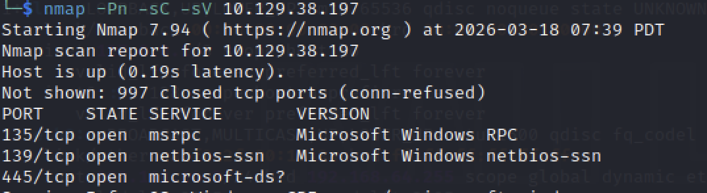
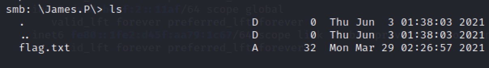

# Dancing - Hack The Box Writeup

## 1. Overview

Machine: Dancing  
Difficulty: Very Easy  
Operating System: Windows  

본 문제는 SMB 서비스의 잘못된 접근 제어 설정을 이용하여 공유 디렉토리에 접근하는 과정이다.  
핵심은 서비스 식별 이후 인증 없이 접근 가능한 리소스를 식별하는 것이다.  

---

## 2. Enumeration

대상 시스템의 열린 포트와 실행 중인 서비스를 확인한다.

nmap -Pn -sC -sV <TARGET_IP>

결과:

445/tcp open  microsoft-ds  

SMB 서비스가 실행 중이며, Windows 기반 시스템임을 확인할 수 있다.  

→ SMB 서비스는 null session(인증 없이 접근)이 가능한 경우가 있으므로  
접근 가능한 공유 자원을 확인하는 것이 중요하다.  

---

## 3. Analysis

SMB(Server Message Block)는 네트워크 상에서 파일 공유를 위한 프로토콜이다.  

다음과 같은 특징이 있다:

* 공유 디렉토리(share)를 통해 파일 접근 가능  
* 일반적으로 인증이 필요  
* 설정에 따라 인증 없이 접근 가능한 경우 존재 (null session)  

따라서 인증 없이 접근 가능한 share가 존재하는지 확인하는 것이 공격의 핵심이다.  

---

## 4. Exploitation

SMB 공유 목록을 확인한다.

smbclient -L //<TARGET_IP> -N

-N 옵션은 비밀번호 없이 접근을 시도하는 옵션이다.  

출력 결과에서 여러 share가 확인된다.  

→ 인증 없이 접근 가능한 share가 존재하는지 확인한다.  

WorkShares share에 접근이 가능하므로 해당 디렉토리를 대상으로 탐색을 진행한다.  

접근 가능한 share에 연결한다.

smbclient //<TARGET_IP>/WorkShares -N

---

## 5. Flag Retrieval

접속 후 내부 디렉토리를 확인한다.

ls

→ 사용자 디렉토리 중 하나에서 flag 파일을 확인할 수 있다.  

해당 디렉토리로 이동한다.

cd <directory_name>

파일 목록을 확인한 후 flag 파일을 다운로드한다.

get flag.txt  

---

## 6. Root Cause

SMB 서비스에서 null session 접근이 허용되어 있다.  
인증 없이 공유 디렉토리에 접근 가능한 설정이 적용된 것이 근본적인 원인이다.  

---

## 7. Commands Summary

nmap -Pn -sC -sV <TARGET_IP>  
smbclient -L //<TARGET_IP> -N  
smbclient //<TARGET_IP>/WorkShares -N  
ls  
cd <directory_name>  
get flag.txt  

---

## 8. Conclusion

SMB 서비스는 설정에 따라 인증 없이 접근이 가능한 경우가 존재한다.  
Enumeration 단계에서 공유 자원을 확인하고,  
접근 가능한 share를 식별하는 것이 공격의 핵심이다.  
