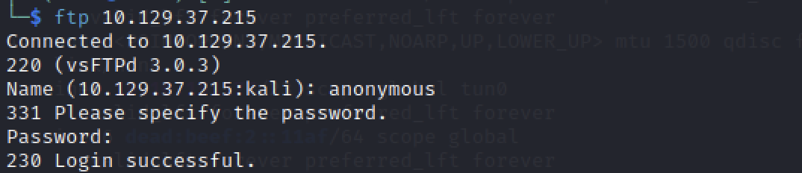
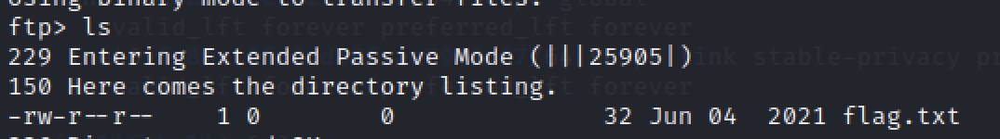

# Fawn - Hack The Box Writeup

## 1. Overview

Machine: Fawn  
Difficulty: Very Easy  
Operating System: Linux  

본 문제는 FTP 서비스의 잘못된 접근 제어 설정을 이용하여 파일에 접근하는 과정이다.  
핵심은 서비스 식별 이후 인증 방식의 취약점을 확인하는 것이다.  

---

## 2. Enumeration

대상 시스템의 열린 포트와 실행 중인 서비스를 확인한다.

nmap -sC -sV <TARGET_IP>

결과:

21/tcp open  ftp  

FTP 서비스가 외부에 노출되어 있음을 확인할 수 있다.  

→ FTP 서비스는 설정에 따라 익명 로그인(anonymous)이 허용될 수 있으므로  
인증 없이 접근 가능한지 확인하는 것이 중요하다.  

---

## 3. Analysis

FTP는 파일 전송을 위한 프로토콜이며, 다음과 같은 특징이 있다:

* 기본적으로 사용자 인증 필요  
* 설정에 따라 익명 접속 허용 가능  
* 인증 정보가 평문으로 전송됨  

익명 접속이 허용된 경우, 인증 없이 파일 접근이 가능하다.  

따라서 anonymous 계정을 이용한 로그인 시도를 우선적으로 수행한다.  

---

## 4. Exploitation

FTP 서비스에 접속한다.

ftp <TARGET_IP>

접속 시 사용자 이름을 입력한다.

Name: anonymous  

비밀번호는 아무 값이나 입력하거나 비워둔다.

Password:  

→ 별도의 인증 없이 로그인에 성공하며 FTP 쉘에 접근할 수 있다.  

---

## 5. Flag Retrieval

현재 디렉토리의 파일 목록을 확인한다.

ls  

→ 디렉토리 내에서 flag 파일을 확인할 수 있다.  

flag 파일을 다운로드한다.

get flag.txt  

---

## 6. Root Cause

FTP 서비스에서 anonymous 접근이 허용되어 있다.  
인증 없이 파일 시스템에 접근 가능한 설정이 적용된 것이 근본적인 원인이다.  

---

## 7. Commands Summary

nmap -sC -sV <TARGET_IP>  
ftp <TARGET_IP>  
ls  
get flag.txt  

---

## 8. Conclusion

FTP 서비스는 설정에 따라 인증 없이 접근이 가능한 경우가 존재한다.  
Enumeration 단계에서 인증 우회 가능 여부를 확인하는 것이 중요하며,  
anonymous 접근 여부를 확인하는 것이 공격의 핵심이다.  
