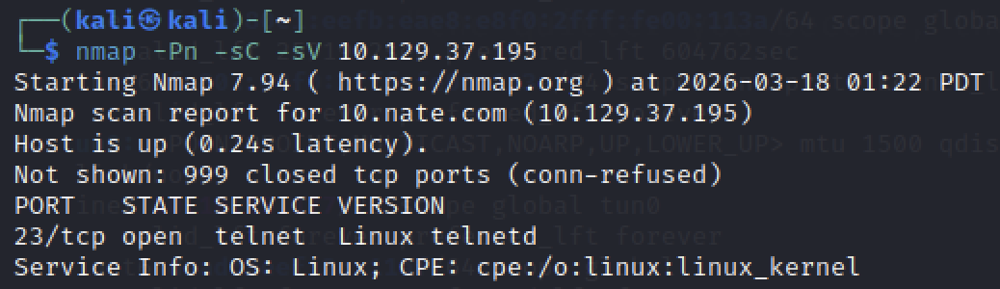
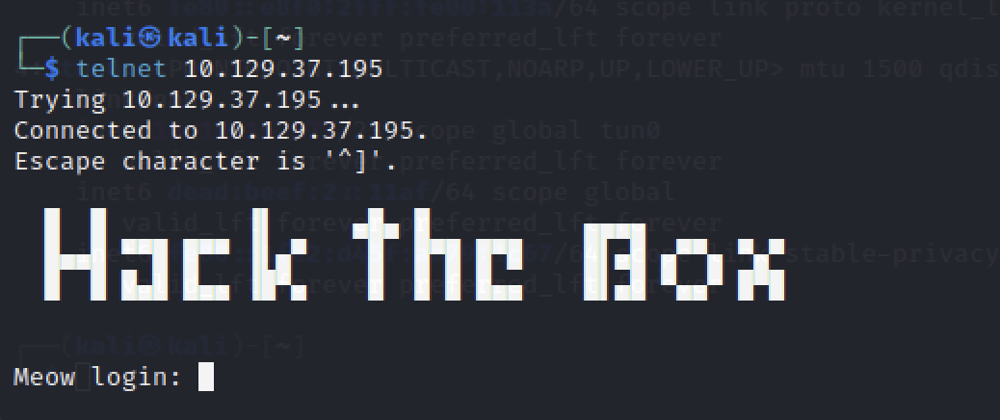
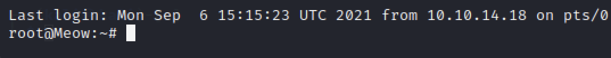

# Meow - Hack The Box Writeup

## 1. Overview

Machine: Meow  
Difficulty: Very Easy  
Operating System: Linux  

본 문제는 Telnet 서비스의 설정 취약점을 이용하여 시스템에 접근하는 과정이다.  
핵심은 서비스 식별 이후 인증 없이 접근 가능한지 확인하는 것이다.  

---

## 2. Enumeration

대상 시스템의 열린 포트와 실행 중인 서비스를 확인한다.

nmap -sC -sV <TARGET_IP>

결과:

23/tcp open  telnet  

Telnet 서비스가 외부에 노출되어 있음을 확인할 수 있다.  

→ Telnet은 평문 통신을 사용하며 보안 설정이 취약한 경우 인증 없이 접근이 가능하므로  
직접 접속을 시도하는 것이 중요하다.  

---

## 3. Analysis

Telnet은 암호화되지 않은 평문 통신을 사용하는 프로토콜이다.  

다음과 같은 특징이 있다:

* 인증 정보가 암호화되지 않음  
* 기본 계정 또는 비밀번호 미설정 상태로 운영되는 경우 존재  
* 보안 설정이 미흡할 경우 무단 접근 가능  

따라서 인증 없이 접속이 가능한지 확인하는 것이 핵심이다.  

---

## 4. Exploitation

Telnet 서비스를 이용하여 대상 시스템에 접속한다.

telnet <TARGET_IP>

접속 시 로그인 프롬프트가 출력된다.

login:  

→ 기본 계정 또는 인증이 필요 없는 계정을 우선적으로 시도한다.  

root  

→ 별도의 비밀번호 입력 없이 로그인에 성공하며 쉘에 접근할 수 있다.  

---

## 5. Flag Retrieval

로그인 이후 현재 디렉토리의 파일을 확인한다.

ls  

→ 디렉토리 내에서 flag 파일을 확인할 수 있다.  

flag 파일의 내용을 출력한다.

cat flag.txt  

---

## 6. Root Cause

Telnet 서비스가 외부에 노출되어 있으며,  
root 계정에 대한 인증 절차가 존재하지 않는다.  

인증 없는 원격 접속이 가능하도록 설정된 것이 근본적인 원인이다.  

---

## 7. Commands Summary

nmap -sC -sV <TARGET_IP>  
telnet <TARGET_IP>  
ls  
cat flag.txt  

---

## 8. Conclusion

Telnet과 같이 보안성이 낮은 프로토콜은 설정에 따라 인증 없이 접근이 가능하다.  
Enumeration 단계에서 서비스 특성을 분석하고,  
직접 접근을 시도하는 것이 공격의 핵심이다.  
