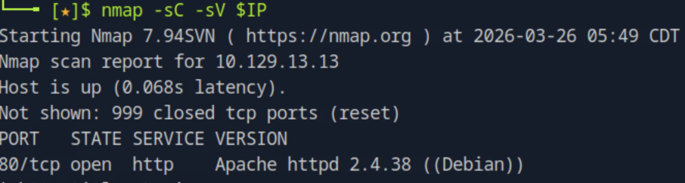

# Appointment

## 개요
이 문제는 웹 로그인 페이지에서 입력값 검증이 제대로 이루어지지 않는 취약점을 이용하여 SQL Injection으로 인증을 우회하고 flag를 획득하는 과정이다. 핵심은 MySQL 주석(`#`)을 활용해 비밀번호 검증 로직을 무력화하는 것이다.

---

## 대상 정보
- Target IP: <TARGET_IP>
- OS: Linux
- Service: HTTP (80/tcp)

---

## 1. 서비스 발견

기본 nmap 스캔을 통해 열린 포트와 서비스를 확인한다.

nmap -sC -sV $IP

80번 포트에서 Apache httpd 2.4.38 (Debian) 웹 서버가 실행 중인 것을 확인할 수 있다.

---

## 2. 웹 페이지 확인

웹 브라우저로 접속하여 서비스 내용을 확인한다.

로그인 페이지가 제공되며, Username과 Password 입력을 통해 인증을 수행하는 구조이다.

---

## 3. 취약점 분석

일반적인 로그인 쿼리는 다음과 같은 형태로 구성된다.

SELECT * FROM users WHERE username = '$username' AND password = '$password';

입력값이 적절히 필터링되지 않을 경우, SQL Injection이 가능하다.  
특히 MySQL에서 `#` 문자는 주석으로 처리되기 때문에 이후 쿼리를 무시시킬 수 있다.

---

## 4. Exploitation (SQL Injection)

아이디 입력값에 다음 payload를 삽입한다.

admin'#

`#` 이후의 구문이 주석 처리되면서 비밀번호 검증 조건이 제거된다.

결과적으로 쿼리는 다음과 같이 동작한다.

SELECT * FROM users WHERE username = 'admin'

따라서 비밀번호 없이 admin 계정으로 로그인할 수 있다.

---

## 5. flag 획득

로그인 성공 후 페이지에서 flag를 확인할 수 있다.

페이지 상단의 첫 단어는 "Congratulations"이며, 이를 통해 문제를 해결할 수 있다.

---

## 6. 취약점 원인 분석

- 사용자 입력값에 대한 검증 부재
- SQL 쿼리에서 문자열 직접 결합 사용
- Prepared Statement 미사용
- 주석(``)을 통한 쿼리 우회 가능

---

## 7. 실제 환경에서의 위험성

- 인증 우회 (Authentication Bypass)
- 관리자 계정 탈취 가능
- 데이터베이스 정보 유출
- 추가적인 공격(SQL Dump 등)으로 확장 가능

---

## 8. 핵심 정리

- 입력값 검증이 없으면 SQL Injection이 발생한다
- MySQL의 `#` 주석을 이용하면 조건을 무력화할 수 있다
- 인증 로직은 반드시 Prepared Statement로 구현해야 한다
