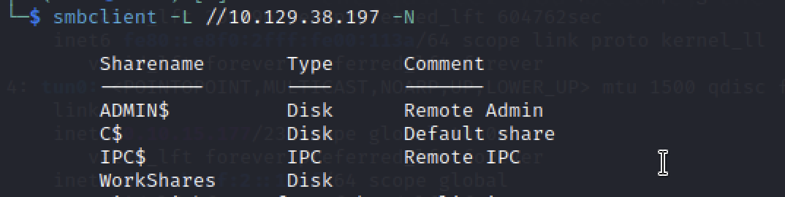

# Dancing - Hack The Box Writeup

## 1. 개요

Machine: Dancing

Difficulty: Very Easy

Operating System: Windows

이 문제는 SMB 서비스에서 null session이 허용된 설정을 이용하여  
인증 없이 공유 디렉토리에 접근하고 파일을 획득하는 문제이다.

핵심은 서비스 식별 이후 인증 없이 접근 가능한지 먼저 확인하는 것이다.

이 문제에서 중요한 것은 단순히 SMB에 접속하는 것이 아니라,  

왜 SMB에서 null session을 먼저 시도했는지를 이해하는 것이다.

---

## 2. Enumeration

대상 시스템의 열린 포트와 실행 중인 서비스를 확인한다.

nmap -Pn -sC -sV <TARGET_IP>

결과:

445/tcp open  microsoft-ds

445번 포트에서 SMB 서비스가 실행 중인 것을 확인할 수 있다.

여기서 SMB에 주목한 이유는 다음과 같다.

- SMB는 네트워크 파일 공유 서비스이다.

- 인증이 필요한 것이 기본이지만, 설정에 따라 인증 없이 접근이 가능하다.

- 잘못된 설정일 경우 바로 파일 접근으로 이어질 수 있다.

즉, 서비스가 확인되는 순간 추가 탐색보다  

“인증 없이 접근 가능한지”를 먼저 확인하는 것이 더 효율적인 상황이다.

---

## 3. Analysis

SMB(Server Message Block)는 파일 공유를 위한 프로토콜이다.

주요 특징:

- 네트워크를 통해 파일 및 디렉토리 접근 가능

- 일반적으로 사용자 인증 필요

- 설정 오류 시 null session 허용 가능

이 문제에서 SMB를 발견했을 때의 판단 흐름은 다음과 같다.

파일 접근이 가능한 서비스다.  

인증이 약할 경우 바로 데이터 노출로 이어진다.  

Starting Point 환경에서는 복잡한 취약점보다 설정 오류 가능성이 높다.  

따라서 null session을 먼저 시도한다.

이 단계에서 이미 공격 방향은 명확해진다.

---

## 4. Exploitation

SMB 공유 목록을 확인한다.

smbclient -L //<TARGET_IP> -N

로그인 없이 접근이 가능한 share가 존재하는지 확인한다.

그 결과 WorkShares share에 접근 가능한 것을 확인할 수 있다.

해당 share에 접속한다.

smbclient //<TARGET_IP>/WorkShares -N

접속에 성공하면 SMB 쉘에 진입하게 된다.

이 시점에서 인증 없이 파일 시스템 접근이 가능한 상태이다.

---

## 5. Flag 획득

파일 목록을 확인한다.

ls

디렉토리를 탐색하여 flag 파일을 확인한다.

flag 파일을 다운로드한다.

get flag.txt

이로써 flag를 획득할 수 있다.

여기서 핵심은 추가적인 공격 없이  
파일 접근이 가능했다는 점이다.

---

## 6. Root Cause

이 문제의 근본 원인은 다음과 같다.

- SMB 서비스가 외부에 노출되어 있다.

- null session 접근이 허용되어 있다.

- 인증 없이 공유 디렉토리 접근이 가능하다.

즉, 접근 제어가 제대로 이루어지지 않은 상태이다.

이 설정은 공격자가 별도의 취약점 분석 없이도  
즉시 내부 파일에 접근할 수 있도록 만든다.

---

## 7. 사용 명령어

nmap -Pn -sC -sV <TARGET_IP>

smbclient -L //<TARGET_IP> -N

smbclient //<TARGET_IP>/WorkShares -N

ls

get flag.txt

---

## 8. 결론

이 문제는 서비스 식별 이후  

해당 서비스의 특성을 이해하고 가장 가능성 높은 약점을 먼저 확인하는 것이 중요하다는 것을 보여준다.

SMB가 열려 있다면  

- 인증 없이 접근 가능한지 확인  

- 접근 가능한 share 확인  

- 파일 탐색 및 다운로드  

이 순서로 진행하는 것이 가장 효율적이다.

특히 이 문제에서는 다음 판단이 핵심이었다.

SMB 서비스 확인  

파일 접근 서비스임을 인지  

null session 가능성 확인  

인증 없이 share 접근 성공  

flag 획득  

실제 환경에서는 다음과 같은 대응이 필요하다.

- null session 비활성화  

- 접근 제어 정책 적용  

- 외부 노출 최소화  

- 인증 강화  

이 문제는 단순하지만,  

잘못된 설정 하나로 내부 데이터가 그대로 노출될 수 있다는 점에서 중요한 사례이다.
