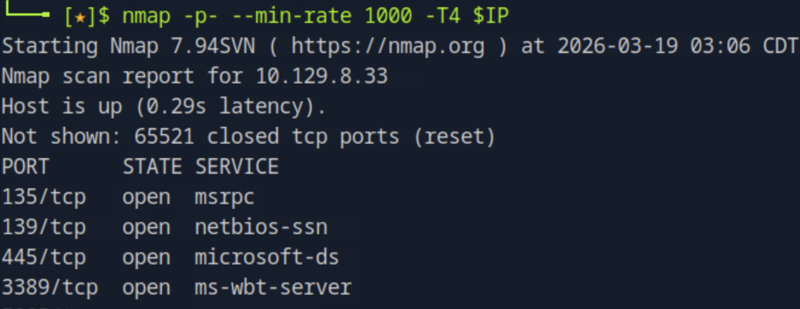
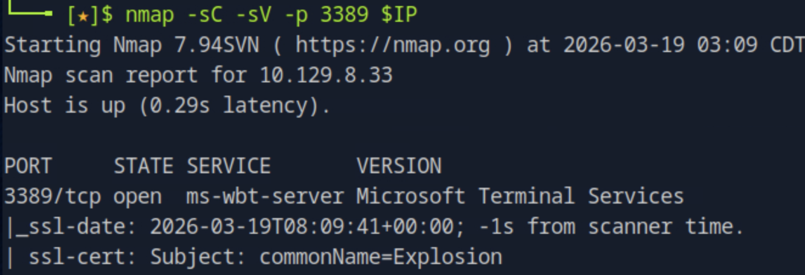
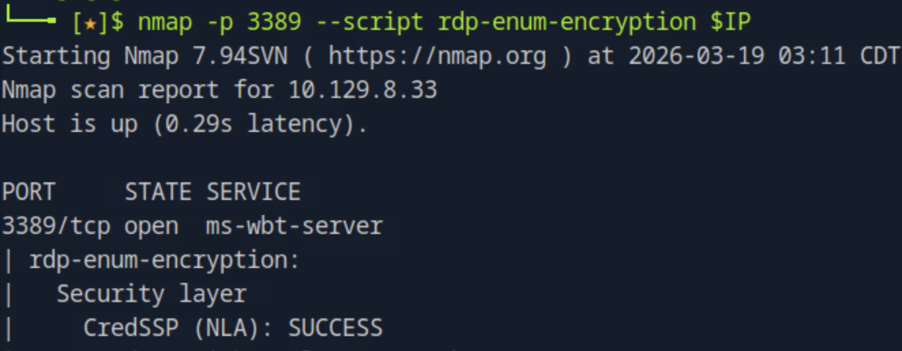
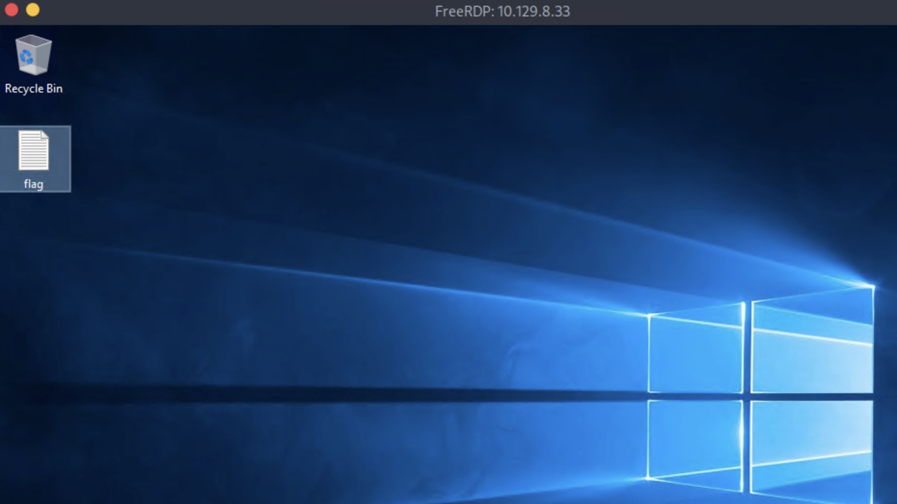

# Explosion

## 개요

이 문제는 Windows 시스템에서 RDP(Remote Desktop Protocol) 서비스가 외부에 노출된 환경을 대상으로,
관리자 계정의 인증 설정 미흡을 이용하여 시스템에 접근하는 과정을 다룬다.
핵심은 포트 스캔을 통해 RDP 서비스를 식별하고, 실제 인증 시도를 통해 접근 가능 여부를 검증하는 것이다.

---

## 대상 정보

* Target IP: <Target IP>
* OS: Windows
* Service: RDP (3389/tcp)

---

## 1. 서비스 발견

전체 포트 스캔을 수행하여 노출된 서비스를 확인한다.

nmap -p- --min-rate 1000 -T4 <TARGET_IP>

스캔 결과 다음과 같은 포트가 열려있는 것을 확인할 수 있다.

* 135/tcp → MSRPC
* 139/tcp → NetBIOS
* 445/tcp → SMB
* 3389/tcp → RDP

3389 포트가 열려 있으므로 원격 데스크탑 서비스 접근 가능성을 우선적으로 고려한다.

---

## 2. 서비스 분석

RDP 서비스의 상세 정보를 확인한다.

nmap -sC -sV -p 3389 <TARGET_IP>

Microsoft Terminal Services가 동작 중임을 확인할 수 있다.

추가적으로 RDP 보안 설정을 확인한다.

nmap -p 3389 --script rdp-enum-encryption <TARGET_IP>

CredSSP(NLA)가 활성화되어 있으나, 이는 인증 방식일 뿐 실제 접근 제어가 안전하다는 의미는 아니다.

---

## 3. 서비스 접근

RDP 클라이언트를 이용하여 직접 접속을 시도한다.

xfreerdp /v:10.129.8.33 /u:Administrator /cert:ignore

인증서 경고를 수락하고 접속을 진행한다.

---

## 4. 인증 우회 및 접근 성공

Administrator 계정으로 비밀번호 없이 로그인 시도가 가능하며,
실제로 인증이 성공하여 시스템에 접근할 수 있다.

이는 관리자 계정에 비밀번호가 설정되어 있지 않거나,
빈 비밀번호 로그인이 허용된 상태임을 의미한다.

---

## 5. Flag 획득

접속 후 바탕화면에서 flag 파일을 확인한다.

이를 통해 시스템 접근이 정상적으로 이루어졌음을 확인할 수 있다.

---

## 6. 취약점 원인 분석

이번 문제의 핵심 원인은 다음과 같다.

* RDP 서비스 외부 노출
* Administrator 계정 활성화 상태 유지
* 비밀번호 없는 로그인 허용

이는 시스템 취약점이 아닌 인증 정책의 부실한 설정(Misconfiguration)에 해당한다.

---

## 7. 실제 환경에서의 위험성

이와 같은 설정은 매우 높은 위험도를 가진다.

* 관리자 계정 즉시 탈취 가능
* 내부 시스템 및 데이터 접근 가능
* 추가 공격 수행 기반 확보

RDP는 원격 제어가 가능한 프로토콜이므로, 공격자는 다음과 같은 행위를 수행할 수 있다.

* 시스템 설정 변경
* 악성코드 설치
* 내부 네트워크 확장 공격

결과적으로 시스템 전체 장악으로 이어질 수 있다.

---

## 8. 핵심 정리

* 포트 스캔을 통해 RDP 서비스 노출을 확인할 수 있다
* 서비스 식별 후 실제 접근 시도를 통해 인증 정책을 검증해야 한다
* 관리자 계정의 비밀번호 미설정은 치명적인 보안 문제이다
* 설정 오류만으로도 시스템 장악이 가능하다

