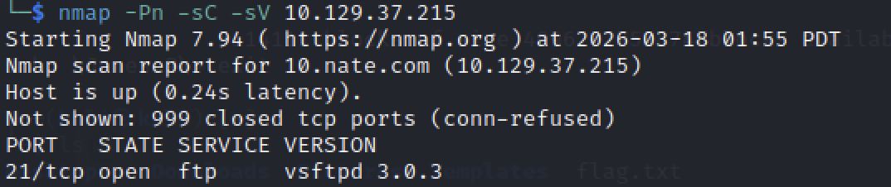

# Fawn - Hack The Box Writeup

## 1. 개요

Machine: Fawn  
Difficulty: Very Easy  
Operating System: Linux  

이 문제는 FTP 서비스에서 익명 로그인이 허용된 설정을 이용하여 파일에 접근하는 문제이다.  
핵심은 인증 없이 접근 가능한 리소스를 식별하는 것이다.

---

## 2. Enumeration

대상 시스템의 열린 포트와 실행 중인 서비스를 확인한다.

nmap -Pn -sC -sV <TARGET_IP>

결과:

21/tcp open  ftp  

21번 포트에서 FTP 서비스가 실행 중인 것을 확인할 수 있다.  
FTP는 설정에 따라 anonymous 로그인이 가능한 경우가 존재한다.

---

## 3. Analysis

FTP(File Transfer Protocol)는 파일 전송을 위한 프로토콜이다.

주요 특징:

- 사용자 인증 기반 접근  
- anonymous 계정 지원 가능  
- 잘못된 설정 시 인증 없이 접근 가능  

따라서 FTP 서비스가 확인되면,  
anonymous 로그인이 가능한지 확인하는 것이 중요하다.

---

## 4. Exploitation

FTP 서비스에 접속한다.

ftp <TARGET_IP>

로그인 시도:

Username: anonymous  
Password: anonymous  

익명 로그인에 성공한다.

---

## 5. Flag 획득

파일 목록을 확인한다.

ls

flag 파일을 확인한 후 다운로드한다.

get flag.txt

---

## 6. Root Cause

FTP 서비스에서 anonymous 로그인이 허용되어 있다.

이로 인해 인증 없이 파일 시스템에 접근이 가능하다.

---

## 7. 사용 명령어

nmap -Pn -sC -sV <TARGET_IP>  
ftp <TARGET_IP>  
ls  
get flag.txt  

---

## 8. 결론

FTP 서비스에서 익명 로그인이 허용될 경우  
민감한 파일이 외부에 노출될 수 있다.

서비스 접근 제어 설정이 매우 중요하다.
