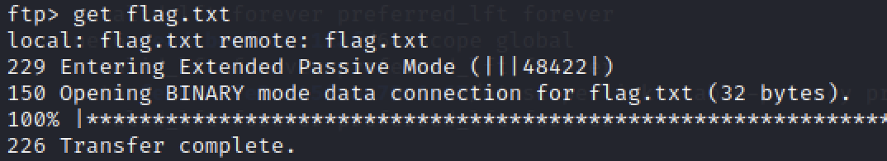

# Fawn - Hack The Box Writeup

## 1. 개요

Machine: Fawn  
Difficulty: Very Easy  
Operating System: Linux  

이 문제는 FTP 서비스에서 익명 로그인이 허용된 설정을 이용하여 파일에 접근하는 문제이다.  
핵심은 서비스 식별 이후 인증 없이 접근 가능한 리소스를 빠르게 찾는 것이다.

이 문제에서 중요한 것은 단순히 FTP에 접속하는 것이 아니라,  
왜 FTP에서 anonymous 로그인을 먼저 시도했는지를 이해하는 것이다.

---

## 2. Enumeration

대상 시스템의 열린 포트와 실행 중인 서비스를 확인한다.

nmap -Pn -sC -sV <TARGET_IP>

결과:

21/tcp open  ftp  

21번 포트에서 FTP 서비스가 실행 중인 것을 확인할 수 있다.

여기서 FTP에 주목한 이유는 다음과 같다.

- FTP는 파일 접근이 가능한 서비스이다.
- 인증이 필요한 것이 기본이지만, 설정에 따라 anonymous 접근이 가능하다.
- 잘못된 설정일 경우 바로 파일 다운로드로 이어질 수 있다.

즉, 서비스가 확인되는 순간 추가 탐색보다  
“인증 없이 접근 가능한지”를 먼저 확인하는 것이 더 효율적인 상황이다.

---

## 3. Analysis

FTP(File Transfer Protocol)는 파일 전송을 위한 프로토콜이다.

주요 특징:

- 사용자 인증 기반 접근  
- anonymous 계정 지원 가능  
- 잘못된 설정 시 인증 없이 파일 접근 가능  

이 문제에서 FTP를 발견했을 때의 판단 흐름은 다음과 같다.

1. 파일 접근이 가능한 서비스다.
2. 인증이 약할 경우 바로 데이터 노출로 이어진다.
3. Starting Point 환경에서는 복잡한 취약점보다 설정 오류 가능성이 높다.
4. 따라서 anonymous 로그인부터 시도한다.

이 단계에서 이미 공격 방향은 명확해진다.  
취약점 분석이 아니라 **설정 검증**이 핵심이다.

---

## 4. Exploitation

FTP 서비스에 접속한다.

ftp <TARGET_IP>

로그인 시도:

Username: anonymous  
Password: anonymous  

익명 로그인은 FTP에서 가장 기본적으로 시도해야 하는 접근 방식이다.  
특히 CTF 환경에서는 높은 확률로 허용되어 있다.

로그인에 성공하면 인증 없이 파일 시스템에 접근할 수 있는 상태가 된다.

---

## 5. Flag 획득

파일 목록을 확인한다.

ls

이 단계에서 중요한 판단은 다음과 같다.

- 현재 접근 권한이 이미 확보된 상태이다.
- 추가적인 권한 상승이 필요 없다.
- 따라서 바로 파일 탐색 → 다운로드로 이어진다.

flag 파일을 확인한 후 다운로드한다.

get flag.txt

이로써 flag를 획득할 수 있다.

여기서 핵심은 flag 자체가 아니라,  
**인증 없이 파일 접근이 가능했다는 점**이다.

---

## 6. Root Cause

이 문제의 근본 원인은 다음과 같다.

- FTP 서비스가 외부에 노출되어 있다.
- anonymous 로그인이 허용되어 있다.
- 인증 없이 파일 시스템 접근이 가능하다.

즉, 접근 제어가 전혀 이루어지지 않은 상태이다.

이 설정은 공격자가 별도의 취약점 분석 없이도  
즉시 내부 파일을 열람 및 다운로드할 수 있도록 만든다.

---

## 7. 사용 명령어

nmap -Pn -sC -sV <TARGET_IP>  
ftp <TARGET_IP>  
ls  
get flag.txt  

---

## 8. 결론

이 문제는 서비스 식별 이후,  
해당 서비스의 기본 동작을 이해하고 가장 가능성 높은 약점을 먼저 점검하는 것이 중요하다는 것을 보여준다.

FTP가 열려 있다면 단순히 연결하는 것이 아니라:

- anonymous 로그인 가능 여부 확인
- 접근 가능한 파일 존재 여부 확인

이 순서로 진행하는 것이 가장 효율적이다.

특히 이 문제에서는 다음 판단이 핵심이었다.

- FTP 서비스 확인
- 파일 접근 가능 서비스임을 인지
- 인증 우회보다 anonymous 접근 먼저 시도
- 로그인 성공 후 즉시 파일 탐색
- flag 획득

실제 환경에서는 다음과 같은 대응이 필요하다.

- anonymous FTP 비활성화
- 접근 제어 정책 적용
- 외부 노출 최소화
- 필요 시 인증 강화

이 문제는 기술적으로 단순하지만,  
잘못된 설정 하나가 전체 데이터 노출로 이어질 수 있다는 점에서 중요한 사례이다.
