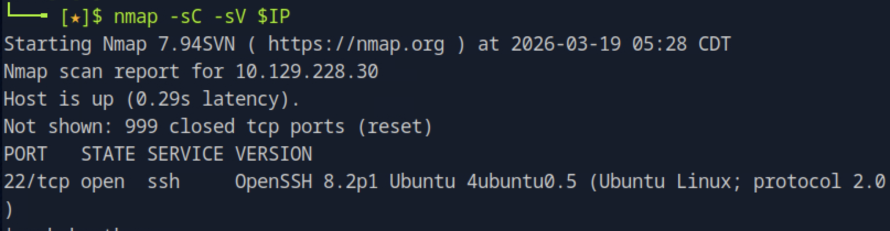
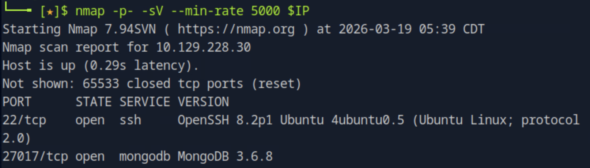
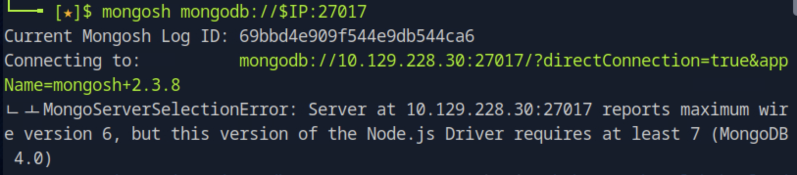
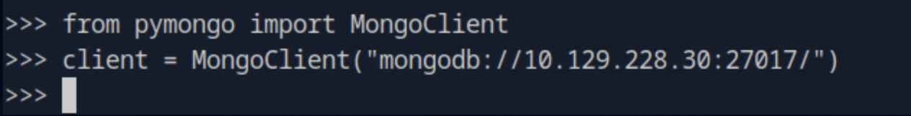
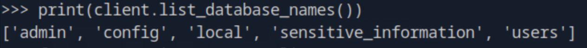
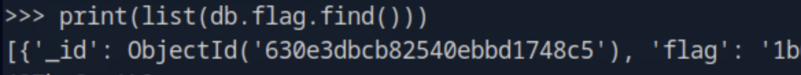

# Mongod

## 개요
이 문제는 MongoDB 서비스가 외부에 노출되어 있으며 인증 없이 접근 가능한 상태에서 데이터베이스를 탐색하여 flag를 획득하는 과정이다. 핵심은 전체 포트 스캔과 MongoDB 접근 우회이다.

---

## 대상 정보
- Target IP: 10.129.228.30  
- OS: Linux  
- Service: MongoDB (27017/tcp), SSH (22/tcp)

---

## 1. 서비스 발견

기본 nmap 스캔을 통해 열린 포트를 확인한다.

nmap -sC -sV $IP

기본 스캔에서는 22번 포트(SSH)만 확인된다.

---

## 2. 전체 포트 스캔

숨겨진 서비스를 찾기 위해 전체 포트 스캔을 수행한다.

nmap -p- -sV --min-rate 5000 $IP

27017 포트에서 MongoDB 3.6.8 서비스가 실행 중인 것을 확인할 수 있다.

---

## 3. 서비스 접근 시도

MongoDB에 직접 접속을 시도한다.

mongosh mongodb://$IP:27017

최신 mongosh 클라이언트는 MongoDB 3.6.8과 호환되지 않아 접속이 실패한다.

---

## 4. 접근 우회 (Python)

Python의 pymongo를 사용하여 MongoDB에 접근한다.

from pymongo import MongoClient  
client = MongoClient("mongodb://10.129.228.30:27017/")

구버전 MongoDB와 호환되어 정상적으로 연결된다.

---

## 5. 데이터베이스 탐색

데이터베이스 목록을 확인한다.

print(client.list_database_names())

`sensitive_information` 데이터베이스가 존재한다.

---

## 6. 컬렉션 확인

해당 데이터베이스의 컬렉션을 확인한다.

db = client["sensitive_information"]  
print(db.list_collection_names())

`flag` 컬렉션이 존재하는 것을 확인할 수 있다.

---

## 7. flag 획득

컬렉션의 데이터를 조회한다.

print(list(db.flag.find()))

flag를 획득할 수 있다.

---

## 8. 취약점 원인 분석

- MongoDB 서비스가 외부에 노출됨  
- 인증 설정이 되어 있지 않음  
- 구버전 서비스 사용으로 보안 관리 미흡  
- 클라이언트 호환성 문제로 접근 방식이 제한되지만 우회 가능  

---

## 9. 실제 환경에서의 위험성

- 데이터베이스 전체 노출  
- 민감 정보 유출  
- 사용자 정보 탈취 가능  
- 시스템 내부 구조 노출  

---

## 10. 핵심 정리

- 전체 포트 스캔은 반드시 수행해야 한다  
- MongoDB는 기본적으로 인증이 없으면 매우 위험하다  
- 클라이언트 호환성 문제는 공격을 막지 못한다  
- Python과 같은 다른 도구로 우회 접근이 가능하다  
