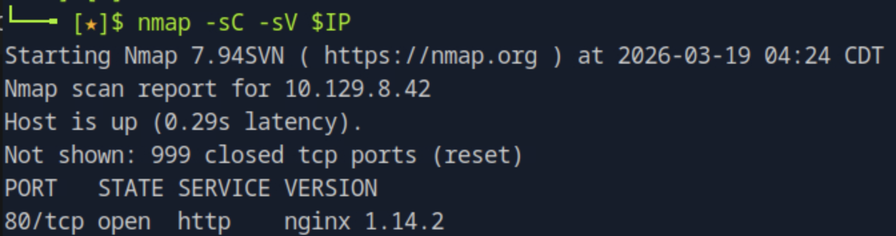
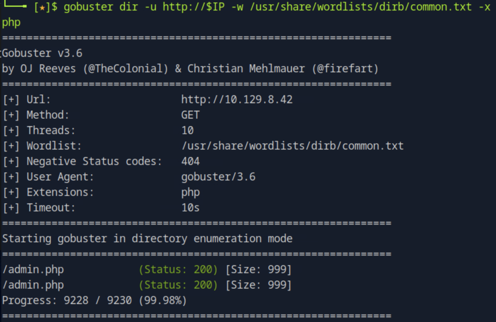
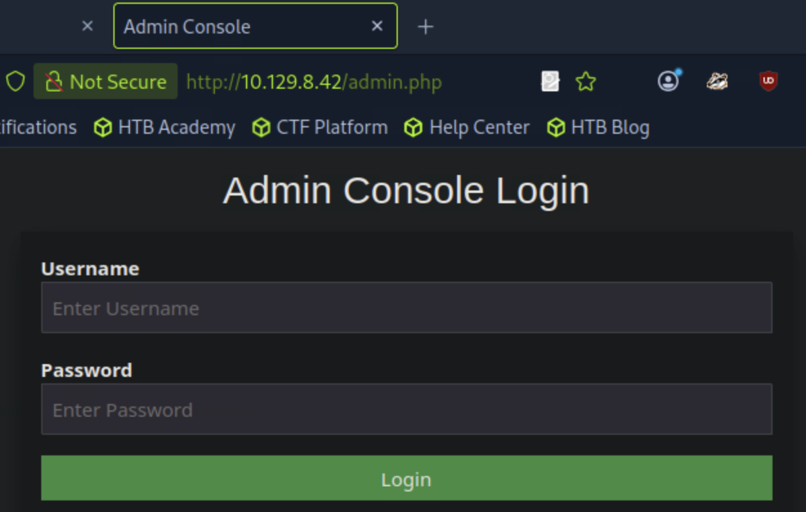
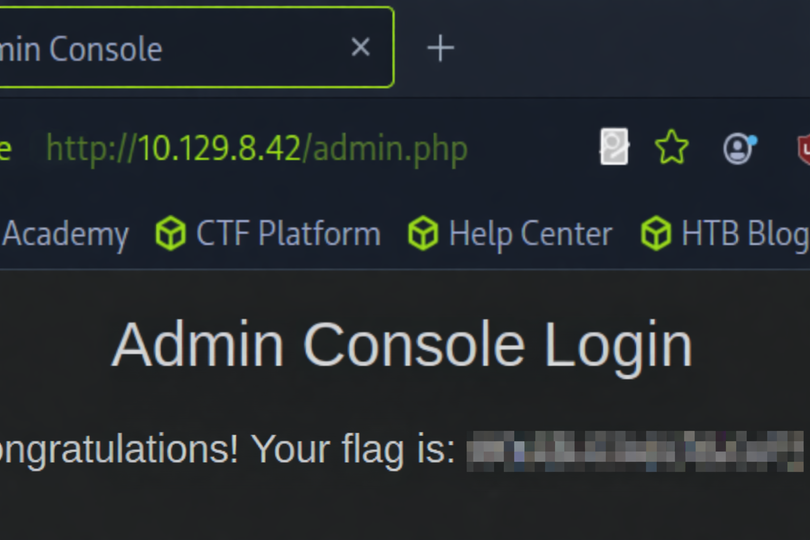

# Preignition

## 개요
이 문제는 웹 서버에서 디렉토리 브루트포싱을 통해 숨겨진 관리자 페이지를 발견하고, 인증이 제대로 구현되지 않은 취약점을 이용해 flag를 획득하는 과정이다. 핵심은 dir busting과 취약한 인증 구조이다.

---

## 대상 정보
- Target IP: <TARGET_IP>
- OS: Linux
- Service: HTTP (80/tcp)

---

## 1. 서비스 발견

기본 nmap 스캔을 통해 열린 포트와 서비스를 확인한다.

nmap -sC -sV $IP

포트 80에서 HTTP 서비스가 실행 중이며 nginx 1.14.2 서버임을 확인할 수 있다.

---

## 2. 서비스 탐색

웹 서버의 숨겨진 경로를 찾기 위해 디렉토리 브루트포싱을 수행한다.

gobuster dir -u http://$IP -w /usr/share/wordlists/dirb/common.txt -x php

/admin.php 경로가 존재하며 상태 코드 200을 반환하는 것을 확인할 수 있다.

---

## 3. 관리자 페이지 접근

발견한 경로에 직접 접근한다.

http://$IP/admin.php

관리자 로그인 페이지가 존재하는 것을 확인할 수 있다.

---

## 4. 인증 우회

해당 페이지는 인증 검증이 제대로 이루어지지 않으며, ID : admin, PW : admin 으로 로그인 시 접근이 가능하다.

---

## 5. flag 획득

로그인 이후 페이지에서 flag를 확인할 수 있다.

---

## 6. 취약점 원인 분석

- 관리자 페이지가 외부에 노출됨 (/admin.php)
- 인증 로직이 부실하거나 존재하지 않음
- 기본/빈 패스워드 허용

---

## 7. 실제 환경에서의 위험성

- 관리자 권한 탈취
- 내부 데이터 접근 및 변경
- 시스템 제어 가능

---

## 8. 핵심 정리

- 디렉토리 브루트포싱은 필수 과정이다
- 숨겨진 관리자 페이지는 반드시 확인해야 한다
- 인증이 없는 서비스는 즉시 취약점으로 이어진다
