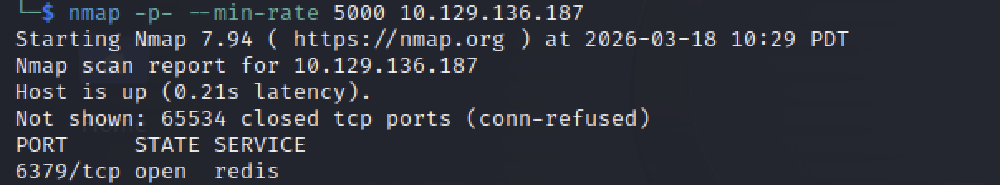
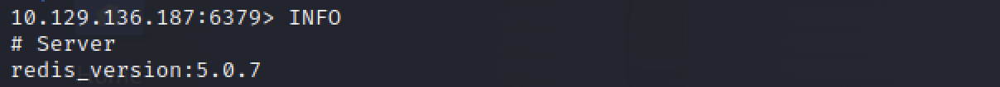
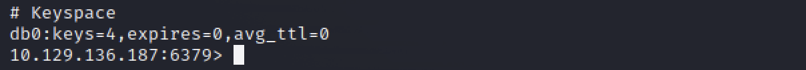
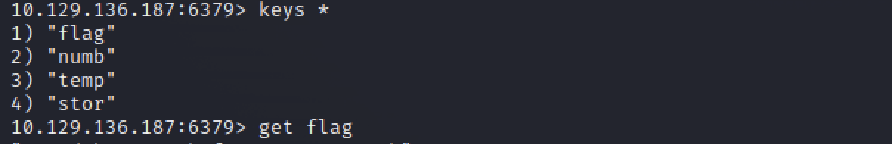

# Redeemer

## 개요
이 문제는 기본 포트 스캔으로는 확인되지 않는 서비스를 탐지하고, Redis 서버에 인증 없이 접근하여 메모리에 저장된 데이터를 획득하는 과정을 다룬다. 핵심은 포트 스캔 범위 확장과 Redis의 보안 설정 문제를 이해하는 것이다.

---

## 대상 정보
- Target IP: <TARGET_IP>
- OS: Linux
- Service: Redis (6379/tcp)

---

## 1. 서비스 발견

기본 nmap 스캔은 상위 1000개의 포트만 검사하기 때문에 일부 서비스는 탐지되지 않는다. 따라서 전체 포트를 대상으로 스캔을 수행한다.

nmap -p- --min-rate 5000 <TARGET_IP>

스캔 결과, 6379 포트에서 Redis 서비스가 실행 중인 것을 확인할 수 있다.

---

## 2. 서비스 접근

Redis는 전용 CLI 도구를 통해 접근할 수 있다.

redis-cli -h <TARGET_IP>

접속이 별도의 인증 없이 성공하는 것을 통해, 해당 Redis 인스턴스는 외부 접근에 대해 인증이 설정되어 있지 않음을 확인할 수 있다.

---

## 3. 서버 정보 수집 및 상태 분석

서버의 상태 및 설정을 확인한다.

INFO

위 결과를 통해 Redis 버전 및 실행 환경을 확인할 수 있다.

또한 Keyspace 정보를 통해 데이터 존재 여부를 확인할 수 있다.

db0에 4개의 key가 존재하는 것을 확인할 수 있다.

---

## 4. 데이터베이스 구조 분석

데이터가 존재하는 DB를 선택한다.

SELECT 0

데이터 개수 확인:

DBSIZE

전체 key 확인:

KEYS *

이후 flag 값을 조회한다.

GET flag

메모리에 저장된 flag 값을 획득할 수 있다.

---

## 5. 데이터 추출 및 민감 정보 접근

Redis는 기본적으로 인증이 설정되지 않은 상태로 실행될 수 있으며, 네트워크 설정에 따라 외부에서 접근이 가능하다. 특히 다음과 같은 설정이 결합될 경우 취약점이 발생한다.

- 인증 비활성화 (no password)
- 외부 인터페이스 바인딩 (0.0.0.0)
- 방화벽 미설정

이 경우 누구나 Redis 서버에 접속하여 내부 데이터를 조회할 수 있다.

또한 Redis는 메모리 기반 데이터베이스이기 때문에, 애플리케이션에서 사용하는 세션 정보, 토큰, 혹은 민감한 데이터가 평문 형태로 저장되어 있을 가능성이 높다.

---

## 6. 취약점 원인 분석

이러한 설정은 단순 정보 노출을 넘어 다음과 같은 보안 문제로 이어질 수 있다.

- 인증 정보 및 세션 탈취
- 내부 데이터베이스 정보 유출
- 웹 서비스 계정 탈취

또한 Redis는 설정 변경이 가능하기 때문에, 공격자가 다음과 같은 행위를 수행할 수도 있다.

- SSH 키 삽입을 통한 서버 접근
- 크론 작업 등록
- 원격 코드 실행(RCE)

즉, Redis의 잘못된 설정은 시스템 전체 장악으로 이어질 수 있는 고위험 취약점이다.

---

## 핵심 정리

- 기본 포트 스캔은 모든 서비스를 발견하지 못하므로 상황에 따라 전체 포트 스캔이 필요하다
- Redis는 인증 없이 외부에 노출될 경우 심각한 보안 문제가 발생한다
- 서비스 발견 후 직접 접근하여 동작을 확인하는 것이 중요하다
- 단순 접근이 아닌 구조 이해가 공격 성공의 핵심이다
