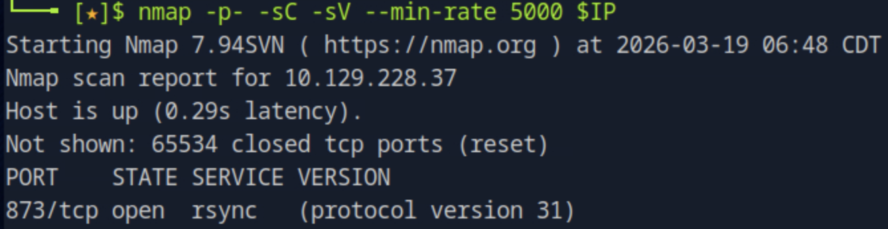
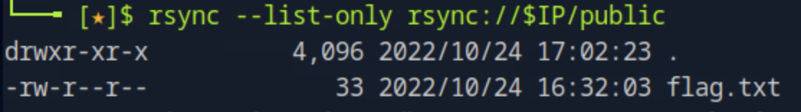
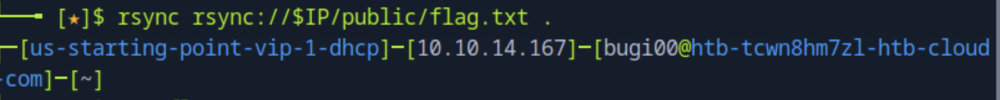

# Synced

## 개요
이 문제는 rsync 서비스의 익명 접근 설정을 이용하여 공개된 공유 디렉토리를 탐색하고, 내부 파일을 직접 다운로드하여 flag를 획득하는 과정이다. 핵심은 rsync enumeration과 잘못된 접근 제어 설정이다.

---

## 대상 정보
- Target IP: <TARGET_IP>
- OS: Linux
- Service: rsync (873/tcp)

---

## 1. 서비스 발견

기본 nmap 스캔을 통해 열린 포트와 서비스를 확인한다.

nmap -p- -sC -sV --min-rate 5000 $IP

포트 873에서 rsync 서비스가 실행 중이며 protocol version 31을 사용하고 있음을 확인할 수 있다.

---

## 2. 서비스 탐색

rsync 서비스에 연결하여 공개된 공유 디렉토리를 확인한다.

rsync rsync://$IP

public이라는 익명 접근 가능한 공유 디렉토리가 존재하는 것을 확인할 수 있다.

---

## 3. 파일 목록 확인

해당 공유 디렉토리 내부 파일 목록을 확인한다.

rsync --list-only rsync://$IP/public

flag.txt 파일이 존재하는 것을 확인할 수 있다.

---

## 4. 파일 다운로드

rsync를 이용하여 flag 파일을 로컬로 다운로드한다.

rsync rsync://$IP/public/flag.txt .

인증 없이 파일 다운로드가 가능한 것을 확인할 수 있다.

---

## 5. flag 획득

다운로드한 파일의 내용을 확인한다.

cat flag.txt

flag를 성공적으로 획득할 수 있다.

---

## 6. 취약점 원인 분석

- rsync 서비스가 외부에 노출됨 (873/tcp)
- 익명(anonymous) 접근 허용
- 민감한 파일이 공개된 공유 디렉토리에 존재

---

## 7. 실제 환경에서의 위험성

- 내부 파일 유출
- 백업 데이터 노출 가능성
- 인증 없이 데이터 접근 및 다운로드 가능

---

## 8. 핵심 정리

- rsync 서비스는 반드시 접근 제어가 필요하다
- anonymous share는 매우 위험하다
- 서비스 enumeration만으로도 flag 획득 가능하다
