# Crocodile

## 개요
이 문제는 FTP 서비스의 익명 접근 설정을 이용하여 크레덴셜 파일을 획득하고, gobuster로 웹 로그인 페이지를 발견한 뒤 수집한 계정 정보로 관리자 패널에 로그인하여 flag를 획득하는 과정이다. 핵심은 FTP anonymous 접근과 웹 디렉토리 enumeration의 조합이다.

---

## 대상 정보
- Target IP: <TARGET_IP>
- OS: Unix
- Service: FTP (21/tcp), HTTP (80/tcp)

---

## 1. 서비스 발견

기본 nmap 스캔을 통해 열린 포트와 서비스를 확인한다.
```bash
nmap -sC -sV $IP
```

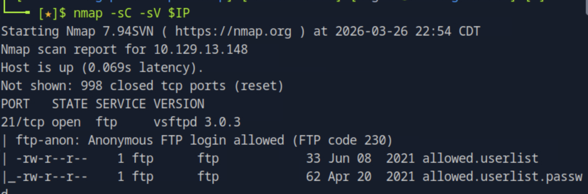

21번 포트에서 vsftpd 3.0.3이 실행 중이며, nmap 스크립트 스캔 결과 anonymous FTP 로그인이 허용되어 있고 `allowed.userlist`와 `allowed.userlist.passwd` 두 파일이 노출되어 있는 것을 확인할 수 있다. 80번 포트에서는 Apache httpd 2.4.41 (Ubuntu) 웹 서버가 실행 중이다.

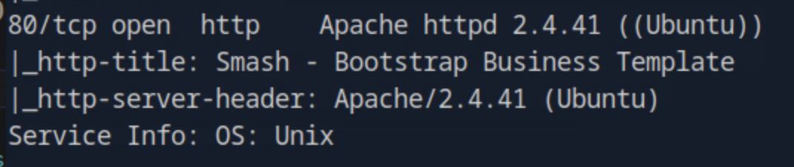

---

## 2. FTP 익명 접속

anonymous 계정으로 FTP에 접속한다.
```bash
ftp $IP
```

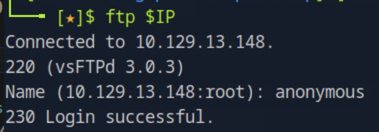

패스워드 없이 anonymous 계정으로 로그인이 성공하는 것을 확인할 수 있다.

---

## 3. FTP 파일 목록 확인 및 다운로드

FTP 서버 내 파일 목록을 확인하고 두 파일을 로컬로 다운로드한다.
```bash
ftp> ls
ftp> get allowed.userlist
ftp> get allowed.userlist.passwd
```

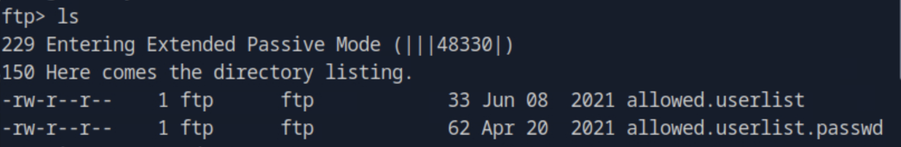

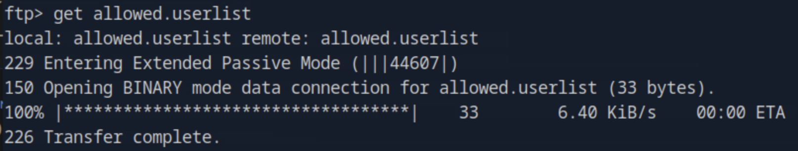

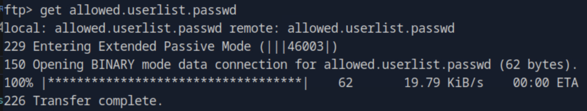

`allowed.userlist`와 `allowed.userlist.passwd` 두 파일이 인증 없이 다운로드되는 것을 확인할 수 있다.

---

## 4. 크레덴셜 파일 확인

다운로드한 파일의 내용을 확인한다.
```bash
cat allowed.userlist
cat allowed.userlist.passwd
```

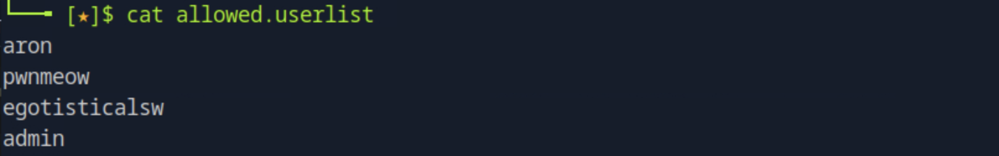

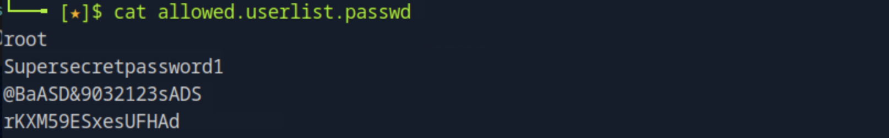

유저 목록에는 `aron`, `pwnmeow`, `egotisticalsw`, `admin`이 존재하며, 패스워드 목록에는 각 계정에 대응하는 패스워드가 순서대로 나열되어 있다. `admin` 계정의 패스워드는 `rKXM59ESxesUFHAd`임을 확인할 수 있다.

---

## 5. 웹 디렉토리 enumeration

웹 서버에서 로그인 페이지를 찾기 위해 gobuster로 디렉토리 및 PHP 파일을 스캔한다.
```bash
gobuster dir -u http://$IP -w /usr/share/wordlists/dirb/common.txt -x php
```

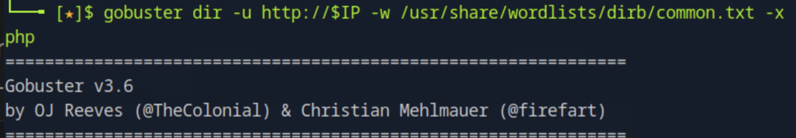

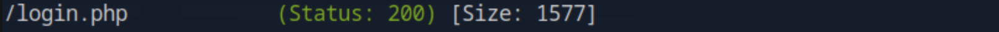

`/login.php` (Status: 200)가 발견되는 것을 확인할 수 있다.

---

## 6. 웹 로그인 및 flag 획득

발견한 `/login.php`에 접속하여 수집한 크레덴셜로 로그인을 시도한다.

- Username: `admin`
- Password: `rKXM59ESxesUFHAd`

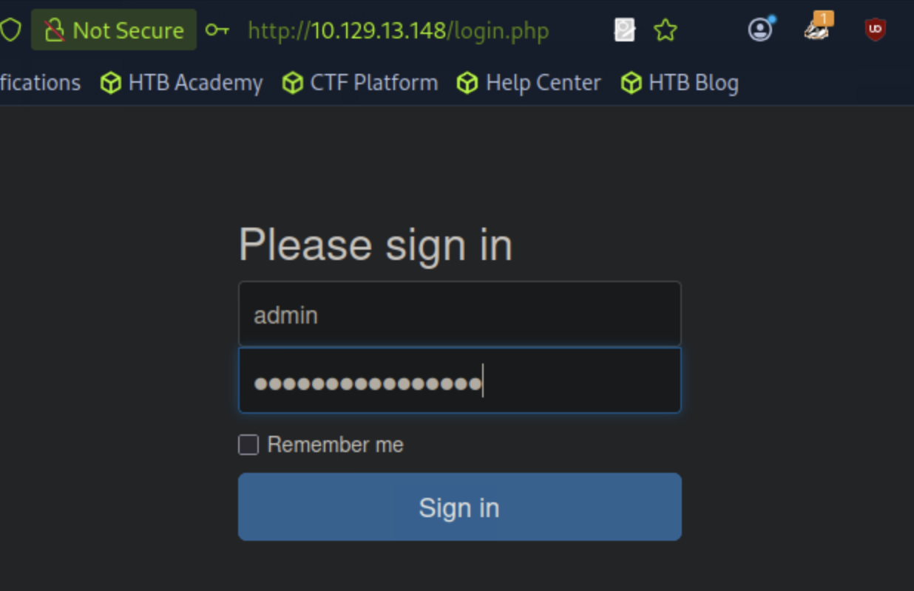

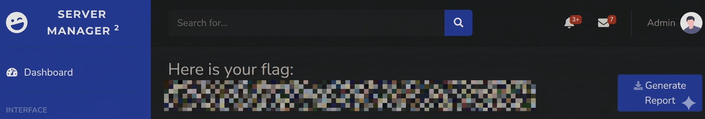

관리자 패널 로그인에 성공하고 대시보드에서 flag를 성공적으로 획득할 수 있다.

---

## 6. 취약점 원인 분석

- FTP 서비스가 anonymous 접근을 허용하도록 잘못 설정됨
- 크레덴셜 파일이 FTP 공개 디렉토리에 평문으로 저장됨
- 웹 로그인 페이지가 디렉토리 enumeration에 노출됨
- 계정 정보와 패스워드가 별도 파일로 분리 저장되었으나 동일한 공개 경로에 존재함

---

## 7. 실제 환경에서의 위험성

- FTP anonymous 접근을 통한 내부 파일 유출
- 크레덴셜 파일 노출로 인한 관리자 계정 탈취
- 웹 관리자 패널 무단 접근 가능
- 추가적인 시스템 침투 발판으로 활용 가능

---

## 8. 핵심 정리

- FTP 서비스는 anonymous 접근을 반드시 비활성화해야 한다
- 크레덴셜 파일은 절대 공개 접근 가능한 경로에 저장해서는 안 된다
- 웹 서버의 민감한 경로는 접근 제어와 함께 robots.txt, 디렉토리 리스팅 비활성화로 보호해야 한다
- 서로 다른 서비스에서 수집한 정보를 조합하면 단계적으로 침투 경로를 확장할 수 있다
