# Funnel

## 개요
이 문제는 FTP 익명 로그인으로 내부 메일 백업 파일을 획득하고, 노출된 기본 패스워드로 SSH 접속에 성공하는 과정이다. 접속 후 내부에서만 동작 중인 PostgreSQL 서비스를 SSH 로컬 포트 포워딩으로 끌어와 데이터베이스에서 flag를 획득한다. 핵심은 민감 정보가 담긴 FTP 파일 노출과 SSH 터널링을 통한 내부 서비스 접근이다.

---

## 대상 정보
- Target IP: <TARGET_IP>
- OS: Linux (Ubuntu 20.04)
- Service: FTP (21/tcp), SSH (22/tcp)

---

## 1. 서비스 발견

기본 nmap 스캔을 통해 열린 포트와 서비스를 확인한다.
```bash
nmap -sC -sV $IP
```

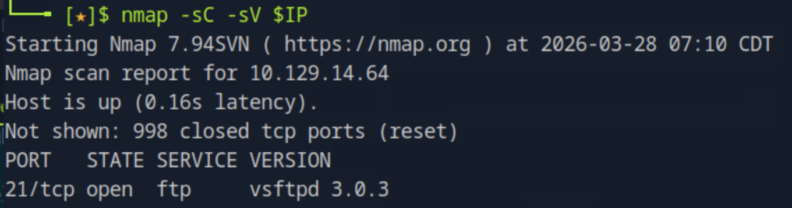
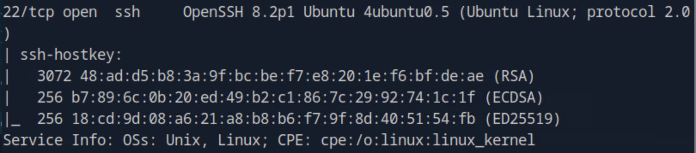

21번 포트에서 vsftpd 3.0.3, 22번 포트에서 OpenSSH 8.2p1이 실행 중인 것을 확인할 수 있다. FTP 서비스가 열려 있으므로 익명 로그인 가능 여부를 먼저 확인한다.

---

## 2. FTP 익명 로그인
```bash
ftp $IP
# Name: anonymous
# Password: (빈칸 엔터)
```

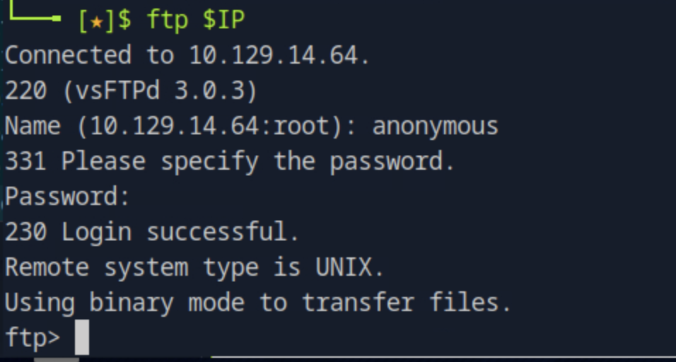

`230 Login successful` 응답으로 익명 로그인이 허용되어 있음을 확인할 수 있다.

---

## 3. FTP 디렉토리 탐색
```bash
ftp> ls
```

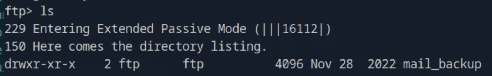

루트에 `mail_backup` 디렉토리가 존재한다. 내부 메일 백업 파일이 있을 것으로 판단하고 진입한다.
```bash
ftp> cd mail_backup
ftp> ls
```

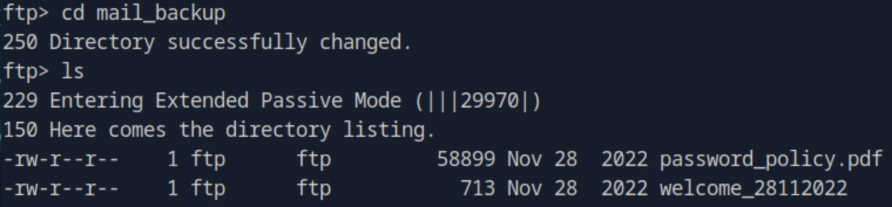

두 개의 파일이 존재한다.

- `password_policy.pdf` — 회사 패스워드 정책 문서
- `welcome_28112022` — 신규 입사자 환영 메일로 추정

---

## 4. 파일 다운로드
```bash
ftp> get password_policy.pdf
```

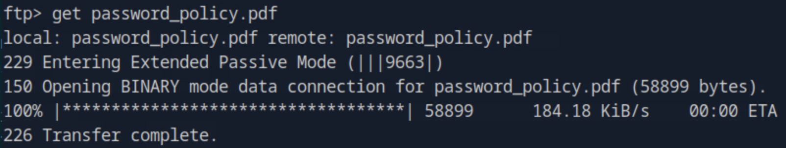
```bash
ftp> get welcome_28112022
```

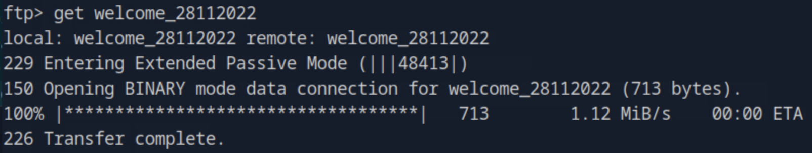

---

## 5. 파일 내용 분석

**password_policy.pdf**

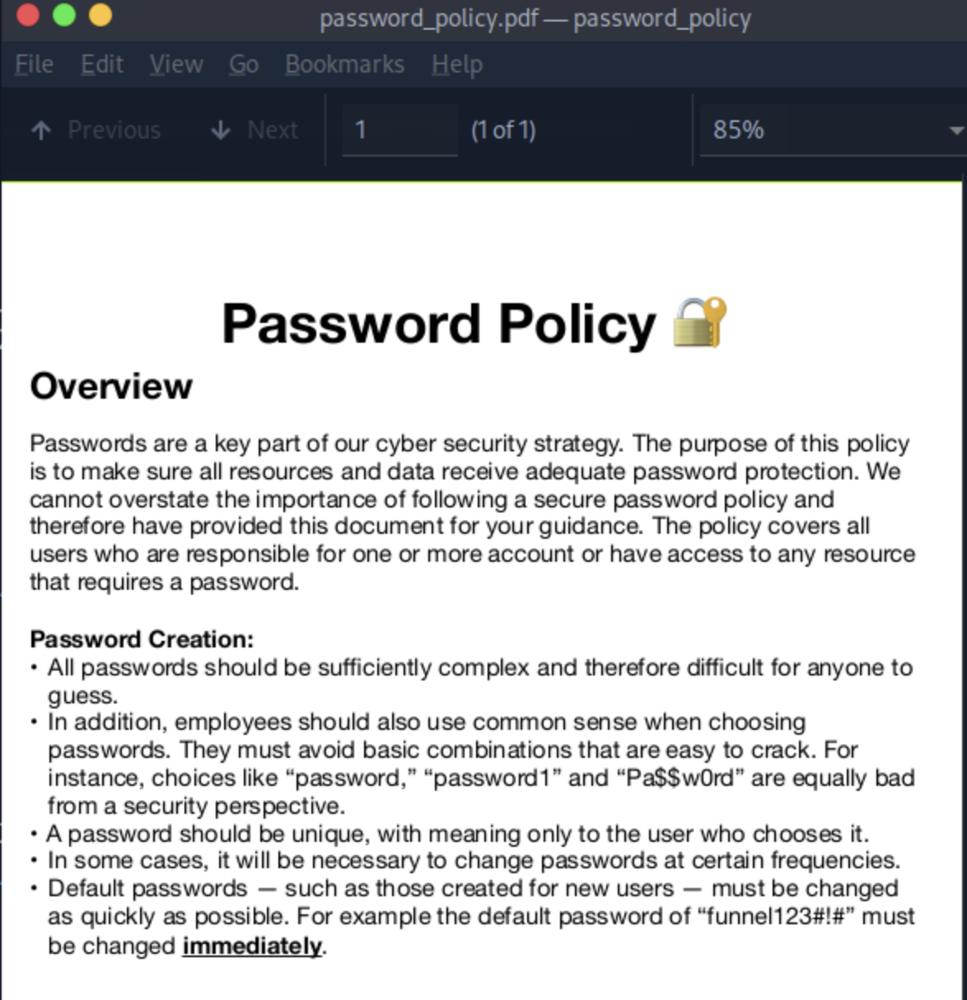

패스워드 정책 문서 하단에 신규 계정의 기본 패스워드가 평문으로 노출되어 있다.

> 기본 패스워드: `funnel123#!#`

즉시 변경하라고 명시되어 있지만, 실제로 변경하지 않은 계정이 존재할 가능성이 높다.

**welcome_28112022**

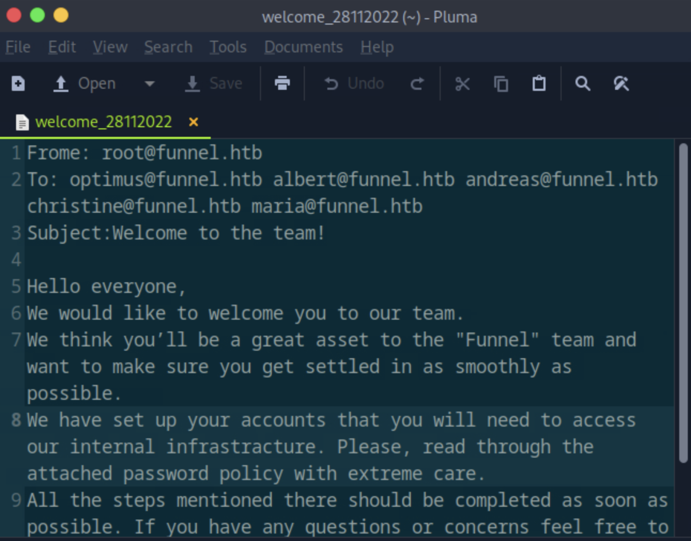

환영 메일 수신자 목록에서 유저명을 추출할 수 있다.

- optimus
- albert
- andreas
- christine
- maria

---

## 6. SSH 접속

수집한 유저명 전체에 기본 패스워드 `funnel123#!#`으로 SSH 접속을 시도한다. `christine` 계정이 패스워드를 변경하지 않은 것을 확인한다.
```bash
ssh christine@$IP
# password: funnel123#!#
```

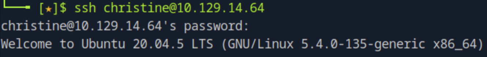

`Welcome to Ubuntu 20.04.5 LTS` 메시지와 함께 접속에 성공한다.

---

## 7. 내부 포트 확인

nmap 외부 스캔에서는 보이지 않는 내부 바인딩 서비스를 확인한다.
```bash
ss -tlnp
```

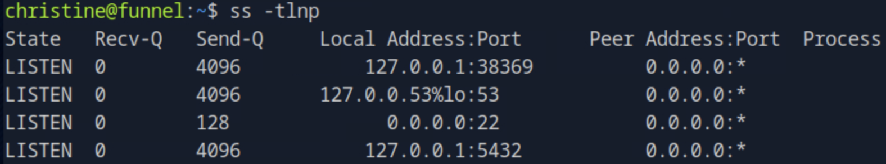

`127.0.0.1:5432`에 PostgreSQL이 루프백으로만 바인딩되어 있어 외부에서 직접 접근이 불가능한 상태다. SSH 로컬 포트 포워딩으로 로컬 머신에 터널을 만들어 접근한다.

---

## 8. VPN 연결 확인

포트 포워딩은 HTB VPN이 연결된 로컬 머신에서 실행해야 한다.


`Initialization Sequence Completed` 메시지로 VPN 연결 상태를 확인한다.

---

## 9. SSH 로컬 포트 포워딩
```bash
ssh -L 1234:localhost:5432 christine@$IP
```

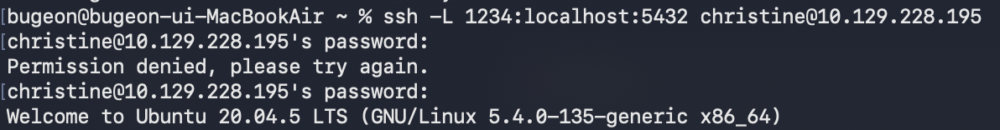

로컬 머신의 `1234` 포트로 들어오는 트래픽을 SSH 터널을 통해 타깃의 `127.0.0.1:5432`로 전달한다. 이후 로컬에서 `localhost:1234`로 접속하면 타깃의 PostgreSQL에 접근할 수 있다.

---

## 10. PostgreSQL 접속 및 탐색
```bash
psql -U christine -h localhost -p 1234
```

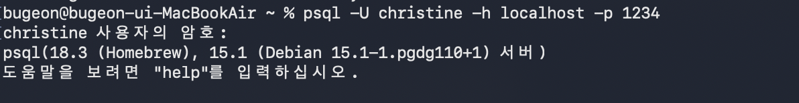

SSH와 동일한 크리덴셜로 PostgreSQL 접속에 성공한다.
```sql
\l
```

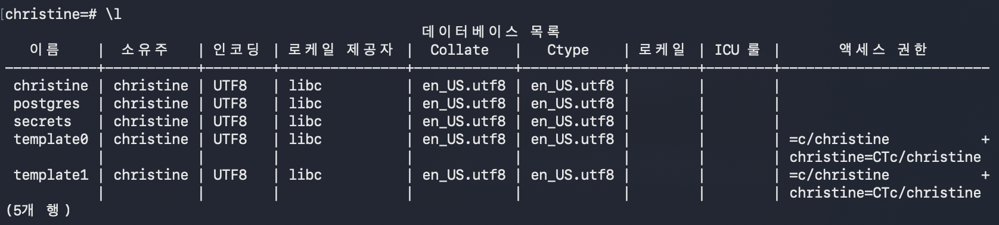

데이터베이스 목록에서 `secrets`가 눈에 띈다. 기본 제공 DB(`postgres`, `template0`, `template1`)와 달리 사용자가 직접 생성한 DB이므로 우선 탐색 대상이다.
```sql
\c secrets
\dt
```

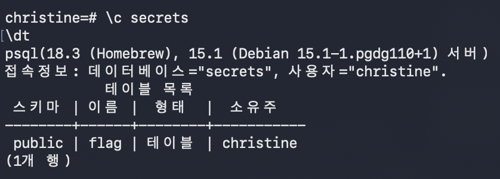

`secrets` DB에 `flag` 테이블이 존재한다.

---

## 11. flag 획득
```sql
SELECT * FROM flag;
```

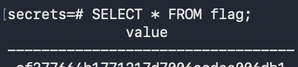

`flag` 테이블에서 flag를 성공적으로 획득한다.

---

## 12. 취약점 원인 분석

- FTP 익명 로그인이 허용되어 내부 파일이 외부에 노출됨
- 패스워드 정책 문서에 기본 패스워드가 평문으로 기재됨
- 신규 계정이 기본 패스워드를 변경하지 않은 상태로 운영됨
- PostgreSQL이 내부 바인딩으로 동작하지만 SSH 접근 권한이 있으면 포트 포워딩으로 우회 가능

---

## 13. 핵심 정리

- FTP 익명 로그인은 항상 초반 체크 항목에 포함해야 한다. 내부 문서가 노출되면 크리덴셜로 이어지는 경우가 많다.
- 패스워드 정책 문서에 예시로 적힌 기본 패스워드가 실제 공격 벡터가 된 케이스다. 문서 자체가 정보 유출 경로가 될 수 있다.
- `ss -tlnp`는 루프백에 바인딩된 숨겨진 서비스를 찾는 핵심 명령이다. nmap 외부 스캔에서는 확인 불가능하다.
- SSH 로컬 포트 포워딩(`-L`)은 내부 서비스를 로컬로 노출시키는 가장 간단한 방법이다. 별도 도구 없이 SSH 하나로 처리된다.
