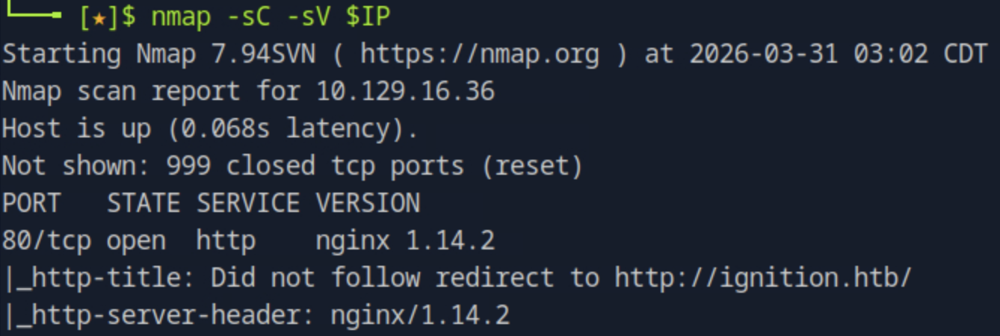
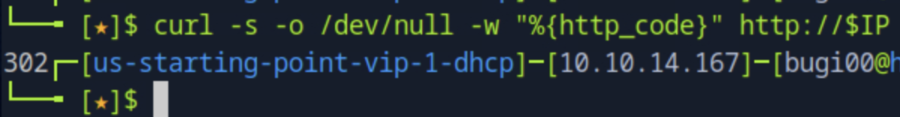
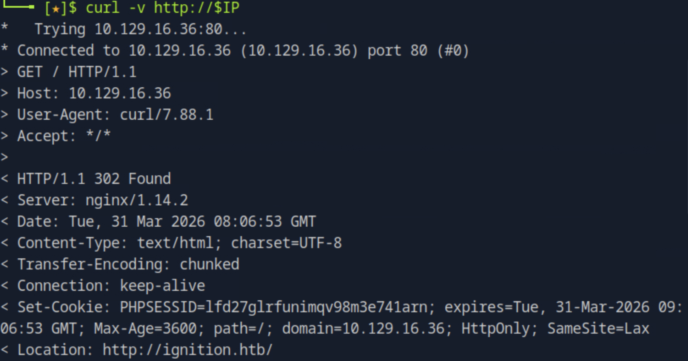
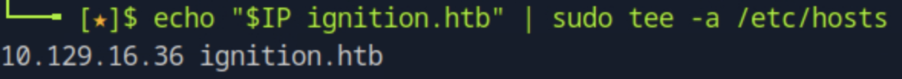
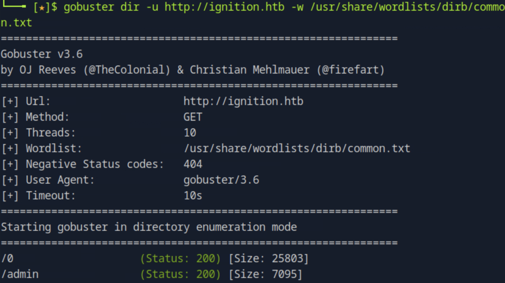
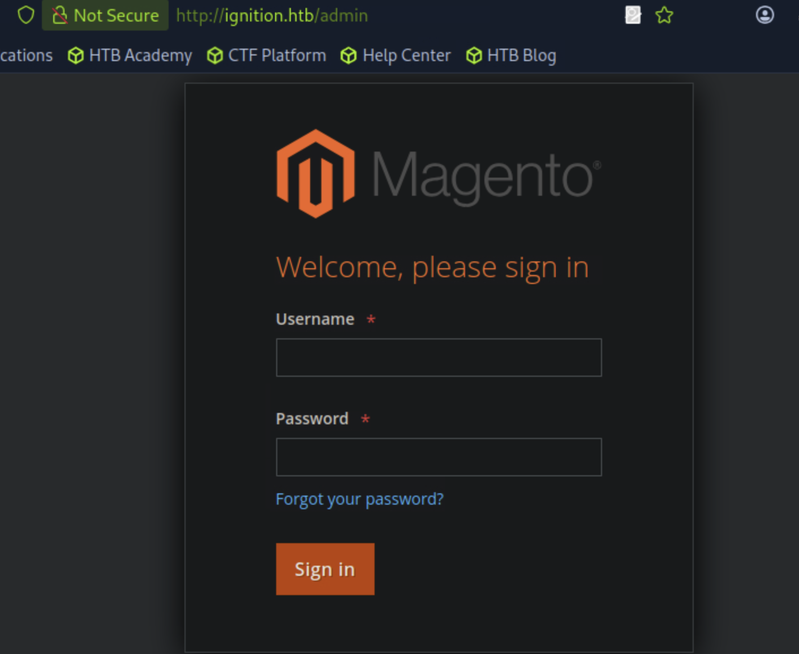
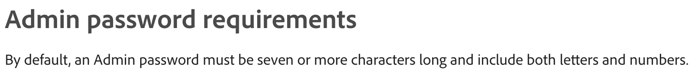
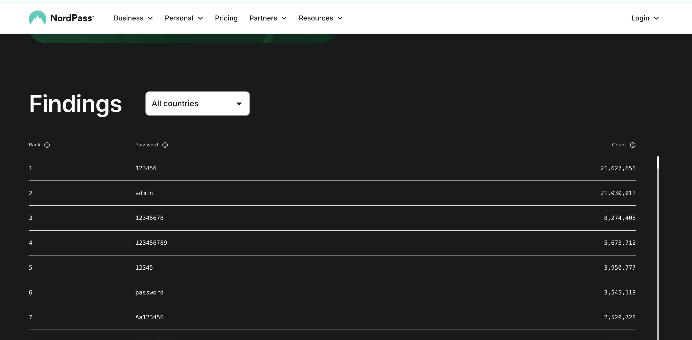
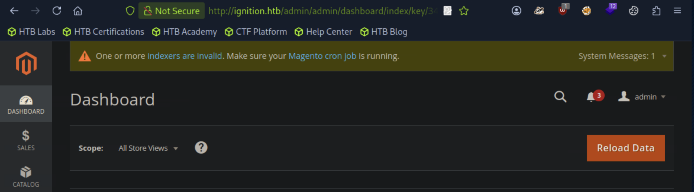

# Ignition

## 개요

nginx 리버스 프록시 뒤에서 동작하는 Magento 기반 이커머스 서버에 대한 가상 호스트 설정 확인, 디렉토리 브루트포스, 그리고 약한 관리자 비밀번호를 통한 로그인을 실습하는 머신이다. 서버가 IP가 아닌 도메인 이름으로만 응답하는 Virtual Host 구조를 이해하고, 공개된 비밀번호 목록과 Magento 비밀번호 정책을 결합해 관리자 계정에 접근하는 과정을 다룬다.

## 대상 정보

| 항목 | 내용 |
|------|------|
| 플랫폼 | HackTheBox Starting Point Tier 1 |
| 운영체제 | Linux |
| 개방 포트 | 80 (HTTP) |
| 주요 기술 스택 | nginx 1.14.2, Magento (PHP) |
| 취약점 | 약한 관리자 비밀번호 (Credential Weakness) |

---

## 풀이 과정

### 1. 포트 스캔

nmap으로 대상 서버의 열린 포트와 서비스 버전을 확인한다.

```bash
nmap -sC -sV $IP
```



80번 포트에서 nginx 1.14.2가 동작하고 있으며, HTTP 타이틀에 `Did not follow redirect to http://ignition.htb/`가 표시된다. 서버가 IP 주소 대신 `ignition.htb`라는 도메인으로의 리다이렉트를 시도하고 있음을 알 수 있다.

---

### 2. HTTP 상태 코드 확인

curl로 IP에 직접 요청을 보내 반환되는 HTTP 상태 코드를 확인한다.

```bash
curl -s -o /dev/null -w "%{http_code}" http://$IP
```



`302 Found`가 반환됐다. 서버가 요청을 다른 URL로 리다이렉트하고 있다는 의미다.

---

### 3. 리다이렉트 대상 확인

curl에 `-v` 옵션을 추가해 응답 헤더를 확인하면 리다이렉트 목적지를 알 수 있다.

```bash
curl -v http://$IP
```



응답 헤더의 `Location: http://ignition.htb/`를 통해 서버가 요청을 `ignition.htb` 도메인으로 리다이렉트하고 있음을 확인했다. 이 도메인은 DNS에 등록되어 있지 않으므로 로컬에서 직접 해석할 수 있도록 `/etc/hosts`에 등록해야 한다.

---

### 4. /etc/hosts 등록

대상 IP와 도메인을 `/etc/hosts`에 추가해 로컬에서 이름 해석이 가능하도록 설정한다.

```bash
echo "$IP ignition.htb" | sudo tee -a /etc/hosts
```



---

### 5. 웹 서비스 확인

브라우저로 `http://ignition.htb`에 접속하면 Magento 기반의 이커머스 메인 페이지가 표시된다.


Magento의 기본 테마인 LUMA가 적용된 쇼핑몰 페이지가 나타난다. 우측 상단의 Sign In은 일반 고객용 로그인이며, 관리자 패널은 별도 경로에 위치한다.

---

### 6. 디렉토리 브루트포스

gobuster를 사용해 관리자 패널 경로를 찾는다.

```bash
gobuster dir -u http://ignition.htb -w /usr/share/wordlists/dirb/common.txt
```



`/admin` 경로가 Status 200으로 발견됐다. 이 경로가 Magento 관리자 로그인 페이지다.

---

### 7. 관리자 로그인 페이지 접속

`http://ignition.htb/admin`에 접속하면 Magento 관리자 로그인 페이지가 나타난다.



---

### 8. Magento 비밀번호 정책 확인

Magento 공식 문서(Adobe Experience League)에서 관리자 비밀번호 요구사항을 확인한다.



기본적으로 Magento 관리자 비밀번호는 7자 이상이어야 하고 문자와 숫자를 모두 포함해야 한다. 이 조건을 기준으로 자주 쓰이는 비밀번호 목록을 필터링한다.

---

### 9. 자주 쓰이는 비밀번호 목록 확인

NordPass의 2023년 가장 많이 사용된 비밀번호 목록을 참고한다.



전체 목록에서 숫자만으로 구성된 것을 제외하고, 7자 이상이면서 문자와 숫자를 혼합한 비밀번호만 추리면 시도할 후보가 몇 개 남지 않는다.

---

### 10. 관리자 계정 로그인 성공

username `admin`, password `qwerty123`으로 로그인에 성공했다.



Magento 관리자 대시보드에 접근하는 데 성공했다.

---

## 취약점 원인 분석

이 머신의 핵심 취약점은 **기본값에 가까운 약한 관리자 비밀번호** 사용이다. `qwerty123`은 2023년 기준 전 세계에서 가장 많이 사용되는 비밀번호 상위권에 속하며, Magento의 최소 비밀번호 조건(7자 이상, 문자+숫자 혼합)을 간신히 만족하는 수준이다. 공격자는 자주 쓰이는 비밀번호 목록과 비밀번호 정책을 결합하는 것만으로 관리자 패널에 접근할 수 있었다.

---

## 실제 환경에서의 위험성

Magento 관리자 패널에 접근하면 상품 관리, 주문 정보, 고객 개인정보, 결제 설정 등 서비스 전체를 제어할 수 있다. 실제 환경에서는 고객 신용카드 정보 탈취, 악성 코드 삽입, 전체 데이터베이스 덤프 등으로 이어질 수 있다.

---

## 핵심 정리

| 항목 | 내용 |
|------|------|
| 취약점 | 약한 관리자 비밀번호 |
| 발견 방법 | gobuster 디렉토리 브루트포스 |
| Virtual Host | IP 직접 접근 불가 → /etc/hosts 등록 필요 |
| 비밀번호 정책 | 7자 이상, 문자+숫자 혼합 (Magento 기본값) |
| 사용된 비밀번호 | qwerty123 (2023 NordPass 상위 목록) |
| 교훈 | 관리자 계정에 공개된 비밀번호 목록에 포함된 값을 사용하면 안 된다 |
