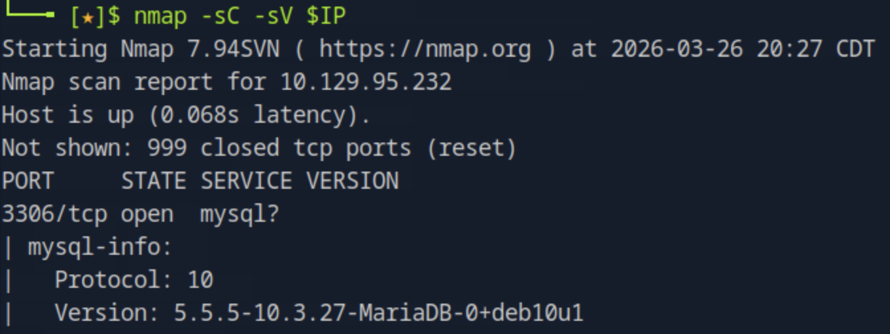
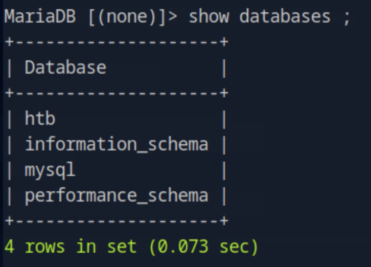
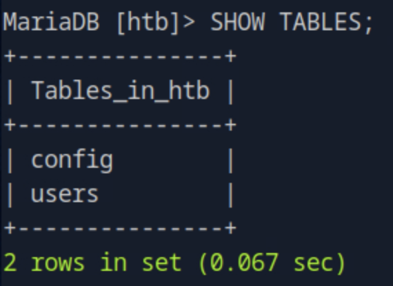
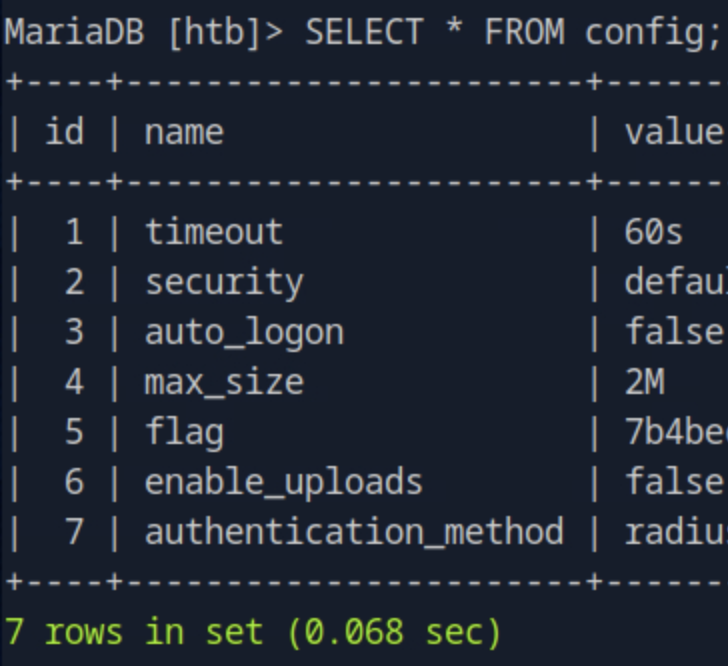

# Sequel

## 개요
이 문제는 MySQL(MariaDB) 서비스가 외부에 노출된 상태에서 root 계정의 패스워드 없이 접근이 가능한 취약점을 이용한다. 인증 없이 데이터베이스에 직접 접속하여 내부 테이블을 탐색하고 flag를 획득하는 과정이다. 핵심은 MySQL 서비스 enumeration과 잘못된 인증 설정이다.

---

## 대상 정보
- Target IP: <TARGET_IP>
- OS: Linux
- Service: MySQL/MariaDB (3306/tcp)

---

## 1. 서비스 발견

기본 nmap 스캔을 통해 열린 포트와 서비스를 확인한다.
```bash
nmap -sC -sV $IP
```



3306번 포트에서 MariaDB (버전 5.5.5-10.3.27-MariaDB-0+deb10u1) 서비스가 실행 중인 것을 확인할 수 있다.

---

## 2. MySQL 접속 시도

root 계정으로 패스워드 없이 접속을 시도한다.
```bash
mysql -u root -h $IP -p
```


패스워드 없이 root 계정으로 MariaDB에 로그인이 성공하는 것을 확인할 수 있다.

---

## 3. 데이터베이스 목록 확인

접속 후 사용 가능한 데이터베이스 목록을 확인한다.
```sql
show databases;
```



`htb`, `information_schema`, `mysql`, `performance_schema` 총 4개의 데이터베이스가 존재한다. `htb` 데이터베이스가 문제와 관련된 것으로 판단된다.

---

## 4. 데이터베이스 선택 및 테이블 확인

`htb` 데이터베이스를 선택하고 테이블 목록을 확인한다.
```sql
use htb;
SHOW TABLES;
```




`config`와 `users` 두 개의 테이블이 존재하는 것을 확인할 수 있다.

---

## 5. flag 획득

`config` 테이블의 전체 내용을 조회한다.
```sql
SELECT * FROM config;
```



`config` 테이블의 `flag` 항목에서 flag를 성공적으로 획득할 수 있다.

---

## 6. 취약점 원인 분석

- MySQL 서비스(3306/tcp)가 외부 네트워크에 노출됨
- root 계정에 패스워드가 설정되어 있지 않음
- 원격 접속에 대한 접근 제어 미흡
- 민감한 데이터(flag)가 평문으로 데이터베이스에 저장됨

---

## 7. 실제 환경에서의 위험성

- 인증 없이 데이터베이스 전체 접근 가능
- 모든 테이블의 데이터 열람 및 수정 가능
- 시스템 계정 정보 탈취 가능
- `INTO OUTFILE` 등을 통한 파일 시스템 접근 가능

---

## 8. 핵심 정리

- MySQL 서비스는 외부에 노출되어서는 안 된다
- root 계정에는 반드시 강력한 패스워드를 설정해야 한다
- 데이터베이스 원격 접속은 필요한 IP만 허용하도록 방화벽 설정이 필요하다
- 민감한 데이터는 암호화하여 저장해야 한다
