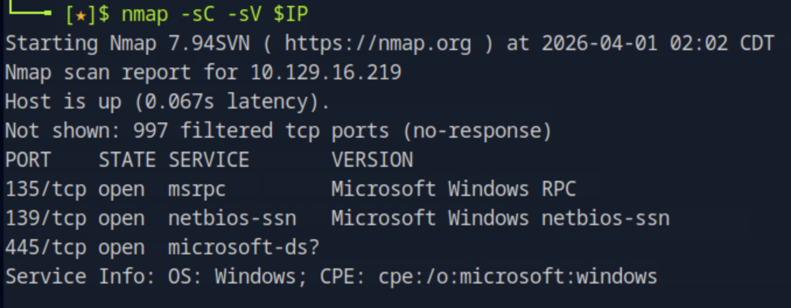
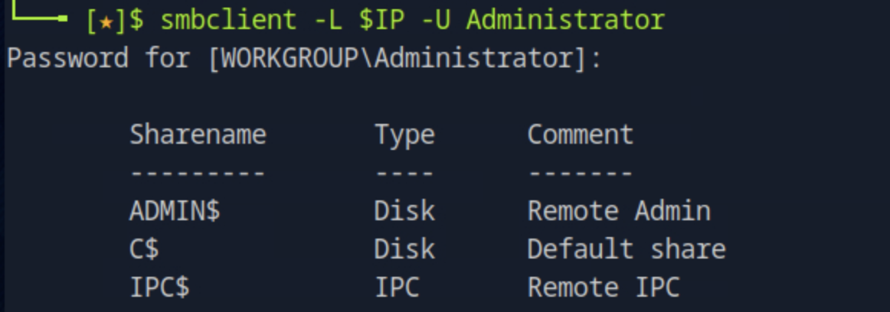
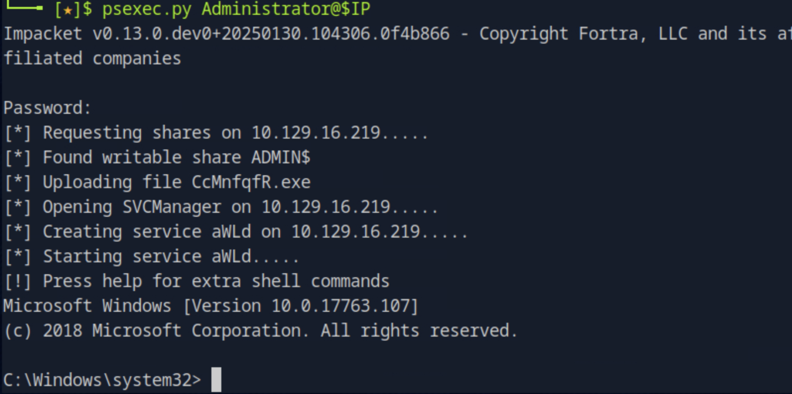
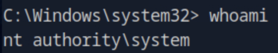
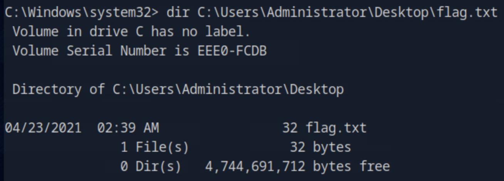
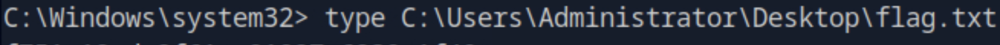

# Tactics

## 개요

Windows 머신에서 SMB 프로토콜을 통해 패스워드 없이 설정된 Administrator 계정을 발견하고, Impacket의 `psexec.py`를 활용해 SYSTEM 권한의 대화형 셸을 획득하는 머신이다. Windows 환경에서의 SMB 열거 기법과 패스워드 없는 관리자 계정의 위험성, 그리고 Impacket 툴셋의 실전 활용법을 실습할 수 있다.

## 대상 정보

| 항목 | 내용 |
|------|------|
| 플랫폼 | HackTheBox Starting Point Tier 1 |
| 운영체제 | Windows 10 (Version 10.0.17763) |
| 개방 포트 | 135 (MSRPC), 139 (NetBIOS), 445 (SMB) |
| 주요 기술 스택 | SMB, Windows RPC, Impacket |
| 취약점 | 패스워드 없는 Administrator 계정 |

---

## 풀이 과정

### 1. 포트 스캔

nmap으로 대상 서버의 열린 포트와 서비스 버전을 확인한다.

```bash
nmap -sC -sV $IP
```



135번(MSRPC), 139번(NetBIOS), 445번(SMB) 포트가 열려있으며 OS가 Windows임이 확인됐다. 세 포트 모두 Windows 환경에서 파일 공유와 원격 관리에 사용되는 SMB 관련 포트다. 열린 포트가 SMB 관련 포트뿐이므로 SMB를 통한 접근을 우선 시도하는 것이 타당하다. 또한 nmap 스크립트 결과에서 `Message signing enabled but not required`가 확인됐는데, 이는 SMB 서명이 강제되지 않아 중간자 공격에도 취약할 수 있음을 의미한다.

---

### 2. SMB 공유 열거

`smbclient`로 대상 서버에서 접근 가능한 SMB 공유 목록을 확인한다. 먼저 익명 접근을 시도했으나 `NT_STATUS_ACCESS_DENIED`로 차단됐다. Windows 머신에서 관리자 계정의 기본값인 `Administrator`로 접근을 시도하면서, 내부 관리 도구는 편의상 패스워드를 설정하지 않는 경우가 있다는 점을 고려해 패스워드 없이 엔터를 입력했다.

```bash
smbclient -L $IP -U Administrator
```



패스워드 없이 Administrator 계정으로 로그인에 성공했다. 공유 목록에는 `ADMIN$`(원격 관리), `C$`(C 드라이브 전체), `IPC$`(프로세스 간 통신) 세 가지 관리자 공유가 확인됐다. 이 중 `C$`는 시스템 전체 파일에 접근할 수 있는 공유로, 파일 시스템 탐색이 가능하다는 것을 의미한다.

---

### 3. psexec.py로 대화형 셸 획득

SMB를 통해 파일 접근이 가능하고 Administrator 계정의 패스워드가 없다는 것을 확인했으므로, Impacket의 `psexec.py`로 대화형 셸 획득을 시도한다. `psexec.py`는 쓰기 가능한 SMB 공유를 통해 실행 파일을 업로드하고 원격 서비스를 생성하는 방식으로 셸을 제공한다.

```bash
psexec.py Administrator@$IP
```



`psexec.py`는 `ADMIN$` 공유에 임시 실행 파일을 업로드하고, Windows 서비스 관리자(SCM)를 통해 서비스를 생성해 실행하는 방식으로 셸을 획득했다. 접속 후 `whoami`로 현재 권한을 확인한다.

```bash
whoami
```



`nt authority\system`이 확인됐다. 이는 Windows에서 가장 높은 권한으로, 운영체제 자체와 동일한 수준의 접근권한이다.

---

### 4. Flag 획득

SYSTEM 권한으로 Administrator 바탕화면의 flag 파일을 확인한다.

```bash
dir C:\Users\Administrator\Desktop\flag.txt
```



flag 파일이 존재함을 확인하고 내용을 읽는다.

```bash
type C:\Users\Administrator\Desktop\flag.txt
```



Flag를 성공적으로 획득했다.

---

## 취약점 원인 분석

이 머신의 핵심 취약점은 **Administrator 계정에 패스워드가 설정되지 않은 것**이다. SMB 자체는 정상적으로 인증을 요구하고 있었지만, 인증에 사용된 자격증명이 사실상 없는 것과 마찬가지였다. 여기에 `psexec.py`가 SMB의 파일 쓰기 권한과 Windows 서비스 관리 권한을 결합해 바로 SYSTEM 권한의 셸로 이어졌다.

`psexec.py`의 동작 방식을 분해하면 다음과 같다.

1. `ADMIN$` 공유에 임의 이름의 실행 파일 업로드
2. Windows 서비스 관리자(SCM)에 해당 파일을 새 서비스로 등록
3. 서비스 시작 → SYSTEM 권한으로 실행
4. 표준 입출력을 파이프로 연결해 대화형 셸 제공

---

## 실제 환경에서의 위험성

SMB 445번 포트가 외부에 노출된 Windows 서버에 패스워드 없는 관리자 계정이 존재하면, 인터넷에서 누구나 이 공격을 그대로 재현할 수 있다. SYSTEM 권한 획득 이후에는 모든 파일 접근, 계정 생성, 백도어 설치, 도메인 내 다른 시스템으로의 피벗이 가능하다. 실제로 WannaCry, NotPetya 같은 랜섬웨어가 SMB 취약점을 통해 대규모로 확산된 사례가 있어, SMB 보안 설정은 Windows 인프라에서 가장 중요한 보안 항목 중 하나다.

---

## 핵심 정리

| 항목 | 내용 |
|------|------|
| 취약점 | 패스워드 없는 Administrator 계정 |
| 열거 도구 | smbclient (-L, -U) |
| 초기 접근 | SMB + 빈 패스워드 Administrator |
| 셸 획득 | Impacket psexec.py |
| 획득 권한 | NT AUTHORITY\SYSTEM (최고 권한) |
| 교훈 | 모든 계정에 강한 패스워드를 설정하고, SMB 포트는 필요한 IP만 접근 가능하도록 방화벽으로 제한해야 한다 |
